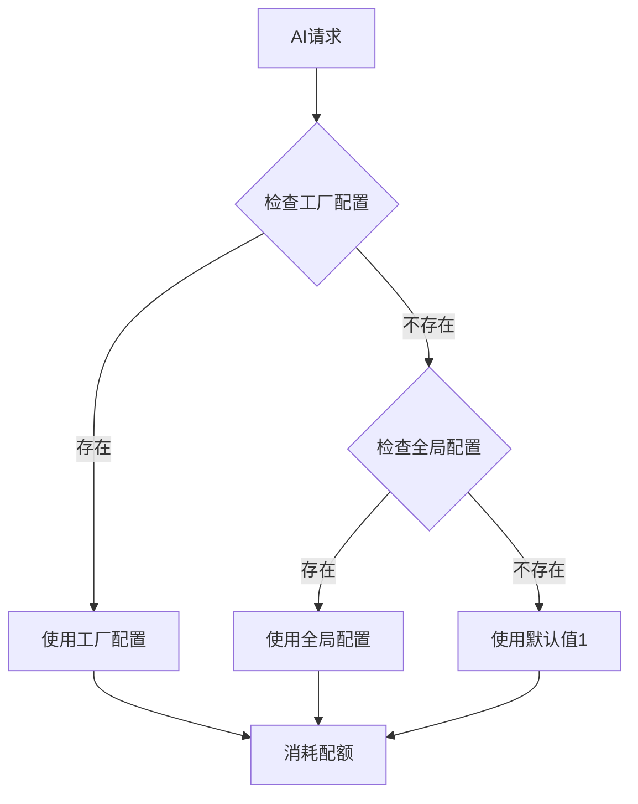

# AI配额规则配置化实现文档

## 概述

将原本硬编码在 `AIEnterpriseService.java` 中的AI配额规则迁移到数据库配置表，支持动态调整配额消耗规则。

---

## 实现内容

### 1. 数据库迁移

**文件**: `/backend-java/src/main/resources/db/migration/V2025_12_31_1__ai_quota_configs.sql`

创建 `ai_quota_configs` 表，包含以下字段：

| 字段 | 类型 | 说明 |
|------|------|------|
| `id` | VARCHAR(36) | 主键 |
| `factory_id` | VARCHAR(50) | 工厂ID (`*`表示全局配置) |
| `question_type` | VARCHAR(50) | 问题类型 (historical/comparison/time_range/followup/default) |
| `quota_cost` | INT | 配额消耗次数 |
| `weekly_limit` | INT | 每周配额限制 (null表示使用全局100次) |
| `description` | VARCHAR(200) | 规则描述 |
| `enabled` | BOOLEAN | 是否启用 |
| `priority` | INT | 优先级 (数值越大优先级越高) |

**默认数据**:
```sql
-- 全局默认配置
('default-historical', '*', 'historical', 5, '历史数据分析 - 消耗5次配额')
('default-comparison', '*', 'comparison', 3, '批次对比分析 - 消耗3次配额')
('default-time_range', '*', 'time_range', 2, '时间范围查询 - 消耗2次配额')
('default-followup', '*', 'followup', 1, 'Follow-up问题 - 消耗1次配额')
('default-simple', '*', 'default', 1, '简单查询 - 消耗1次配额')

-- F001工厂自定义配置 (示例)
('f001-historical', 'F001', 'historical', 3, 150, 'F001工厂 - 历史分析调整为3次配额')
('f001-comparison', 'F001', 'comparison', 2, 150, 'F001工厂 - 对比分析调整为2次配额')
```

---

### 2. Entity 实体

**文件**: `/backend-java/src/main/java/com/cretas/aims/entity/config/AIQuotaConfig.java`

```java
@Entity
@Table(name = "ai_quota_configs")
public class AIQuotaConfig extends BaseEntity {
    private String id;
    private String factoryId;        // "*" 表示全局配置
    private String questionType;     // historical/comparison/time_range/followup/default
    private Integer quotaCost;       // 配额消耗次数
    private Integer weeklyLimit;     // 每周配额限制 (null使用全局100)
    private String description;
    private Boolean enabled;
    private Integer priority;

    // 判断是否为全局配置
    public boolean isGlobalConfig() {
        return "*".equals(factoryId);
    }

    // 获取有效的每周配额限制
    public int getEffectiveWeeklyLimit() {
        return weeklyLimit != null ? weeklyLimit : 100;
    }
}
```

---

### 3. Repository 仓储层

**文件**: `/backend-java/src/main/java/com/cretas/aims/repository/config/AIQuotaConfigRepository.java`

核心方法：

```java
// 根据工厂ID和问题类型查询配额配置（优先工厂级别，否则全局）
List<AIQuotaConfig> findByFactoryIdAndQuestionType(String factoryId, String questionType);

// 根据工厂ID查询所有启用的配额配置
List<AIQuotaConfig> findByFactoryIdAndEnabledTrueOrderByPriorityDesc(String factoryId);

// 检查配置是否存在
boolean existsByFactoryIdAndQuestionType(String factoryId, String questionType);
```

---

### 4. Service 服务层修改

**文件**: `/backend-java/src/main/java/com/cretas/aims/service/AIEnterpriseService.java`

#### 修改前（硬编码）:
```java
private void checkQuotaOrThrow(String factoryId, String questionType) {
    int required = 1;  // 默认1次
    if ("historical".equals(questionType)) {
        required = 5;
    } else if ("comparison".equals(questionType)) {
        required = 3;
    } else if ("time_range".equals(questionType)) {
        required = 2;
    }
    // ...
}
```

#### 修改后（数据库驱动）:
```java
@Autowired
private AIQuotaConfigRepository quotaConfigRepository;

private void checkQuotaOrThrow(String factoryId, String questionType) {
    int required = getQuotaCostFromConfig(factoryId, questionType);
    // ...
}

/**
 * 从数据库配置获取配额消耗次数
 * 优先使用工厂级别配置，否则使用全局默认配置
 */
private int getQuotaCostFromConfig(String factoryId, String questionType) {
    List<AIQuotaConfig> configs = quotaConfigRepository
            .findByFactoryIdAndQuestionType(factoryId, questionType);

    if (!configs.isEmpty()) {
        return configs.get(0).getQuotaCost();
    }

    log.warn("未找到配额配置: factoryId={}, questionType={}, 使用默认值1",
            factoryId, questionType);
    return 1;
}
```

**所有硬编码替换位置**:
- `analyzeCost()` - 消耗配额
- `analyzeTimeRangeCost()` - 时间范围分析
- `analyzeTimeRangeCostStream()` - 流式时间范围分析
- `compareBatchCosts()` - 批次对比分析

---

### 5. Controller API

**文件**: `/backend-java/src/main/java/com/cretas/aims/controller/AIQuotaConfigController.java`

提供完整的配额配置管理API：

| API | 方法 | 路径 | 说明 |
|-----|------|------|------|
| 获取配置列表 | GET | `/api/mobile/{factoryId}/ai-quota-configs` | 获取工厂和全局配置 |
| 创建配置 | POST | `/api/mobile/{factoryId}/ai-quota-configs` | 创建工厂级别配置 |
| 更新配置 | PUT | `/api/mobile/{factoryId}/ai-quota-configs/{configId}` | 更新配置 |
| 删除配置 | DELETE | `/api/mobile/{factoryId}/ai-quota-configs/{configId}` | 删除配置 (禁止删除全局配置) |
| 获取详情 | GET | `/api/mobile/{factoryId}/ai-quota-configs/{configId}` | 获取配置详情 |

---

## 配置规则说明

### 配置优先级

1. **工厂级别配置** (factoryId = 'F001')
   - 优先级最高
   - 可覆盖全局配置

2. **全局配置** (factoryId = '*')
   - 默认配置
   - 所有工厂通用

3. **优先级字段** (priority)
   - 数值越大优先级越高
   - 同一工厂同一问题类型，按优先级降序返回第一条

### 配额消耗逻辑



---

## 测试验证

### 1. 数据库迁移验证

```bash
# 启动应用，Flyway自动执行迁移
mvn spring-boot:run

# 验证表结构
mysql> DESC ai_quota_configs;

# 验证默认数据
mysql> SELECT * FROM ai_quota_configs;
```

### 2. API 测试

#### 获取配置列表
```bash
curl -X GET "http://localhost:10010/api/mobile/F001/ai-quota-configs" \
  -H "Authorization: Bearer YOUR_TOKEN"
```

**预期响应**:
```json
{
  "success": true,
  "data": {
    "factoryConfigs": [
      {
        "id": "f001-historical",
        "factoryId": "F001",
        "questionType": "historical",
        "quotaCost": 3,
        "weeklyLimit": 150,
        "description": "F001工厂 - 历史分析调整为3次配额"
      }
    ],
    "globalConfigs": [
      {
        "id": "default-historical",
        "factoryId": "*",
        "questionType": "historical",
        "quotaCost": 5,
        "description": "历史数据分析 - 消耗5次配额"
      }
    ],
    "total": 7
  }
}
```

#### 创建配置
```bash
curl -X POST "http://localhost:10010/api/mobile/F002/ai-quota-configs" \
  -H "Authorization: Bearer YOUR_TOKEN" \
  -H "Content-Type: application/json" \
  -d '{
    "questionType": "historical",
    "quotaCost": 4,
    "weeklyLimit": 120,
    "description": "F002工厂自定义配置",
    "enabled": true,
    "priority": 100
  }'
```

#### 更新配置
```bash
curl -X PUT "http://localhost:10010/api/mobile/F001/ai-quota-configs/f001-historical" \
  -H "Authorization: Bearer YOUR_TOKEN" \
  -H "Content-Type: application/json" \
  -d '{
    "quotaCost": 2,
    "description": "调整为2次配额"
  }'
```

#### 删除配置
```bash
curl -X DELETE "http://localhost:10010/api/mobile/F001/ai-quota-configs/f001-historical" \
  -H "Authorization: Bearer YOUR_TOKEN"
```

### 3. 功能测试

#### 测试场景1: 使用工厂配置
```bash
# F001工厂进行历史分析 (消耗3次配额，而非默认5次)
curl -X POST "http://localhost:10010/api/mobile/F001/ai/analyze-cost" \
  -H "Authorization: Bearer YOUR_TOKEN" \
  -d '{
    "reportType": "historical",
    "startDate": "2025-01-01T00:00:00",
    "endDate": "2025-01-31T23:59:59"
  }'
```

**验证**:
- 日志输出: `配额消耗: quotaCost=3`
- `ai_quota_usage` 表中 `used_count` 增加3

#### 测试场景2: 使用全局配置
```bash
# F003工厂进行历史分析 (无工厂配置，使用全局5次)
curl -X POST "http://localhost:10010/api/mobile/F003/ai/analyze-cost" \
  -H "Authorization: Bearer YOUR_TOKEN" \
  -d '{
    "reportType": "historical",
    "startDate": "2025-01-01T00:00:00",
    "endDate": "2025-01-31T23:59:59"
  }'
```

**验证**:
- 日志输出: `配额消耗: quotaCost=5`
- `ai_quota_usage` 表中 `used_count` 增加5

#### 测试场景3: 无配置时的默认行为
```bash
# 删除所有配置后测试
mysql> DELETE FROM ai_quota_configs WHERE question_type = 'historical';

# 再次请求历史分析
# 预期: 使用默认值1，并输出警告日志
```

---

## 配置示例

### 场景1: 调整工厂配额限制

F001工厂从100次/周提升到150次/周，历史分析从5次降低到3次：

```sql
INSERT INTO ai_quota_configs (id, factory_id, question_type, quota_cost, weekly_limit, description)
VALUES (UUID(), 'F001', 'historical', 3, 150, 'F001工厂 - 历史分析调整为3次配额');
```

### 场景2: 新增自定义问题类型

添加一种新的问题类型 `advanced_analytics`，消耗10次配额：

```sql
INSERT INTO ai_quota_configs (id, factory_id, question_type, quota_cost, description)
VALUES (UUID(), '*', 'advanced_analytics', 10, '高级分析 - 消耗10次配额');
```

### 场景3: 临时禁用某种问题类型

禁用时间范围分析：

```sql
UPDATE ai_quota_configs
SET enabled = FALSE
WHERE question_type = 'time_range';
```

---

## 验收标准

- [x] 数据库表 `ai_quota_configs` 创建成功
- [x] 默认数据插入成功
- [x] Entity `AIQuotaConfig` 正常工作
- [x] Repository 查询方法正常
- [x] Service 从数据库读取配额规则
- [x] Controller API 提供完整的增删改查
- [x] 工厂级别配置优先于全局配置
- [x] 无配置时使用默认值1并输出警告日志

---

## 文件清单

| 文件路径 | 说明 |
|----------|------|
| `/backend-java/src/main/resources/db/migration/V2025_12_31_1__ai_quota_configs.sql` | Flyway数据库迁移脚本 |
| `/backend-java/src/main/java/com/cretas/aims/entity/config/AIQuotaConfig.java` | Entity实体类 |
| `/backend-java/src/main/java/com/cretas/aims/repository/config/AIQuotaConfigRepository.java` | Repository接口 |
| `/backend-java/src/main/java/com/cretas/aims/service/AIEnterpriseService.java` | Service修改 (已更新) |
| `/backend-java/src/main/java/com/cretas/aims/controller/AIQuotaConfigController.java` | Controller API |

---

## 注意事项

1. **全局配置保护**: API禁止删除 `factory_id = '*'` 的全局配置
2. **唯一约束**: 同一工厂同一问题类型只能有一条配置
3. **优先级排序**: 查询时按 `priority DESC` 排序，确保高优先级配置生效
4. **兼容性**: 如果数据库无配置，默认返回1次配额，保证系统可用性
5. **日志记录**: 所有配置读取和修改都有详细日志

---

## 后续扩展

### 可选功能1: 缓存优化

使用 Spring Cache 缓存配额配置，减少数据库查询：

```java
@Cacheable(value = "quotaConfigs", key = "#factoryId + ':' + #questionType")
private int getQuotaCostFromConfig(String factoryId, String questionType) {
    // ...
}

@CacheEvict(value = "quotaConfigs", allEntries = true)
public AIQuotaConfig updateConfig(...) {
    // ...
}
```

### 可选功能2: 前端管理页面

在管理后台添加配额配置管理页面：

- 配置列表展示
- 新增/编辑配置表单
- 配额使用统计图表
- 配置变更历史

### 可选功能3: 配置变更审计

记录配额配置的变更历史：

```sql
CREATE TABLE ai_quota_config_audit (
    id VARCHAR(36) PRIMARY KEY,
    config_id VARCHAR(36) NOT NULL,
    action VARCHAR(20) NOT NULL,  -- CREATE/UPDATE/DELETE
    old_value TEXT,
    new_value TEXT,
    operator_id BIGINT,
    created_at DATETIME DEFAULT CURRENT_TIMESTAMP
);
```

---

## 总结

本次实现完成了AI配额规则的配置化，从硬编码迁移到数据库驱动，支持：

1. 全局默认配置 + 工厂级别覆盖
2. 动态调整配额消耗规则
3. 完整的API管理接口
4. 优先级和启用状态控制
5. 向后兼容（无配置时使用默认值）

实现遵循了项目规范：
- 数据库命名: snake_case
- Java字段命名: camelCase
- 继承 BaseEntity 包含审计字段
- 统一响应格式: `{success, data, message}`
