# 白垩纪食品溯源系统 - 业务逻辑总览

> **文档版本**: v2.0
> **生成日期**: 2025-11-20
> **系统版本**: Backend Java 11 + Spring Boot 2.7.15 | Frontend React Native + Expo 53+

---

## 📋 目录

1. [系统总览](#1-系统总览)
2. [认证与权限体系](#2-认证与权限体系)
3. [核心业务流程](#3-核心业务流程)
4. [数据模型](#4-数据模型)
5. [前端架构](#5-前端架构)
6. [后端架构](#6-后端架构)
7. [技术实现总结](#7-技术实现总结)

---

## 1. 系统总览

### 1.1 系统架构

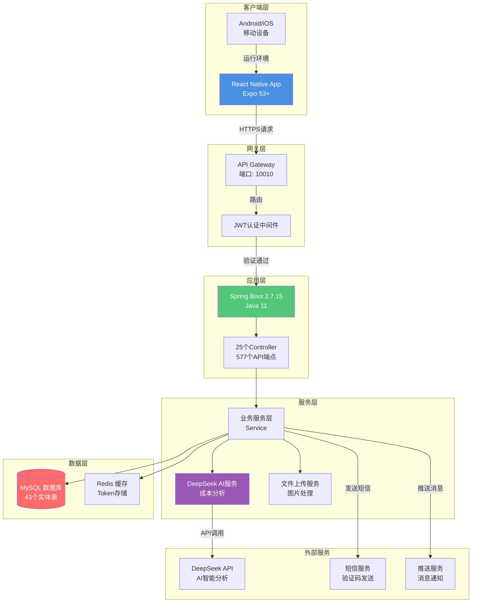
```mermaid
graph TB
    subgraph 客户端层
        A[React Native App<br/>Expo 53+]
        B[Android/iOS<br/>移动设备]
    end

    subgraph 网关层
        C[API Gateway<br/>端口: 10010]
        D[JWT认证中间件]
    end

    subgraph 应用层
        E[Spring Boot 2.7.15<br/>Java 11]
        F[25个Controller<br/>577个API端点]
    end

    subgraph 服务层
        G[业务服务层<br/>Service]
        H[DeepSeek AI服务<br/>成本分析]
        I[文件上传服务<br/>图片处理]
    end

    subgraph 数据层
        J[(MySQL 数据库<br/>43个实体表)]
        K[Redis 缓存<br/>Token存储]
    end

    subgraph 外部服务
        L[DeepSeek API<br/>AI智能分析]
        M[短信服务<br/>验证码发送]
        N[推送服务<br/>消息通知]
    end

    A -->|HTTPS请求| C
    B -->|运行环境| A
    C -->|路由| D
    D -->|验证通过| E
    E --> F
    F --> G
    G --> H
    G --> I
    G --> J
    G --> K
    H -->|API调用| L
    G -->|发送短信| M
    G -->|推送消息| N

    style A fill:#4A90E2,color:#fff
    style E fill:#50C878,color:#fff
    style J fill:#FF6B6B,color:#fff
    style H fill:#9B59B6,color:#fff
```

### 1.2 核心功能模块

| 模块 | 功能描述 | 主要页面数 | 主要API数 |
|------|---------|-----------|-----------|
| 🔐 认证与授权 | 统一登录、8角色权限、Token管理 | 3 | 12 |
| ⏰ 考勤打卡 | 上下班打卡、休息管理、工时统计 | 5 | 8 |
| 🏭 生产加工 | 批次管理、原料消耗、质量检验 | 26 | 35 |
| 🤖 AI成本分析 | DeepSeek智能分析、成本优化建议 | 5 | 11 |
| 📦 库存管理 | 原材料批次、库存预警、出入库 | 3 | 18 |
| 🔧 设备管理 | 设备监控、告警管理、维护记录 | 4 | 15 |
| 👥 人员管理 | 用户管理、部门管理、绩效分析 | 14 | 24 |
| 🏢 平台管理 | 工厂管理、AI配额、平台统计 | 3 | 9 |
| 📊 报表分析 | 13类报表、趋势分析、数据导出 | 13 | 28 |

**总计**: 75个页面 | 577个API端点 | 43个数据实体

---

## 2. 认证与权限体系

### 2.1 统一登录流程

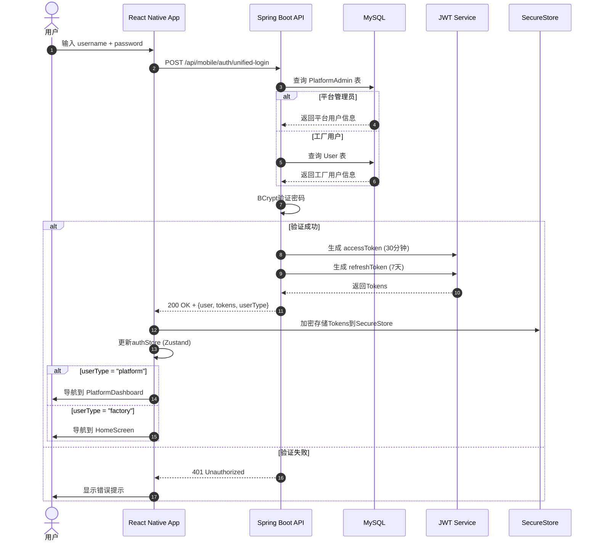
```mermaid
sequenceDiagram
    autonumber
    actor User as 用户
    participant App as React Native App
    participant API as Spring Boot API
    participant DB as MySQL
    participant JWT as JWT Service
    participant Store as SecureStore

    User->>App: 输入 username + password
    App->>API: POST /api/mobile/auth/unified-login

    API->>DB: 查询 PlatformAdmin 表
    alt 平台管理员
        DB-->>API: 返回平台用户信息
    else 工厂用户
        API->>DB: 查询 User 表
        DB-->>API: 返回工厂用户信息
    end

    API->>API: BCrypt验证密码

    alt 验证成功
        API->>JWT: 生成 accessToken (30分钟)
        API->>JWT: 生成 refreshToken (7天)
        JWT-->>API: 返回Tokens
        API-->>App: 200 OK + {user, tokens, userType}

        App->>Store: 加密存储Tokens到SecureStore
        App->>App: 更新authStore (Zustand)

        alt userType = "platform"
            App->>User: 导航到 PlatformDashboard
        else userType = "factory"
            App->>User: 导航到 HomeScreen
        end
    else 验证失败
        API-->>App: 401 Unauthorized
        App->>User: 显示错误提示
    end
```

### 2.2 Token刷新流程

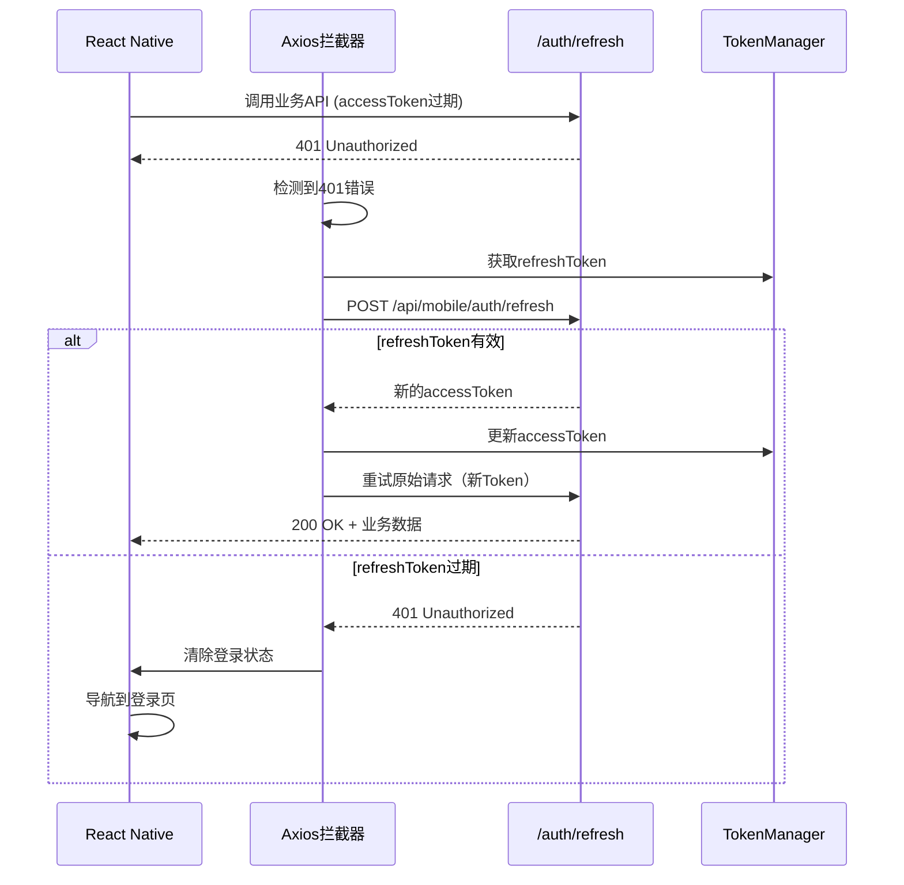
```mermaid
sequenceDiagram
    participant App as React Native
    participant Interceptor as Axios拦截器
    participant API as /auth/refresh
    participant TokenMgr as TokenManager

    App->>API: 调用业务API (accessToken过期)
    API-->>App: 401 Unauthorized

    Interceptor->>Interceptor: 检测到401错误
    Interceptor->>TokenMgr: 获取refreshToken
    Interceptor->>API: POST /api/mobile/auth/refresh

    alt refreshToken有效
        API-->>Interceptor: 新的accessToken
        Interceptor->>TokenMgr: 更新accessToken
        Interceptor->>API: 重试原始请求（新Token）
        API-->>App: 200 OK + 业务数据
    else refreshToken过期
        API-->>Interceptor: 401 Unauthorized
        Interceptor->>App: 清除登录状态
        App->>App: 导航到登录页
    end
```

### 2.3 8角色权限矩阵

#### 角色分类

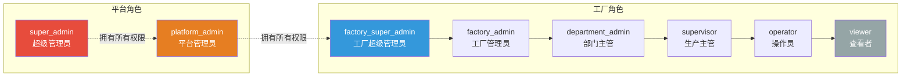
```mermaid
graph LR
    subgraph 平台角色
        A1[super_admin<br/>超级管理员]
        A2[platform_admin<br/>平台管理员]
    end

    subgraph 工厂角色
        B1[factory_super_admin<br/>工厂超级管理员]
        B2[factory_admin<br/>工厂管理员]
        B3[department_admin<br/>部门主管]
        B4[supervisor<br/>生产主管]
        B5[operator<br/>操作员]
        B6[viewer<br/>查看者]
    end

    A1 -.拥有所有权限.-> A2
    A2 -.拥有所有权限.-> B1
    B1 --> B2 --> B3 --> B4 --> B5 --> B6

    style A1 fill:#E74C3C,color:#fff
    style A2 fill:#E67E22,color:#fff
    style B1 fill:#3498DB,color:#fff
    style B6 fill:#95A5A6,color:#fff
```

#### 详细权限对照表

| 功能模块 | super_admin | platform_admin | factory_super_admin | factory_admin | department_admin | supervisor | operator | viewer |
|---------|-------------|----------------|---------------------|---------------|------------------|------------|----------|--------|
| **平台管理** |
| 创建工厂 | ✅ | ✅ | ❌ | ❌ | ❌ | ❌ | ❌ | ❌ |
| 删除工厂 | ✅ | ✅ | ❌ | ❌ | ❌ | ❌ | ❌ | ❌ |
| AI配额管理 | ✅ | ✅ | ❌ | ❌ | ❌ | ❌ | ❌ | ❌ |
| 平台统计 | ✅ | ✅ | ❌ | ❌ | ❌ | ❌ | ❌ | ❌ |
| **用户管理** |
| 创建用户 | ✅ | ✅ | ✅ | ✅ | ❌ | ❌ | ❌ | ❌ |
| 删除用户 | ✅ | ✅ | ✅ | ✅ | ❌ | ❌ | ❌ | ❌ |
| 修改角色 | ✅ | ✅ | ✅ | ✅ | ❌ | ❌ | ❌ | ❌ |
| 查看用户 | ✅ | ✅ | ✅ | ✅ | ✅ | ✅ | ✅ | ✅ |
| **生产管理** |
| 创建批次 | ✅ | ✅ | ✅ | ✅ | ✅ | ✅ | ✅ | ❌ |
| 删除批次 | ✅ | ✅ | ✅ | ✅ | ✅ | ✅ | ❌ | ❌ |
| 开始生产 | ✅ | ✅ | ✅ | ✅ | ✅ | ✅ | ✅ | ❌ |
| 完成批次 | ✅ | ✅ | ✅ | ✅ | ✅ | ✅ | ❌ | ❌ |
| **质量检验** |
| 提交质检 | ✅ | ✅ | ✅ | ✅ | ✅ | ✅ | ✅ | ❌ |
| 修改质检 | ✅ | ✅ | ✅ | ✅ | ✅ | ✅ | ❌ | ❌ |
| 查看质检 | ✅ | ✅ | ✅ | ✅ | ✅ | ✅ | ✅ | ✅ |
| **库存管理** |
| 原料入库 | ✅ | ✅ | ✅ | ✅ | ✅ | ✅ | ✅ | ❌ |
| 库存调整 | ✅ | ✅ | ✅ | ✅ | ✅ | ✅ | ❌ | ❌ |
| 查看库存 | ✅ | ✅ | ✅ | ✅ | ✅ | ✅ | ✅ | ✅ |
| **AI分析** |
| 使用AI分析 | ✅ | ✅ | ✅ | ✅ | ✅ | ✅ | ❌ | ❌ |
| 查看AI报告 | ✅ | ✅ | ✅ | ✅ | ✅ | ✅ | ✅ | ✅ |
| **设备管理** |
| 创建设备 | ✅ | ✅ | ✅ | ✅ | ❌ | ❌ | ❌ | ❌ |
| 设备维护 | ✅ | ✅ | ✅ | ✅ | ✅ | ✅ | ✅ | ❌ |
| 查看设备 | ✅ | ✅ | ✅ | ✅ | ✅ | ✅ | ✅ | ✅ |
| **考勤打卡** |
| 自己打卡 | ✅ | ✅ | ✅ | ✅ | ✅ | ✅ | ✅ | ✅ |
| 修改打卡记录 | ✅ | ✅ | ✅ | ✅ | ✅ | ❌ | ❌ | ❌ |
| 查看部门考勤 | ✅ | ✅ | ✅ | ✅ | ✅ | ✅ | ❌ | ❌ |
| **报表查看** |
| 查看所有报表 | ✅ | ✅ | ✅ | ✅ | ✅ | ✅ | ✅ | ✅ |
| 导出报表 | ✅ | ✅ | ✅ | ✅ | ✅ | ✅ | ❌ | ❌ |

---

## 3. 核心业务流程

### 3.1 打卡考勤流程

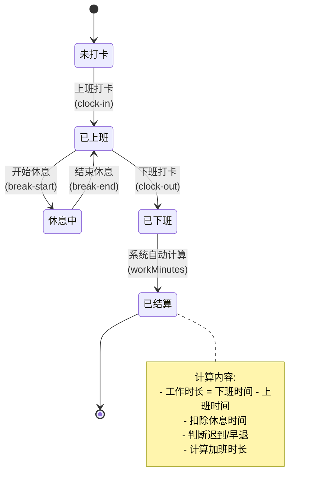
```mermaid
stateDiagram-v2
    [*] --> 未打卡

    未打卡 --> 已上班: 上班打卡<br/>(clock-in)

    已上班 --> 休息中: 开始休息<br/>(break-start)
    休息中 --> 已上班: 结束休息<br/>(break-end)

    已上班 --> 已下班: 下班打卡<br/>(clock-out)

    已下班 --> 已结算: 系统自动计算<br/>(workMinutes)

    已结算 --> [*]

    note right of 已结算
        计算内容:
        - 工作时长 = 下班时间 - 上班时间
        - 扣除休息时间
        - 判断迟到/早退
        - 计算加班时长
    end note
```

#### 打卡数据流

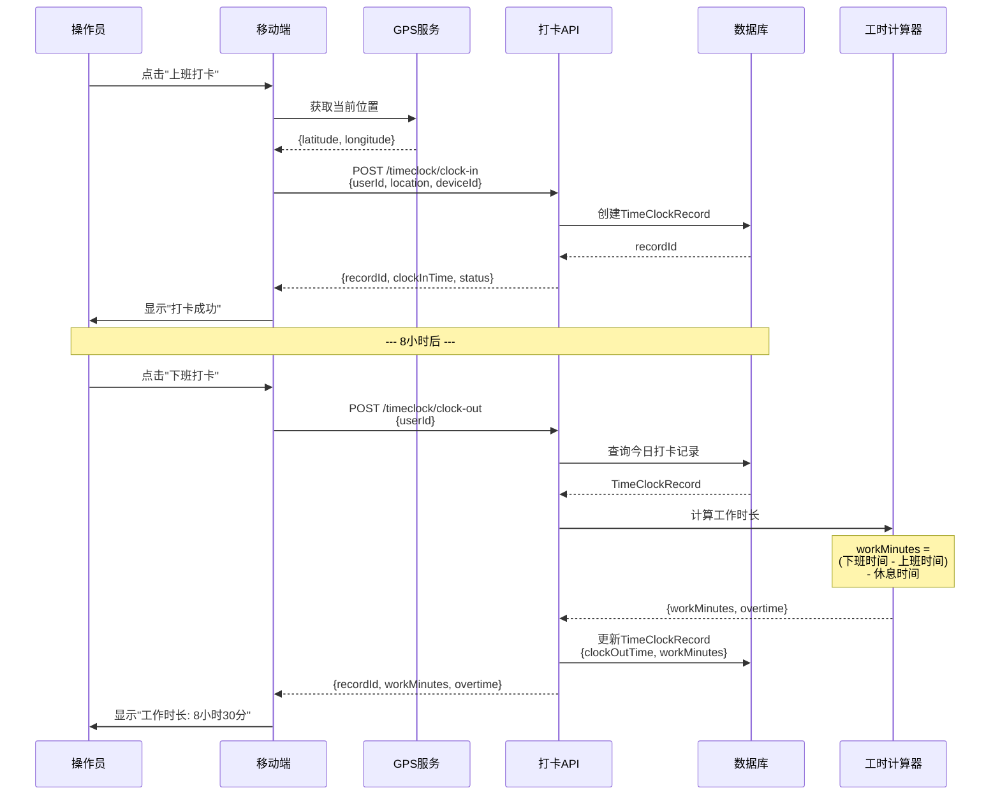
```mermaid
sequenceDiagram
    participant User as 操作员
    participant App as 移动端
    participant GPS as GPS服务
    participant API as 打卡API
    participant DB as 数据库
    participant Calc as 工时计算器

    User->>App: 点击"上班打卡"
    App->>GPS: 获取当前位置
    GPS-->>App: {latitude, longitude}

    App->>API: POST /timeclock/clock-in<br/>{userId, location, deviceId}
    API->>DB: 创建TimeClockRecord
    DB-->>API: recordId
    API-->>App: {recordId, clockInTime, status}
    App->>User: 显示"打卡成功"

    Note over User,DB: --- 8小时后 ---

    User->>App: 点击"下班打卡"
    App->>API: POST /timeclock/clock-out<br/>{userId}

    API->>DB: 查询今日打卡记录
    DB-->>API: TimeClockRecord

    API->>Calc: 计算工作时长
    Note over Calc: workMinutes = <br/>(下班时间 - 上班时间)<br/> - 休息时间
    Calc-->>API: {workMinutes, overtime}

    API->>DB: 更新TimeClockRecord<br/>{clockOutTime, workMinutes}
    API-->>App: {recordId, workMinutes, overtime}
    App->>User: 显示"工作时长: 8小时30分"
```

### 3.2 生产批次全流程

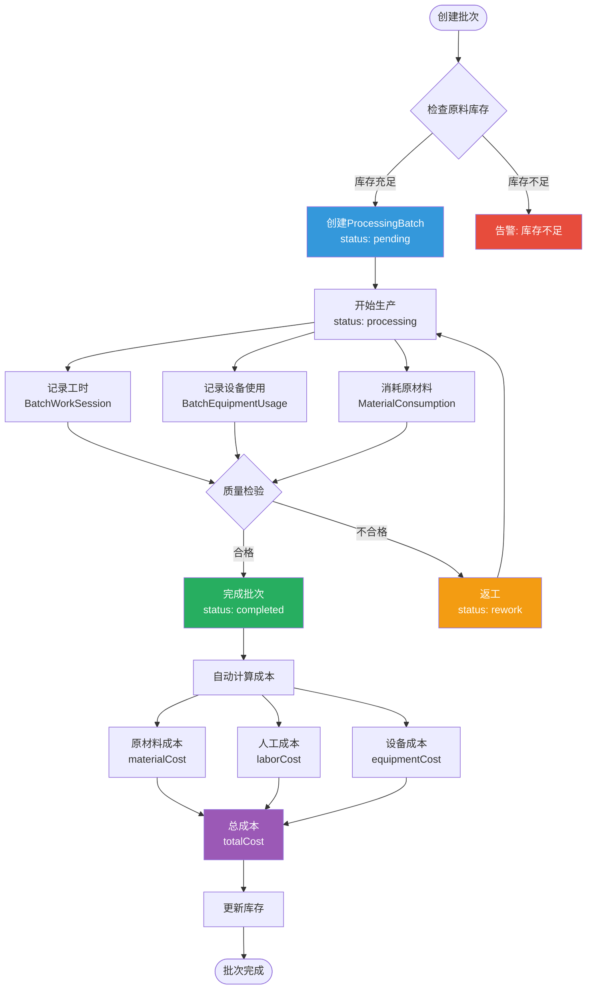
```mermaid
graph TB
    Start([创建批次]) --> CheckMaterial{检查原料库存}
    CheckMaterial -->|库存充足| CreateBatch[创建ProcessingBatch<br/>status: pending]
    CheckMaterial -->|库存不足| Alert1[告警: 库存不足]

    CreateBatch --> StartProduction[开始生产<br/>status: processing]
    StartProduction --> RecordWork[记录工时<br/>BatchWorkSession]
    StartProduction --> RecordEquip[记录设备使用<br/>BatchEquipmentUsage]
    StartProduction --> ConsumeMaterial[消耗原材料<br/>MaterialConsumption]

    RecordWork --> QualityCheck{质量检验}
    RecordEquip --> QualityCheck
    ConsumeMaterial --> QualityCheck

    QualityCheck -->|合格| CompleteBatch[完成批次<br/>status: completed]
    QualityCheck -->|不合格| Rework[返工<br/>status: rework]
    Rework --> StartProduction

    CompleteBatch --> CalcCost[自动计算成本]
    CalcCost --> MaterialCost[原材料成本<br/>materialCost]
    CalcCost --> LaborCost[人工成本<br/>laborCost]
    CalcCost --> EquipmentCost[设备成本<br/>equipmentCost]

    MaterialCost --> TotalCost[总成本<br/>totalCost]
    LaborCost --> TotalCost
    EquipmentCost --> TotalCost

    TotalCost --> UpdateInventory[更新库存]
    UpdateInventory --> End([批次完成])

    style CreateBatch fill:#3498DB,color:#fff
    style CompleteBatch fill:#27AE60,color:#fff
    style Alert1 fill:#E74C3C,color:#fff
    style Rework fill:#F39C12,color:#fff
    style TotalCost fill:#9B59B6,color:#fff
```

#### 成本计算公式

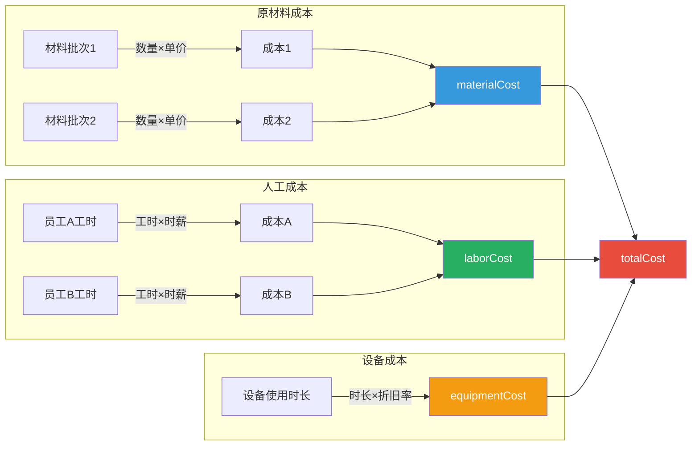
```mermaid
graph LR
    subgraph 原材料成本
        A1[材料批次1] -->|数量×单价| A2[成本1]
        A3[材料批次2] -->|数量×单价| A4[成本2]
        A2 --> A5[materialCost]
        A4 --> A5
    end

    subgraph 人工成本
        B1[员工A工时] -->|工时×时薪| B2[成本A]
        B3[员工B工时] -->|工时×时薪| B4[成本B]
        B2 --> B5[laborCost]
        B4 --> B5
    end

    subgraph 设备成本
        C1[设备使用时长] -->|时长×折旧率| C2[equipmentCost]
    end

    A5 --> D[totalCost]
    B5 --> D
    C2 --> D

    style A5 fill:#3498DB,color:#fff
    style B5 fill:#27AE60,color:#fff
    style C2 fill:#F39C12,color:#fff
    style D fill:#E74C3C,color:#fff
```

**计算逻辑**:
```javascript
// 人工成本 = Σ(员工工时 × 员工时薪)
laborCost = BatchWorkSession.reduce((sum, session) => {
  const hourlyRate = session.user.monthlySalary / session.user.expectedWorkMinutes * 60;
  return sum + (session.workMinutes / 60) * hourlyRate;
}, 0);

// 设备成本 = Σ(设备使用时长 × 设备时薪)
equipmentCost = BatchEquipmentUsage.reduce((sum, usage) => {
  const hourlyRate = equipment.purchasePrice / (equipment.lifespanYears * 365 * 24);
  return sum + (usage.usageMinutes / 60) * hourlyRate;
}, 0);

// 原材料成本 = Σ(消耗数量 × 材料单价)
materialCost = MaterialConsumption.reduce((sum, consumption) => {
  return sum + consumption.quantity * consumption.materialBatch.unitPrice;
}, 0);

// 总成本
totalCost = materialCost + laborCost + equipmentCost + otherCost;
```

### 3.3 AI成本分析流程

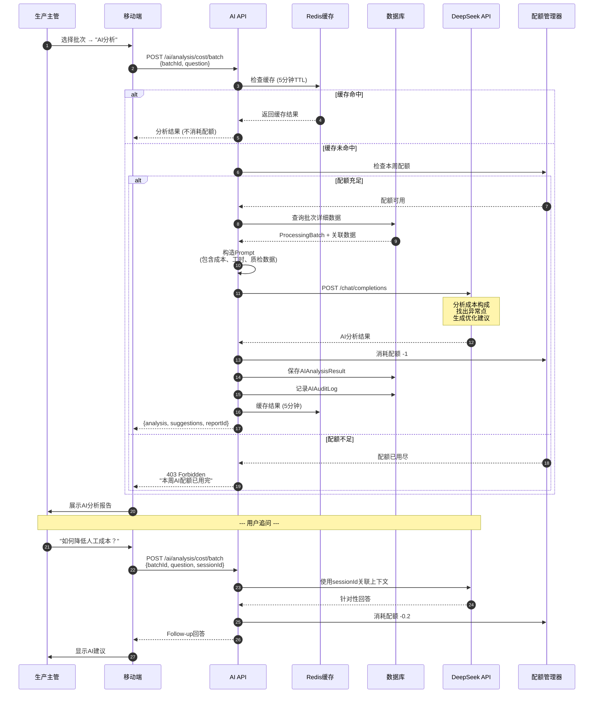
```mermaid
sequenceDiagram
    autonumber
    participant User as 生产主管
    participant App as 移动端
    participant API as AI API
    participant Cache as Redis缓存
    participant DB as 数据库
    participant DeepSeek as DeepSeek API
    participant Quota as 配额管理器

    User->>App: 选择批次 → "AI分析"
    App->>API: POST /ai/analysis/cost/batch<br/>{batchId, question}

    API->>Cache: 检查缓存 (5分钟TTL)

    alt 缓存命中
        Cache-->>API: 返回缓存结果
        API-->>App: 分析结果 (不消耗配额)
    else 缓存未命中
        API->>Quota: 检查本周配额

        alt 配额充足
            Quota-->>API: 配额可用

            API->>DB: 查询批次详细数据
            DB-->>API: ProcessingBatch + 关联数据

            API->>API: 构造Prompt<br/>(包含成本、工时、质检数据)

            API->>DeepSeek: POST /chat/completions
            Note over DeepSeek: 分析成本构成<br/>找出异常点<br/>生成优化建议
            DeepSeek-->>API: AI分析结果

            API->>Quota: 消耗配额 -1
            API->>DB: 保存AIAnalysisResult
            API->>DB: 记录AIAuditLog
            API->>Cache: 缓存结果 (5分钟)

            API-->>App: {analysis, suggestions, reportId}
        else 配额不足
            Quota-->>API: 配额已用尽
            API-->>App: 403 Forbidden<br/>"本周AI配额已用完"
        end
    end

    App->>User: 展示AI分析报告

    Note over User,DeepSeek: --- 用户追问 ---

    User->>App: "如何降低人工成本？"
    App->>API: POST /ai/analysis/cost/batch<br/>{batchId, question, sessionId}

    API->>DeepSeek: 使用sessionId关联上下文
    DeepSeek-->>API: 针对性回答
    API->>Quota: 消耗配额 -0.2
    API-->>App: Follow-up回答
    App->>User: 显示AI建议
```

#### AI分析类型

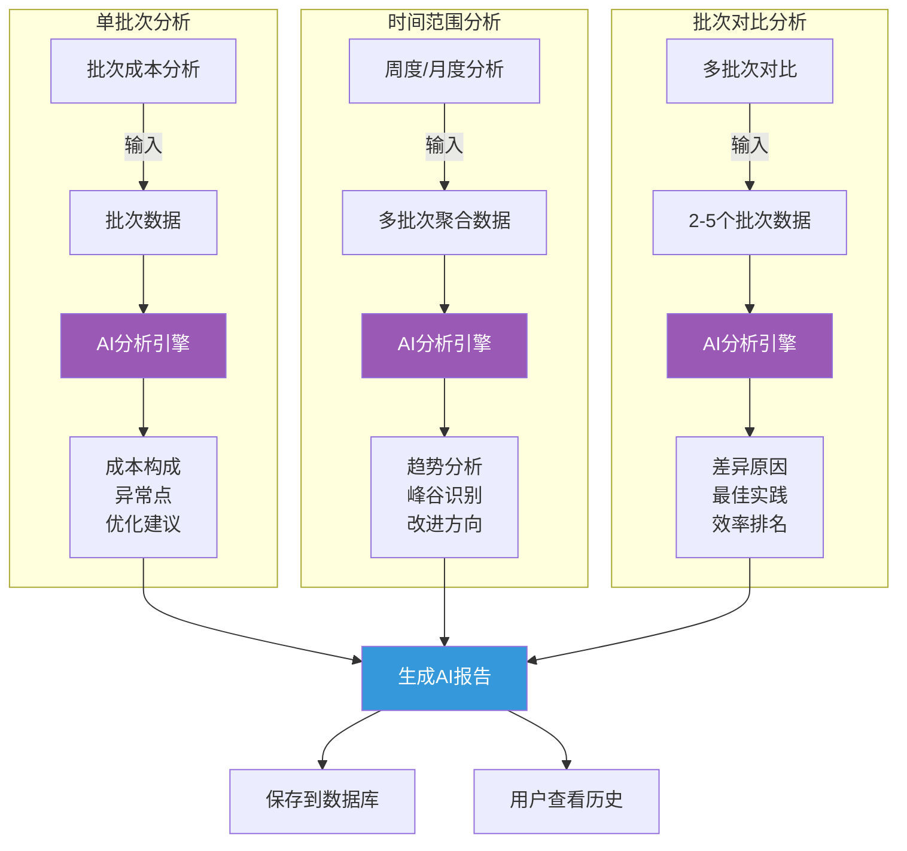
```mermaid
graph TB
    subgraph 单批次分析
        A1[批次成本分析] -->|输入| A2[批次数据]
        A2 --> A3[AI分析引擎]
        A3 --> A4[成本构成<br/>异常点<br/>优化建议]
    end

    subgraph 时间范围分析
        B1[周度/月度分析] -->|输入| B2[多批次聚合数据]
        B2 --> B3[AI分析引擎]
        B3 --> B4[趋势分析<br/>峰谷识别<br/>改进方向]
    end

    subgraph 批次对比分析
        C1[多批次对比] -->|输入| C2[2-5个批次数据]
        C2 --> C3[AI分析引擎]
        C3 --> C4[差异原因<br/>最佳实践<br/>效率排名]
    end

    A4 --> D[生成AI报告]
    B4 --> D
    C4 --> D

    D --> E[保存到数据库]
    D --> F[用户查看历史]

    style A3 fill:#9B59B6,color:#fff
    style B3 fill:#9B59B6,color:#fff
    style C3 fill:#9B59B6,color:#fff
    style D fill:#3498DB,color:#fff
```

### 3.4 库存管理流程

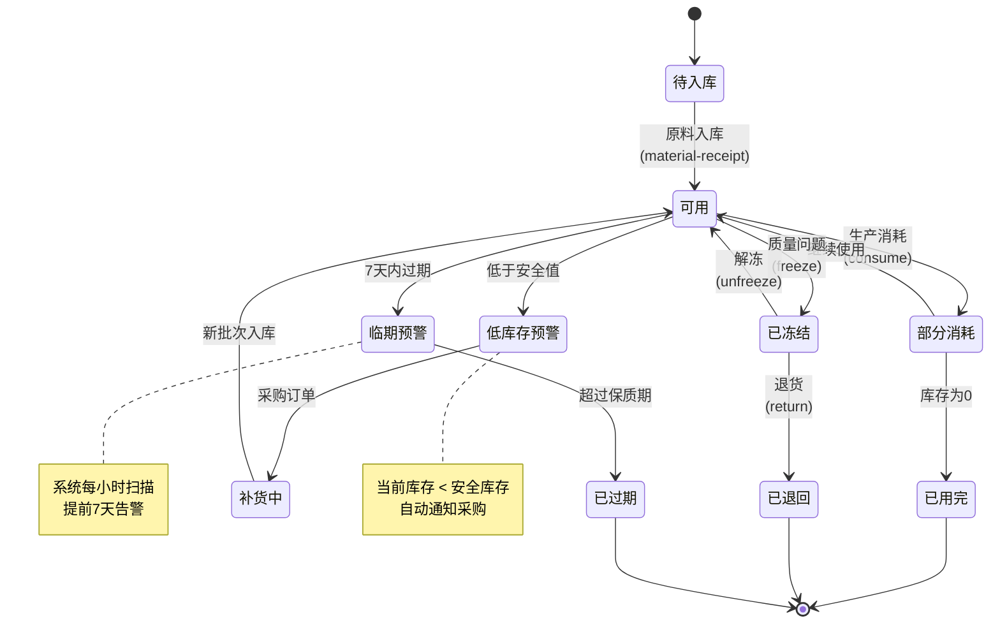
```mermaid
stateDiagram-v2
    [*] --> 待入库

    待入库 --> 可用: 原料入库<br/>(material-receipt)

    可用 --> 部分消耗: 生产消耗<br/>(consume)
    部分消耗 --> 可用: 继续使用
    部分消耗 --> 已用完: 库存为0

    可用 --> 已冻结: 质量问题<br/>(freeze)
    已冻结 --> 可用: 解冻<br/>(unfreeze)
    已冻结 --> 已退回: 退货<br/>(return)

    可用 --> 临期预警: 7天内过期
    临期预警 --> 已过期: 超过保质期

    可用 --> 低库存预警: 低于安全值
    低库存预警 --> 补货中: 采购订单
    补货中 --> 可用: 新批次入库

    已用完 --> [*]
    已退回 --> [*]
    已过期 --> [*]

    note right of 临期预警
        系统每小时扫描
        提前7天告警
    end note

    note right of 低库存预警
        当前库存 < 安全库存
        自动通知采购
    end note
```

#### 库存消耗追踪

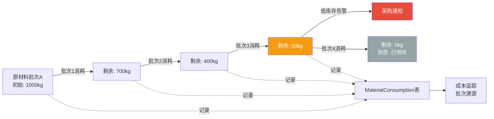
```mermaid
graph LR
    A[原材料批次A<br/>初始: 1000kg] -->|批次1消耗| B[剩余: 700kg]
    B -->|批次2消耗| C[剩余: 400kg]
    C -->|批次3消耗| D[剩余: 50kg]

    D -->|低库存告警| E[采购通知]
    D -->|批次4消耗| F[剩余: 0kg<br/>状态: 已用完]

    A -.记录.-> G[MaterialConsumption表]
    B -.记录.-> G
    C -.记录.-> G
    D -.记录.-> G

    G --> H[成本追踪<br/>批次溯源]

    style D fill:#F39C12,color:#fff
    style E fill:#E74C3C,color:#fff
    style F fill:#95A5A6,color:#fff
```

### 3.5 设备告警生命周期

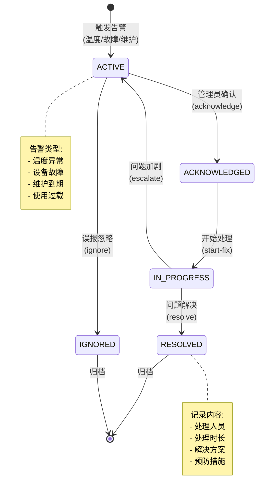
```mermaid
stateDiagram-v2
    [*] --> ACTIVE: 触发告警<br/>(温度/故障/维护)

    ACTIVE --> ACKNOWLEDGED: 管理员确认<br/>(acknowledge)

    ACKNOWLEDGED --> IN_PROGRESS: 开始处理<br/>(start-fix)

    IN_PROGRESS --> RESOLVED: 问题解决<br/>(resolve)
    IN_PROGRESS --> ACTIVE: 问题加剧<br/>(escalate)

    ACTIVE --> IGNORED: 误报忽略<br/>(ignore)

    RESOLVED --> [*]: 归档
    IGNORED --> [*]: 归档

    note right of ACTIVE
        告警类型:
        - 温度异常
        - 设备故障
        - 维护到期
        - 使用过载
    end note

    note right of RESOLVED
        记录内容:
        - 处理人员
        - 处理时长
        - 解决方案
        - 预防措施
    end note
```

#### 告警统计维度

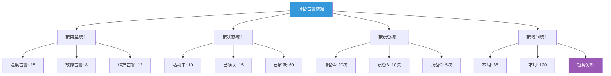
```mermaid
graph TB
    A[设备告警数据] --> B[按类型统计]
    A --> C[按状态统计]
    A --> D[按设备统计]
    A --> E[按时间统计]

    B --> B1[温度告警: 15]
    B --> B2[故障告警: 8]
    B --> B3[维护告警: 12]

    C --> C1[活动中: 10]
    C --> C2[已确认: 15]
    C --> C3[已解决: 60]

    D --> D1[设备A: 20次]
    D --> D2[设备B: 10次]
    D --> D3[设备C: 5次]

    E --> E1[本周: 35]
    E --> E2[本月: 120]
    E --> E3[趋势分析]

    style A fill:#3498DB,color:#fff
    style E3 fill:#9B59B6,color:#fff
```

### 3.6 数据导入导出流程

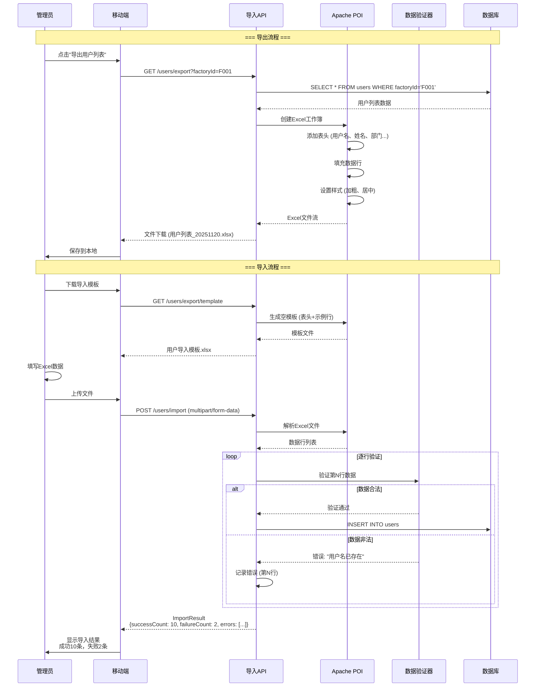
```mermaid
sequenceDiagram
    participant User as 管理员
    participant App as 移动端
    participant API as 导入API
    participant POI as Apache POI
    participant Validator as 数据验证器
    participant DB as 数据库

    Note over User,DB: === 导出流程 ===

    User->>App: 点击"导出用户列表"
    App->>API: GET /users/export?factoryId=F001
    API->>DB: SELECT * FROM users WHERE factoryId='F001'
    DB-->>API: 用户列表数据

    API->>POI: 创建Excel工作簿
    POI->>POI: 添加表头 (用户名、姓名、部门...)
    POI->>POI: 填充数据行
    POI->>POI: 设置样式 (加粗、居中)
    POI-->>API: Excel文件流

    API-->>App: 文件下载 (用户列表_20251120.xlsx)
    App->>User: 保存到本地

    Note over User,DB: === 导入流程 ===

    User->>App: 下载导入模板
    App->>API: GET /users/export/template
    API->>POI: 生成空模板 (表头+示例行)
    POI-->>API: 模板文件
    API-->>App: 用户导入模板.xlsx

    User->>User: 填写Excel数据
    User->>App: 上传文件
    App->>API: POST /users/import (multipart/form-data)

    API->>POI: 解析Excel文件
    POI-->>API: 数据行列表

    loop 逐行验证
        API->>Validator: 验证第N行数据

        alt 数据合法
            Validator-->>API: 验证通过
            API->>DB: INSERT INTO users
        else 数据非法
            Validator-->>API: 错误: "用户名已存在"
            API->>API: 记录错误 (第N行)
        end
    end

    API-->>App: ImportResult<br/>{successCount: 10, failureCount: 2, errors: [...]}
    App->>User: 显示导入结果<br/>成功10条，失败2条
```

---

## 4. 数据模型

### 4.1 核心实体关系图 (ERD)

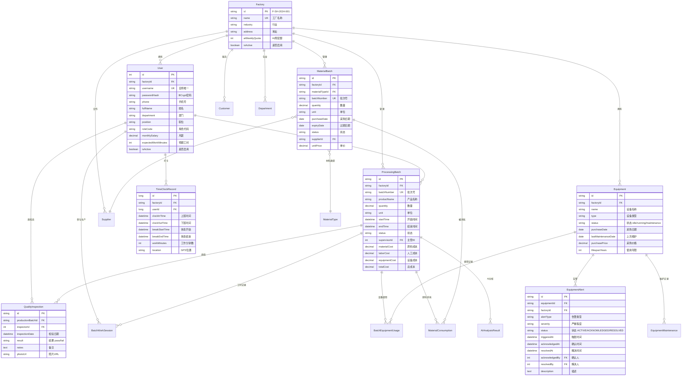
```mermaid
erDiagram
    Factory ||--o{ User : "拥有"
    Factory ||--o{ ProcessingBatch : "管理"
    Factory ||--o{ MaterialBatch : "管理"
    Factory ||--o{ Equipment : "拥有"
    Factory ||--o{ Supplier : "合作"
    Factory ||--o{ Customer : "服务"
    Factory ||--o{ Department : "包含"

    User ||--o{ ProcessingBatch : "主管"
    User ||--o{ TimeClockRecord : "打卡"
    User ||--o{ BatchWorkSession : "参与生产"
    User ||--o{ QualityInspection : "质检员"

    ProcessingBatch ||--o{ QualityInspection : "质检"
    ProcessingBatch ||--o{ BatchWorkSession : "工时记录"
    ProcessingBatch ||--o{ BatchEquipmentUsage : "设备使用"
    ProcessingBatch ||--o{ MaterialConsumption : "原料消耗"
    ProcessingBatch ||--o{ AIAnalysisResult : "AI分析"

    MaterialBatch ||--o{ MaterialConsumption : "被消耗"
    MaterialBatch }o--|| Supplier : "供应商"
    MaterialBatch }o--|| MaterialType : "材料类型"

    Equipment ||--o{ BatchEquipmentUsage : "使用记录"
    Equipment ||--o{ EquipmentAlert : "告警"
    Equipment ||--o{ EquipmentMaintenance : "维护记录"

    Factory {
        string id PK "F-SH-2024-001"
        string name UK "工厂名称"
        string industry "行业"
        string address "地址"
        int aiWeeklyQuota "AI周配额"
        boolean isActive "是否启用"
    }

    User {
        int id PK
        string factoryId FK
        string username UK "全局唯一"
        string passwordHash "BCrypt密码"
        string phone "手机号"
        string fullName "姓名"
        string department "部门"
        string position "职位"
        string roleCode "角色代码"
        decimal monthlySalary "月薪"
        int expectedWorkMinutes "预期工时"
        boolean isActive "是否启用"
    }

    ProcessingBatch {
        string id PK
        string factoryId FK
        string batchNumber UK "批次号"
        string productName "产品名称"
        decimal quantity "数量"
        string unit "单位"
        datetime startTime "开始时间"
        datetime endTime "结束时间"
        string status "状态"
        int supervisorId FK "主管ID"
        decimal materialCost "原料成本"
        decimal laborCost "人工成本"
        decimal equipmentCost "设备成本"
        decimal totalCost "总成本"
    }

    MaterialBatch {
        string id PK
        string factoryId FK
        string materialTypeId FK
        string batchNumber UK "批次号"
        decimal quantity "数量"
        string unit "单位"
        date purchaseDate "采购日期"
        date expiryDate "过期日期"
        string status "状态"
        string supplierId FK
        decimal unitPrice "单价"
    }

    TimeClockRecord {
        long id PK
        string factoryId FK
        long userId FK
        datetime clockInTime "上班时间"
        datetime clockOutTime "下班时间"
        datetime breakStartTime "休息开始"
        datetime breakEndTime "休息结束"
        int workMinutes "工作分钟数"
        string location "GPS位置"
    }

    QualityInspection {
        string id PK
        string productionBatchId FK
        int inspectorId FK
        datetime inspectionDate "检验日期"
        string result "结果 pass/fail"
        text notes "备注"
        string photoUrl "照片URL"
    }

    Equipment {
        string id PK
        string factoryId FK
        string name "设备名称"
        string type "设备类型"
        string status "状态 idle/running/maintenance"
        date purchaseDate "采购日期"
        date lastMaintenanceDate "上次维护"
        decimal purchasePrice "采购价格"
        int lifespanYears "使用年限"
    }

    EquipmentAlert {
        string id PK
        string equipmentId FK
        string factoryId FK
        string alertType "告警类型"
        string severity "严重程度"
        string status "状态 ACTIVE/ACKNOWLEDGED/RESOLVED"
        datetime triggeredAt "触发时间"
        datetime acknowledgedAt "确认时间"
        datetime resolvedAt "解决时间"
        int acknowledgedBy FK "确认人"
        int resolvedBy FK "解决人"
        text description "描述"
    }
```

### 4.2 实体统计

| 实体类别 | 实体数量 | 主要实体 |
|---------|---------|---------|
| **核心业务实体** | 15 | Factory, User, ProcessingBatch, MaterialBatch, Equipment |
| **关联关系实体** | 12 | BatchWorkSession, MaterialConsumption, BatchEquipmentUsage |
| **参考数据实体** | 8 | MaterialType, ProductType, WorkType, Department |
| **AI分析实体** | 5 | AIAnalysisResult, AIAuditLog, AIUsageLog, AIConversation |
| **其他实体** | 3 | TimeClockRecord, QualityInspection, EquipmentAlert |

**总计**: 43个数据实体

---

## 5. 前端架构

### 5.1 导航结构

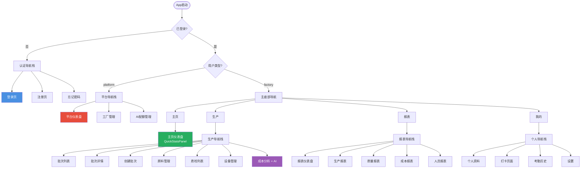
```mermaid
graph TB
    Start([App启动]) --> CheckAuth{已登录?}

    CheckAuth -->|否| AuthStack[认证导航栈]
    CheckAuth -->|是| CheckUserType{用户类型?}

    AuthStack --> Login[登录页]
    AuthStack --> Register[注册页]
    AuthStack --> ForgotPassword[忘记密码]

    CheckUserType -->|platform| PlatformStack[平台导航栈]
    CheckUserType -->|factory| MainTabs[主底部导航]

    PlatformStack --> PlatformDashboard[平台仪表盘]
    PlatformStack --> FactoryManagement[工厂管理]
    PlatformStack --> AIQuotaManagement[AI配额管理]

    MainTabs --> Tab1[主页]
    MainTabs --> Tab2[生产]
    MainTabs --> Tab3[报表]
    MainTabs --> Tab4[我的]

    Tab1 --> HomeScreen[主页仪表盘<br/>QuickStatsPanel]

    Tab2 --> ProcessingNav[生产导航栈]
    ProcessingNav --> BatchList[批次列表]
    ProcessingNav --> BatchDetail[批次详情]
    ProcessingNav --> CreateBatch[创建批次]
    ProcessingNav --> MaterialBatch[原料管理]
    ProcessingNav --> QualityList[质检列表]
    ProcessingNav --> EquipmentList[设备管理]
    ProcessingNav --> CostAnalysis[成本分析 + AI]

    Tab3 --> ReportNav[报表导航栈]
    ReportNav --> ReportDashboard[报表仪表盘]
    ReportNav --> ProductionReport[生产报表]
    ReportNav --> QualityReport[质量报表]
    ReportNav --> CostReport[成本报表]
    ReportNav --> PersonnelReport[人员报表]

    Tab4 --> ProfileNav[个人导航栈]
    ProfileNav --> Profile[个人资料]
    ProfileNav --> TimeClock[打卡页面]
    ProfileNav --> AttendanceHistory[考勤历史]
    ProfileNav --> Settings[设置]

    style Login fill:#4A90E2,color:#fff
    style PlatformDashboard fill:#E74C3C,color:#fff
    style HomeScreen fill:#27AE60,color:#fff
    style CostAnalysis fill:#9B59B6,color:#fff
```

### 5.2 页面模块分布

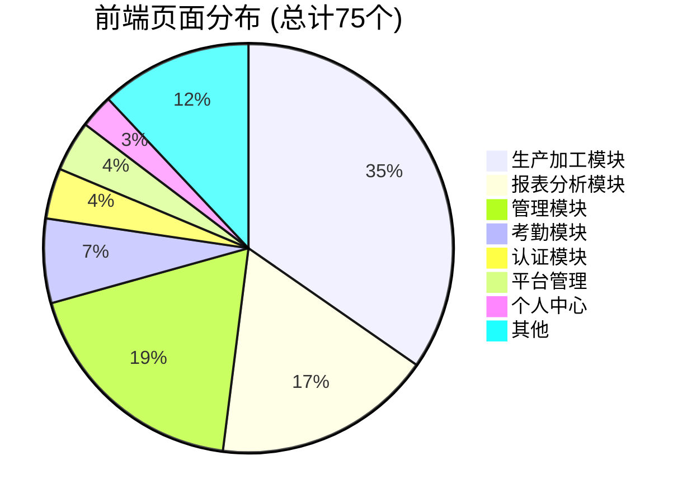
```mermaid
pie title 前端页面分布 (总计75个)
    "生产加工模块" : 26
    "报表分析模块" : 13
    "管理模块" : 14
    "考勤模块" : 5
    "认证模块" : 3
    "平台管理" : 3
    "个人中心" : 2
    "其他" : 9
```

### 5.3 状态管理架构 (Zustand)

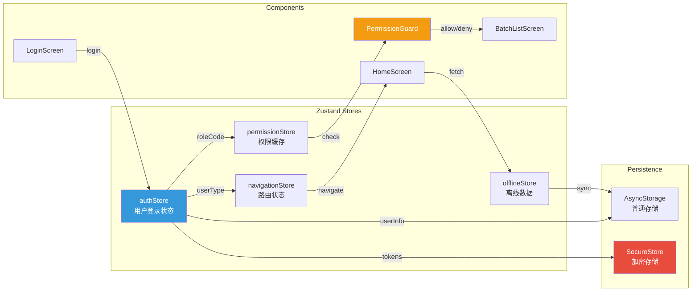
```mermaid
graph LR
    subgraph Zustand Stores
        A[authStore<br/>用户登录状态]
        B[navigationStore<br/>路由状态]
        C[permissionStore<br/>权限缓存]
        D[offlineStore<br/>离线数据]
    end

    subgraph Persistence
        E[SecureStore<br/>加密存储]
        F[AsyncStorage<br/>普通存储]
    end

    subgraph Components
        G[LoginScreen]
        H[HomeScreen]
        I[BatchListScreen]
        J[PermissionGuard]
    end

    G -->|login| A
    A -->|tokens| E
    A -->|userInfo| F

    A -->|userType| B
    B -->|navigate| H

    A -->|roleCode| C
    C -->|check| J
    J -->|allow/deny| I

    H -->|fetch| D
    D -->|sync| F

    style A fill:#3498DB,color:#fff
    style E fill:#E74C3C,color:#fff
    style J fill:#F39C12,color:#fff
```

### 5.4 API客户端架构

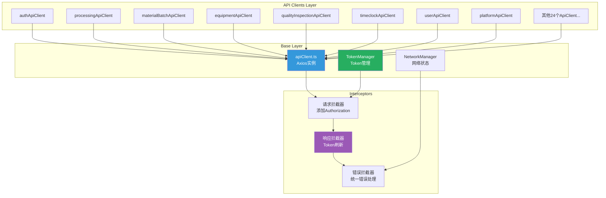
```mermaid
graph TB
    subgraph API Clients Layer
        A1[authApiClient]
        A2[processingApiClient]
        A3[materialBatchApiClient]
        A4[equipmentApiClient]
        A5[qualityInspectionApiClient]
        A6[timeclockApiClient]
        A7[userApiClient]
        A8[platformApiClient]
        A9[其他24个ApiClient...]
    end

    subgraph Base Layer
        B[apiClient.ts<br/>Axios实例]
        C[TokenManager<br/>Token管理]
        D[NetworkManager<br/>网络状态]
    end

    subgraph Interceptors
        E[请求拦截器<br/>添加Authorization]
        F[响应拦截器<br/>Token刷新]
        G[错误拦截器<br/>统一错误处理]
    end

    A1 --> B
    A2 --> B
    A3 --> B
    A4 --> B
    A5 --> B
    A6 --> B
    A7 --> B
    A8 --> B
    A9 --> B

    B --> E
    E --> F
    F --> G

    C --> E
    D --> G

    style B fill:#3498DB,color:#fff
    style C fill:#27AE60,color:#fff
    style F fill:#9B59B6,color:#fff
```

---

## 6. 后端架构

### 6.1 Controller层级结构

```mermaid
graph TB
    subgraph 移动端API
        M[MobileController<br/>603行 - 核心移动接口]
        M1[认证 12个API]
        M2[仪表盘 3个API]
        M3[文件上传 1个API]
        M4[设备管理 2个API]
        M5[人员报表 4个API]
        M6[设备告警 5个API]
        M --> M1
        M --> M2
        M --> M3
        M --> M4
        M --> M5
        M --> M6
    end

    subgraph 生产管理
        P[ProcessingController<br/>577行 - 生产核心]
        P1[批次管理 8个API]
        P2[质量检验 4个API]
        P3[成本分析 2个API]
        P4[仪表盘 6个API]
        P --> P1
        P --> P2
        P --> P3
        P --> P4
    end

    subgraph AI智能
        AI[AIController<br/>409行 - AI分析]
        AI1[成本分析 3个API]
        AI2[配额管理 2个API]
        AI3[报告管理 3个API]
        AI --> AI1
        AI --> AI2
        AI --> AI3
    end

    subgraph 基础数据
        U[UserController 314行]
        MB[MaterialBatchController 463行]
        E[EquipmentController 502行]
        T[TimeClockController 216行]
    end

    subgraph 平台管理
        PL[PlatformController 217行]
        PL1[工厂管理 7个API]
        PL2[AI配额 3个API]
        PL --> PL1
        PL --> PL2
    end

    subgraph 其他Controller
        O[其他15个Controller<br/>参考数据、报表、配置]
    end

    style M fill:#3498DB,color:#fff
    style P fill:#27AE60,color:#fff
    style AI fill:#9B59B6,color:#fff
    style PL fill:#E74C3C,color:#fff
```

### 6.2 API端点统计

```mermaid
pie title API端点分布 (总计577个)
    "ProcessingController" : 35
    "MobileController" : 30
    "MaterialBatchController" : 18
    "EquipmentController" : 15
    "UserController" : 14
    "AIController" : 11
    "PlatformController" : 9
    "TimeClockController" : 8
    "其他Controller" : 437
```

### 6.3 Service层架构

```mermaid
graph TB
    subgraph Controller层
        C1[ProcessingController]
        C2[AIController]
        C3[UserController]
    end

    subgraph Service层
        S1[ProcessingService<br/>批次业务逻辑]
        S2[AIAnalysisService<br/>AI调用与配额]
        S3[UserService<br/>用户管理]
        S4[CostCalculationService<br/>成本计算]
        S5[InventoryService<br/>库存管理]
        S6[TimeClockService<br/>考勤服务]
    end

    subgraph Repository层
        R1[ProcessingBatchRepository]
        R2[AIAnalysisResultRepository]
        R3[UserRepository]
        R4[MaterialBatchRepository]
        R5[TimeClockRecordRepository]
    end

    subgraph External Services
        E1[DeepSeek API<br/>AI分析]
        E2[文件存储服务<br/>OSS/S3]
        E3[短信服务<br/>验证码]
    end

    C1 --> S1
    C2 --> S2
    C3 --> S3

    S1 --> S4
    S1 --> S5
    S1 --> R1

    S2 --> E1
    S2 --> R2

    S3 --> R3
    S6 --> R5

    S1 --> E2
    S3 --> E3

    style S1 fill:#3498DB,color:#fff
    style S2 fill:#9B59B6,color:#fff
    style E1 fill:#E74C3C,color:#fff
```

### 6.4 安全架构

```mermaid
graph LR
    A[HTTP请求] --> B[Spring Security<br/>过滤器链]

    B --> C{需要认证?}
    C -->|否| D[公开端点<br/>/auth/login]
    C -->|是| E[JWT验证]

    E --> F{Token有效?}
    F -->|否| G[401 Unauthorized]
    F -->|是| H{权限检查}

    H --> I[@PreAuthorize<br/>注解验证]
    I --> J{有权限?}

    J -->|否| K[403 Forbidden]
    J -->|是| L[Controller<br/>业务逻辑]

    L --> M[Service层]
    M --> N[Repository层]
    N --> O[(数据库)]

    O --> P[响应数据]
    P --> Q[ResponseEntity]

    style B fill:#3498DB,color:#fff
    style E fill:#27AE60,color:#fff
    style I fill:#F39C12,color:#fff
    style L fill:#9B59B6,color:#fff
```

#### 权限注解示例

```java
// 仅平台管理员可访问
@PreAuthorize("hasRole('ROLE_PLATFORM_ADMIN') or hasRole('ROLE_SUPER_ADMIN')")
@PostMapping("/factories")
public ResponseEntity<Factory> createFactory(@RequestBody Factory factory) { }

// 工厂管理员及以上可访问
@PreAuthorize("hasAnyRole('ROLE_FACTORY_SUPER_ADMIN', 'ROLE_FACTORY_ADMIN')")
@PostMapping("/users")
public ResponseEntity<User> createUser(@RequestBody User user) { }

// 任何登录用户可访问
@PreAuthorize("isAuthenticated()")
@GetMapping("/dashboard")
public ResponseEntity<Dashboard> getDashboard() { }

// 特定用户或管理员可访问
@PreAuthorize("#userId == authentication.principal.id or hasRole('ROLE_FACTORY_ADMIN')")
@GetMapping("/users/{userId}")
public ResponseEntity<User> getUser(@PathVariable Integer userId) { }
```

---

## 7. 技术实现总结

### 7.1 技术栈对照

| 层级 | 前端 (React Native) | 后端 (Spring Boot) |
|------|---------------------|-------------------|
| **框架** | Expo 53+ | Spring Boot 2.7.15 |
| **语言** | TypeScript | Java 11 |
| **路由** | React Navigation 7+ | Spring MVC |
| **状态管理** | Zustand + SecureStore | Spring Session |
| **数据库** | - | MySQL 8+ |
| **ORM** | - | Spring Data JPA + Hibernate |
| **认证** | JWT Client | Spring Security + JWT |
| **网络请求** | Axios | RestTemplate / WebClient |
| **UI组件** | React Native Paper | - |
| **表格处理** | - | Apache POI (Excel) |
| **AI集成** | - | DeepSeek API |
| **缓存** | AsyncStorage | Redis (Token缓存) |
| **文件上传** | Expo ImagePicker | Multipart Upload |

### 7.2 关键技术实现

#### 7.2.1 认证流程

```
前端 (React Native)                      后端 (Spring Boot)
┌─────────────────┐                     ┌──────────────────┐
│   LoginScreen   │                     │ MobileController │
└────────┬────────┘                     └────────┬─────────┘
         │                                       │
         │ POST /auth/unified-login              │
         │ {username, password}                  │
         │──────────────────────────────────────>│
         │                                       │
         │                              ┌────────▼────────┐
         │                              │ UserDetailsService│
         │                              │ 查询用户 + 验证密码 │
         │                              └────────┬────────┘
         │                                       │
         │                              ┌────────▼────────┐
         │                              │   JWT Service   │
         │                              │ 生成accessToken  │
         │                              │ 生成refreshToken │
         │                              └────────┬────────┘
         │                                       │
         │   {user, tokens, userType}            │
         │<──────────────────────────────────────│
         │                                       │
┌────────▼────────┐
│  TokenManager   │
│ SecureStore存储 │
└────────┬────────┘
         │
┌────────▼────────┐
│   authStore     │
│ 更新登录状态     │
└────────┬────────┘
         │
┌────────▼────────┐
│  Navigation     │
│ 根据userType跳转│
└─────────────────┘
```

#### 7.2.2 成本自动计算

```java
// ProcessingService.java
@Transactional
public ProcessingBatch completeBatch(String batchId, CompleteBatchRequest request) {
    ProcessingBatch batch = batchRepository.findById(batchId)
        .orElseThrow(() -> new NotFoundException("批次不存在"));

    // 1. 计算原材料成本
    BigDecimal materialCost = materialConsumptionRepository
        .findByBatchId(batchId)
        .stream()
        .map(consumption -> consumption.getQuantity()
            .multiply(consumption.getMaterialBatch().getUnitPrice()))
        .reduce(BigDecimal.ZERO, BigDecimal::add);

    // 2. 计算人工成本
    BigDecimal laborCost = batchWorkSessionRepository
        .findByBatchId(batchId)
        .stream()
        .map(session -> {
            User worker = session.getUser();
            BigDecimal hourlyRate = worker.getMonthlySalary()
                .divide(new BigDecimal(worker.getExpectedWorkMinutes()), 6, RoundingMode.HALF_UP)
                .multiply(new BigDecimal(60));
            return hourlyRate.multiply(new BigDecimal(session.getWorkMinutes()))
                .divide(new BigDecimal(60), 2, RoundingMode.HALF_UP);
        })
        .reduce(BigDecimal.ZERO, BigDecimal::add);

    // 3. 计算设备成本
    BigDecimal equipmentCost = batchEquipmentUsageRepository
        .findByBatchId(batchId)
        .stream()
        .map(usage -> {
            Equipment equipment = usage.getEquipment();
            BigDecimal hourlyDepreciation = equipment.getPurchasePrice()
                .divide(new BigDecimal(equipment.getLifespanYears() * 365 * 24), 6, RoundingMode.HALF_UP);
            return hourlyDepreciation.multiply(new BigDecimal(usage.getUsageMinutes()))
                .divide(new BigDecimal(60), 2, RoundingMode.HALF_UP);
        })
        .reduce(BigDecimal.ZERO, BigDecimal::add);

    // 4. 总成本
    BigDecimal totalCost = materialCost.add(laborCost).add(equipmentCost);

    // 5. 更新批次
    batch.setMaterialCost(materialCost);
    batch.setLaborCost(laborCost);
    batch.setEquipmentCost(equipmentCost);
    batch.setTotalCost(totalCost);
    batch.setStatus("completed");
    batch.setEndTime(LocalDateTime.now());
    batch.setActualQuantity(request.getActualQuantity());

    // 6. 更新库存
    inventoryService.updateInventoryAfterProduction(batch);

    return batchRepository.save(batch);
}
```

#### 7.2.3 AI分析缓存策略

```java
// AIAnalysisService.java
@Service
public class AIAnalysisService {

    @Autowired
    private RedisTemplate<String, String> redisTemplate;

    @Autowired
    private DeepSeekApiClient deepSeekClient;

    private static final Duration CACHE_TTL = Duration.ofMinutes(5);

    public AIAnalysisResult analyzeBatchCost(String batchId, String question) {
        // 1. 生成缓存key (基于batchId + question的hash)
        String cacheKey = generateCacheKey(batchId, question);

        // 2. 检查缓存
        String cachedResult = redisTemplate.opsForValue().get(cacheKey);
        if (cachedResult != null) {
            log.info("AI分析命中缓存，不消耗配额");
            return parseFromJson(cachedResult);
        }

        // 3. 检查配额
        AIQuota quota = quotaRepository.findByFactoryId(factoryId);
        if (quota.getRemainingQuota() <= 0) {
            throw new QuotaExceededException("本周AI配额已用完");
        }

        // 4. 获取批次数据
        ProcessingBatch batch = batchRepository.findById(batchId)
            .orElseThrow(() -> new NotFoundException("批次不存在"));

        // 5. 构造Prompt
        String prompt = buildPrompt(batch, question);

        // 6. 调用DeepSeek API
        DeepSeekResponse response = deepSeekClient.chat(prompt);

        // 7. 消耗配额
        quota.setRemainingQuota(quota.getRemainingQuota() - 1);
        quotaRepository.save(quota);

        // 8. 保存结果
        AIAnalysisResult result = new AIAnalysisResult();
        result.setBatchId(batchId);
        result.setQuestion(question);
        result.setAnalysis(response.getContent());
        result.setSuggestions(extractSuggestions(response.getContent()));
        result.setTokensUsed(response.getUsage().getTotalTokens());
        AIAnalysisResult savedResult = resultRepository.save(result);

        // 9. 缓存结果 (5分钟TTL)
        redisTemplate.opsForValue().set(cacheKey, toJson(savedResult), CACHE_TTL);

        // 10. 审计日志
        auditLog(factoryId, batchId, question, response.getUsage());

        return savedResult;
    }

    private String generateCacheKey(String batchId, String question) {
        String combined = batchId + ":" + question.toLowerCase().trim();
        return "ai:cache:" + DigestUtils.md5Hex(combined);
    }
}
```

### 7.3 性能优化策略

| 场景 | 优化策略 | 效果 |
|------|---------|------|
| **AI分析** | Redis缓存 (5分钟TTL) | 重复问题不消耗配额 |
| **Token验证** | Redis存储refreshToken | 验证速度 <10ms |
| **批次列表** | 分页查询 (pageSize=20) | 首屏加载 <500ms |
| **库存预警** | 定时任务 (每小时) | 减少实时查询压力 |
| **Excel导出** | 流式写入 (POI SXSSFWorkbook) | 支持10万行数据 |
| **图片上传** | 前端压缩 + 后端裁剪 | 减少流量 70% |
| **离线支持** | AsyncStorage本地缓存 | 离线可查看历史数据 |

### 7.4 数据一致性保证

```java
// 事务管理示例
@Transactional(rollbackFor = Exception.class)
public void processBatchCompletion(String batchId) {
    try {
        // 1. 更新批次状态
        updateBatchStatus(batchId, "completed");

        // 2. 扣减原材料库存
        deductMaterialInventory(batchId);

        // 3. 增加成品库存
        increaseProductInventory(batchId);

        // 4. 计算并保存成本
        calculateAndSaveCost(batchId);

        // 5. 更新员工工时统计
        updateWorkerStatistics(batchId);

        // 任何一步失败，全部回滚
    } catch (Exception e) {
        log.error("批次完成处理失败: {}", batchId, e);
        throw new ProcessingException("批次完成失败，请重试", e);
    }
}
```

---

## 附录

### A. 快速参考

#### A.1 常用API端点

```bash
# 认证
POST   /api/mobile/auth/unified-login        # 统一登录
POST   /api/mobile/auth/refresh              # 刷新Token
GET    /api/mobile/auth/me                   # 获取当前用户

# 打卡
POST   /api/mobile/{factoryId}/timeclock/clock-in   # 上班打卡
POST   /api/mobile/{factoryId}/timeclock/clock-out  # 下班打卡
GET    /api/mobile/{factoryId}/timeclock/today      # 今日打卡记录

# 批次
POST   /api/mobile/{factoryId}/processing/batches            # 创建批次
GET    /api/mobile/{factoryId}/processing/batches            # 批次列表
POST   /api/mobile/{factoryId}/processing/batches/{id}/start # 开始生产
POST   /api/mobile/{factoryId}/processing/batches/{id}/complete # 完成

# AI分析
POST   /api/mobile/{factoryId}/ai/analysis/cost/batch        # 批次成本分析
GET    /api/mobile/{factoryId}/ai/quota                      # 查询配额

# 库存
GET    /api/mobile/{factoryId}/material-batches              # 原料批次列表
POST   /api/mobile/{factoryId}/material-batches              # 原料入库
GET    /api/mobile/{factoryId}/material-batches/low-stock    # 低库存预警

# 设备
GET    /api/mobile/{factoryId}/equipment                     # 设备列表
GET    /api/mobile/{factoryId}/equipment-alerts              # 设备告警
POST   /api/mobile/{factoryId}/equipment/alerts/{id}/resolve # 解决告警

# 平台管理（仅平台管理员）
GET    /api/platform/factories                               # 工厂列表
POST   /api/platform/factories                               # 创建工厂
PUT    /api/platform/ai-quota/{factoryId}                    # 更新AI配额
```

#### A.2 测试账号

```
平台管理员:
  username: admin
  password: Admin@123456

工厂超级管理员:
  username: factory_admin
  password: Factory@123456

生产主管:
  username: supervisor
  password: Super@123456

操作员:
  username: operator
  password: Oper@123456
```

#### A.3 服务器信息

```
后端API服务器:
  地址: http://139.196.165.140:10010
  宝塔面板: https://139.196.165.140:16435/a96c4c2e

部署位置:
  JAR文件: /www/wwwroot/cretas/cretas-backend-system-1.0.0.jar
  日志文件: /www/wwwroot/cretas/cretas-backend.log
  重启脚本: /www/wwwroot/cretas/restart.sh

数据库:
  MySQL 8+
  端口: 3306
  数据库名: cretas_db
```

---

## 文档维护

- **当前版本**: v2.0
- **上次更新**: 2025-11-20
- **维护人**: 系统架构师
- **更新频率**: 每次重大功能发布时更新

**变更历史**:
- v2.0 (2025-11-20): 完整重构，添加所有Mermaid可视化图表
- v1.0 (2024-xx-xx): 初始版本（旧文档）

---

**📄 相关文档**:
- [API完整参考](./API_COMPLETE_REFERENCE.md)
- [功能与文件映射 v2.0](./prd/PRD-功能与文件映射-v2.0.html)
- [PRD系统产品需求文档 v4.0](./prd/PRD-系统产品需求文档-v4.0.md)
- [后端表结构和逻辑需求](../backend/rn-update-tableandlogic.md)
