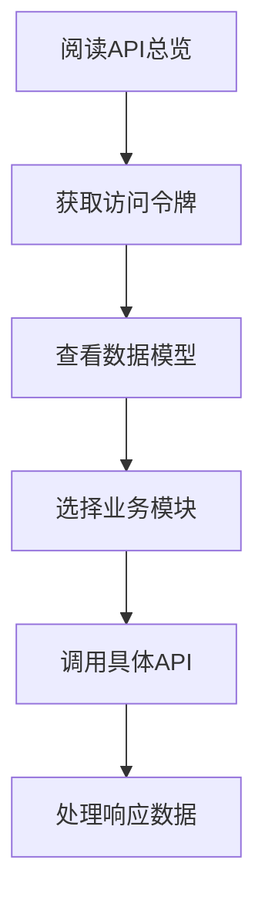

# API文档目录

<!-- updated for: TASK-P2-007 API接口文档完善 - 更新API文档索引 -->

本目录包含食品溯源系统的完整API文档。

## 文档结构

### 📋 核心文档
- [`overview.md`](./overview.md) - API总览与通用约定
- [`data-models.md`](./data-models.md) - 统一数据模型定义
- [`authentication.md`](./authentication.md) - 认证与授权

### 🌾 业务模块API
- [`farming.md`](./farming.md) - 农业模块API（种植/养殖记录、环境数据、农场管理）
- [`processing.md`](./processing.md) - 加工模块API（生产工艺、质量检测、设备监控）
- [`logistics.md`](./logistics.md) - 物流模块API（运输记录、车辆跟踪、仓储管理）
- [`trace.md`](./trace.md) - 溯源模块API（溯源批次、查询验证、二维码生成）

### 👥 管理功能API
- [`admin.md`](./admin.md) - 管理模块API（用户管理、权限配置、系统监控）
- [`profile.md`](./profile.md) - 用户中心API（个人信息、偏好设置、安全配置）

## 📖 使用指南

### 快速开始
1. 📖 **阅读总览**：查看 [`overview.md`](./overview.md) 了解API基本概念和通用约定
2. 🔐 **了解认证**：阅读 [`authentication.md`](./authentication.md) 学习如何获取和使用访问令牌
3. 📊 **查看数据模型**：参考 [`data-models.md`](./data-models.md) 了解统一的数据结构定义
4. 🎯 **选择模块**：根据业务需求查看对应模块的API文档

### 开发流程

### 模块说明

#### 🌾 农业模块 (`/api/v1/farming`)
管理农场信息、种植/养殖记录、环境数据采集和农事活动记录。支持从种植到收获的完整农业生产过程数字化管理。

#### 🏭 加工模块 (`/api/v1/processing`)
提供生产工艺记录、质量检测数据管理、设备监控和加工批次管理。支持从原料入库到成品出库的完整加工过程追踪。

#### 🚛 物流模块 (`/api/v1/logistics`)
管理运输记录、车辆跟踪、仓储信息和温湿度监控。确保食品在运输过程中的安全和全程可追溯性。

#### 🔍 溯源模块 (`/api/v1/traces`)
提供溯源批次管理、产品查询验证和二维码生成功能。是整个食品溯源系统的核心模块。

#### 👤 管理模块 (`/api/v1/admin`)
系统管理员功能，包括用户管理、权限配置、组织架构、系统监控和数据统计等。

#### 👨‍💼 用户中心 (`/api/v1/profile`)
个人账户管理功能，包括个人信息管理、偏好设置、安全配置和消息通知等。

## 🔧 技术规范

### API设计原则
- **RESTful架构**：遵循REST设计理念，资源导向
- **统一响应格式**：所有API返回标准化的JSON响应
- **分页查询**：支持分页、排序、筛选和搜索
- **版本控制**：通过URL路径进行版本管理
- **错误处理**：提供详细的错误码和错误信息

### 数据格式
- **时间格式**：使用ISO 8601标准 (`YYYY-MM-DDTHH:mm:ssZ`)
- **编码格式**：统一使用UTF-8编码
- **数值精度**：金额使用小数点后2位，重量使用小数点后3位
- **布尔值**：使用`true`/`false`
- **空值处理**：使用`null`表示空值

### 安全机制
- **JWT认证**：基于JSON Web Token的无状态认证
- **权限控制**：基于角色的访问控制(RBAC)
- **数据加密**：敏感数据传输和存储加密
- **审计日志**：记录所有重要操作的审计信息

## 📊 统计信息

| 模块 | 接口数量 | 数据模型数 | 状态 |
|------|----------|------------|------|
| 认证模块 | 8 | 5 | ✅ 完成 |
| 农业模块 | 25 | 12 | ✅ 完成 |
| 加工模块 | 28 | 15 | ✅ 完成 |
| 物流模块 | 30 | 18 | ✅ 完成 |
| 溯源模块 | 22 | 10 | ✅ 完成 |
| 管理模块 | 35 | 20 | ✅ 完成 |
| 用户中心 | 20 | 12 | ✅ 完成 |
| **总计** | **168** | **92** | ✅ **完成** |

## 🔄 版本信息

- **当前版本**：v1.0
- **最后更新**：2025-05-21
- **API规范**：基于 [`api-interface-design-agent.mdc`](../../.cursor/rules/api-interface-design-agent.mdc) 规范
- **兼容性**：向后兼容，新版本不会破坏现有集成

## 📞 技术支持

如果在使用API过程中遇到问题，请：

1. **查看错误码表**：每个模块都提供详细的错误码说明
2. **检查请求格式**：确保请求参数符合文档规范
3. **验证权限设置**：确认账户具有相应的API访问权限
4. **联系技术支持**：提供完整的错误信息和请求详情

---

**注意**：本文档基于TASK-P2-007（API接口文档完善）任务创建，严格遵循API接口设计规范，确保系统各模块间的数据一致性和互操作性。 