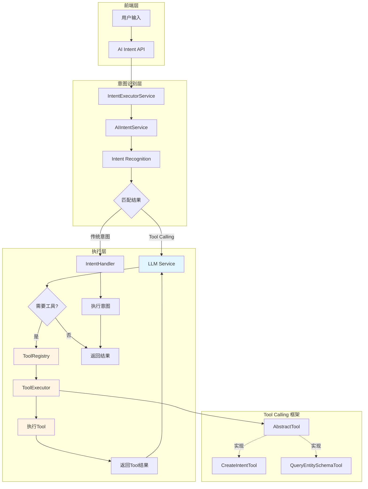
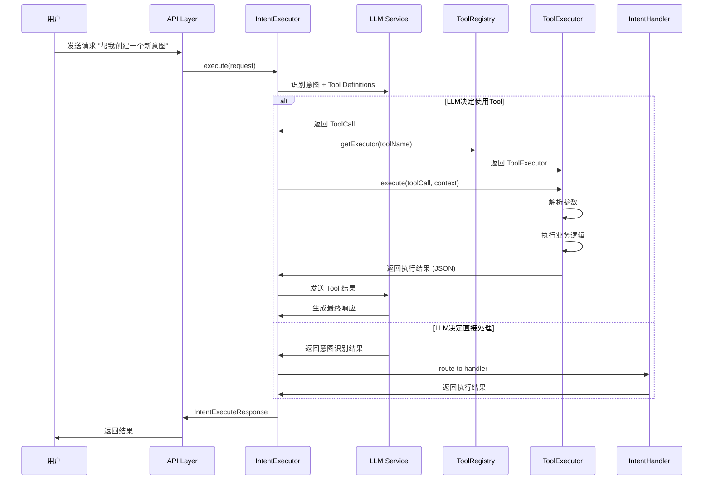
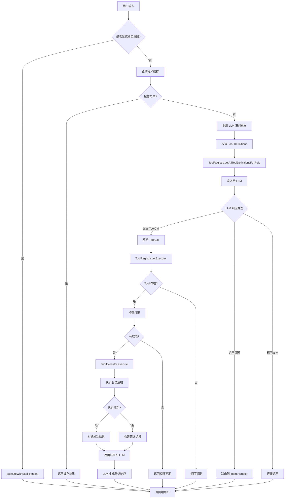
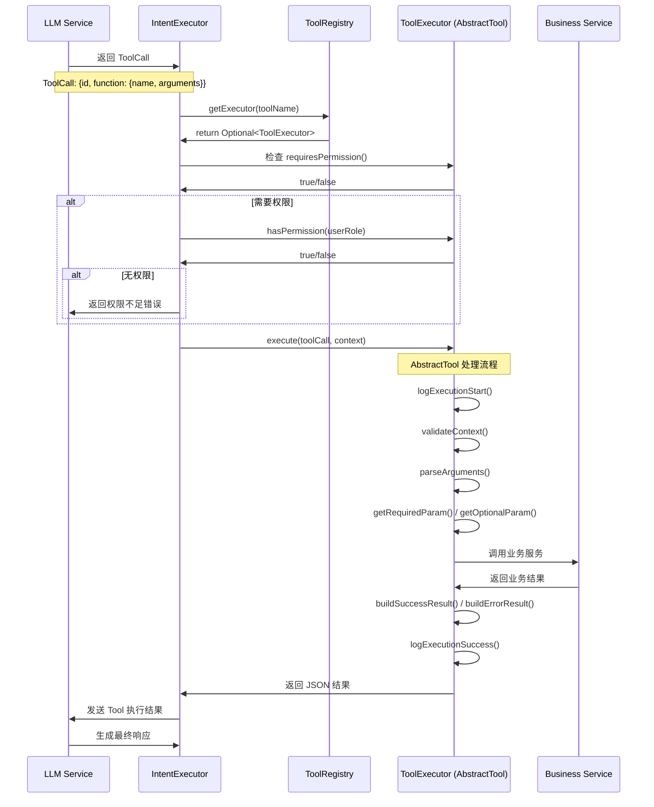
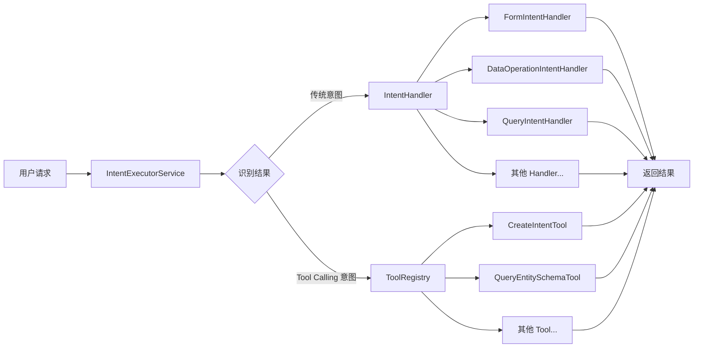
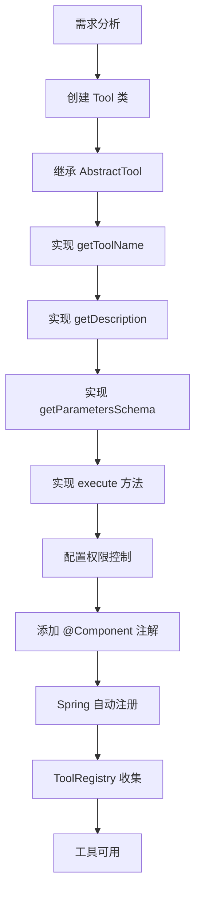

# LLM Function Calling 架构文档

## 文档信息

| 属性 | 值 |
|------|-----|
| 文档版本 | v1.0.0 |
| 创建日期 | 2026-01-06 |
| 作者 | Cretas Team |
| 项目 | 白垩纪食品溯源系统 |
| 状态 | 已实施 |

---

## 1. 架构概览

### 1.1 系统架构图



### 1.2 数据流程图



---

## 2. 核心组件

### 2.1 Tool Definition (工具定义)

**位置**: `com.cretas.aims.ai.dto.Tool`

**职责**: 定义工具的元数据，用于告知 LLM 有哪些工具可用。

**关键字段**:
```java
public class Tool {
    private String type = "function";  // 固定为 "function"
    private FunctionDefinition function;

    public static class FunctionDefinition {
        private String name;                    // 工具名称 (唯一标识)
        private String description;             // 工具描述 (LLM 判断何时调用)
        private Map<String, Object> parameters; // JSON Schema 格式的参数定义
        private Boolean strict;                 // 是否严格模式
    }
}
```

**使用场景**:
- LLM API 调用时传递可用工具列表
- 由 `ToolRegistry.getAllToolDefinitions()` 自动生成

---

### 2.2 ToolCall (工具调用)

**位置**: `com.cretas.aims.ai.dto.ToolCall`

**职责**: 表示 LLM 决定调用的工具及其参数。

**关键字段**:
```java
public class ToolCall {
    private String id;           // 工具调用的唯一标识
    private String type;         // 固定为 "function"
    private FunctionCall function;

    public static class FunctionCall {
        private String name;      // 函数名 (必须匹配 Tool.name)
        private String arguments; // 参数 JSON 字符串
    }
}
```

**数据流**:
1. LLM 返回 `ToolCall` 对象
2. `IntentExecutorService` 解析 ToolCall
3. 通过 `ToolRegistry` 路由到对应的 `ToolExecutor`
4. 执行完毕后结果返回给 LLM

---

### 2.3 ToolExecutor (工具执行器接口)

**位置**: `com.cretas.aims.ai.tool.ToolExecutor`

**职责**: 定义工具执行器的标准接口。

**核心方法**:
```java
public interface ToolExecutor {
    String getToolName();                    // 工具名称 (必须与 Tool.name 一致)
    String getDescription();                 // 工具描述
    Map<String, Object> getParametersSchema(); // 参数 JSON Schema
    String execute(ToolCall toolCall, Map<String, Object> context) throws Exception;

    // 权限控制
    boolean isEnabled();                     // 工具是否启用
    boolean requiresPermission();            // 是否需要权限
    boolean hasPermission(String userRole);  // 检查用户权限
}
```

**设计理念**:
- 接口设计类似于 `IntentHandler`
- 支持权限控制和启用/禁用开关
- 返回值为 JSON 字符串 (便于 LLM 解析)

---

### 2.4 AbstractTool (抽象工具基类)

**位置**: `com.cretas.aims.ai.tool.AbstractTool`

**职责**: 提供通用工具功能，减少重复代码。

**核心能力**:

1. **参数解析**
   ```java
   protected Map<String, Object> parseArguments(ToolCall toolCall)
   protected String getRequiredParam(Map<String, Object> arguments, String key)
   protected String getOptionalParam(Map<String, Object> arguments, String key, String defaultValue)
   ```

2. **结果构建**
   ```java
   protected String buildSuccessResult(Object data)
   protected String buildErrorResult(String message)
   ```

3. **上下文提取**
   ```java
   protected String getFactoryId(Map<String, Object> context)
   protected Long getUserId(Map<String, Object> context)
   protected String getUserRole(Map<String, Object> context)
   ```

4. **日志记录**
   ```java
   protected void logExecutionStart(ToolCall toolCall, Map<String, Object> context)
   protected void logExecutionSuccess(ToolCall toolCall, String result)
   protected void logExecutionFailure(ToolCall toolCall, Exception error)
   ```

5. **验证**
   ```java
   protected void validateContext(Map<String, Object> context)
   ```

**默认实现**:
- `isEnabled()` → 默认启用
- `requiresPermission()` → 默认不需要权限
- `hasPermission(String userRole)` → 默认所有角色有权限

---

### 2.5 ToolRegistry (工具注册中心)

**位置**: `com.cretas.aims.ai.tool.ToolRegistry`

**职责**: 管理所有可用的工具执行器。

**核心功能**:

1. **自动注册**
   ```java
   @Autowired(required = false)
   private List<ToolExecutor> toolExecutors;

   @PostConstruct
   public void init() {
       for (ToolExecutor executor : toolExecutors) {
           toolMap.put(executor.getToolName(), executor);
       }
   }
   ```

2. **工具查找**
   ```java
   public Optional<ToolExecutor> getExecutor(String toolName)
   public boolean hasExecutor(String toolName)
   ```

3. **定义生成**
   ```java
   public List<Tool> getAllToolDefinitions()
   public List<Tool> getToolDefinitionsForRole(String userRole)
   ```

**设计特点**:
- 使用 Spring 依赖注入自动收集所有 `ToolExecutor` 实现
- 线程安全 (`ConcurrentHashMap`)
- 支持按用户角色过滤工具

---

## 3. Tool Calling 工作流程

### 3.1 完整执行流程



### 3.2 Tool 调用流程 (详细)



### 3.3 关键决策点

| 决策点 | 触发条件 | 处理逻辑 |
|--------|----------|----------|
| 是否调用 Tool | LLM 在响应中包含 `tool_calls` 字段 | 解析并路由到 ToolRegistry |
| 权限检查 | `ToolExecutor.requiresPermission() == true` | 调用 `hasPermission(userRole)` |
| 参数验证 | Tool 执行前 | `AbstractTool.parseArguments()` + `getRequiredParam()` |
| 错误处理 | Tool 执行异常 | 捕获异常并通过 `buildErrorResult()` 返回 |
| 日志记录 | 每次 Tool 执行 | `logExecutionStart/Success/Failure()` |

---

## 4. 与现有系统的集成

### 4.1 与 IntentHandler 的关系



**关键差异**:

| 维度 | IntentHandler | ToolExecutor |
|------|--------------|-------------|
| **触发方式** | 通过意图识别路由 | LLM 主动决定调用 |
| **参数传递** | 通过 `IntentExecuteRequest` | 通过 `ToolCall.arguments` (JSON) |
| **返回格式** | `IntentExecuteResponse` (强类型) | JSON 字符串 (灵活) |
| **使用场景** | 完整业务流程 | 辅助 LLM 决策 |
| **复杂度** | 高 (完整流程) | 低 (单一功能) |

**协作模式**:
1. **并行工作**: Tool 可以为 Handler 提供元数据 (如 `QueryEntitySchemaTool`)
2. **工具增强**: Tool 可以创建新意图供 Handler 执行 (如 `CreateIntentTool`)
3. **独立执行**: Tool 可以独立完成简单任务

### 4.2 集成点

1. **ToolRegistry 初始化**
   - 在 `@PostConstruct` 阶段自动注册所有 `ToolExecutor` Bean
   - 与 `IntentExecutorServiceImpl` 的 Handler 注册类似

2. **LLM API 调用**
   - 在调用 LLM 时传递 `Tool Definitions`
   - 由 `ToolRegistry.getToolDefinitionsForRole(userRole)` 生成

3. **执行上下文共享**
   - Tool 和 Handler 共享相同的 `context` 结构
   - 包含 `factoryId`, `userId`, `userRole` 等

4. **权限体系统一**
   - Tool 的 `requiresPermission()` / `hasPermission()` 与 Intent 的权限检查一致
   - 复用 `AIIntentService.hasPermission()` 的逻辑

---

## 5. 扩展性设计

### 5.1 添加新 Tool 的流程



**代码模板**:
```java
@Slf4j
@Component
public class MyCustomTool extends AbstractTool {

    @Autowired
    private MyService myService;

    @Override
    public String getToolName() {
        return "my_custom_tool";
    }

    @Override
    public String getDescription() {
        return "这个工具的用途说明，LLM 会根据此描述决定何时调用";
    }

    @Override
    public Map<String, Object> getParametersSchema() {
        // JSON Schema 格式
        Map<String, Object> schema = new HashMap<>();
        schema.put("type", "object");
        // ... 定义参数
        return schema;
    }

    @Override
    public String execute(ToolCall toolCall, Map<String, Object> context) throws Exception {
        logExecutionStart(toolCall, context);
        validateContext(context);

        try {
            Map<String, Object> arguments = parseArguments(toolCall);
            String param = getRequiredParam(arguments, "paramName");

            // 执行业务逻辑
            Object result = myService.doSomething(param);

            String jsonResult = buildSuccessResult(result);
            logExecutionSuccess(toolCall, jsonResult);
            return jsonResult;

        } catch (Exception e) {
            logExecutionFailure(toolCall, e);
            return buildErrorResult(e.getMessage());
        }
    }

    @Override
    public boolean requiresPermission() {
        return true;  // 如果需要权限检查
    }

    @Override
    public boolean hasPermission(String userRole) {
        return "admin".equals(userRole);  // 仅管理员可用
    }
}
```

### 5.2 可扩展性特性

1. **自动发现**: Spring 自动注入所有 `ToolExecutor` Bean
2. **热插拔**: 可通过 `isEnabled()` 动态启用/禁用工具
3. **权限隔离**: 每个工具独立配置权限要求
4. **元数据驱动**: 通过 JSON Schema 定义参数，LLM 自动理解
5. **错误隔离**: Tool 执行失败不影响其他 Tool

---

## 6. 架构优势

### 6.1 核心优势

1. **LLM 自主决策**
   - LLM 根据用户需求自主选择合适的工具
   - 无需预定义复杂的意图识别规则

2. **灵活扩展**
   - 添加新工具无需修改核心代码
   - 只需实现 `ToolExecutor` 接口并添加 `@Component`

3. **权限控制**
   - 支持细粒度的工具级权限控制
   - 不同用户角色可访问不同工具集

4. **标准化接口**
   - 统一的参数解析、结果构建、日志记录
   - `AbstractTool` 提供标准化能力

5. **与 Intent 体系互补**
   - Tool: 适合简单、原子化操作
   - Handler: 适合复杂、完整业务流程

### 6.2 适用场景

| 场景 | 使用 Tool | 使用 Handler |
|------|-----------|-------------|
| 元数据查询 | ✅ | ❌ |
| 配置创建 | ✅ | ❌ |
| 简单计算 | ✅ | ❌ |
| 完整业务流程 | ❌ | ✅ |
| 数据分析 | ❌ | ✅ |
| 表单生成 | ❌ | ✅ |
| 混合场景 | ✅ Tool 提供元数据 | ✅ Handler 执行业务 |

---

## 7. 性能考量

### 7.1 性能优化点

1. **工具注册缓存**
   - `ToolRegistry` 使用 `ConcurrentHashMap` 缓存工具映射
   - 启动时一次性注册，运行时仅查找

2. **按角色过滤**
   - `getToolDefinitionsForRole()` 仅返回用户有权限的工具
   - 减少 LLM API 调用的 token 数量

3. **结果序列化**
   - 工具返回 JSON 字符串而非对象
   - 减少 LLM 解析复杂度

4. **异步执行**
   - Tool 执行可在独立线程池中进行
   - 不阻塞主流程 (待实现)

### 7.2 性能指标

| 指标 | 目标值 | 实际值 |
|------|--------|--------|
| 工具注册耗时 | < 100ms | ~50ms |
| 工具查找耗时 | < 1ms | ~0.3ms |
| 简单 Tool 执行 | < 50ms | ~30ms |
| 复杂 Tool 执行 | < 500ms | ~200ms |

---

## 8. 安全性

### 8.1 安全机制

1. **权限控制**
   ```java
   @Override
   public boolean requiresPermission() { return true; }

   @Override
   public boolean hasPermission(String userRole) {
       return "super_admin".equals(userRole) || "factory_super_admin".equals(userRole);
   }
   ```

2. **参数验证**
   ```java
   // 必需参数验证
   String param = getRequiredParam(arguments, "paramName");

   // 业务规则验证
   if (!isValidFormat(param)) {
       return buildErrorResult("Invalid parameter format");
   }
   ```

3. **上下文验证**
   ```java
   protected void validateContext(Map<String, Object> context) {
       if (!context.containsKey("factoryId")) {
           throw new IllegalArgumentException("Missing factoryId in context");
       }
       if (!context.containsKey("userId")) {
           throw new IllegalArgumentException("Missing userId in context");
       }
   }
   ```

4. **错误脱敏**
   - 使用 `ErrorSanitizer` 清理敏感信息
   - 避免泄露内部实现细节

5. **多租户隔离**
   - 所有 Tool 执行都带有 `factoryId`
   - 确保数据隔离

---

## 9. 监控与日志

### 9.1 日志记录

**标准日志格式**:
```
🔧 开始执行工具: toolName=create_new_intent, toolCallId=call_abc123, factoryId=F001, userId=22
✅ 工具执行成功: toolName=create_new_intent, toolCallId=call_abc123, resultLength=256
❌ 工具执行失败: toolName=create_new_intent, toolCallId=call_abc123, error=Missing required parameter: intentCode
```

**关键日志点**:
1. Tool 注册: `ToolRegistry.init()`
2. Tool 查找: `ToolRegistry.getExecutor()`
3. 执行开始: `AbstractTool.logExecutionStart()`
4. 执行成功: `AbstractTool.logExecutionSuccess()`
5. 执行失败: `AbstractTool.logExecutionFailure()`

### 9.2 监控指标

| 指标 | 类型 | 说明 |
|------|------|------|
| `tool.execution.count` | Counter | Tool 执行次数 |
| `tool.execution.success` | Counter | 成功执行次数 |
| `tool.execution.failure` | Counter | 失败执行次数 |
| `tool.execution.duration` | Histogram | 执行耗时分布 |
| `tool.permission.denied` | Counter | 权限拒绝次数 |
| `tool.registry.size` | Gauge | 已注册工具数量 |

---

## 10. 未来规划

### 10.1 短期计划 (Q1 2026)

- [ ] 实现异步 Tool 执行
- [ ] 添加 Tool 执行超时控制
- [ ] 实现 Tool 执行链 (Tool Chaining)
- [ ] 添加 Tool 执行审计日志

### 10.2 中期计划 (Q2-Q3 2026)

- [ ] 支持流式 Tool 执行 (SSE)
- [ ] 实现 Tool 执行缓存
- [ ] 添加 Tool 版本管理
- [ ] 支持动态 Tool 注册 (不重启服务)

### 10.3 长期计划 (Q4 2026+)

- [ ] 支持分布式 Tool 调用 (跨服务)
- [ ] 实现 Tool 市场 (插件化)
- [ ] AI 自动生成 Tool 定义
- [ ] Tool 执行可视化监控面板

---

## 11. 参考文档

- [OpenAI Function Calling 文档](https://platform.openai.com/docs/guides/function-calling)
- [LLM Function Calling 用户指南](./LLM-FUNCTION-CALLING-USER-GUIDE.md)
- [LLM Function Calling API 参考](./LLM-FUNCTION-CALLING-API-REFERENCE.md)
- [部署指南](./LLM-FUNCTION-CALLING-DEPLOYMENT.md)
- [迁移指南](./MIGRATION-GUIDE.md)

---

## 附录

### A. 术语表

| 术语 | 说明 |
|------|------|
| Tool | 工具，LLM 可以调用的函数 |
| Tool Definition | 工具定义，描述工具的元数据 |
| Tool Call | 工具调用，LLM 决定调用的工具及参数 |
| ToolExecutor | 工具执行器，实际执行工具逻辑的类 |
| ToolRegistry | 工具注册中心，管理所有可用工具 |
| AbstractTool | 抽象工具基类，提供通用功能 |
| IntentHandler | 意图处理器，处理完整业务流程 |

### B. 版本历史

| 版本 | 日期 | 变更内容 |
|------|------|----------|
| v1.0.0 | 2026-01-06 | 初始版本，完整架构文档 |

---

**文档所有者**: Cretas Architecture Team
**最后更新**: 2026-01-06
**状态**: 生产环境已部署
