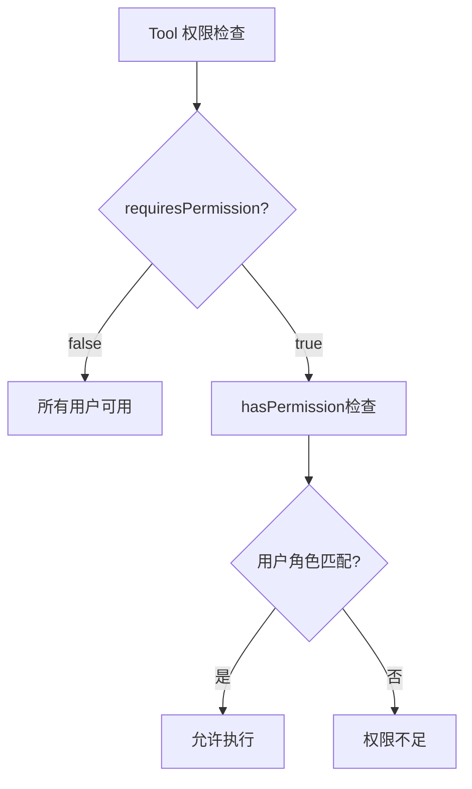

# LLM Function Calling 用户指南

## 文档信息

| 属性 | 值 |
|------|-----|
| 文档版本 | v1.0.0 |
| 创建日期 | 2026-01-06 |
| 目标读者 | 后端开发人员 |
| 难度级别 | 中级 |

---

## 1. 快速开始

### 1.1 5分钟快速体验

创建一个简单的 Tool，实现"获取当前时间"功能：

```java
package com.cretas.aims.ai.tool.impl;

import com.cretas.aims.ai.dto.ToolCall;
import com.cretas.aims.ai.tool.AbstractTool;
import lombok.extern.slf4j.Slf4j;
import org.springframework.stereotype.Component;

import java.time.LocalDateTime;
import java.util.*;

@Slf4j
@Component
public class GetCurrentTimeTool extends AbstractTool {

    @Override
    public String getToolName() {
        return "get_current_time";
    }

    @Override
    public String getDescription() {
        return "获取当前系统时间，返回格式化的日期时间字符串";
    }

    @Override
    public Map<String, Object> getParametersSchema() {
        Map<String, Object> schema = new HashMap<>();
        schema.put("type", "object");
        schema.put("properties", new HashMap<>());  // 无参数
        schema.put("required", Collections.emptyList());
        return schema;
    }

    @Override
    public String execute(ToolCall toolCall, Map<String, Object> context) throws Exception {
        logExecutionStart(toolCall, context);

        try {
            Map<String, Object> result = new HashMap<>();
            result.put("currentTime", LocalDateTime.now().toString());
            result.put("timezone", "Asia/Shanghai");

            String jsonResult = buildSuccessResult(result);
            logExecutionSuccess(toolCall, jsonResult);
            return jsonResult;

        } catch (Exception e) {
            logExecutionFailure(toolCall, e);
            return buildErrorResult(e.getMessage());
        }
    }
}
```

**重启服务后，工具自动可用！**

查看日志确认注册成功：
```
✅ 注册工具: name=get_current_time, class=GetCurrentTimeTool, requiresPermission=false
🔧 Tool Registry 初始化完成，共注册 3 个工具
```

---

## 2. 如何添加新的 Tool

### 2.1 开发流程


### 2.2 Step-by-Step 指南

#### Step 1: 需求分析

**问题清单**:
- [ ] 这个 Tool 要解决什么问题？
- [ ] 输入参数有哪些？哪些是必需的？
- [ ] 输出结果是什么格式？
- [ ] 需要调用哪些业务服务？
- [ ] 是否需要权限控制？
- [ ] 预期执行时间是多少？

**示例需求**:
> 需要一个 Tool，根据批次号查询原料批次的详细信息，包括供应商、入库时间、库存数量等。

#### Step 2: 设计 Tool

**设计模板**:

| 维度 | 内容 |
|------|------|
| Tool Name | `query_material_batch_detail` |
| Description | 根据批次号查询原料批次的详细信息 |
| Parameters | `batchNumber` (必需, string) |
| Return | `{ success: true, data: { batchInfo } }` |
| Permission | 所有用户可用 |
| Dependencies | `MaterialBatchService` |

#### Step 3: 创建 Tool 类

**目录结构**:
```
backend-java/src/main/java/com/cretas/aims/ai/tool/impl/
├── CreateIntentTool.java
├── QueryEntitySchemaTool.java
└── QueryMaterialBatchTool.java  ← 新建
```

**完整代码示例**:

```java
package com.cretas.aims.ai.tool.impl;

import com.cretas.aims.ai.dto.ToolCall;
import com.cretas.aims.ai.tool.AbstractTool;
import com.cretas.aims.entity.MaterialBatch;
import com.cretas.aims.service.MaterialBatchService;
import lombok.extern.slf4j.Slf4j;
import org.springframework.beans.factory.annotation.Autowired;
import org.springframework.stereotype.Component;

import java.util.*;

/**
 * 查询原料批次详情工具
 *
 * 根据批次号查询原料批次的详细信息，包括供应商、入库时间、库存数量等。
 * 用于辅助 LLM 回答用户关于原料批次的问题。
 *
 * @author Your Name
 * @version 1.0.0
 * @since 2026-01-06
 */
@Slf4j
@Component
public class QueryMaterialBatchTool extends AbstractTool {

    @Autowired
    private MaterialBatchService materialBatchService;

    @Override
    public String getToolName() {
        return "query_material_batch_detail";
    }

    @Override
    public String getDescription() {
        return "根据批次号查询原料批次的详细信息，包括供应商、入库时间、库存数量、检验状态等。" +
                "适用场景：用户询问某个批次的具体信息、库存状态、质检结果等。";
    }

    @Override
    public Map<String, Object> getParametersSchema() {
        Map<String, Object> schema = new HashMap<>();
        schema.put("type", "object");

        // 定义参数
        Map<String, Object> properties = new HashMap<>();

        // batchNumber: 批次号（必需）
        Map<String, Object> batchNumber = new HashMap<>();
        batchNumber.put("type", "string");
        batchNumber.put("description", "原料批次号，如 MB20260106001");
        properties.put("batchNumber", batchNumber);

        schema.put("properties", properties);
        schema.put("required", Collections.singletonList("batchNumber"));

        return schema;
    }

    @Override
    public String execute(ToolCall toolCall, Map<String, Object> context) throws Exception {
        logExecutionStart(toolCall, context);
        validateContext(context);

        try {
            // 1. 解析参数
            Map<String, Object> arguments = parseArguments(toolCall);
            String batchNumber = getRequiredParam(arguments, "batchNumber");

            // 2. 获取工厂ID（多租户隔离）
            String factoryId = getFactoryId(context);

            // 3. 调用业务服务
            Optional<MaterialBatch> batchOpt = materialBatchService
                    .findByBatchNumberAndFactoryId(batchNumber, factoryId);

            if (batchOpt.isEmpty()) {
                return buildErrorResult("未找到批次号为 " + batchNumber + " 的原料批次");
            }

            MaterialBatch batch = batchOpt.get();

            // 4. 构建返回结果
            Map<String, Object> batchInfo = new HashMap<>();
            batchInfo.put("batchNumber", batch.getBatchNumber());
            batchInfo.put("materialTypeName", batch.getMaterialTypeName());
            batchInfo.put("supplierName", batch.getSupplierName());
            batchInfo.put("quantity", batch.getQuantity());
            batchInfo.put("unit", batch.getUnit());
            batchInfo.put("remainingQuantity", batch.getRemainingQuantity());
            batchInfo.put("purchaseDate", batch.getPurchaseDate());
            batchInfo.put("expiryDate", batch.getExpiryDate());
            batchInfo.put("qualityStatus", batch.getQualityStatus());
            batchInfo.put("storageLocation", batch.getStorageLocation());

            String result = buildSuccessResult(batchInfo);
            logExecutionSuccess(toolCall, result);

            return result;

        } catch (IllegalArgumentException e) {
            log.warn("参数验证失败: {}", e.getMessage());
            return buildErrorResult("参数验证失败: " + e.getMessage());

        } catch (Exception e) {
            logExecutionFailure(toolCall, e);
            return buildErrorResult("查询批次详情失败: " + e.getMessage());
        }
    }

    /**
     * 此工具不需要特殊权限
     */
    @Override
    public boolean requiresPermission() {
        return false;
    }
}
```

#### Step 4: 参数定义 (JSON Schema)

**基本类型**:
```java
// String 类型
Map<String, Object> stringParam = new HashMap<>();
stringParam.put("type", "string");
stringParam.put("description", "参数描述");
stringParam.put("maxLength", 100);  // 可选：最大长度
stringParam.put("pattern", "^[A-Z0-9]+$");  // 可选：正则表达式

// Number 类型
Map<String, Object> numberParam = new HashMap<>();
numberParam.put("type", "number");
numberParam.put("description", "数值参数");
numberParam.put("minimum", 0);  // 可选：最小值
numberParam.put("maximum", 100);  // 可选：最大值

// Boolean 类型
Map<String, Object> booleanParam = new HashMap<>();
booleanParam.put("type", "boolean");
booleanParam.put("description", "布尔参数");
booleanParam.put("default", false);  // 可选：默认值

// Array 类型
Map<String, Object> arrayParam = new HashMap<>();
arrayParam.put("type", "array");
arrayParam.put("description", "数组参数");
Map<String, Object> items = new HashMap<>();
items.put("type", "string");
arrayParam.put("items", items);
arrayParam.put("minItems", 1);  // 可选：最小元素数
arrayParam.put("maxItems", 10);  // 可选：最大元素数
```

**Enum 类型**:
```java
Map<String, Object> enumParam = new HashMap<>();
enumParam.put("type", "string");
enumParam.put("description", "枚举参数");
enumParam.put("enum", Arrays.asList("OPTION_A", "OPTION_B", "OPTION_C"));
```

**复杂示例**:
```java
@Override
public Map<String, Object> getParametersSchema() {
    Map<String, Object> schema = new HashMap<>();
    schema.put("type", "object");

    Map<String, Object> properties = new HashMap<>();

    // 批次号（必需）
    Map<String, Object> batchNumber = new HashMap<>();
    batchNumber.put("type", "string");
    batchNumber.put("description", "原料批次号");
    batchNumber.put("pattern", "^MB\\d{11}$");
    properties.put("batchNumber", batchNumber);

    // 包含字段（可选）
    Map<String, Object> includeFields = new HashMap<>();
    includeFields.put("type", "array");
    includeFields.put("description", "需要返回的字段列表");
    Map<String, Object> items = new HashMap<>();
    items.put("type", "string");
    items.put("enum", Arrays.asList("supplier", "quality", "storage", "tracking"));
    includeFields.put("items", items);
    properties.put("includeFields", includeFields);

    // 详细模式（可选）
    Map<String, Object> detailed = new HashMap<>();
    detailed.put("type", "boolean");
    detailed.put("description", "是否返回详细信息");
    detailed.put("default", false);
    properties.put("detailed", detailed);

    schema.put("properties", properties);
    schema.put("required", Collections.singletonList("batchNumber"));

    return schema;
}
```

#### Step 5: 实现 execute 方法

**标准模板**:
```java
@Override
public String execute(ToolCall toolCall, Map<String, Object> context) throws Exception {
    logExecutionStart(toolCall, context);
    validateContext(context);

    try {
        // 1. 解析参数
        Map<String, Object> arguments = parseArguments(toolCall);
        String requiredParam = getRequiredParam(arguments, "requiredParam");
        String optionalParam = getOptionalParam(arguments, "optionalParam", "defaultValue");

        // 2. 获取上下文信息
        String factoryId = getFactoryId(context);
        Long userId = getUserId(context);
        String userRole = getUserRole(context);

        // 3. 业务逻辑
        Object businessResult = myService.doSomething(requiredParam, factoryId);

        // 4. 构建返回结果
        Map<String, Object> resultData = new HashMap<>();
        resultData.put("key", businessResult);

        String result = buildSuccessResult(resultData);
        logExecutionSuccess(toolCall, result);
        return result;

    } catch (IllegalArgumentException e) {
        log.warn("参数验证失败: {}", e.getMessage());
        return buildErrorResult("参数验证失败: " + e.getMessage());

    } catch (Exception e) {
        logExecutionFailure(toolCall, e);
        return buildErrorResult("执行失败: " + e.getMessage());
    }
}
```

**最佳实践**:
1. **始终使用 logExecutionStart/Success/Failure**
2. **始终调用 validateContext**
3. **区分 IllegalArgumentException 和其他异常**
4. **使用 buildSuccessResult / buildErrorResult 构建返回值**
5. **捕获具体异常，给出清晰的错误信息**

---

## 3. 如何配置权限

### 3.1 权限模型



### 3.2 配置方式

#### 方式一: 所有用户可用 (默认)

```java
@Override
public boolean requiresPermission() {
    return false;  // 不需要特殊权限
}
```

#### 方式二: 仅特定角色可用

```java
@Override
public boolean requiresPermission() {
    return true;  // 需要权限检查
}

@Override
public boolean hasPermission(String userRole) {
    // 仅超级管理员和工厂管理员可用
    return "super_admin".equals(userRole) ||
           "factory_super_admin".equals(userRole);
}
```

#### 方式三: 复杂权限逻辑

```java
@Override
public boolean requiresPermission() {
    return true;
}

@Override
public boolean hasPermission(String userRole) {
    // 白名单模式
    Set<String> allowedRoles = Set.of(
        "super_admin",
        "factory_super_admin",
        "platform_admin",
        "quality_manager"
    );
    return allowedRoles.contains(userRole);
}
```

### 3.3 角色定义

| 角色 | 代码 | 说明 |
|------|------|------|
| 超级管理员 | `super_admin` | 最高权限 |
| 工厂超级管理员 | `factory_super_admin` | 工厂内最高权限 |
| 平台管理员 | `platform_admin` | 平台级管理员 |
| 质量管理员 | `quality_manager` | 质量相关操作 |
| 生产管理员 | `production_manager` | 生产相关操作 |
| 仓库管理员 | `warehouse_manager` | 仓库相关操作 |
| 普通用户 | `operator` | 基础操作权限 |

---

## 4. 如何测试 Tool

### 4.1 单元测试

**测试模板**:
```java
package com.cretas.aims.ai.tool.impl;

import com.cretas.aims.ai.dto.ToolCall;
import com.cretas.aims.service.MaterialBatchService;
import com.fasterxml.jackson.databind.ObjectMapper;
import org.junit.jupiter.api.BeforeEach;
import org.junit.jupiter.api.Test;
import org.junit.jupiter.api.extension.ExtendWith;
import org.mockito.InjectMocks;
import org.mockito.Mock;
import org.mockito.junit.jupiter.MockitoExtension;

import java.util.HashMap;
import java.util.Map;
import java.util.Optional;

import static org.junit.jupiter.api.Assertions.*;
import static org.mockito.ArgumentMatchers.*;
import static org.mockito.Mockito.*;

@ExtendWith(MockitoExtension.class)
class QueryMaterialBatchToolTest {

    @Mock
    private MaterialBatchService materialBatchService;

    @InjectMocks
    private QueryMaterialBatchTool tool;

    private ObjectMapper objectMapper = new ObjectMapper();

    @BeforeEach
    void setUp() {
        tool.objectMapper = objectMapper;
    }

    @Test
    void testExecute_Success() throws Exception {
        // Given
        ToolCall toolCall = ToolCall.builder()
                .id("call_123")
                .function(ToolCall.FunctionCall.builder()
                        .name("query_material_batch_detail")
                        .arguments("{\"batchNumber\":\"MB20260106001\"}")
                        .build())
                .build();

        Map<String, Object> context = new HashMap<>();
        context.put("factoryId", "F001");
        context.put("userId", 1L);
        context.put("userRole", "operator");

        MaterialBatch mockBatch = new MaterialBatch();
        mockBatch.setBatchNumber("MB20260106001");
        mockBatch.setMaterialTypeName("优质面粉");
        mockBatch.setQuantity(1000.0);

        when(materialBatchService.findByBatchNumberAndFactoryId(anyString(), anyString()))
                .thenReturn(Optional.of(mockBatch));

        // When
        String result = tool.execute(toolCall, context);

        // Then
        assertTrue(result.contains("\"success\":true"));
        assertTrue(result.contains("MB20260106001"));
        assertTrue(result.contains("优质面粉"));
        verify(materialBatchService).findByBatchNumberAndFactoryId("MB20260106001", "F001");
    }

    @Test
    void testExecute_BatchNotFound() throws Exception {
        // Given
        ToolCall toolCall = ToolCall.builder()
                .id("call_123")
                .function(ToolCall.FunctionCall.builder()
                        .name("query_material_batch_detail")
                        .arguments("{\"batchNumber\":\"MB99999999999\"}")
                        .build())
                .build();

        Map<String, Object> context = new HashMap<>();
        context.put("factoryId", "F001");
        context.put("userId", 1L);

        when(materialBatchService.findByBatchNumberAndFactoryId(anyString(), anyString()))
                .thenReturn(Optional.empty());

        // When
        String result = tool.execute(toolCall, context);

        // Then
        assertTrue(result.contains("\"success\":false"));
        assertTrue(result.contains("未找到批次号"));
    }

    @Test
    void testExecute_MissingRequiredParam() throws Exception {
        // Given
        ToolCall toolCall = ToolCall.builder()
                .id("call_123")
                .function(ToolCall.FunctionCall.builder()
                        .name("query_material_batch_detail")
                        .arguments("{}")  // 缺少 batchNumber
                        .build())
                .build();

        Map<String, Object> context = new HashMap<>();
        context.put("factoryId", "F001");
        context.put("userId", 1L);

        // When
        String result = tool.execute(toolCall, context);

        // Then
        assertTrue(result.contains("\"success\":false"));
        assertTrue(result.contains("参数验证失败"));
    }

    @Test
    void testGetToolName() {
        assertEquals("query_material_batch_detail", tool.getToolName());
    }

    @Test
    void testRequiresPermission() {
        assertFalse(tool.requiresPermission());
    }
}
```

### 4.2 集成测试

**使用 Postman 或 cURL 测试**:

```bash
# 1. 执行意图（触发 Tool Calling）
curl -X POST http://localhost:10010/api/mobile/F001/ai-intents/execute \
  -H "Content-Type: application/json" \
  -H "Authorization: Bearer YOUR_TOKEN" \
  -d '{
    "userInput": "查询批次号 MB20260106001 的详细信息"
  }'

# 2. 查看日志确认 Tool 被调用
# 预期日志:
# 🔧 开始执行工具: toolName=query_material_batch_detail, toolCallId=call_xxx, factoryId=F001
# ✅ 工具执行成功: toolName=query_material_batch_detail, toolCallId=call_xxx
```

### 4.3 手动测试检查清单

- [ ] Tool 能否正常注册（查看启动日志）
- [ ] 必需参数缺失时是否返回错误
- [ ] 可选参数默认值是否生效
- [ ] 业务逻辑执行是否正确
- [ ] 错误处理是否友好
- [ ] 权限控制是否生效
- [ ] 日志是否完整
- [ ] 多租户隔离是否正确

---

## 5. 最佳实践

### 5.1 命名规范

**Tool Name 命名规则**:
- 使用 snake_case 格式
- 动词在前，名词在后
- 清晰描述功能

**示例**:
```
✅ query_material_batch_detail
✅ create_new_intent
✅ update_quality_status
✅ delete_expired_records

❌ materialBatch (缺少动词)
❌ QUERY_MATERIAL (全大写)
❌ query (太泛化)
```

### 5.2 Description 编写技巧

**好的 Description**:
```java
@Override
public String getDescription() {
    return "根据批次号查询原料批次的详细信息，包括供应商、入库时间、库存数量、检验状态等。" +
            "适用场景：用户询问某个批次的具体信息、库存状态、质检结果等。" +
            "注意：仅返回当前工厂的批次数据。";
}
```

**要点**:
1. **第一句**: 简洁描述功能
2. **第二句**: 说明适用场景（帮助 LLM 判断何时调用）
3. **第三句**: 补充重要限制或注意事项

### 5.3 参数设计原则

1. **最小化原则**: 只定义必要的参数
2. **明确性原则**: 参数名称清晰，描述详细
3. **默认值原则**: 可选参数提供合理默认值
4. **验证原则**: 在 execute 方法中验证参数合法性

**示例**:
```java
// ❌ 参数过多
{
  "batchNumber", "factoryId", "userId", "timestamp", "requestId", ...
}

// ✅ 精简参数（factoryId, userId 从 context 获取）
{
  "batchNumber"
}
```

### 5.4 错误处理

**分层错误处理**:
```java
try {
    // 业务逻辑
} catch (IllegalArgumentException e) {
    // 参数验证错误（用户可修正）
    log.warn("参数验证失败: {}", e.getMessage());
    return buildErrorResult("参数验证失败: " + e.getMessage());

} catch (BusinessException e) {
    // 业务逻辑错误（用户可理解）
    log.warn("业务处理失败: {}", e.getMessage());
    return buildErrorResult(e.getMessage());

} catch (Exception e) {
    // 系统错误（需要调查）
    logExecutionFailure(toolCall, e);
    return buildErrorResult("系统错误，请联系管理员");
}
```

### 5.5 性能优化

1. **避免 N+1 查询**
   ```java
   // ❌ N+1 查询
   for (String batchNumber : batchNumbers) {
       MaterialBatch batch = batchService.findByBatchNumber(batchNumber);
   }

   // ✅ 批量查询
   List<MaterialBatch> batches = batchService.findByBatchNumbers(batchNumbers);
   ```

2. **使用缓存**
   ```java
   @Cacheable(value = "materialBatch", key = "#batchNumber")
   public Optional<MaterialBatch> findByBatchNumber(String batchNumber) {
       // ...
   }
   ```

3. **限制返回数据量**
   ```java
   // 如果数据量可能很大，分页返回
   if (results.size() > 100) {
       results = results.subList(0, 100);
       resultData.put("truncated", true);
       resultData.put("totalCount", totalCount);
   }
   ```

### 5.6 安全性

1. **多租户隔离**
   ```java
   // ✅ 始终使用 factoryId 过滤
   String factoryId = getFactoryId(context);
   List<MaterialBatch> batches = batchService.findByFactoryId(factoryId);
   ```

2. **SQL 注入防护**
   ```java
   // ✅ 使用参数化查询
   @Query("SELECT b FROM MaterialBatch b WHERE b.batchNumber = :batchNumber")
   Optional<MaterialBatch> findByBatchNumber(@Param("batchNumber") String batchNumber);
   ```

3. **敏感信息脱敏**
   ```java
   // 不要返回敏感字段
   resultData.put("supplierName", batch.getSupplierName());
   // resultData.put("supplierPrice", batch.getSupplierPrice());  // 敏感信息，不返回
   ```

---

## 6. 常见问题

### Q1: Tool 没有被注册？

**检查清单**:
1. 是否添加了 `@Component` 注解？
2. 类是否在正确的包路径下？
3. 是否继承了 `AbstractTool` 或实现了 `ToolExecutor`？
4. `getToolName()` 是否返回非空字符串？
5. `isEnabled()` 是否返回 `true`？

**解决方法**:
```java
@Component  // ← 确保有此注解
public class MyTool extends AbstractTool {
    @Override
    public String getToolName() {
        return "my_tool";  // ← 确保非空
    }
}
```

### Q2: Tool 执行时报 "Missing factoryId in context"？

**原因**: 未调用 `validateContext(context)`

**解决方法**:
```java
@Override
public String execute(ToolCall toolCall, Map<String, Object> context) throws Exception {
    logExecutionStart(toolCall, context);
    validateContext(context);  // ← 添加此行
    // ...
}
```

### Q3: 参数解析失败？

**可能原因**:
1. LLM 返回的 JSON 格式错误
2. 参数名称不匹配
3. 参数类型不匹配

**调试方法**:
```java
Map<String, Object> arguments = parseArguments(toolCall);
log.debug("解析的参数: {}", arguments);  // ← 添加日志查看实际参数
```

### Q4: 权限控制不生效？

**检查**:
```java
@Override
public boolean requiresPermission() {
    return true;  // ← 必须返回 true
}

@Override
public boolean hasPermission(String userRole) {
    log.debug("检查权限: userRole={}", userRole);  // ← 添加日志
    return "admin".equals(userRole);
}
```

### Q5: Tool 返回的结果 LLM 无法理解？

**原因**: 返回格式不标准

**解决方法**:
```java
// ❌ 直接返回对象
return batch.toString();

// ✅ 使用标准格式
Map<String, Object> result = new HashMap<>();
result.put("batchInfo", batch);
return buildSuccessResult(result);
```

---

## 7. 进阶技巧

### 7.1 Tool Chaining (工具链)

**场景**: 一个 Tool 的输出作为另一个 Tool 的输入

```java
// Tool 1: 查询批次列表
@Override
public String execute(ToolCall toolCall, Map<String, Object> context) {
    List<String> batchNumbers = batchService.findAllBatchNumbers(factoryId);
    Map<String, Object> result = new HashMap<>();
    result.put("batchNumbers", batchNumbers);
    result.put("message", "可以使用 query_material_batch_detail 查询每个批次的详情");
    return buildSuccessResult(result);
}
```

**LLM 会自动链式调用**:
1. 用户: "显示所有批次的详细信息"
2. LLM 调用 `list_material_batches` → 获取批次号列表
3. LLM 调用 `query_material_batch_detail` (多次) → 获取每个批次详情
4. LLM 汇总结果返回给用户

### 7.2 异步执行 (未来特性)

```java
// 标记为异步 Tool
@Override
public boolean isAsync() {
    return true;
}

@Override
public CompletableFuture<String> executeAsync(ToolCall toolCall, Map<String, Object> context) {
    return CompletableFuture.supplyAsync(() -> {
        // 长时间运行的任务
        return buildSuccessResult(result);
    });
}
```

### 7.3 条件性返回字段

**根据参数决定返回哪些字段**:
```java
Map<String, Object> arguments = parseArguments(toolCall);
boolean detailed = Boolean.parseBoolean(getOptionalParam(arguments, "detailed", "false"));

Map<String, Object> batchInfo = new HashMap<>();
batchInfo.put("batchNumber", batch.getBatchNumber());
batchInfo.put("materialTypeName", batch.getMaterialTypeName());

if (detailed) {
    // 详细模式：返回所有字段
    batchInfo.put("supplierName", batch.getSupplierName());
    batchInfo.put("purchaseDate", batch.getPurchaseDate());
    batchInfo.put("expiryDate", batch.getExpiryDate());
    // ...
}

return buildSuccessResult(batchInfo);
```

---

## 8. 调试技巧

### 8.1 启用详细日志

**application.properties**:
```properties
# Tool 执行日志
logging.level.com.cretas.aims.ai.tool=DEBUG

# Tool Registry 日志
logging.level.com.cretas.aims.ai.tool.ToolRegistry=DEBUG
```

### 8.2 使用日志追踪

```java
@Override
public String execute(ToolCall toolCall, Map<String, Object> context) throws Exception {
    String traceId = UUID.randomUUID().toString();
    log.info("🔍 TraceId: {}, 开始执行 Tool: {}", traceId, getToolName());

    try {
        // 业务逻辑
        log.debug("🔍 TraceId: {}, 参数: {}", traceId, arguments);
        log.debug("🔍 TraceId: {}, 查询结果: {}", traceId, batch);

        log.info("🔍 TraceId: {}, Tool 执行成功", traceId);
        return buildSuccessResult(result);

    } catch (Exception e) {
        log.error("🔍 TraceId: {}, Tool 执行失败", traceId, e);
        return buildErrorResult(e.getMessage());
    }
}
```

### 8.3 使用断点调试

**关键断点位置**:
1. `ToolRegistry.getExecutor()` - 确认工具被找到
2. `AbstractTool.parseArguments()` - 查看参数解析结果
3. `YourTool.execute()` - 业务逻辑入口
4. 业务服务调用 - 确认服务返回值

---

## 9. 部署检查清单

部署前确认：

- [ ] 所有单元测试通过
- [ ] 集成测试验证功能正常
- [ ] 权限控制配置正确
- [ ] 日志输出格式正确
- [ ] 错误处理完善
- [ ] 性能测试通过（如适用）
- [ ] 代码审查完成
- [ ] 文档更新（API Reference）
- [ ] 监控指标配置（如适用）

---

## 10. 参考资源

- [架构文档](./LLM-FUNCTION-CALLING-ARCHITECTURE.md)
- [API 参考](./LLM-FUNCTION-CALLING-API-REFERENCE.md)
- [部署指南](./LLM-FUNCTION-CALLING-DEPLOYMENT.md)
- [JSON Schema 官方文档](https://json-schema.org/)
- [OpenAI Function Calling 文档](https://platform.openai.com/docs/guides/function-calling)

---

## 附录

### A. Tool 开发模板

**完整代码模板**: `backend-java/src/main/java/com/cretas/aims/ai/tool/impl/ToolTemplate.java`

### B. 常用 JSON Schema 片段

**字符串 ID**:
```java
Map<String, Object> id = new HashMap<>();
id.put("type", "string");
id.put("description", "唯一标识符");
id.put("pattern", "^[A-Z0-9_]+$");
```

**日期时间**:
```java
Map<String, Object> datetime = new HashMap<>();
datetime.put("type", "string");
datetime.put("description", "ISO 8601 格式的日期时间");
datetime.put("format", "date-time");
```

**数量/金额**:
```java
Map<String, Object> amount = new HashMap<>();
amount.put("type", "number");
amount.put("description", "数量或金额");
amount.put("minimum", 0);
```

---

**文档所有者**: Cretas Backend Team
**最后更新**: 2026-01-06
**状态**: 生产就绪
