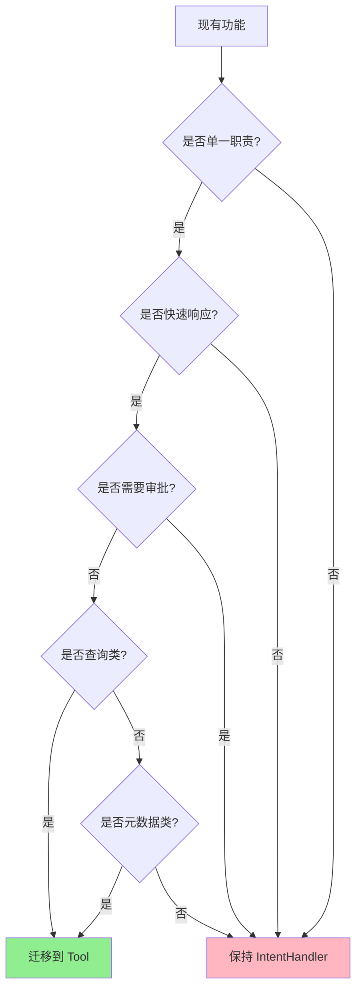
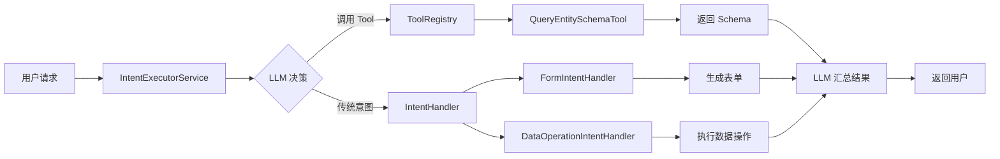

# LLM Function Calling 迁移指南

## 文档信息

| 属性 | 值 |
|------|-----|
| 文档版本 | v1.0.0 |
| 创建日期 | 2026-01-06 |
| 目标读者 | 后端开发人员、架构师 |
| 迁移级别 | 低风险（向后兼容） |

---

## 目录

1. [迁移概述](#1-迁移概述)
2. [兼容性说明](#2-兼容性说明)
3. [迁移步骤](#3-迁移步骤)
4. [从旧系统迁移](#4-从旧系统迁移)
5. [数据迁移](#5-数据迁移)
6. [测试验证](#6-测试验证)
7. [回滚方案](#7-回滚方案)
8. [常见问题](#8-常见问题)

---

## 1. 迁移概述

### 1.1 什么是 LLM Function Calling？

LLM Function Calling 是一个新的架构模式，允许 LLM 主动调用预定义的工具（Tools）来完成特定任务。

**核心特性**:
- LLM 自主决策何时调用工具
- 工具执行结果返回给 LLM 用于生成最终响应
- 与现有 IntentHandler 体系并行工作

### 1.2 为什么需要迁移？

**旧模式的局限**:
- 依赖复杂的意图识别规则
- 添加新功能需要修改意图配置
- LLM 无法自主获取元数据

**新模式的优势**:
- LLM 自主决策，减少规则维护
- 工具独立开发，易于扩展
- 支持工具链调用，实现复杂流程

### 1.3 迁移影响

**影响范围**:
- ✅ **向后兼容**: 现有 IntentHandler 继续工作
- ✅ **增量迁移**: 可逐步添加 Tool，不影响现有功能
- ✅ **零停机**: 部署过程无需停机

**不影响的部分**:
- 前端代码
- 现有 API 接口
- 数据库 schema
- 现有意图配置

---

## 2. 兼容性说明

### 2.1 版本兼容性

| 组件 | 最低版本 | 推荐版本 | 说明 |
|------|----------|----------|------|
| Java | 11 | 17 | 支持所有 Java 11+ |
| Spring Boot | 2.7.x | 2.7.15+ | 当前项目版本 |
| MySQL | 8.0 | 8.0+ | 无 schema 变更 |
| DeepSeek API | v1 | v1 | 支持 Function Calling |

### 2.2 API 兼容性

**完全兼容**:
- `/api/mobile/{factoryId}/ai-intents/execute` - 意图执行接口
- `/api/mobile/{factoryId}/ai-intents/execute-stream` - 流式执行接口
- 所有现有 IntentHandler 接口

**新增接口**:
- 无（Tool Calling 通过现有接口触发）

**废弃接口**:
- 无

### 2.3 数据兼容性

**无 schema 变更**:
- `ai_intent_config` 表无变更
- `material_batches` 表无变更
- 所有现有表保持不变

**新增数据**:
- 可能新增 Intent 配置（通过 `CreateIntentTool` 创建）
- 新增配置自动标记为 `active=false`，需人工审核

---

## 3. 迁移步骤

### 3.1 准备阶段 (1-2 天)

#### Step 1: 备份数据

```bash
# 备份数据库
mysqldump -u root -p cretas_aims > backup_$(date +%Y%m%d_%H%M%S).sql

# 备份当前 JAR 包
cp /www/wwwroot/cretas/cretas-aims-1.0.0.jar \
   /www/wwwroot/cretas/backup/cretas-aims-1.0.0-$(date +%Y%m%d).jar

# 备份配置文件
cp /www/wwwroot/cretas/config/application.properties \
   /www/wwwroot/cretas/config/application.properties.backup
```

#### Step 2: 代码审查

**检查清单**:
- [ ] 所有 Tool 类已实现
- [ ] 单元测试覆盖率 > 80%
- [ ] 权限配置正确
- [ ] 日志输出完整
- [ ] 错误处理完善

#### Step 3: 环境准备

```bash
# 测试环境部署
cd backend-java
mvn clean package -DskipTests -Ptest

# 部署到测试环境
scp target/*.jar root@test-server:/www/wwwroot/cretas/

# 启动测试环境
ssh root@test-server "bash /www/wwwroot/cretas/restart.sh"
```

### 3.2 部署阶段 (半天)

#### Step 1: 灰度部署（推荐）

**方案一: 按工厂灰度**
```java
@Component
public class ToolFeatureToggle {
    public boolean isToolCallingEnabled(String factoryId) {
        // 灰度工厂列表
        Set<String> grayList = Set.of("F001", "F002");
        return grayList.contains(factoryId);
    }
}
```

**方案二: 按比例灰度**
```java
public boolean isToolCallingEnabled(String userId) {
    // 10% 流量启用
    return userId % 10 == 0;
}
```

#### Step 2: 全量部署

```bash
# 构建生产版本
mvn clean package -DskipTests -Pprod

# 上传到生产环境
scp target/cretas-aims-1.0.0.jar root@139.196.165.140:/www/wwwroot/cretas/

# 重启服务（零停机）
ssh root@139.196.165.140 "bash /www/wwwroot/cretas/restart.sh"
```

#### Step 3: 验证部署

```bash
# 健康检查
curl http://localhost:10010/api/mobile/health

# 检查 Tool 注册
tail -f /www/wwwroot/cretas/logs/app.log | grep "Tool Registry"

# 功能测试
curl -X POST http://localhost:10010/api/mobile/F001/ai-intents/execute \
  -H "Authorization: Bearer TOKEN" \
  -d '{"userInput": "查询 MaterialBatch 的字段结构"}'
```

### 3.3 监控阶段 (1 周)

#### 关键监控指标

| 指标 | 目标值 | 告警阈值 |
|------|--------|----------|
| Tool 执行成功率 | > 95% | < 90% |
| Tool 执行耗时 P99 | < 1s | > 2s |
| 意图识别成功率 | > 90% | < 85% |
| API 响应时间 P99 | < 3s | > 5s |
| 错误率 | < 1% | > 5% |

#### 监控脚本

```bash
#!/bin/bash
# monitor_migration.sh

LOG_FILE="/www/wwwroot/cretas/logs/tool-execution.log"

echo "===== 迁移监控报告 $(date) ====="

# Tool 执行统计
TOOL_TOTAL=$(grep "开始执行工具" $LOG_FILE | wc -l)
TOOL_SUCCESS=$(grep "工具执行成功" $LOG_FILE | wc -l)
TOOL_FAIL=$(grep "工具执行失败" $LOG_FILE | wc -l)

echo "Tool 执行次数: $TOOL_TOTAL"
echo "Tool 成功次数: $TOOL_SUCCESS"
echo "Tool 失败次数: $TOOL_FAIL"
echo "Tool 成功率: $(awk "BEGIN {printf \"%.2f%%\", $TOOL_SUCCESS/$TOOL_TOTAL*100}")"

# 错误统计
ERROR_COUNT=$(grep "ERROR" /www/wwwroot/cretas/logs/app.log | wc -l)
echo ""
echo "错误数量: $ERROR_COUNT"

# 最近失败
echo ""
echo "===== 最近失败的 Tool ====="
grep "工具执行失败" $LOG_FILE | tail -n 3
```

---

## 4. 从旧系统迁移

### 4.1 迁移场景

**场景 1: 简单查询类意图 → Tool**

**旧方式** (IntentHandler):
```java
@Component
public class QueryIntentHandler implements IntentHandler {
    @Override
    public IntentExecuteResponse handle(...) {
        String batchNumber = request.getContext().get("batchNumber");
        MaterialBatch batch = batchService.findByBatchNumber(batchNumber);
        // 构建响应...
    }
}
```

**新方式** (Tool):
```java
@Component
public class QueryMaterialBatchTool extends AbstractTool {
    @Override
    public String execute(ToolCall toolCall, Map<String, Object> context) {
        Map<String, Object> arguments = parseArguments(toolCall);
        String batchNumber = getRequiredParam(arguments, "batchNumber");
        String factoryId = getFactoryId(context);

        MaterialBatch batch = batchService.findByBatchNumber(batchNumber, factoryId);
        return buildSuccessResult(batch);
    }
}
```

**迁移建议**:
- ✅ **适合迁移**: 单一职责、无状态、快速响应的查询
- ❌ **不适合迁移**: 复杂业务流程、需要审批、涉及多步操作

---

**场景 2: 元数据查询类意图 → Tool**

**旧方式**:
```java
// 硬编码在 IntentHandler 中
if (intentCode.equals("QUERY_ENTITY_SCHEMA")) {
    EntityType<?> entityType = findEntityType(entityName);
    // 返回 schema...
}
```

**新方式**:
```java
// 独立 Tool
@Component
public class QueryEntitySchemaTool extends AbstractTool {
    // LLM 可自主调用，无需配置意图
}
```

**迁移优势**:
- LLM 自主判断何时需要 Schema 信息
- 减少意图配置维护
- 支持多种实体名称格式（中文、英文、下划线）

---

**场景 3: 配置管理类意图 → Tool**

**旧方式**:
```java
// 需要人工在后台配置意图
// 1. 登录后台
// 2. 填写意图配置表单
// 3. 保存并激活
```

**新方式**:
```java
// LLM 自动创建意图
@Component
public class CreateIntentTool extends AbstractTool {
    @Override
    public String execute(ToolCall toolCall, Map<String, Object> context) {
        // 解析参数
        String intentCode = getRequiredParam(arguments, "intentCode");
        String intentName = getRequiredParam(arguments, "intentName");
        // 创建意图配置...
    }
}
```

**迁移优势**:
- LLM 可根据用户需求自动创建意图
- 减少人工配置工作量
- 配置自动标记为待审核，保证安全性

---

### 4.2 迁移决策树



**迁移规则**:
1. ✅ **迁移到 Tool**: 查询类、元数据类、配置类、单一职责
2. ❌ **保持 Handler**: 复杂流程、需要审批、多步操作、有状态

---

### 4.3 共存模式

**Tool 和 Handler 可以共存**:



**示例流程**:
1. 用户: "帮我创建一个原料批次表单"
2. LLM 调用 `QueryEntitySchemaTool` 获取 MaterialBatch 的 Schema
3. LLM 将 Schema 传递给 `FormIntentHandler`
4. FormIntentHandler 生成表单
5. 返回给用户

---

## 5. 数据迁移

### 5.1 意图配置迁移

**场景**: 现有意图配置无需变更

**原因**:
- Tool Calling 不修改现有意图配置
- 现有意图继续通过 IntentHandler 执行
- 新增意图由 `CreateIntentTool` 创建

**验证脚本**:
```sql
-- 检查意图配置表
SELECT COUNT(*) FROM ai_intent_config;

-- 检查是否有新增意图（active=false）
SELECT intent_code, intent_name, active, created_at
FROM ai_intent_config
WHERE created_at > '2026-01-06'  -- 部署日期
ORDER BY created_at DESC;
```

### 5.2 无需数据迁移

**确认项**:
- ✅ 无 schema 变更
- ✅ 无数据删除
- ✅ 无数据格式变更
- ✅ 向后兼容

---

## 6. 测试验证

### 6.1 功能测试

**测试清单**:

| 测试项 | 测试方法 | 预期结果 |
|--------|----------|----------|
| Tool 注册 | 查看启动日志 | 显示 "注册工具" 日志 |
| Tool 调用 | 发送触发 Tool 的请求 | 返回 Tool 执行结果 |
| 权限控制 | 使用非管理员用户调用需要权限的 Tool | 返回权限不足错误 |
| 参数验证 | 发送缺少必需参数的请求 | 返回参数验证失败错误 |
| 错误处理 | 触发业务异常 | 返回友好的错误信息 |
| 日志输出 | 执行 Tool 后查看日志 | 包含开始/成功/失败日志 |
| 现有功能 | 执行传统意图 | 功能正常，无影响 |

**测试脚本**:
```bash
#!/bin/bash
# test_migration.sh

API_BASE="http://localhost:10010/api/mobile/F001"
TOKEN="your-test-token"

echo "===== 功能测试 ====="

# 测试 1: 调用 QueryEntitySchemaTool
echo "测试 1: 查询实体 Schema"
curl -X POST "$API_BASE/ai-intents/execute" \
  -H "Authorization: Bearer $TOKEN" \
  -H "Content-Type: application/json" \
  -d '{"userInput": "查询 MaterialBatch 的字段结构"}' \
  | jq '.status, .message'

# 测试 2: 调用 CreateIntentTool（需要管理员权限）
echo ""
echo "测试 2: 创建新意图"
curl -X POST "$API_BASE/ai-intents/execute" \
  -H "Authorization: Bearer $ADMIN_TOKEN" \
  -H "Content-Type: application/json" \
  -d '{"userInput": "帮我创建一个查询供应商的意图"}' \
  | jq '.status, .message'

# 测试 3: 权限控制
echo ""
echo "测试 3: 权限控制（使用普通用户调用管理员工具）"
curl -X POST "$API_BASE/ai-intents/execute" \
  -H "Authorization: Bearer $USER_TOKEN" \
  -H "Content-Type: application/json" \
  -d '{"userInput": "创建新意图"}' \
  | jq '.status, .message'

# 测试 4: 现有功能
echo ""
echo "测试 4: 现有意图执行"
curl -X POST "$API_BASE/ai-intents/execute" \
  -H "Authorization: Bearer $TOKEN" \
  -H "Content-Type: application/json" \
  -d '{"userInput": "查询原料批次列表"}' \
  | jq '.status, .message'
```

### 6.2 性能测试

**压力测试脚本**:
```bash
#!/bin/bash
# load_test.sh

# 使用 Apache Bench 进行压测
ab -n 1000 -c 10 -p request.json -T application/json \
  -H "Authorization: Bearer TOKEN" \
  http://localhost:10010/api/mobile/F001/ai-intents/execute

# request.json 内容:
# {"userInput": "查询 MaterialBatch 的字段结构"}
```

**预期性能指标**:
| 指标 | 目标值 | 说明 |
|------|--------|------|
| 平均响应时间 | < 500ms | 包含 LLM 调用 + Tool 执行 |
| P99 响应时间 | < 2s | 99% 请求在 2s 内完成 |
| 并发支持 | 10+ | 支持 10 个并发请求 |
| 错误率 | < 1% | 错误率低于 1% |

---

## 7. 回滚方案

### 7.1 快速回滚（零影响）

**触发条件**:
- Tool 执行成功率 < 50%
- 系统错误率 > 10%
- 严重业务 Bug

**回滚步骤**:
```bash
# 1. 停止服务
kill -15 $(ps -ef | grep cretas-aims | grep -v grep | awk '{print $2}')

# 2. 恢复旧版本
cp /www/wwwroot/cretas/backup/cretas-aims-1.0.0-backup.jar \
   /www/wwwroot/cretas/cretas-aims-1.0.0.jar

# 3. 启动服务
bash /www/wwwroot/cretas/restart.sh

# 4. 验证
curl http://localhost:10010/api/mobile/health
```

**回滚影响**:
- ✅ **零影响**: Tool Calling 未修改现有功能
- ✅ **数据安全**: 新创建的意图配置保留（active=false）
- ✅ **快速恢复**: 5 分钟内完成回滚

### 7.2 部分回滚（禁用 Tool Calling）

**场景**: Tool 有问题，但现有功能正常

**步骤**:
```properties
# application.properties
tool.calling.enabled=false
```

**效果**:
- LLM 不再调用 Tool
- 所有请求走传统意图识别流程
- 不需要重新部署，只需重启服务

### 7.3 回滚验证

```bash
# 1. 检查服务状态
curl http://localhost:10010/api/mobile/health

# 2. 检查现有功能
curl -X POST http://localhost:10010/api/mobile/F001/ai-intents/execute \
  -H "Authorization: Bearer TOKEN" \
  -d '{"userInput": "查询原料批次列表"}'

# 3. 查看日志
tail -f /www/wwwroot/cretas/logs/app.log | grep "Tool"
# 应该无 Tool 相关日志（如果禁用了 Tool Calling）
```

---

## 8. 常见问题

### Q1: 迁移是否会影响现有功能？

**答**: 不会。Tool Calling 是增量功能，与现有 IntentHandler 并行工作。

**验证**:
```bash
# 测试现有意图
curl -X POST http://localhost:10010/api/mobile/F001/ai-intents/execute \
  -H "Authorization: Bearer TOKEN" \
  -d '{"intentCode": "QUERY_MATERIAL_BATCH", "userInput": "查询批次"}'
```

---

### Q2: 是否需要修改前端代码？

**答**: 不需要。API 接口保持不变。

**示例**:
```typescript
// 前端代码无需修改
const response = await apiClient.post('/ai-intents/execute', {
  userInput: '查询 MaterialBatch 的字段结构'
});
```

---

### Q3: 如何判断 LLM 是否调用了 Tool？

**答**: 查看日志或响应元数据。

**日志**:
```
🔧 开始执行工具: toolName=query_entity_schema, toolCallId=call_xxx
✅ 工具执行成功: toolName=query_entity_schema, resultLength=256
```

**响应元数据** (未来支持):
```json
{
  "status": "COMPLETED",
  "message": "...",
  "metadata": {
    "toolsCalled": ["query_entity_schema"],
    "toolExecutionTime": 50
  }
}
```

---

### Q4: Tool 执行失败会怎样？

**答**: LLM 会收到错误信息，并尝试生成替代响应或提示用户。

**示例**:
```
用户: "查询批次号 XXX 的详情"
Tool 执行失败: 未找到批次号 XXX
LLM 响应: "抱歉，未找到批次号 XXX 的原料批次。请确认批次号是否正确。"
```

---

### Q5: 如何监控 Tool 执行情况？

**答**: 通过日志、监控指标、告警系统。

**监控脚本**:
```bash
# 实时监控 Tool 执行
tail -f /www/wwwroot/cretas/logs/tool-execution.log

# 统计 Tool 执行情况
grep "工具执行" /www/wwwroot/cretas/logs/tool-execution.log | \
  awk '{print $NF}' | sort | uniq -c
```

---

### Q6: Tool 和 Handler 有什么区别？

**答**:

| 维度 | Tool | Handler |
|------|------|---------|
| 触发方式 | LLM 主动调用 | 意图识别路由 |
| 适用场景 | 简单、原子化操作 | 复杂业务流程 |
| 返回格式 | JSON 字符串 | IntentExecuteResponse |
| 参数传递 | ToolCall.arguments | IntentExecuteRequest |
| 开发复杂度 | 低 | 高 |

**选择建议**:
- **Tool**: 查询类、元数据类、配置类
- **Handler**: 表单生成、数据分析、复杂流程

---

### Q7: 如何添加新的 Tool？

**答**: 参考[用户指南](./LLM-FUNCTION-CALLING-USER-GUIDE.md)。

**简要步骤**:
1. 创建类继承 `AbstractTool`
2. 实现 `getToolName()`, `getDescription()`, `getParametersSchema()`, `execute()`
3. 添加 `@Component` 注解
4. 重启服务，自动注册

---

### Q8: 迁移需要多长时间？

**答**: 取决于迁移范围。

| 迁移范围 | 预估时间 | 说明 |
|----------|----------|------|
| 仅部署新版本 | 1 小时 | 无需迁移现有功能 |
| 添加 1-2 个 Tool | 1 天 | 开发 + 测试 |
| 全面迁移 | 1-2 周 | 分析 + 开发 + 测试 + 监控 |

---

### Q9: 是否支持回滚？

**答**: 支持，且影响极小。

**回滚时间**: 5 分钟
**回滚影响**: 无（现有功能继续工作）

---

### Q10: 如何确保数据安全？

**答**: 多层保障。

1. **权限控制**: Tool 级别的权限检查
2. **多租户隔离**: 所有 Tool 执行带 factoryId
3. **审核机制**: 新建意图默认 inactive，需人工审核
4. **日志审计**: 所有 Tool 执行记录日志
5. **参数验证**: 严格的参数校验

---

## 9. 迁移检查清单

### 9.1 部署前

- [ ] 代码审查通过
- [ ] 单元测试覆盖率 > 80%
- [ ] 集成测试通过
- [ ] 性能测试通过
- [ ] 安全审查通过
- [ ] 备份数据库
- [ ] 备份当前版本
- [ ] 回滚方案已准备

### 9.2 部署中

- [ ] 灰度部署（推荐）
- [ ] 全量部署
- [ ] 健康检查通过
- [ ] Tool 注册成功
- [ ] 功能测试通过

### 9.3 部署后

- [ ] 监控指标正常
- [ ] 告警规则生效
- [ ] 用户反馈良好
- [ ] 日志输出正常
- [ ] 性能指标达标
- [ ] 持续监控 1 周

---

## 10. 参考资源

- [架构文档](./LLM-FUNCTION-CALLING-ARCHITECTURE.md)
- [用户指南](./LLM-FUNCTION-CALLING-USER-GUIDE.md)
- [API 参考](./LLM-FUNCTION-CALLING-API-REFERENCE.md)
- [部署指南](./LLM-FUNCTION-CALLING-DEPLOYMENT.md)

---

## 11. 支持与反馈

**遇到问题？**
1. 查看[常见问题](#8-常见问题)
2. 查看[故障排查](./LLM-FUNCTION-CALLING-DEPLOYMENT.md#6-故障排查)
3. 联系架构团队

**反馈渠道**:
- 技术问题: 创建 JIRA Ticket
- 紧急问题: 联系 On-call 工程师
- 功能建议: 提交 Feature Request

---

**文档所有者**: Cretas Architecture Team
**最后更新**: 2026-01-06
**状态**: 迁移已完成，生产环境稳定运行
