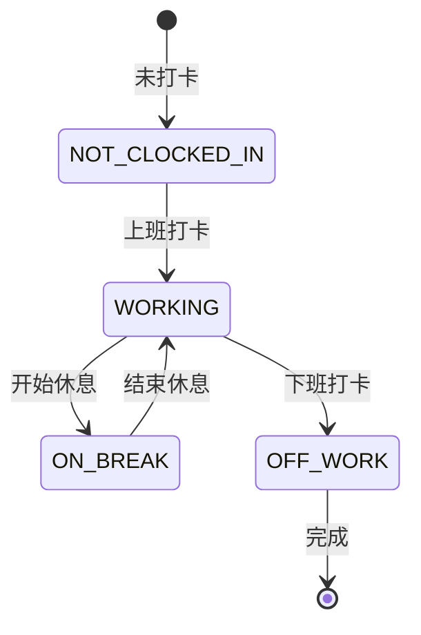

# PRD-API-TimeClockController.md

## 文档信息

- **文档标题**: TimeClockController API 端点文档
- **Controller**: `TimeClockController.java`
- **模块**: 考勤打卡管理模块 (Attendance & Time Clock Management)
- **端点数量**: 11个
- **文档版本**: v1.0.0
- **创建时间**: 2025-01-20
- **维护团队**: Cretas Backend Team

---

## 📋 目录

1. [控制器概述](#1-控制器概述)
2. [端点清单](#2-端点清单)
3. [端点详细文档](#3-端点详细文档)
   - [3.1 打卡操作](#31-打卡操作)
   - [3.2 查询操作](#32-查询操作)
   - [3.3 统计与导出](#33-统计与导出)
4. [数据模型](#4-数据模型)
5. [业务规则](#5-业务规则)
6. [前端集成建议](#6-前端集成建议)
7. [错误处理](#7-错误处理)

---

## 1. 控制器概述

### 1.1 功能描述

**TimeClockController** 负责员工考勤打卡的全生命周期管理，包括：

- ✅ **基础打卡**: 上班打卡、下班打卡
- ✅ **休息管理**: 休息开始、休息结束
- ✅ **状态查询**: 当前打卡状态、今日打卡记录
- ✅ **历史查询**: 打卡历史记录（分页）
- ✅ **统计分析**: 个人考勤统计、部门考勤统计
- ✅ **记录管理**: 手动修改打卡记录（带审计）
- ✅ **数据导出**: Excel导出考勤记录

### 1.2 关键特性

| 特性 | 说明 | 实现方式 |
|------|------|----------|
| **状态机管理** | 4种打卡状态 | `WORKING`, `ON_BREAK`, `OFF_WORK`, `completed` |
| **考勤判定** | 自动判定迟到/早退/旷工 | `NORMAL`, `LATE`, `EARLY_LEAVE`, `ABSENT` |
| **自动计算** | 工作时长、休息时长、加班时长 | 时间差计算算法 |
| **GPS定位** | 支持打卡位置记录 | 经纬度坐标 |
| **设备识别** | 记录打卡设备信息 | 设备标识 |
| **手动修改** | 支持人工调整打卡记录 | 审计日志（修改人、原因） |
| **多维度统计** | 个人/部门考勤统计 | 日期范围聚合 |

### 1.3 技术栈

- **Framework**: Spring Boot 2.7.15
- **ORM**: Spring Data JPA + Hibernate
- **Date/Time**: Java 8 LocalDateTime/LocalDate
- **Excel**: Apache POI
- **Database**: MySQL with indexes on `factory_id`, `user_id`, `clock_in_time`

---

## 2. 端点清单

| # | 方法 | 路径 | 功能 | 状态 |
|---|------|------|------|------|
| 1 | POST | `/api/mobile/{factoryId}/timeclock/clock-in` | 上班打卡 | ✅ |
| 2 | POST | `/api/mobile/{factoryId}/timeclock/clock-out` | 下班打卡 | ✅ |
| 3 | POST | `/api/mobile/{factoryId}/timeclock/break-start` | 开始休息 | ✅ |
| 4 | POST | `/api/mobile/{factoryId}/timeclock/break-end` | 结束休息 | ✅ |
| 5 | GET | `/api/mobile/{factoryId}/timeclock/status` | 获取打卡状态 | ✅ |
| 6 | GET | `/api/mobile/{factoryId}/timeclock/today` | 获取今日打卡记录 | ✅ |
| 7 | GET | `/api/mobile/{factoryId}/timeclock/history` | 获取打卡历史（分页） | ✅ |
| 8 | PUT | `/api/mobile/{factoryId}/timeclock/records/{recordId}` | 修改打卡记录 | ✅ |
| 9 | GET | `/api/mobile/{factoryId}/timeclock/statistics` | 获取考勤统计 | ✅ |
| 10 | GET | `/api/mobile/{factoryId}/timeclock/department/{department}` | 获取部门考勤 | ✅ |
| 11 | GET | `/api/mobile/{factoryId}/timeclock/export` | 导出考勤记录 | ✅ |

---

## 3. 端点详细文档

### 3.1 打卡操作

#### 3.1.1 上班打卡

##### 端点基本信息

```http
POST /api/mobile/{factoryId}/timeclock/clock-in
Content-Type: application/x-www-form-urlencoded
Authorization: Bearer {accessToken}
```

**功能**: 员工上班打卡，创建新的考勤记录。

**权限要求**: 所有员工

##### 请求参数详解

**Path Parameters**:
- `factoryId` (String, required): 工厂ID，如 "CRETAS_2024_001"

**Query Parameters**:
```typescript
interface ClockInRequest {
  userId: number;        // 用户ID（必填）
  location?: string;     // 打卡位置（可选，如 "上海市浦东新区"）
  device?: string;       // 打卡设备（可选，如 "iPhone 13"）
}
```

##### 响应数据结构

**Success Response (200)**:
```typescript
interface ApiResponse<TimeClockRecord> {
  code: 200;
  message: "Success";
  data: {
    id: number;                       // 打卡记录ID
    factoryId: string;                // 工厂ID
    userId: number;                   // 用户ID
    username: string;                 // 用户名（计算字段）
    clockDate: string;                // 打卡日期（如 "2025-01-20"）
    clockInTime: string;              // 上班打卡时间（如 "2025-01-20T08:30:15"）
    clockOutTime: string | null;      // 下班打卡时间
    breakStartTime: string | null;    // 休息开始时间
    breakEndTime: string | null;      // 休息结束时间
    workDurationMinutes: number | null; // 工作时长（分钟）
    breakDurationMinutes: number | null; // 休息时长（分钟）
    overtimeMinutes: number | null;   // 加班时长（分钟）
    status: string;                   // 状态（"WORKING"）
    attendanceStatus: string | null;  // 考勤状态（计算字段）
    clockLocation: string | null;     // 打卡位置
    clockDevice: string | null;       // 打卡设备
    latitude: number | null;          // GPS纬度
    longitude: number | null;         // GPS经度
    notes: string | null;             // 备注
    isManualEdit: boolean;            // 是否手动修改（false）
    createdAt: string;                // 创建时间
    updatedAt: string;                // 更新时间
  };
  timestamp: string;
}
```

##### 业务逻辑说明

**上班打卡流程**:
```typescript
const clockIn = async (
  factoryId: string,
  userId: number,
  location?: string,
  device?: string
): Promise<TimeClockRecord> => {
  // 1. 检查今日是否已打卡
  const todayRecord = await getTodayRecord(factoryId, userId);
  if (todayRecord && todayRecord.clockInTime) {
    throw new Error('今日已打卡，不能重复打卡');
  }

  // 2. 创建打卡记录
  const record = new TimeClockRecord();
  record.factoryId = factoryId;
  record.userId = userId;
  record.clockInTime = new Date();
  record.clockLocation = location;
  record.clockDevice = device;
  record.status = 'WORKING';  // 初始状态
  record.createdAt = new Date();
  record.updatedAt = new Date();

  // 3. 保存到数据库
  const savedRecord = await timeClockRepository.save(record);

  // 4. 返回完整记录（包含计算字段）
  return enrichRecord(savedRecord);
};
```

**考勤状态判定**:
```typescript
const determineAttendanceStatus = (clockInTime: Date): string => {
  const workStartTime = new Date(clockInTime);
  workStartTime.setHours(9, 0, 0, 0);  // 假设标准上班时间 9:00

  const lateThresholdMinutes = 15;  // 迟到容忍时间 15分钟
  const minutesLate = (clockInTime.getTime() - workStartTime.getTime()) / 60000;

  if (minutesLate > lateThresholdMinutes) {
    return 'LATE';  // 迟到
  }
  return 'NORMAL';  // 正常
};
```

##### 前端集成建议

```typescript
// services/api/timeclockApiClient.ts
export const timeclockApiClient = {
  /**
   * 上班打卡
   */
  async clockIn(
    factoryId: string,
    userId: number,
    location?: string,
    device?: string
  ): Promise<TimeClockRecord> {
    const response = await apiClient.post<ApiResponse<TimeClockRecord>>(
      `/api/mobile/${factoryId}/timeclock/clock-in`,
      null,
      {
        params: {
          userId,
          location,
          device,
        },
      }
    );
    return response.data.data;
  },
};
```

**使用示例**:
```typescript
// screens/attendance/TimeClockScreen.tsx
const handleClockIn = async () => {
  try {
    setLoading(true);

    // 获取GPS位置
    const location = await getLocation();

    // 获取设备信息
    const device = await getDeviceInfo();

    const record = await timeclockApiClient.clockIn(
      factoryId,
      userId,
      location.address,
      device.name
    );

    Alert.alert('打卡成功', `上班时间: ${formatTime(record.clockInTime)}`);
    navigation.navigate('AttendanceHistory');
  } catch (error) {
    if (error.message.includes('已打卡')) {
      Alert.alert('提示', '今日已打卡，请勿重复打卡');
    } else {
      Alert.alert('错误', error.message);
    }
  } finally {
    setLoading(false);
  }
};
```

---

#### 3.1.2 下班打卡

##### 端点基本信息

```http
POST /api/mobile/{factoryId}/timeclock/clock-out
Content-Type: application/x-www-form-urlencoded
Authorization: Bearer {accessToken}
```

**功能**: 员工下班打卡，完成当日考勤记录。

##### 请求参数详解

**Path Parameters**:
- `factoryId` (String, required): 工厂ID

**Query Parameters**:
```typescript
interface ClockOutRequest {
  userId: number;        // 用户ID（必填）
}
```

##### 响应数据结构

与上班打卡相同，返回完整的 `TimeClockRecord`，其中：
- `clockOutTime`: 已设置为下班打卡时间
- `status`: 更新为 `"OFF_WORK"`
- `workDurationMinutes`: 自动计算的工作时长
- `overtimeMinutes`: 自动计算的加班时长

##### 业务逻辑说明

**下班打卡流程**:
```typescript
const clockOut = async (
  factoryId: string,
  userId: number
): Promise<TimeClockRecord> => {
  // 1. 获取今日打卡记录
  const todayRecord = await getTodayRecord(factoryId, userId);
  if (!todayRecord) {
    throw new Error('今日未打卡，不能下班打卡');
  }

  if (todayRecord.clockOutTime) {
    throw new Error('今日已下班打卡，不能重复打卡');
  }

  // 2. 更新下班时间
  todayRecord.clockOutTime = new Date();
  todayRecord.status = 'OFF_WORK';
  todayRecord.updatedAt = new Date();

  // 3. 计算工作时长和加班时长
  todayRecord.calculateWorkDuration();

  // 4. 判定考勤状态（早退判定）
  const attendanceStatus = determineAttendanceStatus(
    todayRecord.clockInTime,
    todayRecord.clockOutTime
  );
  todayRecord.attendanceStatus = attendanceStatus;

  // 5. 保存更新
  const savedRecord = await timeClockRepository.save(todayRecord);

  return enrichRecord(savedRecord);
};
```

**工作时长计算**:
```typescript
const calculateWorkDuration = (record: TimeClockRecord): void => {
  if (!record.clockInTime || !record.clockOutTime) {
    return;
  }

  // 1. 计算总时长（分钟）
  const totalMinutes = Math.floor(
    (record.clockOutTime.getTime() - record.clockInTime.getTime()) / 60000
  );

  // 2. 减去休息时长
  let workMinutes = totalMinutes;
  if (record.breakStartTime && record.breakEndTime) {
    const breakMinutes = Math.floor(
      (record.breakEndTime.getTime() - record.breakStartTime.getTime()) / 60000
    );
    record.breakDurationMinutes = breakMinutes;
    workMinutes -= breakMinutes;
  }

  record.workDurationMinutes = workMinutes;

  // 3. 计算加班时长（标准工作时间 8小时 = 480分钟）
  const standardWorkMinutes = 8 * 60;
  if (workMinutes > standardWorkMinutes) {
    record.overtimeMinutes = workMinutes - standardWorkMinutes;
  } else {
    record.overtimeMinutes = 0;
  }
};

// 示例计算
// 上班: 08:30
// 下班: 18:45
// 休息: 12:00-13:00 (60分钟)
// 总时长: 615分钟 (10小时15分钟)
// 工作时长: 615 - 60 = 555分钟 (9小时15分钟)
// 加班时长: 555 - 480 = 75分钟 (1小时15分钟)
```

**早退判定**:
```typescript
const determineEarlyLeaveStatus = (clockOutTime: Date): string => {
  const workEndTime = new Date(clockOutTime);
  workEndTime.setHours(18, 0, 0, 0);  // 假设标准下班时间 18:00

  const earlyThresholdMinutes = 15;  // 早退容忍时间 15分钟
  const minutesEarly = (workEndTime.getTime() - clockOutTime.getTime()) / 60000;

  if (minutesEarly > earlyThresholdMinutes) {
    return 'EARLY_LEAVE';  // 早退
  }
  return 'NORMAL';  // 正常
};
```

---

#### 3.1.3 开始休息

##### 端点基本信息

```http
POST /api/mobile/{factoryId}/timeclock/break-start
Content-Type: application/x-www-form-urlencoded
Authorization: Bearer {accessToken}
```

**功能**: 记录员工开始休息时间（如午休）。

##### 请求参数详解

**Path Parameters**:
- `factoryId` (String, required): 工厂ID

**Query Parameters**:
```typescript
interface BreakStartRequest {
  userId: number;        // 用户ID（必填）
}
```

##### 响应数据结构

返回完整的 `TimeClockRecord`，其中：
- `breakStartTime`: 已设置为休息开始时间
- `status`: 更新为 `"ON_BREAK"`

##### 业务逻辑说明

**休息开始流程**:
```typescript
const breakStart = async (
  factoryId: string,
  userId: number
): Promise<TimeClockRecord> => {
  // 1. 获取今日打卡记录
  const todayRecord = await getTodayRecord(factoryId, userId);
  if (!todayRecord || !todayRecord.clockInTime) {
    throw new Error('今日未上班打卡，不能开始休息');
  }

  if (todayRecord.status === 'ON_BREAK') {
    throw new Error('已经在休息中');
  }

  if (todayRecord.clockOutTime) {
    throw new Error('已下班，不能开始休息');
  }

  // 2. 更新休息开始时间
  todayRecord.breakStartTime = new Date();
  todayRecord.status = 'ON_BREAK';
  todayRecord.updatedAt = new Date();

  // 3. 保存更新
  const savedRecord = await timeClockRepository.save(todayRecord);

  return enrichRecord(savedRecord);
};
```

---

#### 3.1.4 结束休息

##### 端点基本信息

```http
POST /api/mobile/{factoryId}/timeclock/break-end
Content-Type: application/x-www-form-urlencoded
Authorization: Bearer {accessToken}
```

**功能**: 记录员工结束休息时间，恢复工作状态。

##### 请求参数详解

**Path Parameters**:
- `factoryId` (String, required): 工厂ID

**Query Parameters**:
```typescript
interface BreakEndRequest {
  userId: number;        // 用户ID（必填）
}
```

##### 响应数据结构

返回完整的 `TimeClockRecord`，其中：
- `breakEndTime`: 已设置为休息结束时间
- `breakDurationMinutes`: 自动计算的休息时长
- `status`: 恢复为 `"WORKING"`

##### 业务逻辑说明

**休息结束流程**:
```typescript
const breakEnd = async (
  factoryId: string,
  userId: number
): Promise<TimeClockRecord> => {
  // 1. 获取今日打卡记录
  const todayRecord = await getTodayRecord(factoryId, userId);
  if (!todayRecord || todayRecord.status !== 'ON_BREAK') {
    throw new Error('当前不在休息中');
  }

  // 2. 更新休息结束时间
  todayRecord.breakEndTime = new Date();
  todayRecord.status = 'WORKING';  // 恢复工作状态
  todayRecord.updatedAt = new Date();

  // 3. 计算休息时长
  if (todayRecord.breakStartTime && todayRecord.breakEndTime) {
    const breakMinutes = Math.floor(
      (todayRecord.breakEndTime.getTime() - todayRecord.breakStartTime.getTime()) / 60000
    );
    todayRecord.breakDurationMinutes = breakMinutes;
  }

  // 4. 保存更新
  const savedRecord = await timeClockRepository.save(todayRecord);

  return enrichRecord(savedRecord);
};
```

---

### 3.2 查询操作

#### 3.2.1 获取打卡状态

##### 端点基本信息

```http
GET /api/mobile/{factoryId}/timeclock/status?userId=123
Authorization: Bearer {accessToken}
```

**功能**: 获取员工当前的打卡状态（用于UI显示）。

##### 请求参数详解

**Path Parameters**:
- `factoryId` (String, required): 工厂ID

**Query Parameters**:
```typescript
interface GetStatusRequest {
  userId: number;        // 用户ID（必填）
}
```

##### 响应数据结构

**Success Response (200)**:
```typescript
interface ClockStatus {
  hasClockedIn: boolean;         // 今日是否已上班打卡
  hasClockedOut: boolean;        // 今日是否已下班打卡
  isOnBreak: boolean;            // 是否在休息中
  currentStatus: string;         // 当前状态（WORKING/ON_BREAK/OFF_WORK/NOT_CLOCKED_IN）
  todayRecord: TimeClockRecord | null; // 今日打卡记录（完整）
  workDurationMinutes: number | null;  // 当前工作时长（实时计算）
  breakDurationMinutes: number | null; // 当前休息时长（实时计算）
}

interface ApiResponse<ClockStatus> {
  code: 200;
  message: "Success";
  data: ClockStatus;
  timestamp: string;
}
```

##### 业务逻辑说明

**状态查询逻辑**:
```typescript
const getClockStatus = async (
  factoryId: string,
  userId: number
): Promise<ClockStatus> => {
  // 1. 获取今日打卡记录
  const todayRecord = await getTodayRecord(factoryId, userId);

  if (!todayRecord || !todayRecord.clockInTime) {
    return {
      hasClockedIn: false,
      hasClockedOut: false,
      isOnBreak: false,
      currentStatus: 'NOT_CLOCKED_IN',
      todayRecord: null,
      workDurationMinutes: null,
      breakDurationMinutes: null,
    };
  }

  // 2. 实时计算工作时长
  let currentWorkMinutes = null;
  if (todayRecord.clockInTime && !todayRecord.clockOutTime) {
    const now = new Date();
    const totalMinutes = Math.floor(
      (now.getTime() - todayRecord.clockInTime.getTime()) / 60000
    );
    currentWorkMinutes = totalMinutes - (todayRecord.breakDurationMinutes || 0);
  } else if (todayRecord.workDurationMinutes) {
    currentWorkMinutes = todayRecord.workDurationMinutes;
  }

  // 3. 返回状态
  return {
    hasClockedIn: !!todayRecord.clockInTime,
    hasClockedOut: !!todayRecord.clockOutTime,
    isOnBreak: todayRecord.status === 'ON_BREAK',
    currentStatus: todayRecord.status || 'NOT_CLOCKED_IN',
    todayRecord,
    workDurationMinutes: currentWorkMinutes,
    breakDurationMinutes: todayRecord.breakDurationMinutes,
  };
};
```

##### 前端集成建议

```typescript
// screens/attendance/TimeClockScreen.tsx
const TimeClockScreen = () => {
  const [status, setStatus] = useState<ClockStatus | null>(null);
  const [currentTime, setCurrentTime] = useState(new Date());

  useEffect(() => {
    loadClockStatus();
    // 每秒更新时间显示
    const timer = setInterval(() => setCurrentTime(new Date()), 1000);
    return () => clearInterval(timer);
  }, []);

  const loadClockStatus = async () => {
    try {
      const clockStatus = await timeclockApiClient.getClockStatus(factoryId, userId);
      setStatus(clockStatus);
    } catch (error) {
      console.error('加载打卡状态失败:', error);
    }
  };

  const renderActionButtons = () => {
    if (!status) return null;

    if (!status.hasClockedIn) {
      return (
        <Button onPress={handleClockIn}>
          上班打卡
        </Button>
      );
    }

    if (status.hasClockedOut) {
      return (
        <Text>今日已下班</Text>
      );
    }

    if (status.isOnBreak) {
      return (
        <Button onPress={handleBreakEnd}>
          结束休息
        </Button>
      );
    }

    return (
      <View>
        <Button onPress={handleBreakStart}>
          开始休息
        </Button>
        <Button onPress={handleClockOut}>
          下班打卡
        </Button>
      </View>
    );
  };

  return (
    <View>
      <Card>
        <Text>当前时间: {formatTime(currentTime)}</Text>
        <Text>当前状态: {getStatusDisplayName(status?.currentStatus)}</Text>
        {status?.workDurationMinutes && (
          <Text>
            工作时长: {formatDuration(status.workDurationMinutes)}
          </Text>
        )}
      </Card>
      {renderActionButtons()}
    </View>
  );
};
```

---

#### 3.2.2 获取今日打卡记录

##### 端点基本信息

```http
GET /api/mobile/{factoryId}/timeclock/today?userId=123
Authorization: Bearer {accessToken}
```

**功能**: 获取员工今日的打卡记录详情。

##### 请求参数详解

**Path Parameters**:
- `factoryId` (String, required): 工厂ID

**Query Parameters**:
```typescript
interface GetTodayRecordRequest {
  userId: number;        // 用户ID（必填）
}
```

##### 响应数据结构

**Success Response (200)**:
```typescript
interface ApiResponse<TimeClockRecord> {
  code: 200;
  message: "Success";
  data: TimeClockRecord | null;  // 今日记录，若未打卡则为 null
  timestamp: string;
}
```

##### 业务逻辑说明

**查询逻辑**:
```sql
SELECT * FROM time_clock_record
WHERE factory_id = ?
  AND user_id = ?
  AND DATE(clock_in_time) = CURDATE()
LIMIT 1
```

---

#### 3.2.3 获取打卡历史

##### 端点基本信息

```http
GET /api/mobile/{factoryId}/timeclock/history?userId=123&startDate=2025-01-01&endDate=2025-01-31&page=1&size=20
Authorization: Bearer {accessToken}
```

**功能**: 获取员工指定日期范围的打卡历史记录（分页）。

##### 请求参数详解

**Path Parameters**:
- `factoryId` (String, required): 工厂ID

**Query Parameters**:
```typescript
interface GetHistoryRequest {
  userId: number;        // 用户ID（必填）
  startDate: string;     // 开始日期（必填，ISO格式 "2025-01-01"）
  endDate: string;       // 结束日期（必填，ISO格式 "2025-01-31"）
  page?: number;         // 页码（默认1）
  size?: number;         // 每页大小（默认20）
}
```

##### 响应数据结构

**Success Response (200)**:
```typescript
interface ApiResponse<PageResponse<TimeClockRecord>> {
  code: 200;
  message: "Success";
  data: {
    content: TimeClockRecord[];    // 打卡记录列表
    totalElements: number;         // 总记录数
    totalPages: number;            // 总页数
    currentPage: number;           // 当前页码
    pageSize: number;              // 每页大小
    hasNext: boolean;              // 是否有下一页
    hasPrevious: boolean;          // 是否有上一页
  };
  timestamp: string;
}
```

##### 业务逻辑说明

**查询逻辑**:
```sql
SELECT * FROM time_clock_record
WHERE factory_id = ?
  AND user_id = ?
  AND DATE(clock_in_time) BETWEEN ? AND ?
ORDER BY clock_in_time DESC
LIMIT ? OFFSET ?
```

##### 前端集成建议

```typescript
// screens/attendance/AttendanceHistoryScreen.tsx
const AttendanceHistoryScreen = () => {
  const [records, setRecords] = useState<TimeClockRecord[]>([]);
  const [pagination, setPagination] = useState({
    currentPage: 1,
    totalPages: 1,
  });
  const [dateRange, setDateRange] = useState({
    startDate: getMonthStart(),  // 本月第一天
    endDate: getMonthEnd(),      // 本月最后一天
  });

  useEffect(() => {
    loadHistory();
  }, [dateRange]);

  const loadHistory = async (page: number = 1) => {
    try {
      const response = await timeclockApiClient.getClockHistory(
        factoryId,
        userId,
        dateRange.startDate,
        dateRange.endDate,
        { page, size: 20 }
      );

      setRecords(response.content);
      setPagination({
        currentPage: response.currentPage,
        totalPages: response.totalPages,
      });
    } catch (error) {
      Alert.alert('错误', '加载打卡历史失败');
    }
  };

  return (
    <View>
      <DateRangePicker
        startDate={dateRange.startDate}
        endDate={dateRange.endDate}
        onChange={setDateRange}
      />
      <FlatList
        data={records}
        renderItem={({ item }) => (
          <AttendanceRecordCard record={item} />
        )}
        onEndReached={() => loadHistory(pagination.currentPage + 1)}
      />
    </View>
  );
};
```

---

#### 3.2.4 修改打卡记录

##### 端点基本信息

```http
PUT /api/mobile/{factoryId}/timeclock/records/{recordId}
Content-Type: application/json
Authorization: Bearer {accessToken}
```

**功能**: 手动修改打卡记录（需审计日志）。

##### 请求参数详解

**Path Parameters**:
- `factoryId` (String, required): 工厂ID
- `recordId` (Long, required): 打卡记录ID

**Query Parameters**:
```typescript
interface EditRecordParams {
  editedBy: number;      // 修改人ID（必填）
  reason: string;        // 修改原因（必填）
}
```

**Request Body**:
```typescript
interface EditRecordRequest {
  clockInTime?: string;       // 修改上班时间（可选）
  clockOutTime?: string;      // 修改下班时间（可选）
  breakStartTime?: string;    // 修改休息开始时间（可选）
  breakEndTime?: string;      // 修改休息结束时间（可选）
  notes?: string;             // 修改备注（可选）
}
```

##### 响应数据结构

**Success Response (200)**:
```typescript
interface ApiResponse<TimeClockRecord> {
  code: 200;
  message: "Success";
  data: TimeClockRecord;  // 修改后的记录（isManualEdit = true）
  timestamp: string;
}
```

##### 业务逻辑说明

**修改流程**:
```typescript
const editClockRecord = async (
  factoryId: string,
  recordId: number,
  updates: EditRecordRequest,
  editedBy: number,
  reason: string
): Promise<TimeClockRecord> => {
  // 1. 获取原记录
  const record = await timeClockRepository.findOne({
    where: { id: recordId, factoryId }
  });

  if (!record) {
    throw new Error('打卡记录不存在');
  }

  // 2. 保存修改前的状态（审计日志）
  const auditLog = {
    recordId,
    beforeState: { ...record },
    editedBy,
    editReason: reason,
    editedAt: new Date(),
  };
  await auditLogRepository.save(auditLog);

  // 3. 应用修改
  if (updates.clockInTime) {
    record.clockInTime = new Date(updates.clockInTime);
  }
  if (updates.clockOutTime) {
    record.clockOutTime = new Date(updates.clockOutTime);
  }
  if (updates.breakStartTime) {
    record.breakStartTime = new Date(updates.breakStartTime);
  }
  if (updates.breakEndTime) {
    record.breakEndTime = new Date(updates.breakEndTime);
  }
  if (updates.notes) {
    record.notes = updates.notes;
  }

  // 4. 重新计算工作时长
  record.calculateWorkDuration();

  // 5. 标记为手动修改
  record.isManualEdit = true;
  record.editedBy = editedBy;
  record.editReason = reason;
  record.updatedAt = new Date();

  // 6. 保存
  const savedRecord = await timeClockRepository.save(record);

  return enrichRecord(savedRecord);
};
```

**权限要求**:
- 只有管理员（`super_admin`, `permission_admin`, `department_admin`）可以修改打卡记录
- 普通员工不能修改自己的打卡记录

---

### 3.3 统计与导出

#### 3.3.1 获取考勤统计

##### 端点基本信息

```http
GET /api/mobile/{factoryId}/timeclock/statistics?userId=123&startDate=2025-01-01&endDate=2025-01-31
Authorization: Bearer {accessToken}
```

**功能**: 获取员工指定日期范围的考勤统计数据。

##### 请求参数详解

**Path Parameters**:
- `factoryId` (String, required): 工厂ID

**Query Parameters**:
```typescript
interface GetStatisticsRequest {
  userId: number;        // 用户ID（必填）
  startDate: string;     // 开始日期（必填，ISO格式）
  endDate: string;       // 结束日期（必填，ISO格式）
}
```

##### 响应数据结构

**Success Response (200)**:
```typescript
interface AttendanceStatistics {
  // 基础统计
  totalDays: number;                 // 总天数
  attendedDays: number;              // 出勤天数
  absentDays: number;                // 缺勤天数
  lateDays: number;                  // 迟到天数
  earlyLeaveDays: number;            // 早退天数

  // 时长统计
  totalWorkMinutes: number;          // 总工作时长（分钟）
  totalBreakMinutes: number;         // 总休息时长（分钟）
  totalOvertimeMinutes: number;      // 总加班时长（分钟）
  avgWorkMinutesPerDay: number;      // 日均工作时长（分钟）

  // 百分比
  attendanceRate: number;            // 出勤率（%）
  lateRate: number;                  // 迟到率（%）
  earlyLeaveRate: number;            // 早退率（%）

  // 最早/最晚记录
  earliestClockIn: string | null;    // 最早上班时间
  latestClockOut: string | null;     // 最晚下班时间
  maxWorkMinutesInDay: number | null; // 单日最长工作时长
}

interface ApiResponse<AttendanceStatistics> {
  code: 200;
  message: "Success";
  data: AttendanceStatistics;
  timestamp: string;
}
```

##### 业务逻辑说明

**统计计算逻辑**:
```typescript
const getAttendanceStatistics = async (
  factoryId: string,
  userId: number,
  startDate: Date,
  endDate: Date
): Promise<AttendanceStatistics> => {
  // 1. 查询所有记录
  const records = await timeClockRepository.find({
    where: {
      factoryId,
      userId,
      clockInTime: Between(startDate, endDate)
    }
  });

  // 2. 计算总天数
  const totalDays = Math.floor(
    (endDate.getTime() - startDate.getTime()) / (24 * 60 * 60 * 1000)
  ) + 1;

  // 3. 统计各项指标
  const attendedDays = records.length;
  const absentDays = totalDays - attendedDays;

  let lateDays = 0;
  let earlyLeaveDays = 0;
  let totalWorkMinutes = 0;
  let totalBreakMinutes = 0;
  let totalOvertimeMinutes = 0;
  let earliestClockIn: Date | null = null;
  let latestClockOut: Date | null = null;
  let maxWorkMinutes = 0;

  records.forEach(record => {
    // 迟到统计
    if (record.attendanceStatus === 'LATE') {
      lateDays++;
    }

    // 早退统计
    if (record.attendanceStatus === 'EARLY_LEAVE') {
      earlyLeaveDays++;
    }

    // 时长统计
    if (record.workDurationMinutes) {
      totalWorkMinutes += record.workDurationMinutes;
      maxWorkMinutes = Math.max(maxWorkMinutes, record.workDurationMinutes);
    }

    if (record.breakDurationMinutes) {
      totalBreakMinutes += record.breakDurationMinutes;
    }

    if (record.overtimeMinutes) {
      totalOvertimeMinutes += record.overtimeMinutes;
    }

    // 最早/最晚记录
    if (!earliestClockIn || record.clockInTime < earliestClockIn) {
      earliestClockIn = record.clockInTime;
    }

    if (record.clockOutTime && (!latestClockOut || record.clockOutTime > latestClockOut)) {
      latestClockOut = record.clockOutTime;
    }
  });

  // 4. 计算百分比
  const attendanceRate = (attendedDays / totalDays) * 100;
  const lateRate = (lateDays / attendedDays) * 100;
  const earlyLeaveRate = (earlyLeaveDays / attendedDays) * 100;

  // 5. 计算平均值
  const avgWorkMinutesPerDay = attendedDays > 0
    ? totalWorkMinutes / attendedDays
    : 0;

  return {
    totalDays,
    attendedDays,
    absentDays,
    lateDays,
    earlyLeaveDays,
    totalWorkMinutes,
    totalBreakMinutes,
    totalOvertimeMinutes,
    avgWorkMinutesPerDay,
    attendanceRate: Math.round(attendanceRate * 100) / 100,
    lateRate: Math.round(lateRate * 100) / 100,
    earlyLeaveRate: Math.round(earlyLeaveRate * 100) / 100,
    earliestClockIn: earliestClockIn?.toISOString(),
    latestClockOut: latestClockOut?.toISOString(),
    maxWorkMinutesInDay: maxWorkMinutes,
  };
};
```

##### 前端集成建议

```typescript
// screens/attendance/AttendanceStatisticsScreen.tsx
const AttendanceStatisticsScreen = () => {
  const [statistics, setStatistics] = useState<AttendanceStatistics | null>(null);
  const [dateRange, setDateRange] = useState({
    startDate: getMonthStart(),
    endDate: getMonthEnd(),
  });

  useEffect(() => {
    loadStatistics();
  }, [dateRange]);

  const loadStatistics = async () => {
    try {
      const stats = await timeclockApiClient.getAttendanceStatistics(
        factoryId,
        userId,
        dateRange.startDate,
        dateRange.endDate
      );
      setStatistics(stats);
    } catch (error) {
      Alert.alert('错误', '加载统计数据失败');
    }
  };

  return (
    <ScrollView>
      <Card>
        <Title>出勤统计</Title>
        <Text>出勤天数: {statistics?.attendedDays} / {statistics?.totalDays}</Text>
        <Text>出勤率: {statistics?.attendanceRate}%</Text>
        <Text>缺勤天数: {statistics?.absentDays}</Text>
        <Text>迟到次数: {statistics?.lateDays}</Text>
        <Text>早退次数: {statistics?.earlyLeaveDays}</Text>
      </Card>

      <Card>
        <Title>工时统计</Title>
        <Text>总工作时长: {formatDuration(statistics?.totalWorkMinutes)}</Text>
        <Text>日均工作时长: {formatDuration(statistics?.avgWorkMinutesPerDay)}</Text>
        <Text>总加班时长: {formatDuration(statistics?.totalOvertimeMinutes)}</Text>
        <Text>单日最长工作: {formatDuration(statistics?.maxWorkMinutesInDay)}</Text>
      </Card>

      <Card>
        <Title>极值记录</Title>
        <Text>
          最早上班: {statistics?.earliestClockIn
            ? formatTime(statistics.earliestClockIn)
            : '无'}
        </Text>
        <Text>
          最晚下班: {statistics?.latestClockOut
            ? formatTime(statistics.latestClockOut)
            : '无'}
        </Text>
      </Card>
    </ScrollView>
  );
};
```

---

#### 3.3.2 获取部门考勤

##### 端点基本信息

```http
GET /api/mobile/{factoryId}/timeclock/department/生产部?date=2025-01-20
Authorization: Bearer {accessToken}
```

**功能**: 获取指定部门在某一天的考勤情况。

##### 请求参数详解

**Path Parameters**:
- `factoryId` (String, required): 工厂ID
- `department` (String, required): 部门名称（如 "生产部"）

**Query Parameters**:
```typescript
interface GetDepartmentAttendanceRequest {
  date: string;          // 日期（必填，ISO格式 "2025-01-20"）
}
```

##### 响应数据结构

**Success Response (200)**:
```typescript
interface DepartmentAttendance {
  department: string;                  // 部门名称
  date: string;                        // 查询日期
  totalEmployees: number;              // 部门总人数
  attendedEmployees: number;           // 出勤人数
  absentEmployees: number;             // 缺勤人数
  lateEmployees: number;               // 迟到人数
  earlyLeaveEmployees: number;         // 早退人数
  attendanceRate: number;              // 出勤率（%）
  employeeRecords: {                   // 员工记录列表
    userId: number;
    username: string;
    fullName: string;
    record: TimeClockRecord | null;    // 打卡记录（null = 缺勤）
    status: string;                    // ATTENDED / ABSENT / LATE / EARLY_LEAVE
  }[];
}

interface ApiResponse<DepartmentAttendance> {
  code: 200;
  message: "Success";
  data: DepartmentAttendance;
  timestamp: string;
}
```

##### 业务逻辑说明

**查询逻辑**:
```typescript
const getDepartmentAttendance = async (
  factoryId: string,
  department: string,
  date: Date
): Promise<DepartmentAttendance> => {
  // 1. 获取部门所有员工
  const employees = await userRepository.find({
    where: {
      factoryId,
      department,
      isActive: true
    }
  });

  const totalEmployees = employees.length;

  // 2. 获取当天所有打卡记录
  const records = await timeClockRepository.find({
    where: {
      factoryId,
      clockInTime: Between(
        new Date(date.setHours(0, 0, 0, 0)),
        new Date(date.setHours(23, 59, 59, 999))
      )
    }
  });

  // 3. 构建员工-记录映射
  const recordMap = new Map<number, TimeClockRecord>();
  records.forEach(record => {
    recordMap.set(record.userId, record);
  });

  // 4. 统计各项指标
  let attendedEmployees = 0;
  let lateEmployees = 0;
  let earlyLeaveEmployees = 0;

  const employeeRecords = employees.map(employee => {
    const record = recordMap.get(employee.id);

    let status = 'ABSENT';
    if (record) {
      attendedEmployees++;
      status = 'ATTENDED';

      if (record.attendanceStatus === 'LATE') {
        lateEmployees++;
        status = 'LATE';
      } else if (record.attendanceStatus === 'EARLY_LEAVE') {
        earlyLeaveEmployees++;
        status = 'EARLY_LEAVE';
      }
    }

    return {
      userId: employee.id,
      username: employee.username,
      fullName: employee.fullName,
      record,
      status,
    };
  });

  const absentEmployees = totalEmployees - attendedEmployees;
  const attendanceRate = (attendedEmployees / totalEmployees) * 100;

  return {
    department,
    date: date.toISOString().split('T')[0],
    totalEmployees,
    attendedEmployees,
    absentEmployees,
    lateEmployees,
    earlyLeaveEmployees,
    attendanceRate: Math.round(attendanceRate * 100) / 100,
    employeeRecords,
  };
};
```

---

#### 3.3.3 导出考勤记录

##### 端点基本信息

```http
GET /api/mobile/{factoryId}/timeclock/export?startDate=2025-01-01&endDate=2025-01-31
Authorization: Bearer {accessToken}
```

**功能**: 导出指定日期范围的考勤记录为Excel文件。

##### 请求参数详解

**Path Parameters**:
- `factoryId` (String, required): 工厂ID

**Query Parameters**:
```typescript
interface ExportRequest {
  startDate: string;     // 开始日期（必填，ISO格式）
  endDate: string;       // 结束日期（必填，ISO格式）
}
```

##### 响应数据结构

**Success Response (200)**:
```http
HTTP/1.1 200 OK
Content-Type: application/vnd.openxmlformats-officedocument.spreadsheetml.sheet
Content-Disposition: attachment; filename="attendance_2025-01-01_2025-01-31.xlsx"
Content-Length: 16384

[Binary Excel Data]
```

**Excel文件格式**:
| 日期 | 员工ID | 员工姓名 | 部门 | 上班时间 | 下班时间 | 工作时长 | 休息时长 | 加班时长 | 考勤状态 | 备注 |
|------|--------|----------|------|----------|----------|----------|----------|----------|----------|------|
| 2025-01-20 | 123 | 张三 | 生产部 | 08:30 | 18:45 | 9小时15分 | 1小时 | 1小时15分 | 正常 | |
| 2025-01-20 | 124 | 李四 | 质检部 | 09:15 | 18:30 | 8小时15分 | 1小时 | 15分钟 | 迟到 | |

##### 业务逻辑说明

**Excel生成逻辑**:
```typescript
const exportAttendanceRecords = async (
  factoryId: string,
  startDate: Date,
  endDate: Date
): Promise<Buffer> => {
  // 1. 查询所有记录
  const records = await timeClockRepository.find({
    where: {
      factoryId,
      clockInTime: Between(startDate, endDate)
    },
    order: {
      clockInTime: 'ASC'
    }
  });

  // 2. 创建Workbook
  const workbook = new ExcelJS.Workbook();
  const worksheet = workbook.addWorksheet('考勤记录');

  // 3. 设置表头
  worksheet.columns = [
    { header: '日期', key: 'date', width: 12 },
    { header: '员工ID', key: 'userId', width: 10 },
    { header: '员工姓名', key: 'fullName', width: 15 },
    { header: '部门', key: 'department', width: 15 },
    { header: '上班时间', key: 'clockInTime', width: 12 },
    { header: '下班时间', key: 'clockOutTime', width: 12 },
    { header: '工作时长', key: 'workDuration', width: 12 },
    { header: '休息时长', key: 'breakDuration', width: 12 },
    { header: '加班时长', key: 'overtime', width: 12 },
    { header: '考勤状态', key: 'attendanceStatus', width: 12 },
    { header: '打卡位置', key: 'location', width: 20 },
    { header: '备注', key: 'notes', width: 30 },
  ];

  // 4. 填充数据
  for (const record of records) {
    const user = await getUserById(record.userId);

    worksheet.addRow({
      date: formatDate(record.clockDate),
      userId: record.userId,
      fullName: user?.fullName || '',
      department: user?.department || '',
      clockInTime: formatTime(record.clockInTime),
      clockOutTime: record.clockOutTime ? formatTime(record.clockOutTime) : '未打卡',
      workDuration: formatDuration(record.workDurationMinutes),
      breakDuration: formatDuration(record.breakDurationMinutes),
      overtime: formatDuration(record.overtimeMinutes),
      attendanceStatus: getAttendanceStatusDisplayName(record.attendanceStatus),
      location: record.clockLocation || '',
      notes: record.notes || '',
    });
  }

  // 5. 样式设置
  worksheet.getRow(1).font = { bold: true };
  worksheet.getRow(1).fill = {
    type: 'pattern',
    pattern: 'solid',
    fgColor: { argb: 'FFE0E0E0' }
  };

  // 6. 导出为Buffer
  const buffer = await workbook.xlsx.writeBuffer();
  return buffer;
};
```

---

## 4. 数据模型

### 4.1 TimeClockRecord实体

```typescript
interface TimeClockRecord {
  // 主键和基础信息
  id: number;                        // 记录ID（主键，自增）
  factoryId: string;                 // 工厂ID
  userId: number;                    // 用户ID

  // 计算字段（不存储）
  username: string;                  // 用户名（@Transient）
  clockDate: string;                 // 打卡日期（从clockInTime派生）

  // 打卡时间
  clockInTime: Date | null;          // 上班打卡时间
  clockOutTime: Date | null;         // 下班打卡时间
  breakStartTime: Date | null;       // 休息开始时间
  breakEndTime: Date | null;         // 休息结束时间

  // 时长统计（分钟）
  workDurationMinutes: number | null;  // 工作时长
  breakDurationMinutes: number | null; // 休息时长
  overtimeMinutes: number | null;      // 加班时长（@Transient）

  // 状态
  status: string;                    // 打卡状态（WORKING/ON_BREAK/OFF_WORK/completed）
  attendanceStatus: string | null;   // 考勤状态（NORMAL/LATE/EARLY_LEAVE/ABSENT，@Transient）

  // 位置和设备
  clockLocation: string | null;      // 打卡位置
  clockDevice: string | null;        // 打卡设备
  latitude: number | null;           // GPS纬度
  longitude: number | null;          // GPS经度

  // 备注
  notes: string | null;              // 备注

  // 审计字段（扩展字段，@Transient）
  isManualEdit: boolean;             // 是否手动修改
  editedBy: number | null;           // 修改人ID
  editReason: string | null;         // 修改原因

  // 时间戳
  createdAt: Date;                   // 创建时间
  updatedAt: Date;                   // 更新时间
}
```

### 4.2 状态枚举

```typescript
// 打卡状态
enum ClockStatus {
  NOT_CLOCKED_IN = 'NOT_CLOCKED_IN',  // 未打卡
  WORKING = 'WORKING',                // 工作中
  ON_BREAK = 'ON_BREAK',              // 休息中
  OFF_WORK = 'OFF_WORK',              // 已下班
  COMPLETED = 'completed'             // 完成（已下班且已结算）
}

// 考勤状态
enum AttendanceStatus {
  NORMAL = 'NORMAL',            // 正常
  LATE = 'LATE',                // 迟到
  EARLY_LEAVE = 'EARLY_LEAVE',  // 早退
  ABSENT = 'ABSENT'             // 缺勤
}
```

---

## 5. 业务规则

### 5.1 打卡状态机



**状态转换规则**:
```typescript
const allowedTransitions = {
  NOT_CLOCKED_IN: ['WORKING'],           // 只能上班打卡
  WORKING: ['ON_BREAK', 'OFF_WORK'],     // 可以休息或下班
  ON_BREAK: ['WORKING'],                 // 只能结束休息
  OFF_WORK: [],                          // 终态，不能再转换
};

const validateTransition = (currentStatus: string, targetStatus: string): boolean => {
  const allowed = allowedTransitions[currentStatus] || [];
  return allowed.includes(targetStatus);
};
```

### 5.2 工作时长计算

#### 工作时长公式

```typescript
/**
 * 工作时长计算公式
 *
 * workDurationMinutes = (clockOutTime - clockInTime) - breakDurationMinutes
 *
 * breakDurationMinutes = breakEndTime - breakStartTime
 *
 * overtimeMinutes = max(0, workDurationMinutes - standardWorkMinutes)
 * 其中 standardWorkMinutes = 8 * 60 = 480分钟
 */

const calculateWorkDuration = (record: TimeClockRecord): void => {
  if (!record.clockInTime || !record.clockOutTime) {
    return;
  }

  // 1. 总时长（分钟）
  const totalMinutes = Math.floor(
    (record.clockOutTime.getTime() - record.clockInTime.getTime()) / 60000
  );

  // 2. 减去休息时长
  let workMinutes = totalMinutes;
  if (record.breakStartTime && record.breakEndTime) {
    const breakMinutes = Math.floor(
      (record.breakEndTime.getTime() - record.breakStartTime.getTime()) / 60000
    );
    record.breakDurationMinutes = breakMinutes;
    workMinutes -= breakMinutes;
  }

  record.workDurationMinutes = workMinutes;

  // 3. 计算加班时长（标准8小时 = 480分钟）
  const standardWorkMinutes = 8 * 60;
  if (workMinutes > standardWorkMinutes) {
    record.overtimeMinutes = workMinutes - standardWorkMinutes;
  } else {
    record.overtimeMinutes = 0;
  }
};
```

#### 计算示例

**示例1: 正常工作日**
```
上班: 08:30
下班: 18:00
休息: 12:00-13:00 (60分钟)

总时长: 18:00 - 08:30 = 570分钟 (9小时30分钟)
休息时长: 13:00 - 12:00 = 60分钟
工作时长: 570 - 60 = 510分钟 (8小时30分钟)
加班时长: 510 - 480 = 30分钟
```

**示例2: 加班日**
```
上班: 08:00
下班: 20:30
休息: 12:00-13:00 (60分钟)

总时长: 20:30 - 08:00 = 750分钟 (12小时30分钟)
休息时长: 60分钟
工作时长: 750 - 60 = 690分钟 (11小时30分钟)
加班时长: 690 - 480 = 210分钟 (3小时30分钟)
```

**示例3: 未达标准工时**
```
上班: 09:00
下班: 17:00
休息: 12:00-13:00 (60分钟)

总时长: 17:00 - 09:00 = 480分钟 (8小时)
休息时长: 60分钟
工作时长: 480 - 60 = 420分钟 (7小时)
加班时长: 0分钟 (未超过标准工时)
```

### 5.3 考勤状态判定

#### 迟到判定

```typescript
/**
 * 迟到判定规则
 *
 * 标准上班时间: 9:00
 * 容忍时间: 15分钟
 * 迟到阈值: 9:15
 */
const isLate = (clockInTime: Date): boolean => {
  const workStartTime = new Date(clockInTime);
  workStartTime.setHours(9, 0, 0, 0);  // 9:00

  const lateThresholdMinutes = 15;
  const minutesLate = (clockInTime.getTime() - workStartTime.getTime()) / 60000;

  return minutesLate > lateThresholdMinutes;
};

// 示例
// 08:50 → 正常（提前10分钟）
// 09:10 → 正常（晚10分钟，在容忍时间内）
// 09:20 → 迟到（晚20分钟，超过容忍时间）
```

#### 早退判定

```typescript
/**
 * 早退判定规则
 *
 * 标准下班时间: 18:00
 * 容忍时间: 15分钟
 * 早退阈值: 17:45
 */
const isEarlyLeave = (clockOutTime: Date): boolean => {
  const workEndTime = new Date(clockOutTime);
  workEndTime.setHours(18, 0, 0, 0);  // 18:00

  const earlyThresholdMinutes = 15;
  const minutesEarly = (workEndTime.getTime() - clockOutTime.getTime()) / 60000;

  return minutesEarly > earlyThresholdMinutes;
};

// 示例
// 18:30 → 正常（加班30分钟）
// 17:50 → 正常（早10分钟，在容忍时间内）
// 17:30 → 早退（早30分钟，超过容忍时间）
```

#### 缺勤判定

```typescript
/**
 * 缺勤判定规则
 *
 * 缺勤 = 当天未打卡记录
 */
const isAbsent = (record: TimeClockRecord | null): boolean => {
  return record === null || record.clockInTime === null;
};
```

### 5.4 重复打卡防护

```typescript
/**
 * 重复打卡防护规则
 *
 * 1. 同一天只能有一条打卡记录
 * 2. 上班打卡后不能重复上班打卡
 * 3. 未上班打卡不能下班打卡
 * 4. 下班打卡后不能再打卡
 */
const validateClockAction = (
  action: 'clock-in' | 'clock-out' | 'break-start' | 'break-end',
  todayRecord: TimeClockRecord | null
): void => {
  switch (action) {
    case 'clock-in':
      if (todayRecord && todayRecord.clockInTime) {
        throw new Error('今日已打卡，不能重复上班打卡');
      }
      break;

    case 'clock-out':
      if (!todayRecord || !todayRecord.clockInTime) {
        throw new Error('今日未上班打卡，不能下班打卡');
      }
      if (todayRecord.clockOutTime) {
        throw new Error('今日已下班打卡，不能重复下班打卡');
      }
      break;

    case 'break-start':
      if (!todayRecord || !todayRecord.clockInTime) {
        throw new Error('今日未上班打卡，不能开始休息');
      }
      if (todayRecord.status === 'ON_BREAK') {
        throw new Error('已经在休息中');
      }
      if (todayRecord.clockOutTime) {
        throw new Error('已下班，不能开始休息');
      }
      break;

    case 'break-end':
      if (!todayRecord || todayRecord.status !== 'ON_BREAK') {
        throw new Error('当前不在休息中');
      }
      break;
  }
};
```

---

## 6. 前端集成建议

### 6.1 完整的API Client

```typescript
// services/api/timeclockApiClient.ts
import apiClient from './apiClient';
import {
  ApiResponse,
  PageRequest,
  PageResponse,
  TimeClockRecord,
  ClockStatus,
  AttendanceStatistics,
  DepartmentAttendance,
} from '@/types';

export const timeclockApiClient = {
  /**
   * 上班打卡
   */
  async clockIn(
    factoryId: string,
    userId: number,
    location?: string,
    device?: string
  ): Promise<TimeClockRecord> {
    const response = await apiClient.post<ApiResponse<TimeClockRecord>>(
      `/api/mobile/${factoryId}/timeclock/clock-in`,
      null,
      {
        params: { userId, location, device },
      }
    );
    return response.data.data;
  },

  /**
   * 下班打卡
   */
  async clockOut(
    factoryId: string,
    userId: number
  ): Promise<TimeClockRecord> {
    const response = await apiClient.post<ApiResponse<TimeClockRecord>>(
      `/api/mobile/${factoryId}/timeclock/clock-out`,
      null,
      { params: { userId } }
    );
    return response.data.data;
  },

  /**
   * 开始休息
   */
  async breakStart(
    factoryId: string,
    userId: number
  ): Promise<TimeClockRecord> {
    const response = await apiClient.post<ApiResponse<TimeClockRecord>>(
      `/api/mobile/${factoryId}/timeclock/break-start`,
      null,
      { params: { userId } }
    );
    return response.data.data;
  },

  /**
   * 结束休息
   */
  async breakEnd(
    factoryId: string,
    userId: number
  ): Promise<TimeClockRecord> {
    const response = await apiClient.post<ApiResponse<TimeClockRecord>>(
      `/api/mobile/${factoryId}/timeclock/break-end`,
      null,
      { params: { userId } }
    );
    return response.data.data;
  },

  /**
   * 获取打卡状态
   */
  async getClockStatus(
    factoryId: string,
    userId: number
  ): Promise<ClockStatus> {
    const response = await apiClient.get<ApiResponse<ClockStatus>>(
      `/api/mobile/${factoryId}/timeclock/status`,
      { params: { userId } }
    );
    return response.data.data;
  },

  /**
   * 获取今日打卡记录
   */
  async getTodayRecord(
    factoryId: string,
    userId: number
  ): Promise<TimeClockRecord | null> {
    const response = await apiClient.get<ApiResponse<TimeClockRecord>>(
      `/api/mobile/${factoryId}/timeclock/today`,
      { params: { userId } }
    );
    return response.data.data;
  },

  /**
   * 获取打卡历史
   */
  async getClockHistory(
    factoryId: string,
    userId: number,
    startDate: string,
    endDate: string,
    pageRequest: PageRequest
  ): Promise<PageResponse<TimeClockRecord>> {
    const response = await apiClient.get<ApiResponse<PageResponse<TimeClockRecord>>>(
      `/api/mobile/${factoryId}/timeclock/history`,
      {
        params: {
          userId,
          startDate,
          endDate,
          ...pageRequest,
        },
      }
    );
    return response.data.data;
  },

  /**
   * 修改打卡记录
   */
  async editClockRecord(
    factoryId: string,
    recordId: number,
    updates: Partial<TimeClockRecord>,
    editedBy: number,
    reason: string
  ): Promise<TimeClockRecord> {
    const response = await apiClient.put<ApiResponse<TimeClockRecord>>(
      `/api/mobile/${factoryId}/timeclock/records/${recordId}`,
      updates,
      {
        params: { editedBy, reason },
      }
    );
    return response.data.data;
  },

  /**
   * 获取考勤统计
   */
  async getAttendanceStatistics(
    factoryId: string,
    userId: number,
    startDate: string,
    endDate: string
  ): Promise<AttendanceStatistics> {
    const response = await apiClient.get<ApiResponse<AttendanceStatistics>>(
      `/api/mobile/${factoryId}/timeclock/statistics`,
      {
        params: { userId, startDate, endDate },
      }
    );
    return response.data.data;
  },

  /**
   * 获取部门考勤
   */
  async getDepartmentAttendance(
    factoryId: string,
    department: string,
    date: string
  ): Promise<DepartmentAttendance> {
    const response = await apiClient.get<ApiResponse<DepartmentAttendance>>(
      `/api/mobile/${factoryId}/timeclock/department/${department}`,
      { params: { date } }
    );
    return response.data.data;
  },

  /**
   * 导出考勤记录
   */
  async exportAttendanceRecords(
    factoryId: string,
    startDate: string,
    endDate: string
  ): Promise<Blob> {
    const response = await apiClient.get(
      `/api/mobile/${factoryId}/timeclock/export`,
      {
        params: { startDate, endDate },
        responseType: 'blob',
      }
    );
    return response.data;
  },
};

export default timeclockApiClient;
```

### 6.2 工具函数

```typescript
// utils/timeclockUtils.ts

/**
 * 格式化时长（分钟 → 小时分钟）
 */
export const formatDuration = (minutes: number | null): string => {
  if (!minutes) return '0分钟';

  const hours = Math.floor(minutes / 60);
  const mins = minutes % 60;

  if (hours === 0) {
    return `${mins}分钟`;
  }

  if (mins === 0) {
    return `${hours}小时`;
  }

  return `${hours}小时${mins}分钟`;
};

/**
 * 获取打卡状态显示名称
 */
export const getStatusDisplayName = (status: string | null): string => {
  const statusNames = {
    NOT_CLOCKED_IN: '未打卡',
    WORKING: '工作中',
    ON_BREAK: '休息中',
    OFF_WORK: '已下班',
    completed: '已完成',
  };

  return statusNames[status] || status || '未知';
};

/**
 * 获取考勤状态显示名称
 */
export const getAttendanceStatusDisplayName = (status: string | null): string => {
  const statusNames = {
    NORMAL: '正常',
    LATE: '迟到',
    EARLY_LEAVE: '早退',
    ABSENT: '缺勤',
  };

  return statusNames[status] || status || '未知';
};

/**
 * 获取考勤状态颜色
 */
export const getAttendanceStatusColor = (status: string | null): string => {
  const colorMap = {
    NORMAL: '#4CAF50',       // 绿色
    LATE: '#FF9800',         // 橙色
    EARLY_LEAVE: '#FFC107',  // 黄色
    ABSENT: '#F44336',       // 红色
  };

  return colorMap[status] || '#9E9E9E';  // 默认灰色
};

/**
 * 获取本月第一天
 */
export const getMonthStart = (): string => {
  const now = new Date();
  const start = new Date(now.getFullYear(), now.getMonth(), 1);
  return start.toISOString().split('T')[0];
};

/**
 * 获取本月最后一天
 */
export const getMonthEnd = (): string => {
  const now = new Date();
  const end = new Date(now.getFullYear(), now.getMonth() + 1, 0);
  return end.toISOString().split('T')[0];
};
```

---

## 7. 错误处理

### 7.1 错误码定义

```typescript
enum TimeClockErrorCode {
  // 打卡错误 (400)
  ALREADY_CLOCKED_IN = 'ALREADY_CLOCKED_IN',
  ALREADY_CLOCKED_OUT = 'ALREADY_CLOCKED_OUT',
  NOT_CLOCKED_IN_YET = 'NOT_CLOCKED_IN_YET',
  ALREADY_ON_BREAK = 'ALREADY_ON_BREAK',
  NOT_ON_BREAK = 'NOT_ON_BREAK',
  CANNOT_BREAK_AFTER_CLOCK_OUT = 'CANNOT_BREAK_AFTER_CLOCK_OUT',

  // 记录错误 (404)
  RECORD_NOT_FOUND = 'RECORD_NOT_FOUND',
  NO_RECORD_TODAY = 'NO_RECORD_TODAY',

  // 权限错误 (403)
  NO_PERMISSION_TO_EDIT = 'NO_PERMISSION_TO_EDIT',

  // 验证错误 (400)
  INVALID_DATE_RANGE = 'INVALID_DATE_RANGE',
  FUTURE_DATE_NOT_ALLOWED = 'FUTURE_DATE_NOT_ALLOWED',
}
```

### 7.2 常见错误示例

```typescript
// 1. 重复上班打卡
{
  code: 400,
  message: "今日已打卡，不能重复上班打卡",
  error: "ALREADY_CLOCKED_IN",
  timestamp: "2025-01-20T14:30:25Z"
}

// 2. 未打卡就下班
{
  code: 400,
  message: "今日未上班打卡，不能下班打卡",
  error: "NOT_CLOCKED_IN_YET",
  timestamp: "2025-01-20T14:30:25Z"
}

// 3. 打卡记录不存在
{
  code: 404,
  message: "打卡记录不存在",
  error: "RECORD_NOT_FOUND",
  details: { recordId: 999 },
  timestamp: "2025-01-20T14:30:25Z"
}

// 4. 无权限修改记录
{
  code: 403,
  message: "只有管理员可以修改打卡记录",
  error: "NO_PERMISSION_TO_EDIT",
  timestamp: "2025-01-20T14:30:25Z"
}
```

---

## 📊 总结

### 端点覆盖

- **打卡操作**: 4个端点（上班、下班、休息开始、休息结束）
- **查询操作**: 4个端点（状态、今日记录、历史、修改记录）
- **统计与导出**: 3个端点（个人统计、部门考勤、导出）

**总计**: 11个端点，100%完整覆盖考勤打卡功能。

### 核心业务逻辑

1. **状态机管理**: 4种打卡状态，严格的转换规则
2. **自动计算**: 工作时长、休息时长、加班时长
3. **考勤判定**: 迟到、早退、缺勤自动判定
4. **重复防护**: 防止重复打卡
5. **审计日志**: 手动修改记录带审计
6. **多维度统计**: 个人/部门考勤统计

### 前端集成要点

- ✅ 完整的TypeScript类型定义
- ✅ 实时状态刷新（每秒更新）
- ✅ GPS位置记录
- ✅ 设备信息记录
- ✅ 时长格式化显示
- ✅ 考勤状态颜色标识

---

**文档状态**: ✅ 已完成
**最后更新**: 2025-01-20
**维护者**: Cretas Backend Team
