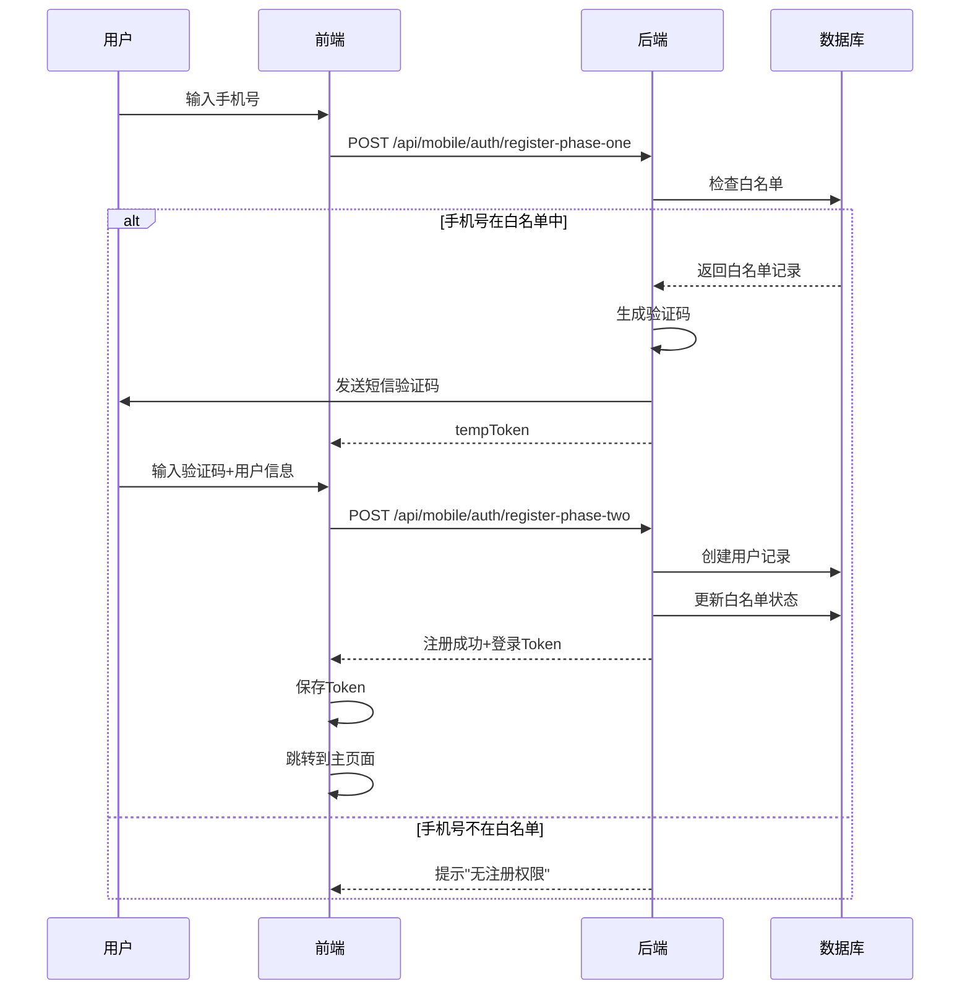
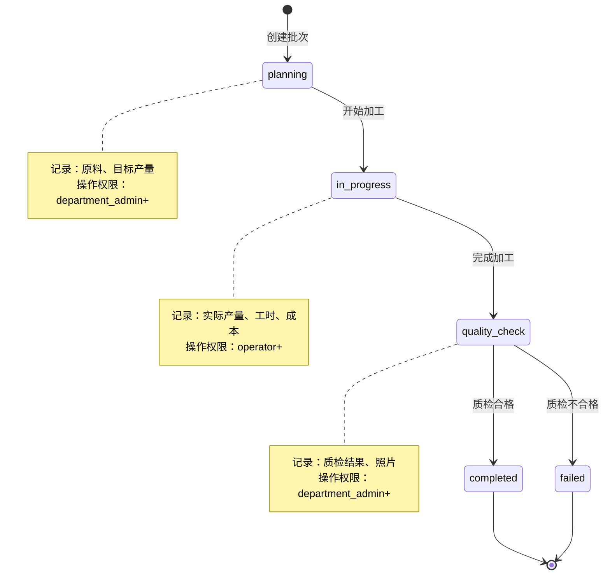

# 白垩纪食品溯源系统 - 产品需求文档 (PRD)

**文档版本**: v2.0
**创建日期**: 2025-01-05
**最后更新**: 2025-01-05
**项目状态**: 开发中 (Phase 1 - 认证系统)

---

## 📋 目录

1. [产品概述](#产品概述)
2. [用户角色体系](#用户角色体系)
3. [核心功能模块](#核心功能模块)
4. [权限矩阵](#权限矩阵)
5. [业务流程](#业务流程)
6. [技术架构](#技术架构)
7. [数据模型](#数据模型)
8. [API 设计](#api-设计)
9. [非功能需求](#非功能需求)

---

## 产品概述

### 1.1 产品定位

白垩纪食品溯源系统是一个面向食品加工行业的**多租户**、**移动优先**的全流程溯源管理平台。

**核心价值**：
- 📱 **移动优先**: React Native 跨平台移动应用
- 🏭 **多租户架构**: 支持多工厂独立运营
- 🔐 **精细权限**: 7级角色权限体系
- 📊 **智能分析**: DeepSeek LLM 成本分析
- 🔄 **全程溯源**: 从原料到成品的完整追踪

### 1.2 目标用户

| 用户类型 | 人数占比 | 主要场景 | 使用频率 |
|---------|---------|---------|---------|
| **平台管理员** | 2-5人 | 管理所有工厂、平台配置 | 每周 |
| **工厂超管** | 每厂1-2人 | 工厂全局管理 | 每天 |
| **部门管理员** | 每厂3-5人 | 部门业务管理 | 每天 |
| **操作员** | 每厂10-50人 | 日常数据录入 | 每小时 |

### 1.3 产品范围

**本期范围 (Phase 1-3)**:
- ✅ 完整的认证授权系统
- ✅ 加工模块 (批次、质检、成本核算)
- ✅ 员工打卡和工时统计
- ✅ 设备监控和告警
- ✅ 智能成本分析 (DeepSeek LLM)
- ✅ 移动端应用 (iOS + Android)

**未来规划 (Phase 4+)**:
- 🔲 养殖模块
- 🔲 物流模块
- 🔲 销售模块
- 🔲 Web 管理后台

---

## 用户角色体系

### 2.1 角色层级架构

```
┌─────────────────────────────────────────┐
│          平台层 (Platform Layer)          │
│  ┌─────────────────────────────────┐    │
│  │     platform_admin (平台管理员)    │    │
│  │   - 管理所有工厂                   │    │
│  │   - 管理所有用户                   │    │
│  │   - 平台级配置                    │    │
│  └─────────────────────────────────┘    │
└─────────────────────────────────────────┘
                    │
                    ↓
┌─────────────────────────────────────────┐
│          工厂层 (Factory Layer)           │
│  ┌─────────────────────────────────┐    │
│  │  factory_super_admin (工厂超管)   │    │
│  │   - 工厂所有权限                   │    │
│  │   - 用户管理                      │    │
│  │   - 所有部门数据                   │    │
│  └─────────────────────────────────┘    │
│                    │                     │
│         ┌──────────┼──────────┐          │
│         ↓          ↓          ↓          │
│  ┌──────────┐ ┌──────────┐ ┌──────────┐ │
│  │permission│ │department│ │ operator │ │
│  │  _admin  │ │  _admin  │ │          │ │
│  │权限管理员 │ │部门管理员 │ │  操作员  │ │
│  └──────────┘ └──────────┘ └──────────┘ │
│         │                                │
│         ↓                                │
│    ┌──────┐                              │
│    │viewer│                              │
│    │查看者│                              │
│    └──────┘                              │
└─────────────────────────────────────────┘
```

### 2.2 角色详细说明

#### 2.2.1 平台角色

**platform_admin (平台管理员)**

| 属性 | 说明 |
|-----|------|
| **权限级别** | 0 (最高) |
| **用户类型** | platform |
| **数据访问** | 所有工厂所有数据 |
| **核心职责** | 平台运营、工厂管理、用户管理 |
| **典型场景** | 创建新工厂、激活用户、查看跨工厂报表 |

**权限清单**:
- ✅ 创建/删除工厂
- ✅ 管理所有工厂用户
- ✅ 查看所有工厂数据
- ✅ 平台级系统配置
- ✅ 跨工厂数据分析
- ✅ 白名单管理
- ✅ 系统监控和日志审计

#### 2.2.2 工厂角色

**factory_super_admin (工厂超级管理员)**

| 属性 | 说明 |
|-----|------|
| **权限级别** | 0 (工厂内最高) |
| **用户类型** | factory |
| **数据访问** | 本工厂所有数据 |
| **部门访问** | 所有部门 |
| **核心职责** | 工厂运营管理、用户管理、全局配置 |

**权限清单**:
- ✅ 工厂用户管理（创建、删除、角色分配）
- ✅ 所有部门数据读写
- ✅ 工厂配置和设置
- ✅ 查看所有业务模块
- ✅ 导出所有数据
- ✅ 审批关键操作

**permission_admin (权限管理员)**

| 属性 | 说明 |
|-----|------|
| **权限级别** | 5 |
| **数据访问** | 本工厂所有数据 (只读+权限管理) |
| **核心职责** | 用户权限管理、角色分配 |

**权限清单**:
- ✅ 分配和调整用户角色
- ✅ 查看所有用户权限
- ✅ 查看所有业务数据（只读）
- ❌ 不能创建/删除用户
- ❌ 不能修改业务数据

**department_admin (部门管理员)**

| 属性 | 说明 |
|-----|------|
| **权限级别** | 10 |
| **数据访问** | 本部门数据 |
| **部门访问** | 单个部门 (farming/processing/logistics/quality) |
| **核心职责** | 部门业务管理、部门员工管理 |

**权限清单**:
- ✅ 管理本部门用户
- ✅ 本部门所有业务操作
- ✅ 查看本部门数据
- ✅ 导出本部门数据
- ❌ 不能访问其他部门数据
- ❌ 不能修改工厂配置

**operator (操作员)**

| 属性 | 说明 |
|-----|------|
| **权限级别** | 30 |
| **数据访问** | 本人创建的数据 |
| **核心职责** | 日常业务操作、数据录入 |

**权限清单**:
- ✅ 创建业务记录（批次、打卡等）
- ✅ 查看本人数据
- ✅ 修改本人未提交的数据
- ❌ 不能删除已提交数据
- ❌ 不能查看他人数据

**viewer (查看者)**

| 属性 | 说明 |
|-----|------|
| **权限级别** | 50 |
| **数据访问** | 授权数据（只读） |
| **核心职责** | 数据查看、报表查看 |

**权限清单**:
- ✅ 查看授权范围内的数据
- ❌ 不能进行任何写操作
- ❌ 不能导出数据

**unactivated (未激活)**

| 属性 | 说明 |
|-----|------|
| **权限级别** | 99 (最低) |
| **数据访问** | 无 |
| **核心职责** | 待激活状态 |

---

## 核心功能模块

### 3.1 认证授权模块 (Phase 1 - 已完成)

#### 3.1.1 统一登录

**功能描述**:
- 智能识别用户类型（平台用户 vs 工厂用户）
- 支持用户名/密码登录
- 支持生物识别登录（指纹/Face ID）
- 支持自动登录（Token 未过期）

**交互流程**:
```
用户输入用户名密码
    ↓
系统检查 PlatformAdmin 表
    ├─ 找到 → 平台用户登录
    └─ 未找到 → 检查 User 表
            ├─ 找到 → 工厂用户登录
            └─ 未找到 → 提示用户不存在
    ↓
验证密码
    ├─ 成功 → 生成 JWT Token
    │         ├─ accessToken (24小时)
    │         └─ refreshToken (7天)
    ├─ 失败 → 提示密码错误
    ↓
保存 Token 到 SecureStore
    ↓
根据角色跳转到对应页面
```

**API 端点**:
- `POST /api/mobile/auth/unified-login` - 统一登录
- `POST /api/mobile/auth/refresh-token` - 刷新 Token
- `POST /api/mobile/auth/logout` - 登出

#### 3.1.2 两阶段注册

**Phase 1: 手机验证**
- 输入手机号
- 发送验证码
- 验证码校验
- 白名单检查

**Phase 2: 完善信息**
- 使用 tempToken
- 填写用户名、密码
- 填写姓名、部门
- 完成注册

**API 端点**:
- `POST /api/mobile/auth/register-phase-one` - 手机验证
- `POST /api/mobile/auth/register-phase-two` - 完成注册

#### 3.1.3 设备绑定

**功能描述**:
- 记录设备唯一标识
- 支持多设备登录
- 设备管理（查看/解绑）

**API 端点**:
- `POST /api/mobile/auth/bind-device` - 绑定设备
- `GET /api/mobile/auth/devices` - 查看设备列表

### 3.2 加工模块 (Phase 2 - 已完成)

#### 3.2.1 生产批次管理

**功能描述**:
- 创建加工批次
- 记录原料信息（鱼类型、数量）
- 记录加工参数（温度、时间）
- 批次状态流转

**批次状态**:
```
planning → in_progress → quality_check → completed
                              ↓
                           failed
```

**数据模型**:
```typescript
interface ProcessingBatch {
  id: string;
  batchNumber: string;  // 批次号（自动生成）
  factoryId: string;
  productType: string;  // 产品类型
  fishType: string;     // 鱼类型
  rawQuantity: number;  // 原料数量 (kg)
  targetQuantity: number; // 目标产量
  actualQuantity: number; // 实际产量
  status: BatchStatus;
  startDate: DateTime;
  endDate?: DateTime;
  costPerKg?: number;   // 单位成本
  totalCost?: number;   // 总成本
}
```

**API 端点**:
- `POST /api/mobile/processing/batches` - 创建批次
- `GET /api/mobile/processing/batches` - 查询批次列表
- `GET /api/mobile/processing/batches/:id` - 查询批次详情
- `PUT /api/mobile/processing/batches/:id` - 更新批次
- `POST /api/mobile/processing/batches/:id/complete` - 完成批次

#### 3.2.2 质量检验

**功能描述**:
- 创建质检记录
- 上传质检照片
- 记录不合格项
- 质检结果（合格/不合格/条件合格）

**质检类型**:
- `raw_material` - 原料质检
- `process` - 过程质检
- `final_product` - 成品质检

**API 端点**:
- `POST /api/mobile/processing/quality-inspections` - 创建质检
- `GET /api/mobile/processing/quality-inspections` - 质检列表

#### 3.2.3 成本核算

**功能描述**:
- 原料成本
- 人工成本（基于工时）
- 设备成本（折旧）
- 能耗成本
- 综合成本分析

**成本计算公式**:
```
总成本 = 原料成本 + 人工成本 + 设备成本 + 能耗成本 + 其他成本

单位成本 = 总成本 / 实际产量

人工成本 = Σ(员工工时 × 时薪)
```

#### 3.2.4 智能成本分析 (DeepSeek LLM)

**功能描述**:
- 分析成本异常
- 提供优化建议
- 成本趋势预测
- 对标分析

**API 端点**:
- `POST /api/mobile/analysis/deepseek` - DeepSeek 分析

**示例请求**:
```json
{
  "batchId": "batch_123",
  "analysisType": "cost_optimization",
  "data": {
    "actualCost": 12.5,
    "targetCost": 10.0,
    "breakdown": {...}
  }
}
```

### 3.3 员工管理模块 (Phase 2 - 已完成)

#### 3.3.1 员工打卡

**功能描述**:
- 上班打卡（Clock In）
- 下班打卡（Clock Out）
- GPS 位置记录
- 打卡照片（可选）
- 异常打卡处理

**打卡类型**:
- `normal` - 正常打卡
- `late` - 迟到
- `early_leave` - 早退
- `overtime` - 加班
- `forgot` - 补卡

**API 端点**:
- `POST /api/mobile/timeclock/clock-in` - 上班打卡
- `POST /api/mobile/timeclock/clock-out` - 下班打卡
- `GET /api/mobile/timeclock/records` - 打卡记录
- `GET /api/mobile/timeclock/current-session` - 当前打卡状态

#### 3.3.2 工时统计

**功能描述**:
- 日工时统计
- 周工时统计
- 月工时统计
- 加班工时统计
- 工时报表导出

**统计维度**:
- 按员工统计
- 按部门统计
- 按工种统计
- 按时间段统计

**API 端点**:
- `GET /api/mobile/time-stats/daily` - 日统计
- `GET /api/mobile/time-stats/weekly` - 周统计
- `GET /api/mobile/time-stats/monthly` - 月统计
- `GET /api/mobile/time-stats/employee/:id` - 员工统计

#### 3.3.3 工作记录

**功能描述**:
- 记录工作内容
- 记录工作批次
- 记录工作工种
- 工作效率分析

**数据模型**:
```typescript
interface EmployeeWorkRecord {
  id: string;
  employeeId: number;
  factoryId: string;
  workType: string;      // 工种
  batchId?: string;      // 关联批次
  startTime: DateTime;
  endTime: DateTime;
  duration: number;      // 工时（小时）
  efficiency?: number;   // 效率分数
  notes?: string;
}
```

### 3.4 设备监控模块 (Phase 2 - 已完成)

#### 3.4.1 设备实时监控

**功能描述**:
- 设备状态监控（运行/停机/维护）
- 设备参数监控（温度、湿度、压力）
- 设备报警
- 设备维护记录

**设备状态**:
- `normal` - 正常
- `warning` - 警告
- `error` - 故障
- `maintenance` - 维护中

**API 端点**:
- `GET /api/mobile/processing/equipment/monitoring` - 设备监控
- `POST /api/mobile/processing/equipment/:id/status` - 更新状态
- `GET /api/mobile/processing/equipment/:id/history` - 历史数据

#### 3.4.2 告警系统

**功能描述**:
- 实时告警推送
- 告警级别分类
- 告警处理流程
- 告警统计分析

**告警级别**:
- `critical` - 严重（红色）
- `warning` - 警告（黄色）
- `info` - 提示（蓝色）

**告警类型**:
- `temperature_high` - 温度过高
- `temperature_low` - 温度过低
- `equipment_failure` - 设备故障
- `quality_issue` - 质量问题
- `cost_overrun` - 成本超标

### 3.5 数据分析模块 (Phase 2 - 已完成)

#### 3.5.1 仪表板

**平台管理员仪表板**:
- 所有工厂概览
- 跨工厂数据对比
- 平台级 KPI

**工厂管理员仪表板**:
- 生产概览（今日/本周/本月）
- 质量概览
- 成本概览
- 人员概览
- 设备概览

**部门管理员仪表板**:
- 部门生产数据
- 部门员工数据
- 部门成本数据

**API 端点**:
- `GET /api/mobile/processing/dashboard/overview` - 仪表板概览
- `GET /api/mobile/processing/dashboard/production` - 生产仪表板
- `GET /api/mobile/processing/dashboard/quality` - 质量仪表板
- `GET /api/mobile/processing/dashboard/cost` - 成本仪表板

#### 3.5.2 报表生成

**报表类型**:
- 生产报表（批次汇总）
- 质检报表
- 工时报表
- 成本报表
- 设备运行报表

**导出格式**:
- PDF
- Excel
- CSV

**API 端点**:
- `GET /api/mobile/reports/production` - 生产报表
- `GET /api/mobile/reports/quality` - 质检报表
- `GET /api/mobile/reports/timeclock` - 工时报表
- `POST /api/mobile/reports/export` - 导出报表

---

## 权限矩阵

### 4.1 模块访问权限

| 模块 | platform_admin | factory_super_admin | permission_admin | department_admin | operator | viewer |
|-----|----------------|---------------------|------------------|------------------|----------|--------|
| **平台管理** | ✅ | ❌ | ❌ | ❌ | ❌ | ❌ |
| **工厂管理** | ✅ | ✅ | ❌ | ❌ | ❌ | ❌ |
| **用户管理** | ✅ | ✅ | ✅ (只读+角色分配) | ✅ (本部门) | ❌ | ❌ |
| **加工管理** | ✅ (所有工厂) | ✅ (本工厂) | 👁️ (只读) | ✅ (本部门) | ✅ (创建记录) | 👁️ (只读) |
| **质检管理** | ✅ | ✅ | 👁️ | ✅ (本部门) | ✅ (提交质检) | 👁️ |
| **员工管理** | ✅ | ✅ | 👁️ | ✅ (本部门) | ✅ (打卡) | 👁️ |
| **设备监控** | ✅ | ✅ | 👁️ | ✅ (本部门设备) | 👁️ | 👁️ |
| **数据分析** | ✅ (全平台) | ✅ (本工厂) | 👁️ | ✅ (本部门) | 👁️ (个人数据) | 👁️ (授权数据) |
| **系统配置** | ✅ | ✅ (工厂配置) | ❌ | ❌ | ❌ | ❌ |

**图例**: ✅ 完全访问 | 👁️ 只读访问 | ❌ 无权访问

### 4.2 数据访问权限

| 角色 | 数据范围 | 可见工厂 | 可见部门 | 可见用户 |
|-----|----------|----------|----------|----------|
| **platform_admin** | 所有数据 | 所有 | 所有 | 所有 |
| **factory_super_admin** | 本工厂所有数据 | 本工厂 | 所有 | 本工厂所有 |
| **permission_admin** | 本工厂所有数据（只读） | 本工厂 | 所有 | 本工厂所有 |
| **department_admin** | 本部门数据 | 本工厂 | 本部门 | 本部门 |
| **operator** | 本人创建的数据 | 本工厂 | 本部门 | 本人 |
| **viewer** | 授权数据（只读） | 授权工厂 | 授权部门 | 授权用户 |

---

## 业务流程

### 5.1 用户注册流程



### 5.2 加工批次流程



### 5.3 员工打卡流程

```
员工到达工厂
    ↓
打开App → 点击"上班打卡"
    ↓
系统获取GPS位置
    ↓
位置验证
    ├─ 在工厂范围内 → 允许打卡
    └─ 不在范围内 → 提示"不在打卡范围"
    ↓
拍摄打卡照片（可选）
    ↓
提交打卡
    ↓
系统记录：
    - 打卡时间
    - GPS位置
    - 打卡照片
    - 工作类型
    ↓
显示打卡成功
    ↓
工作中...
    ↓
点击"下班打卡"
    ↓
计算工时
    ↓
记录工作记录
    ↓
更新工时统计
```

---

## 技术架构

### 6.1 系统架构图

```
┌─────────────────────────────────────────────────┐
│           移动端 (React Native)                   │
│  ┌──────────┐  ┌──────────┐  ┌──────────┐      │
│  │   iOS    │  │ Android  │  │   Web    │      │
│  └──────────┘  └──────────┘  └──────────┘      │
└─────────────────────┬───────────────────────────┘
                      │ HTTPS/REST API
                      ↓
┌─────────────────────────────────────────────────┐
│              后端服务 (Node.js + Express)         │
│  ┌──────────┐  ┌──────────┐  ┌──────────┐      │
│  │ Auth API │  │Mobile API│  │ Admin API│      │
│  └──────────┘  └──────────┘  └──────────┘      │
│  ┌──────────────────────────────────────┐      │
│  │      业务逻辑层 (Controllers)         │      │
│  └──────────────────────────────────────┘      │
│  ┌──────────────────────────────────────┐      │
│  │      数据访问层 (Prisma ORM)          │      │
│  └──────────────────────────────────────┘      │
└─────────────────────┬───────────────────────────┘
                      │
                      ↓
┌─────────────────────────────────────────────────┐
│              数据库 (MySQL 8.0+)                  │
│  ┌──────────┐  ┌──────────┐  ┌──────────┐      │
│  │ 用户数据  │  │ 业务数据  │  │ 系统数据  │      │
│  └──────────┘  └──────────┘  └──────────┘      │
└─────────────────────────────────────────────────┘

        ┌─────────────────────────────────┐
        │  外部服务                        │
        ├─────────────────────────────────┤
        │  • DeepSeek LLM (AI分析)         │
        │  • 短信服务 (验证码)              │
        │  • 对象存储 (图片/文件)           │
        └─────────────────────────────────┘
```

### 6.2 技术栈

**前端 (React Native)**:
- React Native 0.76+
- Expo 53+
- React Navigation 7+
- Zustand (状态管理)
- Axios (HTTP 客户端)
- Expo SecureStore (安全存储)
- Expo LocalAuthentication (生物识别)

**后端 (Node.js)**:
- Node.js 18+
- Express.js 4.18+
- Prisma 5.22+ (ORM)
- JWT (认证)
- bcrypt (密码加密)
- Zod (数据验证)
- Winston (日志)
- node-cron (定时任务)

**数据库**:
- MySQL 8.0+ (开发/生产)
- 可迁移到 PostgreSQL

**DevOps**:
- Docker (容器化)
- Nginx (反向代理)

---

## 数据模型

### 7.1 核心数据模型 ER 图

```
┌─────────────────┐
│   Factory       │
│─────────────────│
│ id (PK)         │
│ name            │
│ industry        │
│ regionCode      │
│ isActive        │
└────────┬────────┘
         │ 1
         │
         │ N
┌────────┴────────┐
│     User        │
│─────────────────│
│ id (PK)         │
│ username        │
│ factoryId (FK)  │
│ roleCode        │◄─────┐
│ department      │      │
│ isActive        │      │
└────────┬────────┘      │
         │ 1             │
         │               │ N
         │ N      ┌──────┴───────┐
┌────────┴──────┐ │ UserRole     │
│ProcessingBatch│ │  History     │
│───────────────│ └──────────────┘
│ id (PK)       │
│ batchNumber   │
│ factoryId(FK) │
│ supervisorId  │
│ status        │
│ fishType      │
│ rawQuantity   │
│ totalCost     │
└───────────────┘
```

### 7.2 关键数据表

#### Factory (工厂)
```sql
CREATE TABLE factories (
  id VARCHAR(50) PRIMARY KEY,
  name VARCHAR(255) NOT NULL,
  industry VARCHAR(100),
  region_code VARCHAR(50),
  address TEXT,
  contact_name VARCHAR(100),
  contact_phone VARCHAR(20),
  is_active BOOLEAN DEFAULT true,
  created_at TIMESTAMP DEFAULT CURRENT_TIMESTAMP,
  updated_at TIMESTAMP DEFAULT CURRENT_TIMESTAMP ON UPDATE CURRENT_TIMESTAMP
);
```

#### User (工厂用户)
```sql
CREATE TABLE users (
  id INT AUTO_INCREMENT PRIMARY KEY,
  username VARCHAR(50) UNIQUE NOT NULL,
  password_hash VARCHAR(255) NOT NULL,
  email VARCHAR(255),
  full_name VARCHAR(100),
  factory_id VARCHAR(50) NOT NULL,
  role_code ENUM('factory_super_admin', 'permission_admin',
                 'department_admin', 'operator', 'viewer', 'unactivated'),
  department ENUM('farming', 'processing', 'logistics',
                  'quality', 'management'),
  is_active BOOLEAN DEFAULT true,
  created_at TIMESTAMP DEFAULT CURRENT_TIMESTAMP,
  FOREIGN KEY (factory_id) REFERENCES factories(id)
);
```

#### PlatformAdmin (平台管理员)
```sql
CREATE TABLE platform_admins (
  id INT AUTO_INCREMENT PRIMARY KEY,
  username VARCHAR(50) UNIQUE NOT NULL,
  password_hash VARCHAR(255) NOT NULL,
  email VARCHAR(255) UNIQUE NOT NULL,
  full_name VARCHAR(100),
  role ENUM('platform_admin'),
  created_at TIMESTAMP DEFAULT CURRENT_TIMESTAMP
);
```

#### ProcessingBatch (加工批次)
```sql
CREATE TABLE processing_batches (
  id VARCHAR(50) PRIMARY KEY,
  batch_number VARCHAR(100) UNIQUE NOT NULL,
  factory_id VARCHAR(50) NOT NULL,
  product_type VARCHAR(100),
  fish_type VARCHAR(100),
  raw_quantity DECIMAL(10,2),
  target_quantity DECIMAL(10,2),
  actual_quantity DECIMAL(10,2),
  status ENUM('planning', 'in_progress', 'quality_check',
              'completed', 'failed'),
  start_date TIMESTAMP,
  end_date TIMESTAMP,
  total_cost DECIMAL(12,2),
  cost_per_kg DECIMAL(10,2),
  supervisor_id INT,
  created_at TIMESTAMP DEFAULT CURRENT_TIMESTAMP,
  FOREIGN KEY (factory_id) REFERENCES factories(id),
  FOREIGN KEY (supervisor_id) REFERENCES users(id)
);
```

---

## API 设计

### 8.1 API 规范

**Base URL**:
- 开发: `http://localhost:3001/api`
- 生产: `https://api.cretas.com/api`

**请求格式**: JSON
**响应格式**: JSON
**认证方式**: JWT Bearer Token

**标准响应结构**:
```json
{
  "success": true,
  "data": {...},
  "message": "操作成功",
  "timestamp": "2025-01-05T10:00:00Z"
}
```

**错误响应结构**:
```json
{
  "success": false,
  "error": {
    "code": "UNAUTHORIZED",
    "message": "未授权访问",
    "details": {...}
  },
  "timestamp": "2025-01-05T10:00:00Z"
}
```

### 8.2 核心 API 端点

详见 [API文档](./API-Reference.md)

**认证相关**:
- `POST /mobile/auth/unified-login` - 统一登录
- `POST /mobile/auth/register-phase-one` - 注册第一步
- `POST /mobile/auth/register-phase-two` - 注册第二步
- `POST /mobile/auth/logout` - 登出
- `POST /mobile/auth/refresh-token` - 刷新Token

**加工相关**:
- `POST /mobile/processing/batches` - 创建批次
- `GET /mobile/processing/batches` - 批次列表
- `GET /mobile/processing/batches/:id` - 批次详情
- `PUT /mobile/processing/batches/:id` - 更新批次

**员工相关**:
- `POST /mobile/timeclock/clock-in` - 上班打卡
- `POST /mobile/timeclock/clock-out` - 下班打卡
- `GET /mobile/time-stats/daily` - 日工时统计

---

## 非功能需求

### 9.1 性能要求

| 指标 | 目标值 | 说明 |
|-----|-------|------|
| **App启动时间** | <3秒 | 冷启动到可交互 |
| **API响应时间** | <500ms | P95 响应时间 |
| **页面切换** | <300ms | 页面过渡动画 |
| **离线支持** | 核心功能 | 打卡、数据录入 |
| **并发用户** | 1000+ | 单工厂峰值 |
| **数据库性能** | <100ms | 单表查询 |

### 9.2 安全要求

| 需求 | 实现方式 |
|-----|---------|
| **密码安全** | bcrypt 加密，至少12轮 |
| **Token安全** | JWT，24小时过期 |
| **HTTPS** | 生产环境强制HTTPS |
| **SQL注入防护** | Prisma ORM 参数化查询 |
| **XSS防护** | 输入验证 + 输出转义 |
| **权限验证** | 每个API请求验证权限 |
| **审计日志** | 记录所有关键操作 |

### 9.3 可用性要求

| 指标 | 目标值 |
|-----|-------|
| **系统可用性** | 99.5% |
| **数据备份** | 每日自动备份 |
| **故障恢复** | <2小时 RTO |
| **数据丢失** | <15分钟 RPO |

### 9.4 兼容性要求

| 平台 | 版本要求 |
|-----|---------|
| **iOS** | iOS 13.0+ |
| **Android** | Android 8.0+ (API 26+) |
| **后端** | Node.js 18+ |
| **数据库** | MySQL 8.0+ / PostgreSQL 13+ |

---

## 附录

### A. 术语表

| 术语 | 说明 |
|-----|------|
| **批次** | 一次完整的加工生产过程 |
| **工时** | 员工工作时长，以小时计 |
| **工种** | 员工工作类型，如"加工工"、"质检员" |
| **白名单** | 允许注册的手机号列表 |
| **tempToken** | 注册过程中的临时令牌，有效期10分钟 |
| **多租户** | 多个工厂共享同一系统，数据隔离 |

### B. 状态码

| 状态码 | 说明 |
|-------|------|
| 200 | 成功 |
| 201 | 创建成功 |
| 400 | 请求参数错误 |
| 401 | 未授权 |
| 403 | 无权限 |
| 404 | 资源不存在 |
| 500 | 服务器错误 |

---

**文档结束**

*如有疑问，请联系项目负责人*
