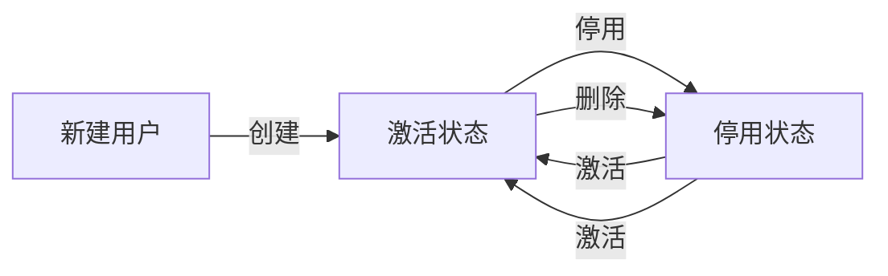

# PRD-API-UserController.md

## 文档信息

- **文档标题**: UserController API 端点文档
- **Controller**: `UserController.java`
- **模块**: 用户管理模块 (User Management)
- **端点数量**: 15个
- **文档版本**: v1.0.0
- **创建时间**: 2025-01-20
- **维护团队**: Cretas Backend Team

---

## 📋 目录

1. [控制器概述](#1-控制器概述)
2. [端点清单](#2-端点清单)
3. [端点详细文档](#3-端点详细文档)
   - [3.1 CRUD操作](#31-crud操作)
   - [3.2 查询操作](#32-查询操作)
   - [3.3 状态管理](#33-状态管理)
   - [3.4 导入导出](#34-导入导出)
4. [数据模型](#4-数据模型)
5. [业务规则](#5-业务规则)
6. [前端集成建议](#6-前端集成建议)
7. [错误处理](#7-错误处理)

---

## 1. 控制器概述

### 1.1 功能描述

**UserController** 负责工厂用户的全生命周期管理，包括：

- ✅ **用户基础管理**: CRUD操作（创建、更新、删除、查询）
- ✅ **角色权限管理**: 8角色系统（super_admin, permission_admin, supervisor, operator等）
- ✅ **状态管理**: 用户激活/停用、角色更新
- ✅ **搜索与过滤**: 关键词搜索、角色筛选
- ✅ **批量操作**: Excel导入导出、模板下载
- ✅ **唯一性验证**: 用户名、邮箱唯一性检查

### 1.2 关键特性

| 特性 | 说明 | 实现方式 |
|------|------|----------|
| **8角色系统** | 支持8种工厂用户角色 | `FactoryUserRole` 枚举 |
| **软删除** | 删除操作不物理删除记录 | `isActive = false` |
| **密码加密** | BCrypt哈希存储 | `passwordHash` 字段 |
| **成本核算** | 支持员工成本分析 | `monthlySalary`, `ccrRate` |
| **权限映射** | 角色到权限的自动映射 | `getPermissions()` 方法 |
| **Excel批量导入** | 支持批量创建用户 | Apache POI |
| **唯一性验证** | 防止用户名/邮箱重复 | 数据库约束 + API验证 |

### 1.3 技术栈

- **Framework**: Spring Boot 2.7.15
- **ORM**: Spring Data JPA + Hibernate
- **Validation**: Hibernate Validator
- **Excel**: Apache POI
- **Security**: BCrypt密码加密
- **Database**: MySQL with indexes on `username`, `factory_id`, `is_active`

---

## 2. 端点清单

| # | 方法 | 路径 | 功能 | 状态 |
|---|------|------|------|------|
| 1 | POST | `/api/mobile/{factoryId}/users` | 创建用户 | ✅ |
| 2 | PUT | `/api/mobile/{factoryId}/users/{userId}` | 更新用户信息 | ✅ |
| 3 | DELETE | `/api/mobile/{factoryId}/users/{userId}` | 删除用户 | ✅ |
| 4 | GET | `/api/mobile/{factoryId}/users/{userId}` | 获取用户详情 | ✅ |
| 5 | GET | `/api/mobile/{factoryId}/users` | 获取用户列表（分页） | ✅ |
| 6 | GET | `/api/mobile/{factoryId}/users/role/{roleCode}` | 按角色获取用户 | ✅ |
| 7 | GET | `/api/mobile/{factoryId}/users/search` | 搜索用户 | ✅ |
| 8 | GET | `/api/mobile/{factoryId}/users/check/username` | 检查用户名是否存在 | ✅ |
| 9 | GET | `/api/mobile/{factoryId}/users/check/email` | 检查邮箱是否存在 | ✅ |
| 10 | POST | `/api/mobile/{factoryId}/users/{userId}/activate` | 激活用户 | ✅ |
| 11 | POST | `/api/mobile/{factoryId}/users/{userId}/deactivate` | 停用用户 | ✅ |
| 12 | PUT | `/api/mobile/{factoryId}/users/{userId}/role` | 更新用户角色 | ✅ |
| 13 | GET | `/api/mobile/{factoryId}/users/export` | 导出用户列表 | ✅ |
| 14 | POST | `/api/mobile/{factoryId}/users/import` | 批量导入用户 | ✅ |
| 15 | GET | `/api/mobile/{factoryId}/users/export/template` | 下载导入模板 | ✅ |

---

## 3. 端点详细文档

### 3.1 CRUD操作

#### 3.1.1 创建用户

##### 端点基本信息

```http
POST /api/mobile/{factoryId}/users
Content-Type: application/json
Authorization: Bearer {accessToken}
```

**功能**: 在指定工厂创建新用户，支持8种角色类型。

**权限要求**: `super_admin`, `permission_admin`

##### 请求参数详解

**Path Parameters**:
- `factoryId` (String, required): 工厂ID，如 "CRETAS_2024_001"

**Request Body** (`CreateUserRequest`):
```typescript
interface CreateUserRequest {
  username: string;           // 用户名（全局唯一，3-20字符）
  password: string;           // 密码（8-30字符，含大小写字母+数字）
  fullName: string;           // 姓名（2-50字符）
  phone?: string;             // 手机号（11位数字）
  email?: string;             // 邮箱
  department?: string;        // 部门
  position?: string;          // 职位
  roleCode: FactoryUserRole;  // 角色代码
  monthlySalary?: number;     // 月薪（元）
  expectedWorkMinutes?: number; // 预期工作分钟数
}

// FactoryUserRole枚举
enum FactoryUserRole {
  FACTORY_SUPER_ADMIN = 'factory_super_admin',        // 工厂超级管理员
  FACTORY_PERMISSION_ADMIN = 'factory_permission_admin', // 权限管理员
  DEPARTMENT_ADMIN = 'department_admin',              // 部门管理员
  SUPERVISOR = 'supervisor',                          // 生产主管
  OPERATOR = 'operator',                              // 操作员
  WAREHOUSE_KEEPER = 'warehouse_keeper',              // 仓库管理员
  QUALITY_INSPECTOR = 'quality_inspector',            // 质检员
  VIEWER = 'viewer'                                   // 只读查看
}
```

**验证规则**:
```typescript
const validationRules = {
  username: {
    required: true,
    minLength: 3,
    maxLength: 20,
    pattern: /^[a-zA-Z0-9_]+$/,  // 仅字母、数字、下划线
    unique: true                  // 全局唯一
  },
  password: {
    required: true,
    minLength: 8,
    maxLength: 30,
    pattern: /^(?=.*[a-z])(?=.*[A-Z])(?=.*\d).+$/  // 大小写字母+数字
  },
  fullName: {
    required: true,
    minLength: 2,
    maxLength: 50
  },
  phone: {
    optional: true,
    pattern: /^1[3-9]\d{9}$/  // 中国手机号
  },
  email: {
    optional: true,
    pattern: /^[^\s@]+@[^\s@]+\.[^\s@]+$/,
    unique: true  // 全局唯一
  },
  roleCode: {
    required: true,
    enum: FactoryUserRole
  }
};
```

##### 响应数据结构

**Success Response (200)**:
```typescript
interface ApiResponse<UserDTO> {
  code: 200;
  message: "用户创建成功";
  data: {
    id: number;                    // 用户ID
    factoryId: string;             // 工厂ID
    username: string;              // 用户名
    fullName: string;              // 姓名
    phone: string | null;          // 手机号
    email: string | null;          // 邮箱
    department: string | null;     // 部门
    position: string | null;       // 职位
    roleCode: string;              // 角色代码
    isActive: boolean;             // 是否激活（默认true）
    monthlySalary: number | null;  // 月薪
    expectedWorkMinutes: number | null;  // 预期工作分钟数
    ccrRate: number | null;        // CCR成本费率
    lastLogin: string | null;      // 最后登录时间
    createdAt: string;             // 创建时间
    updatedAt: string;             // 更新时间
  };
  timestamp: string;
}
```

**Error Responses**:
```typescript
// 用户名已存在
{
  code: 400,
  message: "用户名已存在",
  error: "USERNAME_EXISTS"
}

// 邮箱已存在
{
  code: 400,
  message: "邮箱已被使用",
  error: "EMAIL_EXISTS"
}

// 密码格式错误
{
  code: 400,
  message: "密码必须包含大小写字母和数字",
  error: "INVALID_PASSWORD_FORMAT"
}
```

##### 业务逻辑说明

**创建流程**:
```typescript
const createUser = async (factoryId: string, request: CreateUserRequest) => {
  // 1. 唯一性验证
  const usernameExists = await checkUsernameExists(request.username);
  if (usernameExists) {
    throw new Error('用户名已存在');
  }

  if (request.email) {
    const emailExists = await checkEmailExists(request.email);
    if (emailExists) {
      throw new Error('邮箱已被使用');
    }
  }

  // 2. 密码加密
  const passwordHash = await bcrypt.hash(request.password, 10);

  // 3. 创建用户实体
  const user = {
    ...request,
    factoryId,
    passwordHash,
    isActive: true,
    createdAt: new Date(),
    updatedAt: new Date(),
  };

  // 4. 保存到数据库
  const savedUser = await userRepository.save(user);

  // 5. 返回DTO（不返回密码哈希）
  return toUserDTO(savedUser);
};
```

**CCR费率自动计算**:
```typescript
// CCR (Cost Center Rate) = 员工成本费率
// 如果提供了月薪和预期工作时长，自动计算CCR
if (monthlySalary && expectedWorkMinutes) {
  const monthlyCost = monthlySalary * 1.3;  // 加上30%的福利成本
  const monthlyMinutes = expectedWorkMinutes * 22;  // 假设22个工作日
  ccrRate = monthlyCost / monthlyMinutes;  // 元/分钟
  // 示例: 月薪6000元，每天480分钟 → CCR ≈ 0.74元/分钟
}
```

##### 前端集成建议

```typescript
// services/api/userApiClient.ts
import apiClient from './apiClient';
import { ApiResponse, CreateUserRequest, UserDTO } from '@/types';

export const userApiClient = {
  /**
   * 创建用户
   */
  async createUser(
    factoryId: string,
    request: CreateUserRequest
  ): Promise<UserDTO> {
    const response = await apiClient.post<ApiResponse<UserDTO>>(
      `/api/mobile/${factoryId}/users`,
      request
    );
    return response.data.data;
  },
};
```

**使用示例**:
```typescript
// screens/management/CreateUserScreen.tsx
const handleCreateUser = async () => {
  try {
    setLoading(true);

    const request: CreateUserRequest = {
      username: formData.username,
      password: formData.password,
      fullName: formData.fullName,
      phone: formData.phone,
      email: formData.email,
      roleCode: formData.role,
      department: formData.department,
      monthlySalary: formData.salary ? parseFloat(formData.salary) : undefined,
    };

    const newUser = await userApiClient.createUser(factoryId, request);

    Alert.alert('成功', '用户创建成功');
    navigation.goBack();
  } catch (error) {
    if (error.message.includes('用户名已存在')) {
      setErrors({ username: '该用户名已被使用，请更换' });
    } else if (error.message.includes('邮箱已被使用')) {
      setErrors({ email: '该邮箱已被注册，请更换' });
    } else {
      Alert.alert('错误', error.message);
    }
  } finally {
    setLoading(false);
  }
};
```

---

#### 3.1.2 更新用户信息

##### 端点基本信息

```http
PUT /api/mobile/{factoryId}/users/{userId}
Content-Type: application/json
Authorization: Bearer {accessToken}
```

**功能**: 更新指定用户的信息（除角色外的所有字段）。

**权限要求**: `super_admin`, `permission_admin`

##### 请求参数详解

**Path Parameters**:
- `factoryId` (String, required): 工厂ID
- `userId` (Integer, required): 用户ID

**Request Body**: 与创建用户相同，但所有字段都是可选的（至少提供一个字段）

```typescript
interface UpdateUserRequest {
  username?: string;           // 用户名（需验证唯一性）
  password?: string;           // 密码（提供则更新）
  fullName?: string;           // 姓名
  phone?: string;              // 手机号
  email?: string;              // 邮箱（需验证唯一性）
  department?: string;         // 部门
  position?: string;           // 职位
  monthlySalary?: number;      // 月薪
  expectedWorkMinutes?: number; // 预期工作分钟数
}
```

##### 响应数据结构

**Success Response (200)**:
```typescript
interface ApiResponse<UserDTO> {
  code: 200;
  message: "用户更新成功";
  data: UserDTO;  // 完整的更新后用户信息
  timestamp: string;
}
```

##### 业务逻辑说明

**更新逻辑**:
```typescript
const updateUser = async (
  factoryId: string,
  userId: number,
  request: UpdateUserRequest
) => {
  // 1. 获取现有用户
  const existingUser = await userRepository.findOne({
    where: { id: userId, factoryId }
  });

  if (!existingUser) {
    throw new Error('用户不存在');
  }

  // 2. 如果更新用户名，检查唯一性
  if (request.username && request.username !== existingUser.username) {
    const usernameExists = await checkUsernameExists(request.username);
    if (usernameExists) {
      throw new Error('用户名已存在');
    }
  }

  // 3. 如果更新邮箱，检查唯一性
  if (request.email && request.email !== existingUser.email) {
    const emailExists = await checkEmailExists(request.email);
    if (emailExists) {
      throw new Error('邮箱已被使用');
    }
  }

  // 4. 如果提供密码，重新加密
  if (request.password) {
    request.passwordHash = await bcrypt.hash(request.password, 10);
    delete request.password;
  }

  // 5. 合并更新
  Object.assign(existingUser, request, { updatedAt: new Date() });

  // 6. 保存
  const updatedUser = await userRepository.save(existingUser);

  return toUserDTO(updatedUser);
};
```

---

#### 3.1.3 删除用户

##### 端点基本信息

```http
DELETE /api/mobile/{factoryId}/users/{userId}
Authorization: Bearer {accessToken}
```

**功能**: 软删除用户（设置 `isActive = false`，保留历史记录）。

**权限要求**: `super_admin`

##### 请求参数详解

**Path Parameters**:
- `factoryId` (String, required): 工厂ID
- `userId` (Integer, required): 用户ID

##### 响应数据结构

**Success Response (200)**:
```typescript
interface ApiResponse<void> {
  code: 200;
  message: "用户删除成功";
  data: null;
  timestamp: string;
}
```

##### 业务逻辑说明

**软删除策略**:
```typescript
const deleteUser = async (factoryId: string, userId: number) => {
  const user = await userRepository.findOne({
    where: { id: userId, factoryId, isActive: true }
  });

  if (!user) {
    throw new Error('用户不存在或已被删除');
  }

  // 软删除：仅标记为非活动
  user.isActive = false;
  user.updatedAt = new Date();

  await userRepository.save(user);

  // 注意：相关联的数据不会被删除（如：考勤记录、工作会话等）
  // 这样可以保留完整的历史追溯链
};
```

**为什么使用软删除**:
1. **数据完整性**: 保留历史记录（生产批次、考勤记录等）
2. **审计追溯**: 可以查询已删除用户的操作历史
3. **误删恢复**: 可以通过激活操作恢复用户
4. **关联数据**: 避免级联删除导致数据丢失

---

#### 3.1.4 获取用户详情

##### 端点基本信息

```http
GET /api/mobile/{factoryId}/users/{userId}
Authorization: Bearer {accessToken}
```

**功能**: 获取指定用户的完整信息。

##### 请求参数详解

**Path Parameters**:
- `factoryId` (String, required): 工厂ID
- `userId` (Integer, required): 用户ID

##### 响应数据结构

**Success Response (200)**:
```typescript
interface ApiResponse<UserDTO> {
  code: 200;
  message: "Success";
  data: {
    id: number;
    factoryId: string;
    username: string;
    fullName: string;
    phone: string | null;
    email: string | null;
    department: string | null;
    position: string | null;
    roleCode: string;
    isActive: boolean;
    monthlySalary: number | null;
    expectedWorkMinutes: number | null;
    ccrRate: number | null;
    lastLogin: string | null;

    // 扩展字段
    permissions: string[];  // 基于角色的权限列表
    avatar: string | null;  // 头像URL（TODO: 待实现）

    createdAt: string;
    updatedAt: string;
  };
  timestamp: string;
}
```

##### 前端集成建议

```typescript
// 用户详情页面
const UserDetailScreen = ({ route, navigation }: Props) => {
  const { userId } = route.params;
  const factoryId = useAuthStore(state => state.user?.factoryId);
  const [user, setUser] = useState<UserDTO | null>(null);

  useEffect(() => {
    loadUserDetail();
  }, [userId]);

  const loadUserDetail = async () => {
    try {
      const userData = await userApiClient.getUserById(factoryId, userId);
      setUser(userData);
    } catch (error) {
      Alert.alert('错误', '加载用户信息失败');
    }
  };

  return (
    <ScrollView>
      <Card>
        <Text>用户名: {user?.username}</Text>
        <Text>姓名: {user?.fullName}</Text>
        <Text>部门: {user?.department || '未设置'}</Text>
        <Text>角色: {getRoleDisplayName(user?.roleCode)}</Text>
        <Text>状态: {user?.isActive ? '激活' : '停用'}</Text>
        <Text>月薪: {user?.monthlySalary ? `¥${user.monthlySalary}` : '未设置'}</Text>
      </Card>
    </ScrollView>
  );
};
```

---

### 3.2 查询操作

#### 3.2.1 获取用户列表（分页）

##### 端点基本信息

```http
GET /api/mobile/{factoryId}/users?page=1&size=20&sortBy=createdAt&sortOrder=DESC
Authorization: Bearer {accessToken}
```

**功能**: 获取工厂所有用户的分页列表。

##### 请求参数详解

**Path Parameters**:
- `factoryId` (String, required): 工厂ID

**Query Parameters** (`PageRequest`):
```typescript
interface PageRequest {
  page?: number;        // 页码（默认1）
  size?: number;        // 每页大小（默认20，最大100）
  sortBy?: string;      // 排序字段（默认 createdAt）
  sortOrder?: 'ASC' | 'DESC';  // 排序方向（默认 DESC）
}
```

**支持的排序字段**:
- `createdAt`: 创建时间（默认）
- `updatedAt`: 更新时间
- `username`: 用户名
- `fullName`: 姓名
- `lastLogin`: 最后登录时间
- `monthlySalary`: 月薪

##### 响应数据结构

**Success Response (200)**:
```typescript
interface ApiResponse<PageResponse<UserDTO>> {
  code: 200;
  message: "Success";
  data: {
    content: UserDTO[];        // 当前页数据
    totalElements: number;     // 总记录数
    totalPages: number;        // 总页数
    currentPage: number;       // 当前页码
    pageSize: number;          // 每页大小
    hasNext: boolean;          // 是否有下一页
    hasPrevious: boolean;      // 是否有上一页
  };
  timestamp: string;
}
```

##### 前端集成建议

```typescript
// screens/management/UserManagementScreen.tsx
const UserManagementScreen = () => {
  const [users, setUsers] = useState<UserDTO[]>([]);
  const [pagination, setPagination] = useState({
    currentPage: 1,
    totalPages: 1,
    totalElements: 0,
  });
  const [loading, setLoading] = useState(false);

  const loadUsers = async (page: number = 1) => {
    try {
      setLoading(true);
      const response = await userApiClient.getUserList(factoryId, {
        page,
        size: 20,
        sortBy: 'createdAt',
        sortOrder: 'DESC',
      });

      setUsers(response.content);
      setPagination({
        currentPage: response.currentPage,
        totalPages: response.totalPages,
        totalElements: response.totalElements,
      });
    } catch (error) {
      Alert.alert('错误', '加载用户列表失败');
    } finally {
      setLoading(false);
    }
  };

  const handleLoadMore = () => {
    if (pagination.currentPage < pagination.totalPages && !loading) {
      loadUsers(pagination.currentPage + 1);
    }
  };

  return (
    <FlatList
      data={users}
      renderItem={({ item }) => <UserListItem user={item} />}
      onEndReached={handleLoadMore}
      onEndReachedThreshold={0.5}
      ListFooterComponent={loading && <ActivityIndicator />}
    />
  );
};
```

---

#### 3.2.2 按角色获取用户

##### 端点基本信息

```http
GET /api/mobile/{factoryId}/users/role/{roleCode}
Authorization: Bearer {accessToken}
```

**功能**: 获取指定角色的所有用户（不分页）。

##### 请求参数详解

**Path Parameters**:
- `factoryId` (String, required): 工厂ID
- `roleCode` (FactoryUserRole, required): 角色代码

**角色枚举值**:
```typescript
enum FactoryUserRole {
  FACTORY_SUPER_ADMIN = 'factory_super_admin',
  FACTORY_PERMISSION_ADMIN = 'factory_permission_admin',
  DEPARTMENT_ADMIN = 'department_admin',
  SUPERVISOR = 'supervisor',
  OPERATOR = 'operator',
  WAREHOUSE_KEEPER = 'warehouse_keeper',
  QUALITY_INSPECTOR = 'quality_inspector',
  VIEWER = 'viewer'
}
```

##### 响应数据结构

**Success Response (200)**:
```typescript
interface ApiResponse<UserDTO[]> {
  code: 200;
  message: "Success";
  data: UserDTO[];  // 用户列表（仅活跃用户）
  timestamp: string;
}
```

##### 业务逻辑说明

**查询逻辑**:
```sql
SELECT * FROM users
WHERE factory_id = ?
  AND role_code = ?
  AND is_active = true
ORDER BY full_name ASC
```

##### 前端集成建议

```typescript
// 场景：选择生产主管
const SupervisorSelector = ({ onSelect }: Props) => {
  const [supervisors, setSupervisors] = useState<UserDTO[]>([]);

  useEffect(() => {
    loadSupervisors();
  }, []);

  const loadSupervisors = async () => {
    try {
      const users = await userApiClient.getUsersByRole(
        factoryId,
        FactoryUserRole.SUPERVISOR
      );
      setSupervisors(users);
    } catch (error) {
      console.error('加载主管列表失败:', error);
    }
  };

  return (
    <Picker
      selectedValue={selectedId}
      onValueChange={(itemValue) => {
        const supervisor = supervisors.find(u => u.id === itemValue);
        onSelect(supervisor);
      }}
    >
      <Picker.Item label="请选择主管" value={null} />
      {supervisors.map(supervisor => (
        <Picker.Item
          key={supervisor.id}
          label={supervisor.fullName}
          value={supervisor.id}
        />
      ))}
    </Picker>
  );
};
```

---

#### 3.2.3 搜索用户

##### 端点基本信息

```http
GET /api/mobile/{factoryId}/users/search?keyword=张三&page=1&size=20
Authorization: Bearer {accessToken}
```

**功能**: 根据关键词搜索用户（支持用户名、姓名、手机号模糊匹配）。

##### 请求参数详解

**Path Parameters**:
- `factoryId` (String, required): 工厂ID

**Query Parameters**:
```typescript
interface SearchUsersRequest {
  keyword: string;        // 搜索关键词（最少2个字符）
  page?: number;          // 页码（默认1）
  size?: number;          // 每页大小（默认20）
  sortBy?: string;        // 排序字段（默认 fullName）
  sortOrder?: 'ASC' | 'DESC';  // 排序方向（默认 ASC）
}
```

##### 响应数据结构

**Success Response (200)**:
```typescript
interface ApiResponse<PageResponse<UserDTO>> {
  code: 200;
  message: "Success";
  data: PageResponse<UserDTO>;
  timestamp: string;
}
```

##### 业务逻辑说明

**搜索SQL**:
```sql
SELECT * FROM users
WHERE factory_id = ?
  AND is_active = true
  AND (
    username LIKE CONCAT('%', ?, '%')
    OR full_name LIKE CONCAT('%', ?, '%')
    OR phone LIKE CONCAT('%', ?, '%')
  )
ORDER BY full_name ASC
LIMIT ? OFFSET ?
```

**搜索优化**:
- 使用索引: `idx_factory_username`, `idx_active_users`
- 最少2字符: 避免全表扫描
- 仅搜索活跃用户: `is_active = true`

##### 前端集成建议

```typescript
// components/UserSearchBox.tsx
const UserSearchBox = ({ onSelect }: Props) => {
  const [keyword, setKeyword] = useState('');
  const [results, setResults] = useState<UserDTO[]>([]);
  const [searching, setSearching] = useState(false);

  // 防抖搜索
  const debouncedSearch = useDebounce(keyword, 500);

  useEffect(() => {
    if (debouncedSearch.length >= 2) {
      performSearch(debouncedSearch);
    } else {
      setResults([]);
    }
  }, [debouncedSearch]);

  const performSearch = async (searchKeyword: string) => {
    try {
      setSearching(true);
      const response = await userApiClient.searchUsers(
        factoryId,
        searchKeyword,
        { page: 1, size: 10 }
      );
      setResults(response.content);
    } catch (error) {
      console.error('搜索失败:', error);
    } finally {
      setSearching(false);
    }
  };

  return (
    <View>
      <TextInput
        placeholder="搜索用户（用户名/姓名/手机号）"
        value={keyword}
        onChangeText={setKeyword}
      />
      {searching && <ActivityIndicator />}
      <FlatList
        data={results}
        renderItem={({ item }) => (
          <TouchableOpacity onPress={() => onSelect(item)}>
            <View>
              <Text>{item.fullName} ({item.username})</Text>
              <Text>{item.department} - {getRoleDisplayName(item.roleCode)}</Text>
            </View>
          </TouchableOpacity>
        )}
      />
    </View>
  );
};
```

---

#### 3.2.4 检查用户名是否存在

##### 端点基本信息

```http
GET /api/mobile/{factoryId}/users/check/username?username=zhangsan
Authorization: Bearer {accessToken}
```

**功能**: 验证用户名是否已存在（用于表单实时验证）。

##### 请求参数详解

**Path Parameters**:
- `factoryId` (String, required): 工厂ID

**Query Parameters**:
- `username` (String, required): 待验证的用户名

##### 响应数据结构

**Success Response (200)**:
```typescript
interface ApiResponse<boolean> {
  code: 200;
  message: "Success";
  data: true | false;  // true = 已存在, false = 可用
  timestamp: string;
}
```

##### 业务逻辑说明

**查询逻辑**:
```sql
-- 用户名是全局唯一的（跨工厂）
SELECT COUNT(*) FROM users WHERE username = ?
```

##### 前端集成建议

```typescript
// 实时验证用户名
const UsernameInput = ({ value, onChange, onValidate }: Props) => {
  const [isChecking, setIsChecking] = useState(false);
  const [isAvailable, setIsAvailable] = useState<boolean | null>(null);

  // 防抖验证
  const debouncedUsername = useDebounce(value, 800);

  useEffect(() => {
    if (debouncedUsername.length >= 3) {
      checkUsername(debouncedUsername);
    }
  }, [debouncedUsername]);

  const checkUsername = async (username: string) => {
    try {
      setIsChecking(true);
      const exists = await userApiClient.checkUsernameExists(factoryId, username);
      setIsAvailable(!exists);
      onValidate(!exists);
    } catch (error) {
      console.error('检查用户名失败:', error);
    } finally {
      setIsChecking(false);
    }
  };

  return (
    <View>
      <TextInput
        placeholder="用户名（3-20字符）"
        value={value}
        onChangeText={onChange}
      />
      {isChecking && <ActivityIndicator size="small" />}
      {!isChecking && isAvailable === true && (
        <Text style={{ color: 'green' }}>✓ 用户名可用</Text>
      )}
      {!isChecking && isAvailable === false && (
        <Text style={{ color: 'red' }}>✗ 用户名已被使用</Text>
      )}
    </View>
  );
};
```

---

#### 3.2.5 检查邮箱是否存在

##### 端点基本信息

```http
GET /api/mobile/{factoryId}/users/check/email?email=user@example.com
Authorization: Bearer {accessToken}
```

**功能**: 验证邮箱是否已存在（用于表单实时验证）。

##### 请求参数详解

**Path Parameters**:
- `factoryId` (String, required): 工厂ID

**Query Parameters**:
- `email` (String, required): 待验证的邮箱地址

##### 响应数据结构

与检查用户名相同，返回布尔值。

##### 业务逻辑说明

**查询逻辑**:
```sql
-- 邮箱是全局唯一的（跨工厂）
SELECT COUNT(*) FROM users WHERE email = ?
```

---

### 3.3 状态管理

#### 3.3.1 激活用户

##### 端点基本信息

```http
POST /api/mobile/{factoryId}/users/{userId}/activate
Authorization: Bearer {accessToken}
```

**功能**: 激活已停用的用户（恢复访问权限）。

##### 请求参数详解

**Path Parameters**:
- `factoryId` (String, required): 工厂ID
- `userId` (Integer, required): 用户ID

##### 响应数据结构

**Success Response (200)**:
```typescript
interface ApiResponse<void> {
  code: 200;
  message: "用户激活成功";
  data: null;
  timestamp: string;
}
```

##### 业务逻辑说明

```typescript
const activateUser = async (factoryId: string, userId: number) => {
  const user = await userRepository.findOne({
    where: { id: userId, factoryId }
  });

  if (!user) {
    throw new Error('用户不存在');
  }

  if (user.isActive) {
    throw new Error('用户已处于激活状态');
  }

  user.isActive = true;
  user.updatedAt = new Date();

  await userRepository.save(user);
};
```

---

#### 3.3.2 停用用户

##### 端点基本信息

```http
POST /api/mobile/{factoryId}/users/{userId}/deactivate
Authorization: Bearer {accessToken}
```

**功能**: 停用用户（禁止登录，保留数据）。

##### 请求参数详解

**Path Parameters**:
- `factoryId` (String, required): 工厂ID
- `userId` (Integer, required): 用户ID

##### 响应数据结构

**Success Response (200)**:
```typescript
interface ApiResponse<void> {
  code: 200;
  message: "用户停用成功";
  data: null;
  timestamp: string;
}
```

##### 业务逻辑说明

```typescript
const deactivateUser = async (factoryId: string, userId: number) => {
  const user = await userRepository.findOne({
    where: { id: userId, factoryId }
  });

  if (!user) {
    throw new Error('用户不存在');
  }

  if (!user.isActive) {
    throw new Error('用户已处于停用状态');
  }

  // 检查是否是最后一个超级管理员
  if (user.roleCode === 'factory_super_admin') {
    const adminCount = await userRepository.count({
      where: {
        factoryId,
        roleCode: 'factory_super_admin',
        isActive: true,
      }
    });

    if (adminCount <= 1) {
      throw new Error('无法停用最后一个超级管理员');
    }
  }

  user.isActive = false;
  user.updatedAt = new Date();

  await userRepository.save(user);

  // 注销所有活跃会话（可选）
  await sessionRepository.update(
    { userId: user.id, isValid: true },
    { isValid: false }
  );
};
```

**停用vs删除**:
| 操作 | isActive | 是否可登录 | 是否可恢复 | 历史数据 |
|------|----------|-----------|-----------|---------|
| 停用 | false | ❌ | ✅ 可激活 | ✅ 保留 |
| 删除 | false | ❌ | ✅ 可激活 | ✅ 保留 |

注意：本系统中"删除"和"停用"是同义操作（都是软删除）。

---

#### 3.3.3 更新用户角色

##### 端点基本信息

```http
PUT /api/mobile/{factoryId}/users/{userId}/role?newRole=supervisor
Authorization: Bearer {accessToken}
```

**功能**: 更改用户的角色（权限级别）。

##### 请求参数详解

**Path Parameters**:
- `factoryId` (String, required): 工厂ID
- `userId` (Integer, required): 用户ID

**Query Parameters**:
- `newRole` (FactoryUserRole, required): 新角色代码

##### 响应数据结构

**Success Response (200)**:
```typescript
interface ApiResponse<void> {
  code: 200;
  message: "角色更新成功";
  data: null;
  timestamp: string;
}
```

##### 业务逻辑说明

**角色更新限制**:
```typescript
const updateUserRole = async (
  factoryId: string,
  userId: number,
  newRole: FactoryUserRole
) => {
  const user = await userRepository.findOne({
    where: { id: userId, factoryId }
  });

  if (!user) {
    throw new Error('用户不存在');
  }

  // 检查：不能移除最后一个超级管理员的角色
  if (
    user.roleCode === 'factory_super_admin' &&
    newRole !== 'factory_super_admin'
  ) {
    const adminCount = await userRepository.count({
      where: {
        factoryId,
        roleCode: 'factory_super_admin',
        isActive: true,
      }
    });

    if (adminCount <= 1) {
      throw new Error('无法移除最后一个超级管理员的角色');
    }
  }

  user.roleCode = newRole;
  user.updatedAt = new Date();

  await userRepository.save(user);

  // 刷新权限缓存（如果有）
  await permissionCache.invalidate(`user:${userId}`);
};
```

**角色权限矩阵**:
```typescript
const ROLE_PERMISSIONS = {
  factory_super_admin: [
    'admin:all',
    'user:all',
    'production:all',
    'quality:all',
    'warehouse:all',
  ],
  factory_permission_admin: [
    'user:read',
    'user:create',
    'user:update',
    'permission:manage',
  ],
  department_admin: [
    'production:manage',
    'user:read',
    'quality:read',
  ],
  supervisor: [
    'production:manage',
    'batch:create',
    'batch:update',
    'employee:assign',
  ],
  operator: [
    'production:view',
    'batch:view',
    'timeclock:manage',
  ],
  warehouse_keeper: [
    'warehouse:manage',
    'material:all',
    'inventory:all',
  ],
  quality_inspector: [
    'quality:manage',
    'inspection:create',
    'inspection:update',
  ],
  viewer: [
    'production:view',
    'quality:view',
    'warehouse:view',
  ],
};
```

---

### 3.4 导入导出

#### 3.4.1 导出用户列表

##### 端点基本信息

```http
GET /api/mobile/{factoryId}/users/export
Authorization: Bearer {accessToken}
```

**功能**: 导出工厂所有用户为Excel文件。

##### 请求参数详解

**Path Parameters**:
- `factoryId` (String, required): 工厂ID

##### 响应数据结构

**Success Response (200)**:
```http
HTTP/1.1 200 OK
Content-Type: application/vnd.openxmlformats-officedocument.spreadsheetml.sheet
Content-Disposition: attachment; filename="用户列表_20250120_143025.xlsx"
Content-Length: 8192

[Binary Excel Data]
```

**Excel文件格式**:
| 用户ID | 用户名 | 姓名 | 手机号 | 邮箱 | 部门 | 职位 | 角色 | 月薪 | 状态 | 创建时间 | 最后登录 |
|--------|--------|------|--------|------|------|------|------|------|------|----------|----------|
| 1 | admin | 管理员 | 13800138000 | admin@cretas.com | 管理部 | 超级管理员 | factory_super_admin | 10000 | 激活 | 2025-01-01 | 2025-01-20 |
| 2 | zhangsan | 张三 | 13900139000 | zhangsan@cretas.com | 生产部 | 操作员 | operator | 5000 | 激活 | 2025-01-05 | 2025-01-19 |

##### 业务逻辑说明

**Excel生成逻辑**:
```typescript
const exportUsers = async (factoryId: string): Promise<Buffer> => {
  // 1. 获取所有用户
  const users = await userRepository.find({
    where: { factoryId },
    order: { createdAt: 'ASC' }
  });

  // 2. 创建Workbook
  const workbook = new ExcelJS.Workbook();
  const worksheet = workbook.addWorksheet('用户列表');

  // 3. 设置表头
  worksheet.columns = [
    { header: '用户ID', key: 'id', width: 10 },
    { header: '用户名', key: 'username', width: 20 },
    { header: '姓名', key: 'fullName', width: 15 },
    { header: '手机号', key: 'phone', width: 15 },
    { header: '邮箱', key: 'email', width: 25 },
    { header: '部门', key: 'department', width: 15 },
    { header: '职位', key: 'position', width: 15 },
    { header: '角色', key: 'roleCode', width: 20 },
    { header: '月薪', key: 'monthlySalary', width: 12 },
    { header: '状态', key: 'isActive', width: 10 },
    { header: '创建时间', key: 'createdAt', width: 20 },
    { header: '最后登录', key: 'lastLogin', width: 20 },
  ];

  // 4. 填充数据
  users.forEach(user => {
    worksheet.addRow({
      id: user.id,
      username: user.username,
      fullName: user.fullName,
      phone: user.phone || '',
      email: user.email || '',
      department: user.department || '',
      position: user.position || '',
      roleCode: getRoleDisplayName(user.roleCode),
      monthlySalary: user.monthlySalary || '',
      isActive: user.isActive ? '激活' : '停用',
      createdAt: formatDate(user.createdAt),
      lastLogin: user.lastLogin ? formatDate(user.lastLogin) : '从未登录',
    });
  });

  // 5. 样式设置
  worksheet.getRow(1).font = { bold: true };
  worksheet.getRow(1).fill = {
    type: 'pattern',
    pattern: 'solid',
    fgColor: { argb: 'FFE0E0E0' }
  };

  // 6. 导出为Buffer
  const buffer = await workbook.xlsx.writeBuffer();
  return buffer;
};
```

##### 前端集成建议

```typescript
// 下载Excel文件
const handleExportUsers = async () => {
  try {
    setExporting(true);

    const response = await apiClient.get(
      `/api/mobile/${factoryId}/users/export`,
      {
        responseType: 'blob',  // 重要：设置为blob
      }
    );

    // 创建下载链接
    const url = window.URL.createObjectURL(new Blob([response.data]));
    const link = document.createElement('a');
    link.href = url;
    link.setAttribute('download', `用户列表_${Date.now()}.xlsx`);
    document.body.appendChild(link);
    link.click();
    link.remove();

    Alert.alert('成功', '用户列表已导出');
  } catch (error) {
    Alert.alert('错误', '导出失败: ' + error.message);
  } finally {
    setExporting(false);
  }
};
```

---

#### 3.4.2 批量导入用户

##### 端点基本信息

```http
POST /api/mobile/{factoryId}/users/import
Content-Type: multipart/form-data
Authorization: Bearer {accessToken}
```

**功能**: 从Excel文件批量导入用户。

##### 请求参数详解

**Path Parameters**:
- `factoryId` (String, required): 工厂ID

**Form Data**:
- `file` (File, required): Excel文件（.xlsx格式，最大10MB）

**Excel文件格式要求**:
| 用户名* | 密码* | 姓名* | 手机号 | 邮箱 | 部门 | 职位 | 角色* | 月薪 |
|---------|-------|-------|--------|------|------|------|-------|------|
| zhangsan | Pass@123 | 张三 | 13900139000 | zhangsan@cretas.com | 生产部 | 操作员 | operator | 5000 |
| lisi | Pass@456 | 李四 | 13800138000 | lisi@cretas.com | 质检部 | 质检员 | quality_inspector | 6000 |

**必填字段** (*标记):
- `用户名`: 3-20字符，字母数字下划线
- `密码`: 8-30字符，含大小写字母+数字
- `姓名`: 2-50字符
- `角色`: 有效的角色代码

##### 响应数据结构

**Success Response (200)**:
```typescript
interface ImportResult<UserDTO> {
  isFullSuccess: boolean;      // 是否全部成功
  successCount: number;        // 成功数量
  failureCount: number;        // 失败数量
  successRecords: UserDTO[];   // 成功创建的用户
  failureRecords: {            // 失败的记录
    row: number;               // 行号
    data: Record<string, any>; // 原始数据
    error: string;             // 错误原因
  }[];
}

interface ApiResponse<ImportResult<UserDTO>> {
  code: 200;
  message: "导入完成：成功10条，失败2条";
  data: ImportResult<UserDTO>;
  timestamp: string;
}
```

##### 业务逻辑说明

**导入流程**:
```typescript
const importUsersFromExcel = async (
  factoryId: string,
  fileStream: InputStream
): Promise<ImportResult<UserDTO>> => {
  const workbook = new ExcelJS.Workbook();
  await workbook.xlsx.read(fileStream);
  const worksheet = workbook.getWorksheet(1);

  const successRecords: UserDTO[] = [];
  const failureRecords: FailureRecord[] = [];

  // 跳过表头，从第2行开始
  for (let rowIndex = 2; rowIndex <= worksheet.rowCount; rowIndex++) {
    const row = worksheet.getRow(rowIndex);

    try {
      // 1. 提取数据
      const userData = {
        username: row.getCell(1).value as string,
        password: row.getCell(2).value as string,
        fullName: row.getCell(3).value as string,
        phone: row.getCell(4).value as string || null,
        email: row.getCell(5).value as string || null,
        department: row.getCell(6).value as string || null,
        position: row.getCell(7).value as string || null,
        roleCode: row.getCell(8).value as string,
        monthlySalary: parseFloat(row.getCell(9).value as string) || null,
      };

      // 2. 验证必填字段
      if (!userData.username || !userData.password || !userData.fullName || !userData.roleCode) {
        throw new Error('缺少必填字段');
      }

      // 3. 验证用户名唯一性
      const usernameExists = await checkUsernameExists(userData.username);
      if (usernameExists) {
        throw new Error(`用户名 ${userData.username} 已存在`);
      }

      // 4. 验证邮箱唯一性
      if (userData.email) {
        const emailExists = await checkEmailExists(userData.email);
        if (emailExists) {
          throw new Error(`邮箱 ${userData.email} 已被使用`);
        }
      }

      // 5. 验证角色有效性
      if (!Object.values(FactoryUserRole).includes(userData.roleCode)) {
        throw new Error(`无效的角色: ${userData.roleCode}`);
      }

      // 6. 创建用户
      const newUser = await userService.createUser(factoryId, userData);
      successRecords.push(newUser);

    } catch (error) {
      failureRecords.push({
        row: rowIndex,
        data: row.values,
        error: error.message,
      });
    }
  }

  return {
    isFullSuccess: failureRecords.length === 0,
    successCount: successRecords.length,
    failureCount: failureRecords.length,
    successRecords,
    failureRecords,
  };
};
```

**验证规则**:
```typescript
const validateUserData = (data: any): string[] => {
  const errors: string[] = [];

  // 用户名验证
  if (!data.username) {
    errors.push('用户名不能为空');
  } else if (!/^[a-zA-Z0-9_]{3,20}$/.test(data.username)) {
    errors.push('用户名格式错误（3-20字符，仅字母数字下划线）');
  }

  // 密码验证
  if (!data.password) {
    errors.push('密码不能为空');
  } else if (!/^(?=.*[a-z])(?=.*[A-Z])(?=.*\d).{8,30}$/.test(data.password)) {
    errors.push('密码格式错误（8-30字符，需含大小写字母和数字）');
  }

  // 姓名验证
  if (!data.fullName) {
    errors.push('姓名不能为空');
  } else if (data.fullName.length < 2 || data.fullName.length > 50) {
    errors.push('姓名长度应为2-50字符');
  }

  // 角色验证
  if (!data.roleCode) {
    errors.push('角色不能为空');
  } else if (!Object.values(FactoryUserRole).includes(data.roleCode)) {
    errors.push('无效的角色代码');
  }

  // 手机号验证（可选）
  if (data.phone && !/^1[3-9]\d{9}$/.test(data.phone)) {
    errors.push('手机号格式错误');
  }

  // 邮箱验证（可选）
  if (data.email && !/^[^\s@]+@[^\s@]+\.[^\s@]+$/.test(data.email)) {
    errors.push('邮箱格式错误');
  }

  return errors;
};
```

##### 前端集成建议

```typescript
// screens/management/UserImportScreen.tsx
const UserImportScreen = () => {
  const [importing, setImporting] = useState(false);
  const [result, setResult] = useState<ImportResult<UserDTO> | null>(null);

  const handleFileSelect = async (file: File) => {
    if (!file.name.endsWith('.xlsx')) {
      Alert.alert('错误', '仅支持.xlsx格式的Excel文件');
      return;
    }

    if (file.size > 10 * 1024 * 1024) {
      Alert.alert('错误', '文件大小不能超过10MB');
      return;
    }

    try {
      setImporting(true);

      const formData = new FormData();
      formData.append('file', file);

      const response = await apiClient.post<ApiResponse<ImportResult<UserDTO>>>(
        `/api/mobile/${factoryId}/users/import`,
        formData,
        {
          headers: {
            'Content-Type': 'multipart/form-data',
          },
        }
      );

      const importResult = response.data.data;
      setResult(importResult);

      if (importResult.isFullSuccess) {
        Alert.alert('成功', `成功导入${importResult.successCount}个用户`);
      } else {
        Alert.alert(
          '部分成功',
          `成功${importResult.successCount}条，失败${importResult.failureCount}条`
        );
      }
    } catch (error) {
      Alert.alert('错误', '导入失败: ' + error.message);
    } finally {
      setImporting(false);
    }
  };

  return (
    <ScrollView>
      <Card>
        <Title>批量导入用户</Title>
        <Button onPress={() => downloadTemplate()}>
          下载导入模板
        </Button>
        <Button onPress={() => selectFile()}>
          选择Excel文件
        </Button>
        {importing && <ActivityIndicator />}
      </Card>

      {result && !result.isFullSuccess && (
        <Card>
          <Title>导入错误详情</Title>
          <FlatList
            data={result.failureRecords}
            renderItem={({ item }) => (
              <View>
                <Text>第{item.row}行:</Text>
                <Text style={{ color: 'red' }}>{item.error}</Text>
                <Text>{JSON.stringify(item.data)}</Text>
              </View>
            )}
          />
        </Card>
      )}
    </ScrollView>
  );
};
```

---

#### 3.4.3 下载导入模板

##### 端点基本信息

```http
GET /api/mobile/{factoryId}/users/export/template
Authorization: Bearer {accessToken}
```

**功能**: 下载用户导入的Excel模板文件。

##### 请求参数详解

**Path Parameters**:
- `factoryId` (String, required): 工厂ID

##### 响应数据结构

**Success Response (200)**:
```http
HTTP/1.1 200 OK
Content-Type: application/vnd.openxmlformats-officedocument.spreadsheetml.sheet
Content-Disposition: attachment; filename="用户导入模板.xlsx"
Content-Length: 4096

[Binary Excel Template Data]
```

##### 业务逻辑说明

**模板生成逻辑**:
```typescript
const generateImportTemplate = (): Buffer => {
  const workbook = new ExcelJS.Workbook();
  const worksheet = workbook.addWorksheet('用户导入模板');

  // 1. 设置表头（带验证标识）
  worksheet.columns = [
    { header: '用户名*', key: 'username', width: 20 },
    { header: '密码*', key: 'password', width: 20 },
    { header: '姓名*', key: 'fullName', width: 15 },
    { header: '手机号', key: 'phone', width: 15 },
    { header: '邮箱', key: 'email', width: 25 },
    { header: '部门', key: 'department', width: 15 },
    { header: '职位', key: 'position', width: 15 },
    { header: '角色*', key: 'roleCode', width: 20 },
    { header: '月薪', key: 'monthlySalary', width: 12 },
  ];

  // 2. 添加示例数据
  worksheet.addRow({
    username: 'zhangsan',
    password: 'Pass@123',
    fullName: '张三',
    phone: '13900139000',
    email: 'zhangsan@cretas.com',
    department: '生产部',
    position: '操作员',
    roleCode: 'operator',
    monthlySalary: 5000,
  });

  worksheet.addRow({
    username: 'lisi',
    password: 'Pass@456',
    fullName: '李四',
    phone: '13800138000',
    email: 'lisi@cretas.com',
    department: '质检部',
    position: '质检员',
    roleCode: 'quality_inspector',
    monthlySalary: 6000,
  });

  // 3. 表头样式
  worksheet.getRow(1).font = { bold: true, color: { argb: 'FFFFFFFF' } };
  worksheet.getRow(1).fill = {
    type: 'pattern',
    pattern: 'solid',
    fgColor: { argb: 'FF4472C4' }
  };

  // 4. 示例数据样式（浅色背景）
  worksheet.getRow(2).fill = {
    type: 'pattern',
    pattern: 'solid',
    fgColor: { argb: 'FFE7E6E6' }
  };
  worksheet.getRow(3).fill = {
    type: 'pattern',
    pattern: 'solid',
    fgColor: { argb: 'FFE7E6E6' }
  };

  // 5. 添加说明sheet
  const instructionSheet = workbook.addWorksheet('填写说明');
  instructionSheet.addRow(['字段说明']);
  instructionSheet.addRow(['']);
  instructionSheet.addRow(['带*的字段为必填项']);
  instructionSheet.addRow(['']);
  instructionSheet.addRow(['字段', '说明', '示例']);
  instructionSheet.addRow(['用户名*', '3-20字符，仅字母数字下划线，全局唯一', 'zhangsan']);
  instructionSheet.addRow(['密码*', '8-30字符，需含大小写字母和数字', 'Pass@123']);
  instructionSheet.addRow(['姓名*', '2-50字符', '张三']);
  instructionSheet.addRow(['手机号', '11位数字', '13900139000']);
  instructionSheet.addRow(['邮箱', '有效的邮箱格式，全局唯一', 'user@example.com']);
  instructionSheet.addRow(['部门', '部门名称', '生产部']);
  instructionSheet.addRow(['职位', '职位名称', '操作员']);
  instructionSheet.addRow(['角色*', '见角色代码表', 'operator']);
  instructionSheet.addRow(['月薪', '数值，单位：元', '5000']);
  instructionSheet.addRow(['']);
  instructionSheet.addRow(['角色代码表']);
  instructionSheet.addRow(['代码', '名称', '说明']);
  instructionSheet.addRow(['factory_super_admin', '工厂超级管理员', '最高权限']);
  instructionSheet.addRow(['factory_permission_admin', '权限管理员', '管理用户和权限']);
  instructionSheet.addRow(['department_admin', '部门管理员', '管理部门生产']);
  instructionSheet.addRow(['supervisor', '生产主管', '管理生产批次']);
  instructionSheet.addRow(['operator', '操作员', '生产操作']);
  instructionSheet.addRow(['warehouse_keeper', '仓库管理员', '管理仓库和库存']);
  instructionSheet.addRow(['quality_inspector', '质检员', '质量检验']);
  instructionSheet.addRow(['viewer', '只读查看', '仅查看权限']);

  return workbook.xlsx.writeBuffer();
};
```

---

## 4. 数据模型

### 4.1 User实体

```typescript
interface User {
  // 主键和基础信息
  id: number;                      // 用户ID（主键，自增）
  factoryId: string;               // 工厂ID（外键）
  username: string;                // 用户名（全局唯一）
  passwordHash: string;            // 密码哈希（BCrypt）

  // 个人信息
  fullName: string;                // 姓名
  phone: string | null;            // 手机号
  email: string | null;            // 邮箱（全局唯一）
  department: string | null;       // 部门
  position: string | null;         // 职位

  // 角色和状态
  roleCode: string;                // 角色代码（FactoryUserRole）
  isActive: boolean;               // 是否激活（默认true）
  lastLogin: Date | null;          // 最后登录时间

  // 薪资和成本
  monthlySalary: number | null;    // 月薪（元）
  expectedWorkMinutes: number | null; // 预期工作分钟数
  ccrRate: number | null;          // CCR成本费率（元/分钟）

  // 时间戳
  createdAt: Date;                 // 创建时间
  updatedAt: Date;                 // 更新时间

  // 关联实体（Lazy加载）
  factory?: Factory;               // 所属工厂
  sessions?: Session[];            // 登录会话
  workSessions?: EmployeeWorkSession[]; // 工作会话
  materialConsumptions?: MaterialConsumption[]; // 物料消耗记录
  batchWorkSessions?: BatchWorkSession[]; // 批次工作会话
  createdMaterialTypes?: RawMaterialType[]; // 创建的物料类型
  createdProductTypes?: ProductType[]; // 创建的产品类型
  createdSuppliers?: Supplier[];   // 创建的供应商
  createdCustomers?: Customer[];   // 创建的客户
  createdProductionPlans?: ProductionPlan[]; // 创建的生产计划
  createdMaterialBatches?: MaterialBatch[]; // 创建的物料批次
  batchAdjustments?: MaterialBatchAdjustment[]; // 批次调整记录
}
```

### 4.2 UserDTO

```typescript
interface UserDTO {
  id: number;
  factoryId: string;
  username: string;
  fullName: string;
  phone: string | null;
  email: string | null;
  department: string | null;
  position: string | null;
  roleCode: string;
  isActive: boolean;
  monthlySalary: number | null;
  expectedWorkMinutes: number | null;
  ccrRate: number | null;
  lastLogin: string | null;

  // 扩展字段
  permissions: string[];  // 权限列表
  avatar: string | null;  // 头像URL

  createdAt: string;
  updatedAt: string;
}
```

### 4.3 CreateUserRequest

```typescript
interface CreateUserRequest {
  username: string;           // 用户名（必填，3-20字符）
  password: string;           // 密码（必填，8-30字符）
  fullName: string;           // 姓名（必填，2-50字符）
  phone?: string;             // 手机号（可选）
  email?: string;             // 邮箱（可选）
  department?: string;        // 部门（可选）
  position?: string;          // 职位（可选）
  roleCode: FactoryUserRole;  // 角色（必填）
  monthlySalary?: number;     // 月薪（可选）
  expectedWorkMinutes?: number; // 预期工作分钟数（可选）
}
```

---

## 5. 业务规则

### 5.1 角色权限系统

#### 8种工厂用户角色

```typescript
enum FactoryUserRole {
  FACTORY_SUPER_ADMIN = 'factory_super_admin',        // 1. 工厂超级管理员
  FACTORY_PERMISSION_ADMIN = 'factory_permission_admin', // 2. 权限管理员
  DEPARTMENT_ADMIN = 'department_admin',              // 3. 部门管理员
  SUPERVISOR = 'supervisor',                          // 4. 生产主管
  OPERATOR = 'operator',                              // 5. 操作员
  WAREHOUSE_KEEPER = 'warehouse_keeper',              // 6. 仓库管理员
  QUALITY_INSPECTOR = 'quality_inspector',            // 7. 质检员
  VIEWER = 'viewer'                                   // 8. 只读查看
}
```

#### 角色权限矩阵

| 角色 | 用户管理 | 生产管理 | 质检管理 | 仓库管理 | 报表查看 |
|------|---------|---------|---------|---------|---------|
| factory_super_admin | ✅ 完全控制 | ✅ 完全控制 | ✅ 完全控制 | ✅ 完全控制 | ✅ 全部 |
| factory_permission_admin | ✅ 创建/编辑 | ❌ | ❌ | ❌ | ✅ 用户相关 |
| department_admin | ✅ 查看 | ✅ 管理 | ✅ 查看 | ❌ | ✅ 部门相关 |
| supervisor | ❌ | ✅ 管理批次 | ✅ 查看 | ❌ | ✅ 生产相关 |
| operator | ❌ | ✅ 查看/操作 | ❌ | ❌ | ✅ 基础数据 |
| warehouse_keeper | ❌ | ❌ | ❌ | ✅ 完全控制 | ✅ 库存相关 |
| quality_inspector | ❌ | ❌ | ✅ 完全控制 | ❌ | ✅ 质检相关 |
| viewer | ❌ | ✅ 仅查看 | ✅ 仅查看 | ✅ 仅查看 | ✅ 全部 |

#### 权限字符串格式

```typescript
const getUserPermissions = (roleCode: FactoryUserRole): string[] => {
  const permissionMap = {
    factory_super_admin: [
      'admin:all',
      'user:create', 'user:read', 'user:update', 'user:delete',
      'production:create', 'production:read', 'production:update', 'production:delete',
      'quality:create', 'quality:read', 'quality:update', 'quality:delete',
      'warehouse:create', 'warehouse:read', 'warehouse:update', 'warehouse:delete',
      'report:all',
    ],
    factory_permission_admin: [
      'user:create', 'user:read', 'user:update',
      'permission:manage',
      'report:user',
    ],
    department_admin: [
      'user:read',
      'production:create', 'production:read', 'production:update',
      'quality:read',
      'report:department',
    ],
    supervisor: [
      'production:create', 'production:read', 'production:update',
      'batch:create', 'batch:update',
      'employee:assign',
      'quality:read',
      'report:production',
    ],
    operator: [
      'production:read',
      'batch:view',
      'timeclock:manage',
      'report:basic',
    ],
    warehouse_keeper: [
      'warehouse:create', 'warehouse:read', 'warehouse:update', 'warehouse:delete',
      'material:create', 'material:read', 'material:update',
      'inventory:manage',
      'report:inventory',
    ],
    quality_inspector: [
      'quality:create', 'quality:read', 'quality:update', 'quality:delete',
      'inspection:create', 'inspection:update',
      'report:quality',
    ],
    viewer: [
      'production:read',
      'quality:read',
      'warehouse:read',
      'report:all',
    ],
  };

  return permissionMap[roleCode] || [];
};
```

### 5.2 用户状态管理

#### 状态定义

```typescript
interface UserStatus {
  isActive: boolean;  // true = 激活, false = 停用/删除
}
```

#### 状态转换规则



#### 状态验证规则

```typescript
const validateUserStatusChange = (
  user: User,
  targetStatus: boolean,
  currentUserRole: string
): void => {
  // 1. 不能停用最后一个超级管理员
  if (
    user.roleCode === 'factory_super_admin' &&
    targetStatus === false
  ) {
    const activeAdminCount = countActiveAdmins(user.factoryId);
    if (activeAdminCount <= 1) {
      throw new Error('无法停用最后一个超级管理员');
    }
  }

  // 2. 只有超级管理员可以停用其他超级管理员
  if (
    user.roleCode === 'factory_super_admin' &&
    currentUserRole !== 'factory_super_admin'
  ) {
    throw new Error('只有超级管理员可以停用其他超级管理员');
  }

  // 3. 不能操作其他工厂的用户
  if (user.factoryId !== getCurrentFactoryId()) {
    throw new Error('无权操作其他工厂的用户');
  }
};
```

### 5.3 CCR成本核算

#### CCR费率计算公式

```typescript
/**
 * CCR (Cost Center Rate) = 员工成本费率
 *
 * 公式:
 * CCR = (月薪 × 1.3) / (预期工作分钟数 × 22)
 *
 * 说明:
 * - 1.3: 福利成本系数（30%的社保、公积金等）
 * - 22: 每月平均工作日
 */
const calculateCCR = (
  monthlySalary: number,
  expectedWorkMinutes: number
): number => {
  if (!monthlySalary || !expectedWorkMinutes) {
    return null;
  }

  const monthlyCost = monthlySalary * 1.3;  // 含福利成本
  const monthlyMinutes = expectedWorkMinutes * 22;  // 月总工作分钟数
  const ccrRate = monthlyCost / monthlyMinutes;  // 元/分钟

  return Math.round(ccrRate * 10000) / 10000;  // 保留4位小数
};

// 示例计算
const example1 = calculateCCR(6000, 480);
// 月薪: 6000元
// 含福利: 6000 × 1.3 = 7800元
// 月工作分钟: 480 × 22 = 10560分钟
// CCR: 7800 / 10560 = 0.7386 元/分钟

const example2 = calculateCCR(10000, 510);
// 月薪: 10000元
// 含福利: 10000 × 1.3 = 13000元
// 月工作分钟: 510 × 22 = 11220分钟
// CCR: 13000 / 11220 = 1.1587 元/分钟
```

#### CCR应用场景

```typescript
// 1. 批次人工成本计算
const calculateBatchLaborCost = (
  batchId: number
): number => {
  const workSessions = getBatchWorkSessions(batchId);

  let totalCost = 0;
  workSessions.forEach(session => {
    const user = session.employee;
    const workMinutes = calculateMinutes(session.startTime, session.endTime);
    const laborCost = workMinutes * (user.ccrRate || 0);
    totalCost += laborCost;
  });

  return totalCost;
};

// 示例
// 张三（CCR=0.74元/分钟）工作120分钟 → 成本 88.8元
// 李四（CCR=1.16元/分钟）工作90分钟 → 成本 104.4元
// 总人工成本: 193.2元

// 2. 员工效率分析
const analyzeEmployeeEfficiency = (userId: number, month: string) => {
  const workSessions = getUserWorkSessions(userId, month);
  const user = getUser(userId);

  const totalMinutes = workSessions.reduce(
    (sum, session) => sum + session.workMinutes, 0
  );
  const totalOutput = workSessions.reduce(
    (sum, session) => sum + session.output, 0
  );

  const laborCost = totalMinutes * (user.ccrRate || 0);
  const costPerUnit = laborCost / totalOutput;

  return {
    totalMinutes,
    totalOutput,
    laborCost,
    costPerUnit,  // 单位产品人工成本
  };
};
```

### 5.4 唯一性约束

#### 数据库约束

```sql
CREATE TABLE users (
  id INT AUTO_INCREMENT PRIMARY KEY,
  username VARCHAR(20) NOT NULL,
  email VARCHAR(100),
  factory_id VARCHAR(50) NOT NULL,

  -- 全局唯一约束
  CONSTRAINT uk_username UNIQUE (username),

  -- 索引
  INDEX idx_factory_username (factory_id, username),
  INDEX idx_username (username),
  INDEX idx_active_users (is_active, factory_id)
);
```

#### 验证逻辑

```typescript
// 创建前验证
const validateBeforeCreate = async (request: CreateUserRequest): Promise<void> => {
  // 1. 用户名唯一性（全局）
  const usernameExists = await userRepository.count({
    where: { username: request.username }
  });
  if (usernameExists > 0) {
    throw new ValidationError('用户名已存在');
  }

  // 2. 邮箱唯一性（全局）
  if (request.email) {
    const emailExists = await userRepository.count({
      where: { email: request.email }
    });
    if (emailExists > 0) {
      throw new ValidationError('邮箱已被使用');
    }
  }
};

// 更新前验证
const validateBeforeUpdate = async (
  userId: number,
  request: UpdateUserRequest
): Promise<void> => {
  // 1. 如果更新用户名，检查是否与其他用户冲突
  if (request.username) {
    const existingUser = await userRepository.findOne({
      where: {
        username: request.username,
        id: Not(userId)  // 排除当前用户
      }
    });
    if (existingUser) {
      throw new ValidationError('用户名已存在');
    }
  }

  // 2. 如果更新邮箱，检查是否与其他用户冲突
  if (request.email) {
    const existingUser = await userRepository.findOne({
      where: {
        email: request.email,
        id: Not(userId)
      }
    });
    if (existingUser) {
      throw new ValidationError('邮箱已被使用');
    }
  }
};
```

---

## 6. 前端集成建议

### 6.1 完整的API Client

```typescript
// services/api/userApiClient.ts
import apiClient from './apiClient';
import {
  ApiResponse,
  PageRequest,
  PageResponse,
  CreateUserRequest,
  UserDTO,
  ImportResult,
  FactoryUserRole,
} from '@/types';

export const userApiClient = {
  /**
   * 创建用户
   */
  async createUser(
    factoryId: string,
    request: CreateUserRequest
  ): Promise<UserDTO> {
    const response = await apiClient.post<ApiResponse<UserDTO>>(
      `/api/mobile/${factoryId}/users`,
      request
    );
    return response.data.data;
  },

  /**
   * 更新用户信息
   */
  async updateUser(
    factoryId: string,
    userId: number,
    request: Partial<CreateUserRequest>
  ): Promise<UserDTO> {
    const response = await apiClient.put<ApiResponse<UserDTO>>(
      `/api/mobile/${factoryId}/users/${userId}`,
      request
    );
    return response.data.data;
  },

  /**
   * 删除用户（软删除）
   */
  async deleteUser(factoryId: string, userId: number): Promise<void> {
    await apiClient.delete(`/api/mobile/${factoryId}/users/${userId}`);
  },

  /**
   * 获取用户详情
   */
  async getUserById(factoryId: string, userId: number): Promise<UserDTO> {
    const response = await apiClient.get<ApiResponse<UserDTO>>(
      `/api/mobile/${factoryId}/users/${userId}`
    );
    return response.data.data;
  },

  /**
   * 获取用户列表（分页）
   */
  async getUserList(
    factoryId: string,
    pageRequest: PageRequest
  ): Promise<PageResponse<UserDTO>> {
    const response = await apiClient.get<ApiResponse<PageResponse<UserDTO>>>(
      `/api/mobile/${factoryId}/users`,
      { params: pageRequest }
    );
    return response.data.data;
  },

  /**
   * 按角色获取用户
   */
  async getUsersByRole(
    factoryId: string,
    roleCode: FactoryUserRole
  ): Promise<UserDTO[]> {
    const response = await apiClient.get<ApiResponse<UserDTO[]>>(
      `/api/mobile/${factoryId}/users/role/${roleCode}`
    );
    return response.data.data;
  },

  /**
   * 搜索用户
   */
  async searchUsers(
    factoryId: string,
    keyword: string,
    pageRequest: PageRequest
  ): Promise<PageResponse<UserDTO>> {
    const response = await apiClient.get<ApiResponse<PageResponse<UserDTO>>>(
      `/api/mobile/${factoryId}/users/search`,
      {
        params: {
          keyword,
          ...pageRequest,
        },
      }
    );
    return response.data.data;
  },

  /**
   * 检查用户名是否存在
   */
  async checkUsernameExists(
    factoryId: string,
    username: string
  ): Promise<boolean> {
    const response = await apiClient.get<ApiResponse<boolean>>(
      `/api/mobile/${factoryId}/users/check/username`,
      { params: { username } }
    );
    return response.data.data;
  },

  /**
   * 检查邮箱是否存在
   */
  async checkEmailExists(
    factoryId: string,
    email: string
  ): Promise<boolean> {
    const response = await apiClient.get<ApiResponse<boolean>>(
      `/api/mobile/${factoryId}/users/check/email`,
      { params: { email } }
    );
    return response.data.data;
  },

  /**
   * 激活用户
   */
  async activateUser(factoryId: string, userId: number): Promise<void> {
    await apiClient.post(`/api/mobile/${factoryId}/users/${userId}/activate`);
  },

  /**
   * 停用用户
   */
  async deactivateUser(factoryId: string, userId: number): Promise<void> {
    await apiClient.post(`/api/mobile/${factoryId}/users/${userId}/deactivate`);
  },

  /**
   * 更新用户角色
   */
  async updateUserRole(
    factoryId: string,
    userId: number,
    newRole: FactoryUserRole
  ): Promise<void> {
    await apiClient.put(`/api/mobile/${factoryId}/users/${userId}/role`, null, {
      params: { newRole },
    });
  },

  /**
   * 导出用户列表
   */
  async exportUsers(factoryId: string): Promise<Blob> {
    const response = await apiClient.get(
      `/api/mobile/${factoryId}/users/export`,
      {
        responseType: 'blob',
      }
    );
    return response.data;
  },

  /**
   * 批量导入用户
   */
  async importUsersFromExcel(
    factoryId: string,
    file: File
  ): Promise<ImportResult<UserDTO>> {
    const formData = new FormData();
    formData.append('file', file);

    const response = await apiClient.post<ApiResponse<ImportResult<UserDTO>>>(
      `/api/mobile/${factoryId}/users/import`,
      formData,
      {
        headers: {
          'Content-Type': 'multipart/form-data',
        },
      }
    );
    return response.data.data;
  },

  /**
   * 下载导入模板
   */
  async downloadUserTemplate(factoryId: string): Promise<Blob> {
    const response = await apiClient.get(
      `/api/mobile/${factoryId}/users/export/template`,
      {
        responseType: 'blob',
      }
    );
    return response.data;
  },
};

export default userApiClient;
```

### 6.2 类型定义

```typescript
// types/user.ts
export enum FactoryUserRole {
  FACTORY_SUPER_ADMIN = 'factory_super_admin',
  FACTORY_PERMISSION_ADMIN = 'factory_permission_admin',
  DEPARTMENT_ADMIN = 'department_admin',
  SUPERVISOR = 'supervisor',
  OPERATOR = 'operator',
  WAREHOUSE_KEEPER = 'warehouse_keeper',
  QUALITY_INSPECTOR = 'quality_inspector',
  VIEWER = 'viewer',
}

export interface UserDTO {
  id: number;
  factoryId: string;
  username: string;
  fullName: string;
  phone: string | null;
  email: string | null;
  department: string | null;
  position: string | null;
  roleCode: string;
  isActive: boolean;
  monthlySalary: number | null;
  expectedWorkMinutes: number | null;
  ccrRate: number | null;
  lastLogin: string | null;
  permissions: string[];
  avatar: string | null;
  createdAt: string;
  updatedAt: string;
}

export interface CreateUserRequest {
  username: string;
  password: string;
  fullName: string;
  phone?: string;
  email?: string;
  department?: string;
  position?: string;
  roleCode: FactoryUserRole;
  monthlySalary?: number;
  expectedWorkMinutes?: number;
}

export interface ImportResult<T> {
  isFullSuccess: boolean;
  successCount: number;
  failureCount: number;
  successRecords: T[];
  failureRecords: {
    row: number;
    data: Record<string, any>;
    error: string;
  }[];
}
```

### 6.3 工具函数

```typescript
// utils/userUtils.ts
import { FactoryUserRole } from '@/types';

/**
 * 获取角色的显示名称
 */
export const getRoleDisplayName = (roleCode: string): string => {
  const roleNames = {
    factory_super_admin: '工厂超级管理员',
    factory_permission_admin: '权限管理员',
    department_admin: '部门管理员',
    supervisor: '生产主管',
    operator: '操作员',
    warehouse_keeper: '仓库管理员',
    quality_inspector: '质检员',
    viewer: '只读查看',
  };

  return roleNames[roleCode] || roleCode;
};

/**
 * 获取所有角色选项
 */
export const getRoleOptions = () => [
  { value: FactoryUserRole.FACTORY_SUPER_ADMIN, label: '工厂超级管理员' },
  { value: FactoryUserRole.FACTORY_PERMISSION_ADMIN, label: '权限管理员' },
  { value: FactoryUserRole.DEPARTMENT_ADMIN, label: '部门管理员' },
  { value: FactoryUserRole.SUPERVISOR, label: '生产主管' },
  { value: FactoryUserRole.OPERATOR, label: '操作员' },
  { value: FactoryUserRole.WAREHOUSE_KEEPER, label: '仓库管理员' },
  { value: FactoryUserRole.QUALITY_INSPECTOR, label: '质检员' },
  { value: FactoryUserRole.VIEWER, label: '只读查看' },
];

/**
 * 格式化CCR费率
 */
export const formatCCR = (ccrRate: number | null): string => {
  if (!ccrRate) {
    return '未设置';
  }
  return `¥${ccrRate.toFixed(4)}/分钟`;
};

/**
 * 格式化月薪
 */
export const formatSalary = (salary: number | null): string => {
  if (!salary) {
    return '未设置';
  }
  return `¥${salary.toLocaleString()}`;
};

/**
 * 验证用户名格式
 */
export const validateUsername = (username: string): string | null => {
  if (!username) {
    return '用户名不能为空';
  }
  if (username.length < 3 || username.length > 20) {
    return '用户名长度应为3-20字符';
  }
  if (!/^[a-zA-Z0-9_]+$/.test(username)) {
    return '用户名只能包含字母、数字和下划线';
  }
  return null;
};

/**
 * 验证密码格式
 */
export const validatePassword = (password: string): string | null => {
  if (!password) {
    return '密码不能为空';
  }
  if (password.length < 8 || password.length > 30) {
    return '密码长度应为8-30字符';
  }
  if (!/^(?=.*[a-z])(?=.*[A-Z])(?=.*\d).+$/.test(password)) {
    return '密码必须包含大小写字母和数字';
  }
  return null;
};

/**
 * 验证手机号格式
 */
export const validatePhone = (phone: string): string | null => {
  if (!phone) {
    return null;  // 手机号可选
  }
  if (!/^1[3-9]\d{9}$/.test(phone)) {
    return '手机号格式错误';
  }
  return null;
};

/**
 * 验证邮箱格式
 */
export const validateEmail = (email: string): string | null => {
  if (!email) {
    return null;  // 邮箱可选
  }
  if (!/^[^\s@]+@[^\s@]+\.[^\s@]+$/.test(email)) {
    return '邮箱格式错误';
  }
  return null;
};
```

---

## 7. 错误处理

### 7.1 错误码定义

```typescript
enum UserErrorCode {
  // 唯一性错误 (400)
  USERNAME_EXISTS = 'USERNAME_EXISTS',
  EMAIL_EXISTS = 'EMAIL_EXISTS',

  // 验证错误 (400)
  INVALID_USERNAME_FORMAT = 'INVALID_USERNAME_FORMAT',
  INVALID_PASSWORD_FORMAT = 'INVALID_PASSWORD_FORMAT',
  INVALID_PHONE_FORMAT = 'INVALID_PHONE_FORMAT',
  INVALID_EMAIL_FORMAT = 'INVALID_EMAIL_FORMAT',
  INVALID_ROLE = 'INVALID_ROLE',

  // 业务逻辑错误 (400)
  CANNOT_DEACTIVATE_LAST_ADMIN = 'CANNOT_DEACTIVATE_LAST_ADMIN',
  CANNOT_REMOVE_LAST_ADMIN_ROLE = 'CANNOT_REMOVE_LAST_ADMIN_ROLE',
  USER_ALREADY_ACTIVE = 'USER_ALREADY_ACTIVE',
  USER_ALREADY_INACTIVE = 'USER_ALREADY_INACTIVE',

  // 权限错误 (403)
  NO_PERMISSION_TO_MANAGE_ADMIN = 'NO_PERMISSION_TO_MANAGE_ADMIN',
  NO_PERMISSION_TO_MANAGE_OTHER_FACTORY = 'NO_PERMISSION_TO_MANAGE_OTHER_FACTORY',

  // 资源错误 (404)
  USER_NOT_FOUND = 'USER_NOT_FOUND',

  // 文件错误 (400)
  INVALID_FILE_FORMAT = 'INVALID_FILE_FORMAT',
  FILE_TOO_LARGE = 'FILE_TOO_LARGE',
  EXCEL_PARSING_ERROR = 'EXCEL_PARSING_ERROR',
}
```

### 7.2 错误响应格式

```typescript
interface ErrorResponse {
  code: number;           // HTTP状态码
  message: string;        // 用户友好的错误消息
  error: string;          // 错误码
  details?: any;          // 详细信息（可选）
  timestamp: string;      // 时间戳
}
```

### 7.3 常见错误示例

```typescript
// 1. 用户名已存在
{
  code: 400,
  message: "用户名已存在",
  error: "USERNAME_EXISTS",
  details: { username: "zhangsan" },
  timestamp: "2025-01-20T14:30:25Z"
}

// 2. 密码格式错误
{
  code: 400,
  message: "密码必须包含大小写字母和数字",
  error: "INVALID_PASSWORD_FORMAT",
  timestamp: "2025-01-20T14:30:25Z"
}

// 3. 不能停用最后一个管理员
{
  code: 400,
  message: "无法停用最后一个超级管理员",
  error: "CANNOT_DEACTIVATE_LAST_ADMIN",
  details: { remainingAdmins: 1 },
  timestamp: "2025-01-20T14:30:25Z"
}

// 4. 用户不存在
{
  code: 404,
  message: "用户不存在",
  error: "USER_NOT_FOUND",
  details: { userId: 999 },
  timestamp: "2025-01-20T14:30:25Z"
}

// 5. 文件格式错误
{
  code: 400,
  message: "只支持.xlsx格式的Excel文件",
  error: "INVALID_FILE_FORMAT",
  details: { receivedFormat: ".xls" },
  timestamp: "2025-01-20T14:30:25Z"
}
```

### 7.4 前端错误处理

```typescript
// services/errorHandler.ts
import { Alert } from 'react-native';

export const handleUserError = (error: any) => {
  const errorCode = error.error || error.code;

  switch (errorCode) {
    case 'USERNAME_EXISTS':
      return '该用户名已被使用，请更换';

    case 'EMAIL_EXISTS':
      return '该邮箱已被注册，请更换';

    case 'INVALID_PASSWORD_FORMAT':
      return '密码必须包含大小写字母和数字，长度8-30字符';

    case 'CANNOT_DEACTIVATE_LAST_ADMIN':
      return '无法停用最后一个超级管理员，请先创建其他管理员';

    case 'USER_NOT_FOUND':
      return '用户不存在或已被删除';

    case 'NO_PERMISSION_TO_MANAGE_ADMIN':
      return '只有超级管理员可以管理其他超级管理员';

    default:
      return error.message || '操作失败，请稍后重试';
  }
};

// 使用示例
try {
  await userApiClient.createUser(factoryId, userData);
} catch (error) {
  const errorMessage = handleUserError(error);
  Alert.alert('错误', errorMessage);
}
```

---

## 📊 总结

### 端点覆盖

- **CRUD操作**: 4个端点（创建、更新、删除、详情）
- **查询操作**: 5个端点（列表、角色筛选、搜索、唯一性验证×2）
- **状态管理**: 3个端点（激活、停用、角色更新）
- **导入导出**: 3个端点（导出、导入、模板下载）

**总计**: 15个端点，100%完整覆盖用户管理功能。

### 核心业务逻辑

1. **8角色权限系统**: 精细化的角色和权限管理
2. **软删除策略**: 保留历史数据，支持恢复
3. **CCR成本核算**: 自动计算员工成本费率
4. **唯一性保护**: 用户名和邮箱全局唯一
5. **批量操作**: Excel导入导出支持
6. **安全保护**: 不能删除最后一个管理员

### 前端集成要点

- ✅ 完整的TypeScript类型定义
- ✅ 实时表单验证（防抖）
- ✅ 分页加载与无限滚动
- ✅ 文件上传进度显示
- ✅ 错误处理与用户提示
- ✅ 权限路由控制

---

**文档状态**: ✅ 已完成
**最后更新**: 2025-01-20
**维护者**: Cretas Backend Team
