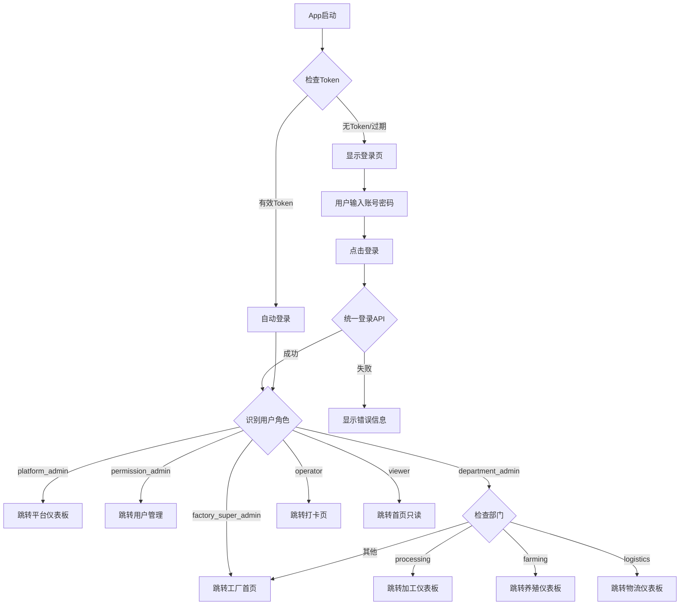

# 白垩纪食品溯源系统 - 页面跳转逻辑设计

**文档版本**: v2.0
**更新日期**: 2025-01-05

---

## 📋 目录

1. [导航架构概述](#导航架构概述)
2. [登录后路由规则](#登录后路由规则)
3. [角色页面访问矩阵](#角色页面访问矩阵)
4. [页面跳转流程](#页面跳转流程)
5. [权限守卫机制](#权限守卫机制)
6. [代码实现](#代码实现)

---

## 导航架构概述

### 1.1 导航器层级结构

```
AppNavigator (Root)
│
├─ AuthStack (未登录)
│  ├─ Login (登录页)
│  ├─ RegisterPhaseOne (注册第一步)
│  └─ RegisterPhaseTwo (注册第二步)
│
└─ MainNavigator (已登录)
   │
   ├─ TabNavigator (底部Tab)
   │  │
   │  ├─ HomeTab
   │  │  └─ HomeScreen (首页)
   │  │
   │  ├─ PlatformTab (平台管理员可见)
   │  │  └─ PlatformStack
   │  │     ├─ PlatformDashboard (平台仪表板)
   │  │     ├─ FactoryList (工厂列表)
   │  │     └─ FactoryDetails (工厂详情)
   │  │
   │  ├─ ProcessingTab (加工部门可见)
   │  │  └─ ProcessingStack
   │  │     ├─ ProcessingDashboard (加工仪表板)
   │  │     ├─ BatchList (批次列表)
   │  │     ├─ BatchDetail (批次详情)
   │  │     ├─ QualityInspection (质检)
   │  │     ├─ CostAnalysis (成本分析)
   │  │     └─ EquipmentMonitoring (设备监控)
   │  │
   │  ├─ TimeClockTab (员工可见)
   │  │  └─ TimeClockStack
   │  │     ├─ TimeClockScreen (打卡页)
   │  │     ├─ ClockHistory (打卡记录)
   │  │     └─ TimeStatistics (工时统计)
   │  │
   │  └─ AdminTab (管理员可见)
   │     └─ AdminStack
   │        ├─ UserManagement (用户管理)
   │        ├─ WhitelistManagement (白名单管理)
   │        └─ PermissionManagement (权限管理)
   │
   └─ Modal Screens (模态页面)
      ├─ UserProfile (个人资料)
      ├─ Settings (设置)
      └─ Notifications (通知)
```

### 1.2 导航器类型

| 导航器 | 类型 | 用途 |
|-------|------|------|
| **AppNavigator** | Stack Navigator | 根导航器，处理认证状态 |
| **TabNavigator** | Bottom Tab Navigator | 主界面底部导航 |
| **ProcessingStack** | Stack Navigator | 加工模块页面栈 |
| **TimeClockStack** | Stack Navigator | 打卡模块页面栈 |
| **AdminStack** | Stack Navigator | 管理模块页面栈 |
| **PlatformStack** | Stack Navigator | 平台管理页面栈 |

---

## 登录后路由规则

### 2.1 智能路由函数

**核心逻辑**: `getPostLoginRoute(user: User): NavigationRoute`

```typescript
function getPostLoginRoute(user: User): NavigationRoute {
  const { userType, role, department } = user;

  // 1. 平台管理员
  if (userType === 'platform') {
    if (role === 'platform_admin') {
      return {
        navigator: 'Main',
        screen: 'PlatformTab',
        params: { screen: 'PlatformDashboard' }
      };
    }
  }

  // 2. 工厂超级管理员
  if (role === 'factory_super_admin') {
    return {
      navigator: 'Main',
      screen: 'HomeTab',  // 显示工厂概览
      params: { screen: 'HomeScreen' }
    };
  }

  // 3. 权限管理员
  if (role === 'permission_admin') {
    return {
      navigator: 'Main',
      screen: 'AdminTab',
      params: { screen: 'UserManagement' }
    };
  }

  // 4. 部门管理员 - 根据部门跳转
  if (role === 'department_admin') {
    switch (department) {
      case 'processing':
        return {
          navigator: 'Main',
          screen: 'ProcessingTab',
          params: { screen: 'ProcessingDashboard' }
        };
      case 'farming':
        return {
          navigator: 'Main',
          screen: 'FarmingTab',
          params: { screen: 'FarmingDashboard' }
        };
      case 'logistics':
        return {
          navigator: 'Main',
          screen: 'LogisticsTab',
          params: { screen: 'LogisticsDashboard' }
        };
      default:
        return {
          navigator: 'Main',
          screen: 'HomeTab',
          params: { screen: 'HomeScreen' }
        };
    }
  }

  // 5. 操作员 - 直接到打卡页
  if (role === 'operator') {
    return {
      navigator: 'Main',
      screen: 'TimeClockTab',
      params: { screen: 'TimeClockScreen' }
    };
  }

  // 6. 查看者 - 首页
  return {
    navigator: 'Main',
    screen: 'HomeTab',
    params: { screen: 'HomeScreen' }
  };
}
```

### 2.2 登录后跳转规则表

| 角色 | userType | 跳转目标 | 说明 |
|-----|----------|----------|------|
| **platform_admin** | platform | PlatformTab → PlatformDashboard | 平台仪表板，显示所有工厂 |
| **factory_super_admin** | factory | HomeTab → HomeScreen | 工厂首页，显示本工厂概览 |
| **permission_admin** | factory | AdminTab → UserManagement | 直接进入用户管理 |
| **department_admin (加工部)** | factory | ProcessingTab → ProcessingDashboard | 加工部门仪表板 |
| **department_admin (养殖部)** | factory | FarmingTab → FarmingDashboard | 养殖部门仪表板 |
| **department_admin (物流部)** | factory | LogisticsTab → LogisticsDashboard | 物流部门仪表板 |
| **operator** | factory | TimeClockTab → TimeClockScreen | 打卡页面 |
| **viewer** | factory | HomeTab → HomeScreen | 首页（只读模式） |

---

## 角色页面访问矩阵

### 3.1 底部 Tab 可见性

| Tab标签 | platform_admin | factory_super_admin | permission_admin | department_admin | operator | viewer |
|---------|----------------|---------------------|------------------|------------------|----------|--------|
| **首页** | ✅ | ✅ | ✅ | ✅ | ✅ | ✅ |
| **平台** | ✅ | ❌ | ❌ | ❌ | ❌ | ❌ |
| **养殖** | ✅ | ✅ | 👁️ | ✅ (养殖部) | ❌ | 👁️ |
| **加工** | ✅ | ✅ | 👁️ | ✅ (加工部) | ✅ | 👁️ |
| **物流** | ✅ | ✅ | 👁️ | ✅ (物流部) | ❌ | 👁️ |
| **溯源** | ✅ | ✅ | 👁️ | ✅ | 👁️ | 👁️ |
| **打卡** | ❌ | ❌ | ❌ | ❌ | ✅ | ❌ |
| **管理** | ✅ | ✅ | ✅ | ❌ | ❌ | ❌ |

**图例**: ✅ 完全访问 | 👁️ 只读访问 | ❌ 不可见

### 3.2 页面级访问控制

#### 平台管理模块 (仅 platform_admin)

| 页面 | 路由 | 权限要求 | 功能 |
|-----|------|---------|------|
| **平台仪表板** | `/platform/dashboard` | platform_admin | 所有工厂概览、KPI统计 |
| **工厂列表** | `/platform/factories` | platform_admin | 所有工厂列表、创建工厂 |
| **工厂详情** | `/platform/factories/:id` | platform_admin | 单个工厂详细信息、配置 |
| **用户总览** | `/platform/users` | platform_admin | 所有工厂用户管理 |
| **平台配置** | `/platform/settings` | platform_admin | 平台级系统配置 |

#### 加工模块

| 页面 | 路由 | 最低权限 | platform_admin | factory_super_admin | department_admin (加工部) | operator |
|-----|------|---------|----------------|---------------------|--------------------------|----------|
| **加工仪表板** | `/processing/dashboard` | operator | ✅ (所有工厂) | ✅ | ✅ (本部门) | 👁️ (个人) |
| **批次列表** | `/processing/batches` | operator | ✅ | ✅ | ✅ | 👁️ |
| **创建批次** | `/processing/batches/new` | department_admin | ✅ | ✅ | ✅ | ❌ |
| **批次详情** | `/processing/batches/:id` | operator | ✅ | ✅ | ✅ | 👁️ |
| **质检记录** | `/processing/quality` | operator | ✅ | ✅ | ✅ | ✅ (提交) |
| **成本分析** | `/processing/cost-analysis` | department_admin | ✅ | ✅ | ✅ | ❌ |
| **设备监控** | `/processing/equipment` | operator | ✅ | ✅ | ✅ | 👁️ |

#### 员工管理模块

| 页面 | 路由 | 最低权限 | 功能 |
|-----|------|---------|------|
| **打卡页面** | `/timeclock/clock` | operator | 上班/下班打卡 |
| **打卡记录** | `/timeclock/history` | operator | 查看个人打卡记录 |
| **工时统计** | `/timeclock/statistics` | operator | 查看个人工时统计 |
| **工作记录** | `/timeclock/work-records` | department_admin | 查看部门工作记录 |

#### 管理模块

| 页面 | 路由 | 最低权限 | 功能 |
|-----|------|---------|------|
| **用户管理** | `/admin/users` | permission_admin | 用户列表、创建/编辑用户 |
| **角色分配** | `/admin/users/:id/roles` | permission_admin | 分配用户角色 |
| **白名单管理** | `/admin/whitelist` | factory_super_admin | 添加/删除白名单 |
| **权限配置** | `/admin/permissions` | factory_super_admin | 权限配置页 |

---

## 页面跳转流程

### 4.1 登录流程



### 4.2 platform_admin 页面跳转流程

```
登录成功
    ↓
跳转到: PlatformTab → PlatformDashboard
    ↓
显示内容:
    - 所有工厂列表卡片
    - 平台级 KPI
    - 工厂激活状态
    - 用户总数统计
    ↓
用户操作选项:
    ├─ 点击"工厂管理" → 工厂列表页
    ├─ 点击"用户管理" → 所有用户列表
    ├─ 点击"数据分析" → 跨工厂报表
    ├─ 点击某个工厂卡片 → 工厂详情页
    └─ 点击"配置" → 平台配置页
```

**PlatformDashboard 关键指标**:
```typescript
interface PlatformDashboardData {
  totalFactories: number;      // 工厂总数
  activeFactories: number;     // 激活工厂数
  totalUsers: number;          // 用户总数
  totalBatches: number;        // 总批次数
  todayProduction: number;     // 今日生产量
  topFactories: Factory[];     // TOP工厂
  recentAlerts: Alert[];       // 最近告警
}
```

### 4.3 factory_super_admin 页面跳转流程

```
登录成功
    ↓
跳转到: HomeTab → HomeScreen
    ↓
显示内容:
    - 本工厂概览
    - 今日生产数据
    - 员工出勤情况
    - 设备运行状态
    - 最近告警
    ↓
底部Tab显示:
    ├─ 首页 (当前)
    ├─ 养殖
    ├─ 加工
    ├─ 物流
    ├─ 溯源
    └─ 管理
    ↓
用户可点击任意Tab切换模块
```

**HomeScreen 数据结构**:
```typescript
interface FactoryHomeData {
  factoryInfo: {
    id: string;
    name: string;
    todayProduction: number;
    todayAttendance: number;
  };
  productionSummary: {
    activeBatches: number;
    completedToday: number;
    qualityRate: number;
  };
  employeeSummary: {
    onDuty: number;
    total: number;
    absentRate: number;
  };
  equipmentSummary: {
    running: number;
    total: number;
    alerts: number;
  };
  recentAlerts: Alert[];
}
```

### 4.4 department_admin (加工部) 页面跳转流程

```
登录成功
    ↓
跳转到: ProcessingTab → ProcessingDashboard
    ↓
显示内容:
    - 本部门今日生产数据
    - 进行中的批次
    - 待处理质检
    - 部门员工出勤
    - 部门设备状态
    ↓
可用操作:
    ├─ 创建新批次
    ├─ 查看批次列表
    ├─ 质检记录
    ├─ 成本分析
    └─ 设备监控
    ↓
权限限制:
    - 只能查看/操作本部门数据
    - 不能访问其他部门数据
    - 可以查看本部门员工工时
```

**ProcessingDashboard 数据结构**:
```typescript
interface ProcessingDashboardData {
  departmentId: string;
  departmentName: string;
  stats: {
    todayProduction: number;
    activeBatches: number;
    pendingQuality: number;
    employeesOnDuty: number;
  };
  recentBatches: ProcessingBatch[];
  equipmentStatus: EquipmentStatus[];
  costTrend: CostTrendData;
}
```

### 4.5 operator 页面跳转流程

```
登录成功
    ↓
跳转到: TimeClockTab → TimeClockScreen
    ↓
显示内容:
    - 大号打卡按钮 (上班/下班)
    - 当前打卡状态
    - 今日工时
    - 本月累计工时
    ↓
可用操作:
    ├─ 上班打卡 → 记录打卡时间+GPS
    ├─ 下班打卡 → 计算工时
    ├─ 查看打卡记录
    └─ 查看工时统计
    ↓
底部Tab显示:
    ├─ 首页
    ├─ 加工 (如果有权限)
    └─ 打卡 (当前)
```

**TimeClockScreen UI 布局**:
```
┌─────────────────────────────────┐
│        【当前状态】               │
│    未打卡 / 已上班 / 已下班        │
└─────────────────────────────────┘
┌─────────────────────────────────┐
│    ┌─────────────────────┐      │
│    │                     │      │
│    │   [上班打卡] 按钮     │      │
│    │   08:30 AM          │      │
│    │                     │      │
│    └─────────────────────┘      │
│                                 │
│    ┌─────────────────────┐      │
│    │   [下班打卡] 按钮     │      │
│    │   已工作: 4小时30分   │      │
│    └─────────────────────┘      │
└─────────────────────────────────┘
┌─────────────────────────────────┐
│   今日工时: 0.0 小时              │
│   本周工时: 24.5 小时             │
│   本月工时: 156.0 小时            │
└─────────────────────────────────┘
```

---

## 权限守卫机制

### 5.1 导航守卫 (NavigationGuard)

**实现位置**: `src/navigation/NavigationGuard.tsx`

**守卫类型**:
1. **认证守卫**: 检查用户是否登录
2. **权限守卫**: 检查用户是否有页面访问权限
3. **Tab守卫**: 动态显示/隐藏Tab

**守卫逻辑**:
```typescript
function canAccessScreen(
  user: User,
  screenName: string
): boolean {
  const userPermissions = getUserPermissions(user);
  const screenPermissions = SCREEN_PERMISSIONS[screenName];

  // 检查用户是否有所需权限
  return screenPermissions.every(
    permission => userPermissions.includes(permission)
  );
}
```

### 5.2 Tab 动态显示逻辑

**TabNavigator 配置**:
```typescript
const TabConfig = {
  Home: {
    icon: 'home',
    label: '首页',
    visible: () => true,  // 所有角色可见
  },
  Platform: {
    icon: 'globe',
    label: '平台',
    visible: (user) => user.userType === 'platform',  // 仅平台管理员
  },
  Processing: {
    icon: 'cube',
    label: '加工',
    visible: (user) => hasModuleAccess(user, 'processing_access'),
  },
  TimeClock: {
    icon: 'time',
    label: '打卡',
    visible: (user) => user.role === 'operator',  // 仅操作员
  },
  Admin: {
    icon: 'settings',
    label: '管理',
    visible: (user) => ROLE_LEVELS[user.role] <= 10,  // 管理员及以上
  },
};
```

### 5.3 页面级权限检查

**PermissionGuard 组件**:
```tsx
<PermissionGuard
  requiredPermissions={['processing_batch_create']}
  fallback={<Text>无权访问此功能</Text>}
>
  <CreateBatchButton />
</PermissionGuard>
```

**实现原理**:
```typescript
const PermissionGuard: FC<Props> = ({
  requiredPermissions,
  children,
  fallback
}) => {
  const { user } = useAuthStore();
  const hasPermission = checkUserPermissions(
    user,
    requiredPermissions
  );

  return hasPermission ? children : (fallback || null);
};
```

---

## 代码实现

### 6.1 导航器配置示例

**AppNavigator.tsx**:
```typescript
export function AppNavigator() {
  const { user, isAuthenticated } = useAuthStore();

  return (
    <NavigationContainer>
      <Stack.Navigator screenOptions={{ headerShown: false }}>
        {!isAuthenticated ? (
          // 未登录：显示认证页面
          <>
            <Stack.Screen name="Login" component={LoginScreen} />
            <Stack.Screen name="RegisterPhaseOne" component={RegisterPhaseOneScreen} />
            <Stack.Screen name="RegisterPhaseTwo" component={RegisterPhaseTwoScreen} />
          </>
        ) : (
          // 已登录：显示主界面
          <Stack.Screen name="Main" component={MainTabNavigator} />
        )}
      </Stack.Navigator>
    </NavigationContainer>
  );
}
```

**MainTabNavigator.tsx**:
```typescript
export function MainTabNavigator() {
  const { user } = useAuthStore();

  return (
    <Tab.Navigator>
      {/* 首页 - 所有角色 */}
      <Tab.Screen name="HomeTab" component={HomeScreen} />

      {/* 平台管理 - 仅 platform_admin */}
      {user.userType === 'platform' && (
        <Tab.Screen name="PlatformTab" component={PlatformStackNavigator} />
      )}

      {/* 加工模块 - 有加工权限的角色 */}
      {hasModuleAccess(user, 'processing_access') && (
        <Tab.Screen name="ProcessingTab" component={ProcessingStackNavigator} />
      )}

      {/* 打卡模块 - 仅 operator */}
      {user.role === 'operator' && (
        <Tab.Screen name="TimeClockTab" component={TimeClockStackNavigator} />
      )}

      {/* 管理模块 - 管理员及以上 */}
      {ROLE_LEVELS[user.role] <= 10 && (
        <Tab.Screen name="AdminTab" component={AdminStackNavigator} />
      )}
    </Tab.Navigator>
  );
}
```

### 6.2 智能路由实现

**navigationHelper.ts**:
```typescript
import { User } from '../types/auth';
import { FACTORY_ROLES } from '../types/auth';

interface NavigationRoute {
  screen: string;
  params?: Record<string, any>;
}

export function getPostLoginRoute(user: User): NavigationRoute {
  const { userType, role, department } = user;

  // 平台管理员
  if (userType === 'platform' && role === 'platform_admin') {
    return {
      screen: 'PlatformTab',
      params: { screen: 'PlatformDashboard' }
    };
  }

  // 工厂超级管理员
  if (role === FACTORY_ROLES.FACTORY_SUPER_ADMIN) {
    return {
      screen: 'HomeTab',
      params: { screen: 'HomeScreen' }
    };
  }

  // 权限管理员
  if (role === FACTORY_ROLES.PERMISSION_ADMIN) {
    return {
      screen: 'AdminTab',
      params: { screen: 'UserManagement' }
    };
  }

  // 部门管理员 - 根据部门跳转
  if (role === FACTORY_ROLES.DEPARTMENT_ADMIN) {
    const departmentRoutes: Record<string, NavigationRoute> = {
      processing: {
        screen: 'ProcessingTab',
        params: { screen: 'ProcessingDashboard' }
      },
      farming: {
        screen: 'FarmingTab',
        params: { screen: 'FarmingDashboard' }
      },
      logistics: {
        screen: 'LogisticsTab',
        params: { screen: 'LogisticsDashboard' }
      },
      quality: {
        screen: 'QualityTab',
        params: { screen: 'QualityDashboard' }
      },
    };

    return departmentRoutes[department || 'processing'] || {
      screen: 'HomeTab',
      params: { screen: 'HomeScreen' }
    };
  }

  // 操作员 - 直接到打卡页
  if (role === FACTORY_ROLES.OPERATOR) {
    return {
      screen: 'TimeClockTab',
      params: { screen: 'TimeClockScreen' }
    };
  }

  // 默认：首页
  return {
    screen: 'HomeTab',
    params: { screen: 'HomeScreen' }
  };
}

// 检查用户是否有模块访问权限
export function hasModuleAccess(
  user: User,
  module: string
): boolean {
  const userPermissions = getUserPermissions(user);
  return userPermissions.modules[module] === true;
}

// 获取用户权限
function getUserPermissions(user: User): UserPermissions {
  return FULL_ROLE_PERMISSIONS[user.role] || DEFAULT_PERMISSIONS;
}
```

### 6.3 登录页面实现

**EnhancedLoginScreen.tsx 关键逻辑**:
```typescript
const handleLogin = async () => {
  try {
    // 1. 调用登录API
    const success = await login({
      username: username.trim(),
      password: password.trim(),
      rememberMe,
      biometricEnabled: rememberMe && biometricStatus.available,
    });

    if (success) {
      // 2. 获取登录后的用户信息
      const { user } = useAuthStore.getState();

      // 3. 计算目标路由
      const route = getPostLoginRoute(user);

      // 4. 执行导航
      navigation.replace('Main', route.params ? route : { screen: route.screen });
    }
  } catch (error) {
    console.error('Login failed:', error);
  }
};
```

---

## 特殊场景处理

### 7.1 首次登录

```
用户首次登录
    ↓
检测 isFirstLogin = true
    ↓
显示引导页 (Onboarding)
    ↓
介绍系统功能
    ↓
设置个人偏好
    ↓
完成引导
    ↓
标记 isFirstLogin = false
    ↓
跳转到角色对应的主页
```

### 7.2 权限不足

```
用户尝试访问某页面
    ↓
NavigationGuard 检查权限
    ↓
权限不足
    ↓
显示提示: "您没有权限访问此页面"
    ↓
选项:
    ├─ 返回上一页
    └─ 返回首页
```

### 7.3 Token 过期

```
用户操作过程中
    ↓
API 请求返回 401
    ↓
尝试使用 refreshToken 刷新
    ├─ 成功 → 重试原请求
    └─ 失败 → 清除Token
                ↓
              显示登录页
                ↓
              提示: "登录已过期，请重新登录"
```

### 7.4 角色变更

```
管理员修改了用户角色
    ↓
用户下次打开App
    ↓
检测角色与本地缓存不一致
    ↓
显示提示: "您的角色已更新"
    ↓
清除本地导航状态
    ↓
根据新角色跳转到对应页面
```

---

## 页面跳转参数传递

### 8.1 跨页面参数传递

**场景1: 查看批次详情**
```typescript
// BatchList 页面
navigation.navigate('BatchDetail', {
  batchId: 'batch_123',
  batchNumber: 'BATCH-2025-001',
  readonly: !hasPermission('processing_batch_edit')
});

// BatchDetail 页面
const { batchId, readonly } = route.params;
```

**场景2: 创建批次后跳转**
```typescript
// CreateBatch 页面
const handleCreateBatch = async (batchData) => {
  const result = await createBatch(batchData);

  // 跳转到详情页
  navigation.replace('BatchDetail', {
    batchId: result.id,
    justCreated: true
  });
};
```

**场景3: 从通知跳转**
```typescript
// 收到推送通知
const notification = {
  type: 'batch_quality_issue',
  batchId: 'batch_456'
};

// 跳转到批次详情
navigation.navigate('Main', {
  screen: 'ProcessingTab',
  params: {
    screen: 'BatchDetail',
    params: { batchId: notification.batchId }
  }
});
```

---

## 页面返回处理

### 9.1 返回逻辑

**普通页面返回**:
```typescript
// 使用系统返回按钮
navigation.goBack();

// 或返回到指定页面
navigation.navigate('ProcessingDashboard');
```

**根页面返回**:
```typescript
// TabNavigator 的根页面按返回键 → 显示退出确认
const handleBackPress = () => {
  Alert.alert(
    '确认退出',
    '确定要退出应用吗？',
    [
      { text: '取消', style: 'cancel' },
      { text: '退出', onPress: () => BackHandler.exitApp() }
    ]
  );
  return true;
};
```

### 9.2 登出返回

```typescript
const handleLogout = async () => {
  // 1. 调用登出API
  await AuthService.logout();

  // 2. 清除本地数据
  await TokenManager.clearTokens();

  // 3. 重置导航栈到登录页
  navigation.reset({
    index: 0,
    routes: [{ name: 'Login' }],
  });
};
```

---

## 深度链接 (Deep Linking)

### 10.1 支持的深度链接

| 链接 | 目标页面 | 示例 |
|-----|---------|------|
| `cretas://batch/:id` | 批次详情 | `cretas://batch/batch_123` |
| `cretas://clock-in` | 打卡页面 | `cretas://clock-in` |
| `cretas://profile` | 个人资料 | `cretas://profile` |
| `cretas://notifications` | 通知列表 | `cretas://notifications` |

### 10.2 深度链接处理

```typescript
const linking = {
  prefixes: ['cretas://', 'https://app.cretas.com'],
  config: {
    screens: {
      Main: {
        screens: {
          ProcessingTab: {
            screens: {
              BatchDetail: 'batch/:id',
            },
          },
          TimeClockTab: {
            screens: {
              TimeClockScreen: 'clock-in',
            },
          },
        },
      },
    },
  },
};
```

---

## 附录

### A. 页面完整清单

| 模块 | 页面名称 | 路由 | 文件路径 |
|-----|---------|------|---------|
| **认证** | 登录页 | `/login` | `screens/auth/EnhancedLoginScreen.tsx` |
| **认证** | 注册第一步 | `/register/phase-one` | `screens/auth/RegisterPhaseOneScreen.tsx` |
| **认证** | 注册第二步 | `/register/phase-two` | `screens/auth/RegisterPhaseTwoScreen.tsx` |
| **首页** | 首页 | `/home` | `screens/main/HomeScreen.tsx` |
| **平台** | 平台仪表板 | `/platform/dashboard` | `screens/platform/PlatformDashboardScreen.tsx` |
| **平台** | 工厂列表 | `/platform/factories` | `screens/platform/FactoryListScreen.tsx` |
| **加工** | 加工仪表板 | `/processing/dashboard` | `screens/processing/ProcessingDashboardScreen.tsx` |
| **加工** | 批次列表 | `/processing/batches` | `screens/processing/BatchListScreen.tsx` |
| **加工** | 批次详情 | `/processing/batches/:id` | `screens/processing/BatchDetailScreen.tsx` |
| **加工** | 创建批次 | `/processing/batches/new` | `screens/processing/CreateBatchScreen.tsx` |
| **加工** | 成本分析 | `/processing/cost-analysis` | `screens/processing/CostAnalysisDashboard.tsx` |
| **加工** | 设备监控 | `/processing/equipment` | `screens/processing/EquipmentMonitoringScreen.tsx` |
| **打卡** | 打卡页 | `/timeclock/clock` | `screens/timeclock/TimeClockScreen.tsx` |
| **打卡** | 打卡记录 | `/timeclock/history` | `screens/timeclock/ClockHistoryScreen.tsx` |
| **打卡** | 工时统计 | `/timeclock/statistics` | `screens/timeclock/TimeStatisticsScreen.tsx` |
| **管理** | 用户管理 | `/admin/users` | `screens/admin/UserManagementScreen.tsx` |
| **管理** | 白名单管理 | `/admin/whitelist` | `screens/management/WhitelistManagementScreen.tsx` |
| **管理** | 权限管理 | `/admin/permissions` | `screens/management/PermissionManagementScreen.tsx` |

### B. 导航状态持久化

**持久化配置**:
```typescript
import AsyncStorage from '@react-native-async-storage/async-storage';

const NAVIGATION_STATE_KEY = 'NAVIGATION_STATE_V1';

export const navigationPersistence = {
  // 保存导航状态
  async save(state: NavigationState) {
    await AsyncStorage.setItem(
      NAVIGATION_STATE_KEY,
      JSON.stringify(state)
    );
  },

  // 恢复导航状态
  async restore(): Promise<NavigationState | undefined> {
    const savedState = await AsyncStorage.getItem(NAVIGATION_STATE_KEY);
    return savedState ? JSON.parse(savedState) : undefined;
  },
};
```

---

**文档结束**

*本文档描述了系统的完整页面跳转逻辑，包括基于角色的动态导航、权限守卫机制等*
