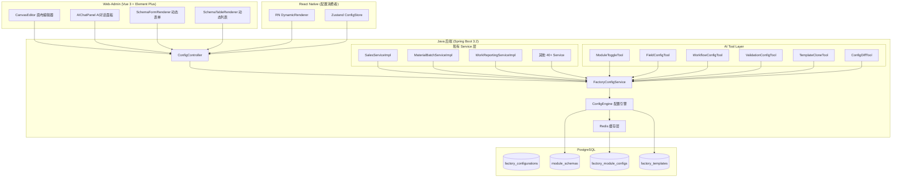

# V2.0 画布配置系统 (Canvas Configuration System) 设计 Spec

**版本**: 1.0.0
**日期**: 2026-04-09
**状态**: Draft
**作者**: Cretas Architecture Team

---

## 1. Executive Summary

画布配置系统是白垩纪食品溯源平台从"单客户定制"向"多工厂 SaaS"演进的核心基础设施。它采用**配置即数据**架构,通过统一的 JSON Schema 驱动所有业务模块的页面布局、字段开关、流程状态机和权限矩阵,使不同食品工厂(熟食加工、烘焙、餐饮、水产)无需改代码即可获得定制化系统。

**为什么要做**: 当前 49 个 Vue 页面和后端 Service 全部硬编码六扇门食品的业务逻辑(字段、状态流转、校验规则),每接一个新客户就要 fork 代码。画布配置系统将这些差异点抽象为可配置项,平台管理员通过 Web 画布编辑器(专家模式)或 AI 对话(自动模式)完成工厂配置,前端动态渲染器消费配置生成页面。

**核心价值**: 新工厂上线时间从"开发 4-8 周"降至"配置 1-3 天";AI Agent 可全自动生成行业模板配置;工厂管理员可自助调整字段和流程,无需技术支持。

---

## 2. Architecture Overview

### 2.1 整体架构



### 2.2 数据流: 配置 CRUD

```
平台管理员 → CanvasEditor (Vue)
  → POST /api/platform/config/{factoryId}/modules/{moduleCode}
  → ConfigController
  → FactoryConfigService.saveModuleConfig()
  → 写入 factory_module_configs (JSONB)
  → 清除 Redis 缓存 config:{factoryId}:{moduleCode}
  → WebSocket 通知前端 CONFIG_UPDATED 事件
  → 前端 Pinia store 重新拉取配置
  → SchemaFormRenderer / SchemaTableRenderer 热加载新配置
```

### 2.3 数据流: 配置消费

```
用户打开销售订单页面
  → SchemaFormRenderer.vue 挂载
  → GET /api/platform/config/{factoryId}/modules/sales_order/effective
  → ConfigEngine 合并: module_schema.default_config ← factory_template.base_config ← factory_module_configs.field_config
  → 返回 EffectiveModuleConfig JSON
  → Renderer 遍历 fields[] → 按 visible/required/type 动态渲染 el-input/el-select/el-date-picker
  → 按 groups[] 分组 → el-tabs
  → 按 workflow.currentState 显示操作按钮
```

### 2.4 AI 数据流

```
用户对话: "新建一个烘焙工厂,只需要进销存+简单报工"
  → IntentExecutorServiceImpl.execute()
  → 意图识别 → FACTORY_CONFIG_GENERATE
  → TemplateCloneTool.execute()
    → 选择 food_processing 模板
    → ConfigDiffTool 生成 diff
  → FieldConfigTool.execute() x N
    → 批量关闭不需要的字段
  → ModuleToggleTool.execute() x N
    → 关闭 reusable_container, operational_quote 等模块
  → 返回配置摘要 + diff 预览
  → [Plan Mode] 用户 Approve → FactoryConfigService.publishConfig()
  → [Autopilot] 自动发布
```

### 2.5 与现有系统的关系

| 现有组件 | 演进方向 |
|---------|---------|
| `LowcodePageConfig` | 保留,负责 **A 层页面布局** (首页/仪表盘组件排列) |
| `LowcodeComponentDefinition` | 保留,作为画布组件库 |
| `FactoryFeatureConfig` | **升级为 `factory_module_configs`** 的一部分,moduleId 映射到 module_code |
| `LowcodeService` | 保留,专注页面布局 CRUD |
| 新增 `FactoryConfigService` | 负责 **B/C/D 层** (模块开关/字段配置/流程配置) |
| 4 个 PageDesign AI Tool | 保留,覆盖 A 层;新增 6 个 Tool 覆盖 B/C/D 层 |

---

## 3. Data Model

### 3.1 核心表设计

#### 3.1.1 `module_schemas` -- 模块 Schema 定义 (平台级)

平台维护的模块元数据,定义每个业务模块所有可配置项的 Schema。不随工厂变化。

```sql
CREATE TABLE module_schemas (
    id              BIGSERIAL PRIMARY KEY,
    module_code     VARCHAR(64) NOT NULL UNIQUE,  -- 如 sales_order, bom, inbound
    module_name     VARCHAR(100) NOT NULL,         -- 中文名: 销售订单
    module_category VARCHAR(32) NOT NULL,           -- SALES, PRODUCTION, MATERIAL, QUALITY, FINANCE, HR, EQUIPMENT, RESTAURANT
    module_version  INTEGER NOT NULL DEFAULT 1,
    field_schema    JSONB NOT NULL,                 -- 所有可配字段的元数据
    workflow_schema JSONB,                          -- 状态机元数据 (无状态机的模块为 null)
    validation_schema JSONB,                        -- 校验规则元数据
    permission_schema JSONB,                        -- 字段级权限模板
    default_config  JSONB NOT NULL,                 -- 默认配置值 (所有字段的默认可见性/必填/选项)
    description     TEXT,
    is_active       BOOLEAN NOT NULL DEFAULT true,
    created_at      TIMESTAMP DEFAULT NOW(),
    updated_at      TIMESTAMP DEFAULT NOW(),
    deleted_at      TIMESTAMP
);

CREATE INDEX idx_ms_category ON module_schemas(module_category);
CREATE INDEX idx_ms_active ON module_schemas(is_active);

-- 触发器: 自动更新 updated_at
CREATE TRIGGER trigger_ms_updated_at
BEFORE UPDATE ON module_schemas
FOR EACH ROW EXECUTE FUNCTION update_updated_at();
```

#### 3.1.2 `factory_configurations` -- 工厂级总配置

```sql
CREATE TABLE factory_configurations (
    id              BIGSERIAL PRIMARY KEY,
    factory_id      VARCHAR(50) NOT NULL,
    template_id     BIGINT REFERENCES factory_templates(id),
    config_version  INTEGER NOT NULL DEFAULT 1,
    status          VARCHAR(16) NOT NULL DEFAULT 'DRAFT',  -- DRAFT / PUBLISHED / ARCHIVED
    published_at    TIMESTAMP,
    published_by    BIGINT,
    rollback_version INTEGER,                              -- 可回滚到的上一个版本号
    change_summary  TEXT,                                   -- 本次发布的变更摘要
    created_by      BIGINT NOT NULL,
    created_at      TIMESTAMP DEFAULT NOW(),
    updated_at      TIMESTAMP DEFAULT NOW(),
    deleted_at      TIMESTAMP
);

CREATE UNIQUE INDEX idx_fc_factory_version ON factory_configurations(factory_id, config_version);
CREATE INDEX idx_fc_factory_status ON factory_configurations(factory_id, status);

CREATE TRIGGER trigger_fc_updated_at
BEFORE UPDATE ON factory_configurations
FOR EACH ROW EXECUTE FUNCTION update_updated_at();
```

#### 3.1.3 `factory_module_configs` -- 工厂 x 模块级配置

```sql
CREATE TABLE factory_module_configs (
    id                  BIGSERIAL PRIMARY KEY,
    factory_id          VARCHAR(50) NOT NULL,
    module_code         VARCHAR(64) NOT NULL,
    config_version      INTEGER NOT NULL DEFAULT 1,       -- 与 factory_configurations.config_version 对齐
    enabled             BOOLEAN NOT NULL DEFAULT true,     -- B层: 模块开关
    field_config        JSONB NOT NULL DEFAULT '{}',      -- C层: 字段可见性/必填/默认值/选项
    workflow_config     JSONB NOT NULL DEFAULT '{}',      -- D层: 状态机步骤/转换条件
    validation_config   JSONB NOT NULL DEFAULT '{}',      -- C/D层: 校验规则开关/参数
    permission_config   JSONB NOT NULL DEFAULT '{}',      -- 角色 x 字段 可见/可编辑
    layout_config       JSONB NOT NULL DEFAULT '{}',      -- A层: 页面布局/分组/tab顺序
    custom_labels       JSONB NOT NULL DEFAULT '{}',      -- 字段中文标签覆盖
    computed_fields     JSONB NOT NULL DEFAULT '{}',      -- 计算字段公式
    created_at          TIMESTAMP DEFAULT NOW(),
    updated_at          TIMESTAMP DEFAULT NOW(),
    deleted_at          TIMESTAMP
);

CREATE UNIQUE INDEX idx_fmc_factory_module_version ON factory_module_configs(factory_id, module_code, config_version);
CREATE INDEX idx_fmc_factory ON factory_module_configs(factory_id);

CREATE TRIGGER trigger_fmc_updated_at
BEFORE UPDATE ON factory_module_configs
FOR EACH ROW EXECUTE FUNCTION update_updated_at();
```

#### 3.1.4 `factory_templates` -- 行业模板

```sql
CREATE TABLE factory_templates (
    id              BIGSERIAL PRIMARY KEY,
    template_code   VARCHAR(64) NOT NULL UNIQUE,   -- food_processing, bakery, restaurant
    template_name   VARCHAR(100) NOT NULL,
    industry_type   VARCHAR(32) NOT NULL,           -- FOOD_PROCESSING, BAKERY, RESTAURANT, AQUATIC
    description     TEXT,
    base_config     JSONB NOT NULL,                 -- 模板默认配置快照 (所有模块的 factory_module_configs)
    preview_image   VARCHAR(255),                   -- 模板预览图 URL
    usage_count     INTEGER DEFAULT 0,              -- 使用次数
    is_active       BOOLEAN NOT NULL DEFAULT true,
    created_by      BIGINT,
    created_at      TIMESTAMP DEFAULT NOW(),
    updated_at      TIMESTAMP DEFAULT NOW(),
    deleted_at      TIMESTAMP
);

CREATE TRIGGER trigger_ft_updated_at
BEFORE UPDATE ON factory_templates
FOR EACH ROW EXECUTE FUNCTION update_updated_at();
```

#### 3.1.5 `config_change_log` -- 配置变更审计日志

```sql
CREATE TABLE config_change_log (
    id              BIGSERIAL PRIMARY KEY,
    factory_id      VARCHAR(50) NOT NULL,
    module_code     VARCHAR(64),                    -- null 表示工厂级操作
    operation       VARCHAR(32) NOT NULL,           -- CREATE, UPDATE, PUBLISH, ROLLBACK, ENABLE, DISABLE
    before_value    JSONB,                          -- 变更前
    after_value     JSONB,                          -- 变更后
    diff_summary    TEXT,                           -- 人类可读的变更摘要
    operator_id     BIGINT NOT NULL,
    operator_type   VARCHAR(16) NOT NULL DEFAULT 'USER',  -- USER / AI_AGENT
    ai_prompt       TEXT,                           -- 如果是 AI 操作,记录原始 prompt
    created_at      TIMESTAMP DEFAULT NOW()
);

CREATE INDEX idx_ccl_factory ON config_change_log(factory_id);
CREATE INDEX idx_ccl_factory_module ON config_change_log(factory_id, module_code);
CREATE INDEX idx_ccl_created ON config_change_log(created_at);
```

### 3.2 JSON Schema 设计

#### 3.2.1 销售订单 (sales_order) module_schema

**field_schema** -- 基于现有 `SalesOrder.java` entity 的 30+ 字段:

```json
{
  "fields": [
    {
      "code": "orderNumber",
      "label": "订单号",
      "type": "string",
      "required": true,
      "configurable": false,
      "autoGenerate": true,
      "listVisible": true,
      "listOrder": 1,
      "listWidth": 150,
      "group": "basic",
      "description": "系统自动生成,格式 SO-{yyyyMMdd}-{seq}"
    },
    {
      "code": "customerId",
      "label": "客户",
      "type": "reference",
      "required": true,
      "configurable": false,
      "referenceConfig": {
        "entity": "customer",
        "displayField": "name",
        "valueField": "id",
        "searchFields": ["name", "contactPerson", "phone"],
        "apiEndpoint": "/api/mobile/{factoryId}/customers"
      },
      "listVisible": true,
      "listOrder": 2,
      "listWidth": 140,
      "listDisplayField": "customerName",
      "group": "basic"
    },
    {
      "code": "orderDate",
      "label": "下单日期",
      "type": "date",
      "required": true,
      "configurable": false,
      "defaultValue": "TODAY",
      "listVisible": true,
      "listOrder": 3,
      "listWidth": 120,
      "group": "basic"
    },
    {
      "code": "requiredDeliveryDate",
      "label": "要求交货日期",
      "type": "date",
      "required": false,
      "configurable": true,
      "defaultVisible": true,
      "listVisible": true,
      "listOrder": 4,
      "listWidth": 120,
      "group": "basic"
    },
    {
      "code": "deliveryAddress",
      "label": "收货地址",
      "type": "text",
      "required": false,
      "configurable": true,
      "defaultVisible": true,
      "group": "basic"
    },
    {
      "code": "salesperson",
      "label": "业务员",
      "type": "reference",
      "required": false,
      "configurable": true,
      "defaultVisible": true,
      "referenceConfig": {
        "entity": "employee",
        "displayField": "realName",
        "valueField": "realName",
        "filter": { "department": "销售部" },
        "apiEndpoint": "/api/mobile/{factoryId}/employees"
      },
      "group": "basic"
    },
    {
      "code": "remark",
      "label": "备注",
      "type": "textarea",
      "required": false,
      "configurable": true,
      "defaultVisible": true,
      "group": "basic"
    },
    {
      "code": "items",
      "label": "订单明细",
      "type": "line_items",
      "required": true,
      "configurable": false,
      "itemSchema": {
        "fields": [
          {
            "code": "productTypeId",
            "label": "产品",
            "type": "reference",
            "required": true,
            "referenceConfig": {
              "entity": "productType",
              "displayField": "name",
              "valueField": "id",
              "apiEndpoint": "/api/mobile/{factoryId}/finished-goods/product-types"
            }
          },
          {
            "code": "specification",
            "label": "规格",
            "type": "string",
            "required": false,
            "configurable": true,
            "defaultVisible": true
          },
          {
            "code": "quantity",
            "label": "数量",
            "type": "decimal",
            "required": true,
            "min": 0.01
          },
          {
            "code": "unit",
            "label": "单位",
            "type": "select",
            "required": true,
            "options": [
              { "value": "kg", "label": "公斤" },
              { "value": "piece", "label": "个" },
              { "value": "box", "label": "箱" },
              { "value": "bag", "label": "袋" },
              { "value": "bottle", "label": "瓶" }
            ],
            "defaultValue": "kg",
            "configurable": true
          },
          {
            "code": "unitPrice",
            "label": "单价",
            "type": "decimal",
            "required": true,
            "min": 0,
            "precision": 4
          },
          {
            "code": "lineAmount",
            "label": "行金额",
            "type": "decimal",
            "computed": "quantity * unitPrice",
            "readonly": true
          },
          {
            "code": "taxRate",
            "label": "税率(%)",
            "type": "decimal",
            "required": false,
            "configurable": true,
            "defaultVisible": true,
            "defaultValue": 0
          }
        ]
      },
      "group": "items"
    },
    {
      "code": "totalAmount",
      "label": "订单总金额",
      "type": "decimal",
      "required": false,
      "configurable": false,
      "computed": "SUM(items[].lineAmount)",
      "readonly": true,
      "listVisible": true,
      "listOrder": 5,
      "listWidth": 120,
      "formatter": "currency",
      "group": "amounts"
    },
    {
      "code": "discountAmount",
      "label": "折扣金额",
      "type": "decimal",
      "required": false,
      "configurable": true,
      "defaultVisible": false,
      "min": 0,
      "group": "amounts"
    },
    {
      "code": "taxAmount",
      "label": "税额",
      "type": "decimal",
      "required": false,
      "configurable": true,
      "defaultVisible": false,
      "computed": "SUM(items[].lineAmount * items[].taxRate / 100)",
      "readonly": true,
      "group": "amounts"
    },
    {
      "code": "shippingIncluded",
      "label": "是否含运费",
      "type": "boolean",
      "required": false,
      "configurable": true,
      "defaultVisible": true,
      "defaultValue": false,
      "group": "费用"
    },
    {
      "code": "shippingFee",
      "label": "运费",
      "type": "decimal",
      "required": false,
      "configurable": true,
      "defaultVisible": true,
      "min": 0,
      "dependsOn": { "field": "shippingIncluded", "value": true },
      "group": "费用"
    },
    {
      "code": "extraFees",
      "label": "其他费用",
      "type": "json_array",
      "required": false,
      "configurable": true,
      "defaultVisible": true,
      "itemSchema": {
        "fields": [
          { "code": "name", "type": "string", "label": "费用名", "required": true },
          { "code": "amount", "type": "decimal", "label": "金额", "required": true, "min": 0 },
          { "code": "remark", "type": "string", "label": "备注", "required": false }
        ]
      },
      "group": "费用"
    },
    {
      "code": "boxQuantity",
      "label": "下单箱数",
      "type": "decimal",
      "required": false,
      "configurable": true,
      "defaultVisible": true,
      "min": 0,
      "group": "basic"
    },
    {
      "code": "quoteId",
      "label": "关联报价单",
      "type": "reference",
      "required": false,
      "configurable": true,
      "defaultVisible": false,
      "referenceConfig": {
        "entity": "operationalQuote",
        "displayField": "quoteNumber",
        "valueField": "id",
        "apiEndpoint": "/api/mobile/{factoryId}/quotes"
      },
      "group": "business"
    },
    {
      "code": "estimatedCost",
      "label": "预估BOM成本",
      "type": "decimal",
      "required": false,
      "configurable": true,
      "defaultVisible": false,
      "readonly": true,
      "computed": "SERVER_SIDE",
      "group": "business"
    },
    {
      "code": "estimatedProfit",
      "label": "预估利润",
      "type": "decimal",
      "required": false,
      "configurable": true,
      "defaultVisible": false,
      "readonly": true,
      "computed": "totalAmount - estimatedCost",
      "group": "business"
    },
    {
      "code": "invoiceStatus",
      "label": "开票状态",
      "type": "select",
      "required": false,
      "configurable": true,
      "defaultVisible": false,
      "readonly": true,
      "options": [
        { "value": "NOT_INVOICED", "label": "未开票" },
        { "value": "PARTIAL_INVOICED", "label": "部分开票" },
        { "value": "FULLY_INVOICED", "label": "全部开票" }
      ],
      "listVisible": false,
      "group": "finance"
    },
    {
      "code": "invoicedAmount",
      "label": "已开票金额",
      "type": "decimal",
      "required": false,
      "configurable": true,
      "defaultVisible": false,
      "readonly": true,
      "formatter": "currency",
      "group": "finance"
    },
    {
      "code": "paidAmount",
      "label": "已收款金额",
      "type": "decimal",
      "required": false,
      "configurable": true,
      "defaultVisible": false,
      "readonly": true,
      "formatter": "currency",
      "group": "finance"
    },
    {
      "code": "settlementFlag",
      "label": "是否结清",
      "type": "boolean",
      "required": false,
      "configurable": true,
      "defaultVisible": false,
      "readonly": true,
      "group": "finance"
    }
  ],
  "groups": [
    { "code": "basic", "label": "基本信息", "order": 1, "configurable": false },
    { "code": "items", "label": "订单明细", "order": 2, "configurable": false },
    { "code": "amounts", "label": "金额汇总", "order": 3, "configurable": false },
    { "code": "费用", "label": "运费与其他费用", "order": 4, "configurable": true, "defaultVisible": true },
    { "code": "business", "label": "业务扩展", "order": 5, "configurable": true, "defaultVisible": false },
    { "code": "finance", "label": "财务信息", "order": 6, "configurable": true, "defaultVisible": false }
  ]
}
```

**workflow_schema** -- 基于现有 `SalesOrderStatus.java` 枚举:

```json
{
  "states": [
    {
      "code": "DRAFT",
      "label": "草稿",
      "configurable": false,
      "color": "#909399",
      "isInitial": true,
      "isFinal": false,
      "description": "销售订单草稿"
    },
    {
      "code": "CONFIRMED",
      "label": "已确认",
      "configurable": false,
      "color": "#409EFF",
      "isInitial": false,
      "isFinal": false,
      "description": "客户已确认订单"
    },
    {
      "code": "PENDING_FINANCE_REVIEW",
      "label": "待财务审核",
      "configurable": true,
      "color": "#E6A23C",
      "isInitial": false,
      "isFinal": false,
      "description": "已提交财务审核,等待审批。可配置跳过。"
    },
    {
      "code": "FINANCE_APPROVED",
      "label": "财务已批准",
      "configurable": true,
      "color": "#67C23A",
      "isInitial": false,
      "isFinal": false,
      "description": "财务审核通过,可触发生产。跟随 PENDING_FINANCE_REVIEW 开关。"
    },
    {
      "code": "FINANCE_REJECTED",
      "label": "财务已驳回",
      "configurable": true,
      "color": "#F56C6C",
      "isInitial": false,
      "isFinal": false,
      "description": "财务审核不通过。跟随 PENDING_FINANCE_REVIEW 开关。"
    },
    {
      "code": "PROCESSING",
      "label": "处理中",
      "configurable": false,
      "color": "#E6A23C",
      "isInitial": false,
      "isFinal": false,
      "description": "拣货/备货中"
    },
    {
      "code": "PARTIAL_DELIVERED",
      "label": "部分发货",
      "configurable": true,
      "color": "#E6A23C",
      "isInitial": false,
      "isFinal": false,
      "description": "部分商品已发货。小工厂可关闭,直接到已完成。"
    },
    {
      "code": "COMPLETED",
      "label": "已完成",
      "configurable": false,
      "color": "#67C23A",
      "isInitial": false,
      "isFinal": true,
      "description": "全部发货完成"
    },
    {
      "code": "CANCELLED",
      "label": "已取消",
      "configurable": false,
      "color": "#F56C6C",
      "isInitial": false,
      "isFinal": true,
      "description": "订单已取消"
    }
  ],
  "transitions": [
    {
      "from": "DRAFT",
      "to": "CONFIRMED",
      "action": "confirm",
      "label": "确认订单",
      "configurable": false,
      "requiredFields": ["customerId", "items"],
      "buttonType": "primary"
    },
    {
      "from": "CONFIRMED",
      "to": "PENDING_FINANCE_REVIEW",
      "action": "submitForReview",
      "label": "提交财务审核",
      "configurable": true,
      "condition": "config.workflow.hasFinanceReview",
      "requiredRole": "sales",
      "buttonType": "warning"
    },
    {
      "from": "PENDING_FINANCE_REVIEW",
      "to": "FINANCE_APPROVED",
      "action": "approveFinance",
      "label": "审核通过",
      "configurable": true,
      "requiredRole": "finance",
      "buttonType": "success"
    },
    {
      "from": "PENDING_FINANCE_REVIEW",
      "to": "FINANCE_REJECTED",
      "action": "rejectFinance",
      "label": "审核驳回",
      "configurable": true,
      "requiredRole": "finance",
      "buttonType": "danger"
    },
    {
      "from": "FINANCE_REJECTED",
      "to": "DRAFT",
      "action": "revise",
      "label": "退回修改",
      "configurable": true,
      "buttonType": "warning"
    },
    {
      "from": "FINANCE_APPROVED",
      "to": "PROCESSING",
      "action": "startProcessing",
      "label": "开始处理",
      "configurable": false,
      "buttonType": "primary"
    },
    {
      "from": "CONFIRMED",
      "to": "PROCESSING",
      "action": "startProcessingDirect",
      "label": "开始处理",
      "configurable": true,
      "condition": "!config.workflow.hasFinanceReview",
      "buttonType": "primary",
      "description": "无财务审核时,确认后直接处理"
    },
    {
      "from": "PROCESSING",
      "to": "PARTIAL_DELIVERED",
      "action": "partialDeliver",
      "label": "部分发货",
      "configurable": true,
      "condition": "config.workflow.allowPartialDelivery",
      "buttonType": "warning"
    },
    {
      "from": "PROCESSING",
      "to": "COMPLETED",
      "action": "complete",
      "label": "完成发货",
      "configurable": false,
      "buttonType": "success"
    },
    {
      "from": "PARTIAL_DELIVERED",
      "to": "COMPLETED",
      "action": "completeRemaining",
      "label": "完成剩余发货",
      "configurable": true,
      "buttonType": "success"
    },
    {
      "from": "DRAFT",
      "to": "CANCELLED",
      "action": "cancel",
      "label": "取消订单",
      "configurable": false,
      "buttonType": "danger",
      "confirmMessage": "确定要取消此订单吗?"
    },
    {
      "from": "CONFIRMED",
      "to": "CANCELLED",
      "action": "cancel",
      "label": "取消订单",
      "configurable": false,
      "buttonType": "danger",
      "confirmMessage": "订单已确认,确定要取消吗?"
    }
  ],
  "workflowOptions": {
    "hasFinanceReview": {
      "label": "启用财务审核",
      "type": "boolean",
      "defaultValue": true,
      "description": "关闭后订单确认直接进入处理,跳过财务审核环节"
    },
    "allowPartialDelivery": {
      "label": "允许部分发货",
      "type": "boolean",
      "defaultValue": true,
      "description": "关闭后只能全部发货,不支持分批"
    }
  }
}
```

**validation_schema**:

```json
{
  "rules": [
    {
      "code": "min_order_amount",
      "label": "最低订单金额",
      "configurable": true,
      "defaultEnabled": false,
      "params": {
        "minAmount": { "type": "decimal", "label": "最低金额", "defaultValue": 0 }
      },
      "errorMessage": "订单金额不能低于 {minAmount} 元"
    },
    {
      "code": "max_line_items",
      "label": "最大明细行数",
      "configurable": true,
      "defaultEnabled": false,
      "params": {
        "maxItems": { "type": "integer", "label": "最大行数", "defaultValue": 50 }
      },
      "errorMessage": "订单明细不能超过 {maxItems} 行"
    },
    {
      "code": "delivery_date_range",
      "label": "交货日期范围限制",
      "configurable": true,
      "defaultEnabled": false,
      "params": {
        "minDaysFromNow": { "type": "integer", "label": "最少提前天数", "defaultValue": 1 },
        "maxDaysFromNow": { "type": "integer", "label": "最多提前天数", "defaultValue": 90 }
      },
      "errorMessage": "交货日期需在 {minDaysFromNow} 到 {maxDaysFromNow} 天内"
    },
    {
      "code": "duplicate_customer_order_check",
      "label": "同客户重复订单检查",
      "configurable": true,
      "defaultEnabled": false,
      "params": {
        "withinHours": { "type": "integer", "label": "检查时间窗口(小时)", "defaultValue": 24 }
      },
      "errorMessage": "该客户在 {withinHours} 小时内已有相似订单,请确认"
    }
  ]
}
```

**permission_schema**:

```json
{
  "roles": ["factory_super_admin", "sales_manager", "sales_staff", "finance", "warehouse", "viewer"],
  "fieldPermissions": [
    {
      "fieldCode": "totalAmount",
      "permissions": {
        "factory_super_admin": "edit",
        "sales_manager": "edit",
        "sales_staff": "view",
        "finance": "view",
        "warehouse": "hidden",
        "viewer": "view"
      }
    },
    {
      "fieldCode": "estimatedCost",
      "permissions": {
        "factory_super_admin": "view",
        "sales_manager": "view",
        "sales_staff": "hidden",
        "finance": "view",
        "warehouse": "hidden",
        "viewer": "hidden"
      }
    },
    {
      "fieldCode": "estimatedProfit",
      "permissions": {
        "factory_super_admin": "view",
        "sales_manager": "view",
        "sales_staff": "hidden",
        "finance": "view",
        "warehouse": "hidden",
        "viewer": "hidden"
      }
    }
  ],
  "actionPermissions": [
    {
      "actionCode": "confirm",
      "allowedRoles": ["factory_super_admin", "sales_manager", "sales_staff"]
    },
    {
      "actionCode": "approveFinance",
      "allowedRoles": ["factory_super_admin", "finance"]
    },
    {
      "actionCode": "cancel",
      "allowedRoles": ["factory_super_admin", "sales_manager"]
    }
  ]
}
```

#### 3.2.2 BOM (bom) module_schema

**field_schema** -- 基于现有 `BomItem.java` entity:

```json
{
  "fields": [
    {
      "code": "productTypeId",
      "label": "产品(成品)",
      "type": "reference",
      "required": true,
      "configurable": false,
      "referenceConfig": {
        "entity": "productType",
        "displayField": "name",
        "valueField": "id",
        "apiEndpoint": "/api/mobile/{factoryId}/finished-goods/product-types"
      },
      "listVisible": true,
      "listOrder": 1,
      "listWidth": 160,
      "listDisplayField": "productName",
      "group": "basic"
    },
    {
      "code": "materialTypeId",
      "label": "原辅料",
      "type": "reference",
      "required": true,
      "configurable": false,
      "referenceConfig": {
        "entity": "materialType",
        "displayField": "name",
        "valueField": "id",
        "apiEndpoint": "/api/mobile/{factoryId}/material-types"
      },
      "listVisible": true,
      "listOrder": 2,
      "listWidth": 160,
      "listDisplayField": "materialName",
      "group": "basic"
    },
    {
      "code": "materialCategory",
      "label": "物料分类",
      "type": "select",
      "required": true,
      "configurable": true,
      "defaultVisible": true,
      "options": [
        { "value": "RAW", "label": "原料" },
        { "value": "AUXILIARY", "label": "辅料" },
        { "value": "PACKAGING", "label": "包材" }
      ],
      "defaultValue": "RAW",
      "listVisible": true,
      "listOrder": 3,
      "listWidth": 100,
      "group": "basic"
    },
    {
      "code": "standardQuantity",
      "label": "标准用量",
      "type": "decimal",
      "required": true,
      "configurable": false,
      "min": 0.0001,
      "precision": 4,
      "listVisible": true,
      "listOrder": 4,
      "listWidth": 120,
      "group": "dosage"
    },
    {
      "code": "unit",
      "label": "计量单位",
      "type": "select",
      "required": true,
      "configurable": true,
      "options": [
        { "value": "kg", "label": "公斤" },
        { "value": "g", "label": "克" },
        { "value": "L", "label": "升" },
        { "value": "mL", "label": "毫升" },
        { "value": "piece", "label": "个" },
        { "value": "pack", "label": "包" },
        { "value": "roll", "label": "卷" }
      ],
      "defaultValue": "kg",
      "listVisible": true,
      "listOrder": 5,
      "listWidth": 80,
      "group": "dosage"
    },
    {
      "code": "yieldRate",
      "label": "出成率(%)",
      "type": "decimal",
      "required": false,
      "configurable": true,
      "defaultVisible": true,
      "min": 0.01,
      "max": 100,
      "precision": 2,
      "defaultValue": 100.00,
      "description": "百分比,如 90 表示 90% 出成率",
      "listVisible": true,
      "listOrder": 6,
      "listWidth": 100,
      "group": "dosage"
    },
    {
      "code": "unitPrice",
      "label": "单价",
      "type": "decimal",
      "required": false,
      "configurable": true,
      "defaultVisible": true,
      "min": 0,
      "precision": 4,
      "listVisible": true,
      "listOrder": 7,
      "listWidth": 100,
      "group": "cost"
    },
    {
      "code": "taxRate",
      "label": "税率(%)",
      "type": "decimal",
      "required": false,
      "configurable": true,
      "defaultVisible": false,
      "min": 0,
      "max": 100,
      "precision": 2,
      "defaultValue": 0,
      "group": "cost"
    },
    {
      "code": "sortOrder",
      "label": "排序",
      "type": "integer",
      "required": false,
      "configurable": true,
      "defaultVisible": false,
      "defaultValue": 0,
      "group": "basic"
    },
    {
      "code": "remark",
      "label": "备注",
      "type": "textarea",
      "required": false,
      "configurable": true,
      "defaultVisible": true,
      "maxLength": 500,
      "group": "basic"
    }
  ],
  "groups": [
    { "code": "basic", "label": "基本信息", "order": 1, "configurable": false },
    { "code": "dosage", "label": "用量配方", "order": 2, "configurable": false },
    { "code": "cost", "label": "成本信息", "order": 3, "configurable": true, "defaultVisible": true }
  ],
  "categories": {
    "configurable": true,
    "description": "BOM 物料分类,工厂可选择启用哪些分类",
    "options": [
      {
        "code": "RAW",
        "label": "原料",
        "required": true,
        "defaultEnabled": true,
        "description": "主要原材料,如肉类/面粉/蔬菜"
      },
      {
        "code": "AUXILIARY",
        "label": "辅料",
        "required": false,
        "defaultEnabled": true,
        "description": "调味料/添加剂等辅助材料"
      },
      {
        "code": "PACKAGING",
        "label": "包材",
        "required": false,
        "defaultEnabled": true,
        "description": "包装袋/标签/纸箱等"
      },
      {
        "code": "DOUGH",
        "label": "面团/半成品",
        "required": false,
        "defaultEnabled": false,
        "description": "烘焙行业特有: 预制面团、酱料半成品"
      },
      {
        "code": "FILLING",
        "label": "馅料",
        "required": false,
        "defaultEnabled": false,
        "description": "预制馅料 (烘焙/饺子/包子行业)"
      }
    ]
  }
}
```

**BOM workflow_schema** (BOM 本身无状态机,但有版本管理):

```json
{
  "states": [
    {
      "code": "ACTIVE",
      "label": "生效中",
      "configurable": false,
      "color": "#67C23A",
      "isInitial": true,
      "isFinal": false
    },
    {
      "code": "SUPERSEDED",
      "label": "已被替代",
      "configurable": false,
      "color": "#909399",
      "isInitial": false,
      "isFinal": true
    }
  ],
  "transitions": [
    {
      "from": "ACTIVE",
      "to": "SUPERSEDED",
      "action": "supersede",
      "label": "替换版本",
      "configurable": false,
      "buttonType": "warning",
      "description": "当新版BOM创建时,旧版自动变为已替代"
    }
  ],
  "workflowOptions": {
    "requireApprovalForChange": {
      "label": "BOM变更需审批",
      "type": "boolean",
      "defaultValue": false,
      "description": "开启后修改BOM配方需要主管审批"
    },
    "trackVersionHistory": {
      "label": "保留版本历史",
      "type": "boolean",
      "defaultValue": true,
      "description": "记录每次BOM修改的历史版本"
    }
  }
}
```

**BOM validation_schema**:

```json
{
  "rules": [
    {
      "code": "total_yield_rate_check",
      "label": "总出成率合理性检查",
      "configurable": true,
      "defaultEnabled": true,
      "params": {
        "minTotalYield": { "type": "decimal", "label": "最低总出成率(%)", "defaultValue": 50 },
        "maxTotalYield": { "type": "decimal", "label": "最高总出成率(%)", "defaultValue": 150 }
      },
      "errorMessage": "BOM总出成率 {actual}% 不在合理范围 ({minTotalYield}%-{maxTotalYield}%)"
    },
    {
      "code": "require_raw_material",
      "label": "至少一项原料",
      "configurable": false,
      "defaultEnabled": true,
      "params": {},
      "errorMessage": "BOM必须包含至少一项原料(RAW)类物料"
    },
    {
      "code": "duplicate_material_check",
      "label": "重复物料检查",
      "configurable": true,
      "defaultEnabled": true,
      "params": {},
      "errorMessage": "同一产品BOM中不能包含重复的物料"
    }
  ]
}
```

---

## 4. Config Engine (后端核心)

### 4.1 FactoryConfigService 接口

```java
public interface FactoryConfigService {

    // ========== 有效配置读取 (合并: schema.default ← template ← factory override) ==========

    /**
     * 获取合并后的有效配置
     * 合并优先级: factory_module_configs > factory_template.base_config > module_schema.default_config
     */
    EffectiveModuleConfig getEffectiveConfig(String factoryId, String moduleCode);

    /**
     * 获取合并后的有效配置,含角色权限过滤
     */
    EffectiveModuleConfig getEffectiveConfig(String factoryId, String moduleCode, String roleCode);

    // ========== 字段级查询 (C 层) ==========

    boolean isFieldVisible(String factoryId, String moduleCode, String fieldCode);

    boolean isFieldVisible(String factoryId, String moduleCode, String fieldCode, String roleCode);

    boolean isFieldRequired(String factoryId, String moduleCode, String fieldCode);

    Object getFieldDefaultValue(String factoryId, String moduleCode, String fieldCode);

    List<OptionItem> getFieldOptions(String factoryId, String moduleCode, String fieldCode);

    String getFieldLabel(String factoryId, String moduleCode, String fieldCode);

    // ========== 流程级查询 (D 层) ==========

    List<WorkflowStateDTO> getWorkflowStates(String factoryId, String moduleCode);

    List<WorkflowTransitionDTO> getAvailableTransitions(String factoryId, String moduleCode, String currentState);

    List<WorkflowTransitionDTO> getAvailableTransitions(String factoryId, String moduleCode, String currentState, String roleCode);

    boolean isTransitionAllowed(String factoryId, String moduleCode, String fromState, String toState);

    boolean isTransitionAllowed(String factoryId, String moduleCode, String fromState, String toState, String roleCode);

    // ========== 模块级查询 (B 层) ==========

    boolean isModuleEnabled(String factoryId, String moduleCode);

    List<ModuleSummaryDTO> getEnabledModules(String factoryId);

    // ========== 校验规则查询 ==========

    List<ValidationRuleDTO> getActiveValidationRules(String factoryId, String moduleCode);

    ValidationResult validateField(String factoryId, String moduleCode, String fieldCode, Object value);

    ValidationResult validateEntity(String factoryId, String moduleCode, Map<String, Object> entityData);

    // ========== 配置 CRUD (写操作) ==========

    void saveModuleConfig(String factoryId, String moduleCode, ModuleConfigDTO config);

    void toggleModule(String factoryId, String moduleCode, boolean enabled);

    void updateFieldConfig(String factoryId, String moduleCode, String fieldCode, FieldConfigDTO fieldConfig);

    void updateWorkflowConfig(String factoryId, String moduleCode, WorkflowConfigDTO workflowConfig);

    // ========== 发布与版本管理 ==========

    void publishConfig(String factoryId);

    void rollbackConfig(String factoryId, int targetVersion);

    List<ConfigVersionDTO> getConfigHistory(String factoryId);

    ConfigDiffDTO diffConfigs(String factoryId, int versionA, int versionB);

    // ========== 模板操作 ==========

    void applyTemplate(String factoryId, String templateCode);

    void saveAsTemplate(String factoryId, String templateCode, String templateName);
}
```

### 4.2 EffectiveModuleConfig DTO

```java
/**
 * 合并后的有效模块配置,前端直接消费
 */
public record EffectiveModuleConfig(
    String moduleCode,
    String moduleName,
    boolean enabled,
    List<EffectiveField> fields,       // 合并后的字段列表 (已按 visible 过滤, 按 group+order 排序)
    List<FieldGroup> groups,            // 字段分组
    WorkflowConfig workflow,            // 合并后的状态机 (已按 enabled 过滤)
    List<ValidationRuleDTO> validationRules,  // 激活的校验规则
    Map<String, String> customLabels    // 标签覆盖
) {}

public record EffectiveField(
    String code,
    String label,            // customLabels 覆盖后的标签
    String type,
    boolean required,
    boolean visible,
    boolean readonly,
    Object defaultValue,
    List<OptionItem> options, // select 类型的选项
    String group,
    int order,
    Map<String, Object> extra // dependsOn, referenceConfig, computed, itemSchema 等
) {}
```

### 4.3 配置合并算法

```
function mergeConfig(factoryId, moduleCode):
    schema = moduleSchemaRepository.findByModuleCode(moduleCode)
    
    // Layer 1: Schema 默认值
    effective = deepClone(schema.defaultConfig)
    
    // Layer 2: 模板覆盖 (如果工厂使用了模板)
    factoryConfig = factoryConfigurationRepository.findPublished(factoryId)
    if factoryConfig.templateId != null:
        template = factoryTemplateRepository.findById(factoryConfig.templateId)
        moduleTemplateConfig = template.baseConfig[moduleCode]
        if moduleTemplateConfig != null:
            effective = deepMerge(effective, moduleTemplateConfig)
    
    // Layer 3: 工厂自定义覆盖 (最高优先级)
    factoryModuleConfig = factoryModuleConfigRepository.findByFactoryAndModule(
        factoryId, moduleCode, factoryConfig.configVersion)
    if factoryModuleConfig != null:
        effective = deepMerge(effective, factoryModuleConfig)
    
    // Layer 4: 角色权限过滤 (运行时, 不持久化)
    if roleCode != null:
        effective.fields = applyPermissionFilter(effective.fields, schema.permissionSchema, roleCode)
        effective.workflow.transitions = applyTransitionPermission(effective.workflow.transitions, roleCode)
    
    return effective

function deepMerge(base, override):
    // 字段级合并: override 中存在的 key 覆盖 base, base 中独有的 key 保留
    // 特殊处理: 
    //   - fields[].visible: override 显式设为 false 时覆盖
    //   - fields[].options: override 完全替换 (不追加)
    //   - workflow.states[].enabled: override 覆盖
    //   - 新增字段: 忽略 (只有 schema 中定义的字段才有效)
```

### 4.4 现有 Service 适配模式

每个现有 Service 在关键决策点注入 `FactoryConfigService` 读取配置。以 `SalesServiceImpl` 为例:

**字段校验适配**:
```java
// 当前硬编码:
if (dto.getCustomerId() == null) throw new BusinessException("客户不能为空");

// 适配后:
for (EffectiveField field : configService.getEffectiveConfig(factoryId, "sales_order").fields()) {
    if (field.required() && getValue(dto, field.code()) == null) {
        throw new BusinessException(field.label() + "不能为空");
    }
}
```

**状态流转适配**:
```java
// 当前硬编码:
if (order.getStatus() == CONFIRMED) {
    order.setStatus(PENDING_FINANCE_REVIEW);
}

// 适配后:
String nextState = resolveNextState(factoryId, "sales_order", currentState, action);
if (!configService.isTransitionAllowed(factoryId, "sales_order", currentState, nextState)) {
    throw new BusinessException("当前状态不允许执行此操作");
}
order.setStatus(SalesOrderStatus.valueOf(nextState));
```

**模块开关适配**:
```java
// 在 Controller 层统一拦截:
@Aspect
@Component
public class ModuleEnabledAspect {
    @Autowired
    private FactoryConfigService configService;

    @Before("@annotation(RequireModule)")
    public void checkModuleEnabled(JoinPoint joinPoint) {
        RequireModule annotation = /* 获取注解 */;
        String factoryId = /* 从参数提取 */;
        if (!configService.isModuleEnabled(factoryId, annotation.value())) {
            throw new BusinessException("模块 " + annotation.value() + " 未启用");
        }
    }
}

// Service 标注:
@RequireModule("sales_order")
public SalesOrder createOrder(String factoryId, SalesOrderDTO dto) { ... }
```

### 4.5 缓存策略

```
Redis 缓存设计:

Key 格式:
  config:effective:{factoryId}:{moduleCode}           → EffectiveModuleConfig JSON (无角色过滤版本)
  config:effective:{factoryId}:{moduleCode}:{roleCode} → EffectiveModuleConfig JSON (角色过滤版本)
  config:schema:{moduleCode}                           → ModuleSchema JSON
  config:version:{factoryId}                           → 当前生效版本号

TTL: 
  effective config → 1 小时 (自动刷新)
  schema → 24 小时 (极少变动)
  version → 无过期 (手动失效)

失效策略:
  1. saveModuleConfig() → 删除 config:effective:{factoryId}:{moduleCode}:* (glob 删除)
  2. publishConfig() → 删除 config:effective:{factoryId}:* + 更新 config:version:{factoryId}
  3. 前端通过 WebSocket 收到 CONFIG_UPDATED → Pinia store 重新 fetch

本地缓存 (Java 进程内):
  Caffeine Cache, 容量 500, TTL 5 分钟
  用于高频读取场景 (isFieldVisible 在一次请求中可能调用 20+ 次)
```

### 4.6 API 端点设计

```
# 配置消费 API (前端渲染器用)
GET    /api/platform/config/{factoryId}/modules/{moduleCode}/effective
GET    /api/platform/config/{factoryId}/modules/{moduleCode}/effective?roleCode=sales
GET    /api/platform/config/{factoryId}/modules

# 配置管理 API (画布编辑器用)
GET    /api/platform/config/{factoryId}/modules/{moduleCode}
PUT    /api/platform/config/{factoryId}/modules/{moduleCode}
PATCH  /api/platform/config/{factoryId}/modules/{moduleCode}/fields/{fieldCode}
PATCH  /api/platform/config/{factoryId}/modules/{moduleCode}/workflow
PATCH  /api/platform/config/{factoryId}/modules/{moduleCode}/toggle

# 发布与版本
POST   /api/platform/config/{factoryId}/publish
POST   /api/platform/config/{factoryId}/rollback/{version}
GET    /api/platform/config/{factoryId}/history
GET    /api/platform/config/{factoryId}/diff?versionA=3&versionB=4

# 模板
GET    /api/platform/templates
POST   /api/platform/templates/{templateCode}/apply/{factoryId}
POST   /api/platform/config/{factoryId}/save-as-template

# Schema (平台管理)
GET    /api/platform/schemas
GET    /api/platform/schemas/{moduleCode}

# 变更日志
GET    /api/platform/config/{factoryId}/changelog
```

---

## 5. Dynamic Renderer (前端核心)

### 5.1 Vue 动态表单渲染器 SchemaFormRenderer

```
SchemaFormRenderer.vue
├── Props:
│   ├── moduleCode: string           -- 模块代码
│   ├── mode: 'create' | 'edit' | 'view'  -- 表单模式
│   ├── initialData?: object          -- 编辑模式的初始数据
│   └── factoryId?: string            -- 可选覆盖 (默认从 authStore 取)
│
├── Setup:
│   ├── 调用 GET /config/{factoryId}/modules/{moduleCode}/effective
│   ├── 缓存到 Pinia configStore
│   └── 监听 WebSocket CONFIG_UPDATED 事件 → 热重载
│
├── 渲染逻辑:
│   ├── 遍历 config.groups[] → el-tabs 或 el-collapse
│   │   └── 每个 group 内遍历 fields[] (按 group 过滤+排序)
│   │       ├── field.visible === false → 跳过
│   │       ├── field.type === 'string'    → <el-input v-model="formData[field.code]" />
│   │       ├── field.type === 'text'      → <el-input type="textarea" />
│   │       ├── field.type === 'textarea'  → <el-input type="textarea" :maxlength="field.maxLength" />
│   │       ├── field.type === 'decimal'   → <el-input-number :precision="field.precision" :min="field.min" :max="field.max" />
│   │       ├── field.type === 'integer'   → <el-input-number :precision="0" />
│   │       ├── field.type === 'boolean'   → <el-switch />
│   │       ├── field.type === 'date'      → <el-date-picker type="date" />
│   │       ├── field.type === 'select'    → <el-select>
│   │       │                                   <el-option v-for="opt in field.options" />
│   │       │                                 </el-select>
│   │       ├── field.type === 'reference' → <ReferenceSelector :config="field.referenceConfig" />
│   │       ├── field.type === 'json_array'→ <DynamicArrayEditor :itemSchema="field.itemSchema" />
│   │       ├── field.type === 'line_items'→ <LineItemsEditor :itemSchema="field.itemSchema" />
│   │       └── field.readonly || mode === 'view' → 禁用编辑
│   │
│   ├── dependsOn 联动:
│   │   └── watch(formData[dep.field]) → 当值不匹配 dep.value 时隐藏当前字段
│   │
│   ├── computed 字段:
│   │   └── watch 依赖字段变化 → 实时计算 (如 lineAmount = quantity * unitPrice)
│   │
│   └── 提交:
│       ├── 遍历 fields[] → 按 required 校验
│       ├── 执行 validationRules[] 校验
│       └── emit('submit', formData)
│
├── 子组件:
│   ├── ReferenceSelector.vue — 远程搜索下拉 (el-select remote + debounce)
│   ├── DynamicArrayEditor.vue — JSON 数组编辑器 (可增删行)
│   └── LineItemsEditor.vue — 明细行编辑器 (表格内编辑 + 行合计)
│
└── 输出:
    ├── emit('submit', formData)
    └── emit('validate', validationResult)
```

### 5.2 Vue 动态列表渲染器 SchemaTableRenderer

```
SchemaTableRenderer.vue
├── Props:
│   ├── moduleCode: string
│   ├── data: object[]                -- 表格数据
│   ├── loading: boolean
│   ├── pagination: { page, size, total }
│   └── currentState?: string         -- 用于工作流按钮渲染
│
├── 渲染逻辑:
│   ├── 遍历 fields[] 过滤 listVisible === true → 排序 by listOrder
│   │   └── <el-table-column
│   │         :prop="field.code"
│   │         :label="field.label"
│   │         :width="field.listWidth"
│   │         :formatter="getFormatter(field.formatter)" />
│   │
│   ├── 格式化器映射:
│   │   ├── 'currency'  → formatAmount(val)
│   │   ├── 'date'      → dayjs(val).format('YYYY-MM-DD')
│   │   ├── 'datetime'  → dayjs(val).format('YYYY-MM-DD HH:mm')
│   │   ├── 'boolean'   → val ? '是' : '否'
│   │   ├── 'status'    → <el-tag :type="getStatusType(val)">{{ getStatusLabel(val) }}</el-tag>
│   │   └── 'reference' → 显示 displayField 而非 id
│   │
│   ├── 操作栏:
│   │   ├── 遍历 workflow.transitions[]
│   │   ├── 过滤 from === row.status 的 transition
│   │   ├── 过滤角色权限
│   │   └── 渲染 <el-button :type="transition.buttonType">{{ transition.label }}</el-button>
│   │
│   └── 分页: <el-pagination />
│
└── 输出:
    ├── emit('action', { action, row })
    ├── emit('page-change', { page, size })
    └── emit('row-click', row)
```

### 5.3 DynamicModulePage.vue -- 通用模块壳

```
DynamicModulePage.vue
├── 路由: /modules/:moduleCode
│
├── 内部状态:
│   ├── currentView: 'list' | 'create' | 'edit' | 'detail'
│   ├── config: EffectiveModuleConfig (从 API 获取)
│   ├── tableData: object[]
│   ├── selectedRow: object | null
│   └── pagination: { page, size, total }
│
├── 渲染:
│   ├── Header: 模块名 + 操作按钮 (新建/导出/刷新)
│   ├── currentView === 'list':
│   │   └── <SchemaTableRenderer :moduleCode :data :loading :pagination />
│   ├── currentView === 'create':
│   │   └── <SchemaFormRenderer :moduleCode mode="create" @submit="handleCreate" />
│   ├── currentView === 'edit':
│   │   └── <SchemaFormRenderer :moduleCode mode="edit" :initialData @submit="handleUpdate" />
│   └── currentView === 'detail':
│       └── <SchemaFormRenderer :moduleCode mode="view" :initialData />
│
├── API 调用:
│   ├── loadData() → GET /api/mobile/{factoryId}/{moduleApiPath}?page&size
│   ├── handleCreate(data) → POST /api/mobile/{factoryId}/{moduleApiPath}
│   ├── handleUpdate(data) → PUT /api/mobile/{factoryId}/{moduleApiPath}/{id}
│   └── handleAction(action, row) → POST /api/mobile/{factoryId}/{moduleApiPath}/{id}/{action}
│
└── moduleApiPath 映射:
    sales_order → sales-orders
    bom → bom-items
    inbound → material-batches/inbound
    production_report → work-reports
    ...
```

### 5.4 现有 49 页面迁移策略

**原则: 渐进替换,不一次全改。**

```
阶段 1 (Phase 1): 新建 DynamicModulePage + Renderer,与硬编码页面并存
  - 路由 /modules/sales_order → DynamicModulePage (新)
  - 路由 /sales/orders → list.vue (旧,保留)
  - 两个入口并存,通过 Feature Flag 控制导航菜单显示哪个

阶段 2 (Phase 3): 验证稳定后替换路由
  - /sales/orders → redirect to /modules/sales_order
  - 保留旧文件 90 天作为 fallback

阶段 3 (Phase 4): 清理
  - 删除旧硬编码页面文件
  - 所有模块统一走 /modules/:moduleCode
```

**Feature Flag 机制**:
```typescript
// router/index.ts
{
  path: '/sales/orders',
  component: () => {
    const configStore = useConfigStore();
    const factoryId = useAuthStore().factoryId;
    if (configStore.isDynamicRenderingEnabled(factoryId, 'sales_order')) {
      return import('@/views/modules/DynamicModulePage.vue');
    }
    return import('@/views/sales/orders/list.vue');
  },
  meta: { moduleCode: 'sales_order' }
}
```

---

## 6. AI Configuration Agent

### 6.1 三种模式详细设计

#### Autopilot Mode (全自动)

```
触发: "新建一个烘焙工厂" / "帮我配置一个餐饮门店"

执行流程:
  1. TemplateCloneTool.execute()
     - 输入: { industryType: "BAKERY" }
     - 匹配最接近模板: bakery (或 fallback 到 food_processing)
     - 克隆模板 base_config → factory_module_configs (status=DRAFT)

  2. FieldConfigTool.execute() x N (批量)
     - 根据行业特征自动调整:
       - 烘焙: 开启 BOM.categories.DOUGH, BOM.categories.FILLING
       - 烘焙: 关闭 sales_order.fields.shippingIncluded (烘焙多为门店自取)
       - 烘焙: 开启 production_report.fields.fermentationTime (发酵时间)

  3. ModuleToggleTool.execute() x N
     - 开启: sales_order, bom, inbound, outbound, production_report, quality_inspection
     - 关闭: reusable_container, operational_quote (烘焙不需要)

  4. WorkflowConfigTool.execute()
     - 烘焙: 关闭 sales_order.workflow.hasFinanceReview (小店不需要)
     - 烘焙: 开启 production_report.workflow.requireQualityCheck (食品安全)

  5. publishConfig() — 自动发布

  6. 返回摘要:
     "已为烘焙工厂完成配置:
      - 启用 6 个模块 (销售/BOM/入库/出库/报工/质检)
      - 关闭 2 个模块 (周转箱/报价)
      - 自定义 3 项字段 (BOM新增面团/馅料分类, 报工新增发酵时间)
      - 简化 1 个流程 (跳过财务审核)"
```

#### Plan Mode (review diff)

```
触发: "把六扇门的配置改成只保留进销存+简单报工"

执行流程:
  1. ConfigDiffTool.execute()
     - 读取当前配置
     - 生成目标配置 (AI 理解用户意图)
     - 输出结构化 diff

  2. 返回 diff 预览给前端:
     {
       "changes": [
         { "type": "MODULE_DISABLE", "module": "reusable_container", "moduleName": "周转箱管理" },
         { "type": "MODULE_DISABLE", "module": "operational_quote", "moduleName": "报价管理" },
         { "type": "MODULE_DISABLE", "module": "bom", "moduleName": "BOM配方" },
         { "type": "MODULE_KEEP", "module": "sales_order", "moduleName": "销售订单" },
         { "type": "MODULE_KEEP", "module": "purchase_order", "moduleName": "采购订单" },
         { "type": "MODULE_KEEP", "module": "inbound", "moduleName": "入库管理" },
         { "type": "MODULE_KEEP", "module": "outbound", "moduleName": "出库管理" },
         { "type": "MODULE_KEEP", "module": "inventory", "moduleName": "库存管理" },
         { "type": "MODULE_KEEP", "module": "production_report", "moduleName": "生产报工",
           "subChanges": [
             { "type": "FIELD_HIDE", "field": "batchYieldRate", "label": "批次出成率" },
             { "type": "WORKFLOW_SIMPLIFY", "detail": "关闭主管审批,直接提交完成" }
           ]
         },
         { "type": "FIELD_HIDE", "module": "sales_order", "field": "extraFees", "label": "其他费用" }
       ],
       "summary": "关闭 3 个模块, 修改 2 个模块的字段/流程配置"
     }

  3. 前端 ConfigDiffViewer.vue 展示 diff:
     ✅ 保留: 销售订单, 采购订单, 入库, 出库, 库存
     ✅ 保留(简化): 生产报工 → 关闭出成率字段, 跳过主管审批
     ❌ 关闭: 周转箱管理, 报价管理, BOM配方
     🔧 修改: 销售订单 → 隐藏其他费用

     [全部接受] [全部拒绝] [逐项审核]

  4. 用户点击 [全部接受]:
     - 批量执行 ModuleToggleTool + FieldConfigTool + WorkflowConfigTool
     - publishConfig()
```

#### Action Mode (手动 + AI 辅助)

```
用户在画布编辑器中手动操作,AI 作为实时顾问:

场景 1: 隐藏字段
  用户: 在 FieldConfigPanel 中关闭"运费"字段的 visible 开关
  AI 实时检测到关联影响:
    → "提示: 你隐藏了运费字段,但以下模块引用了运费数据:
       1. 开票模块 — freightAmount 参与税额计算
       2. 财务报表 — 运费统计指标
       建议: 同时关闭运费开票,或设置运费默认值为 0"
    → [应用建议] [忽略]

场景 2: 关闭流程步骤
  用户: 在 WorkflowDesigner 中关闭"财务审核"步骤
  AI 实时检测:
    → "提示: 关闭财务审核后:
       1. 订单确认后将直接进入处理,无人复核金额
       2. estimatedCost 和 estimatedProfit 字段将不再有审核记录
       3. 建议: 设置大额订单(>10000元)仍走审核"
    → [应用建议] [忽略]

场景 3: 添加自定义字段选项
  用户: 给 BOM.materialCategory 添加新选项"面团"
  AI 自动补全:
    → "检测到你在添加面团分类,已自动设置:
       - code: DOUGH
       - label: 面团/半成品
       - description: 预制面团、酱料半成品
       确认?"
```

### 6.2 AI Tool 扩展 (新增 6 个)

#### 6.2.1 `canvas_module_toggle_tool`

```
Tool Name: canvas_module_toggle_tool
Domain: canvas
Description: 开关工厂的业务模块。启用或禁用指定模块,如销售订单、BOM、入库等。
Parameters:
  - factoryId (string, required): 工厂ID
  - moduleCode (string, required): 模块代码
  - enabled (boolean, required): 是否启用
Execute:
  1. 校验 moduleCode 存在于 module_schemas
  2. 调用 configService.toggleModule(factoryId, moduleCode, enabled)
  3. 返回 { success: true, message: "模块 {moduleName} 已{启用/禁用}" }
```

#### 6.2.2 `canvas_field_config_tool`

```
Tool Name: canvas_field_config_tool
Domain: canvas
Description: 修改工厂某个模块的字段配置,包括字段可见性、是否必填、默认值、选项列表等。
Parameters:
  - factoryId (string, required): 工厂ID
  - moduleCode (string, required): 模块代码
  - fieldCode (string, required): 字段代码
  - visible (boolean, optional): 是否可见
  - required (boolean, optional): 是否必填
  - defaultValue (any, optional): 默认值
  - options (array, optional): 下拉选项列表
  - label (string, optional): 标签覆盖
Execute:
  1. 校验 fieldCode 存在于 module_schema.field_schema
  2. 校验 field.configurable === true (不可配字段拒绝修改)
  3. 合并到 factory_module_configs.field_config
  4. 清除缓存
  5. 返回变更详情
```

#### 6.2.3 `canvas_workflow_config_tool`

```
Tool Name: canvas_workflow_config_tool
Domain: canvas
Description: 修改工厂某个模块的流程状态机配置,包括启用/禁用步骤、修改转换条件等。
Parameters:
  - factoryId (string, required): 工厂ID
  - moduleCode (string, required): 模块代码
  - workflowOptions (object, optional): 流程选项 (如 hasFinanceReview, allowPartialDelivery)
  - enableStates (array, optional): 要启用的状态 code 列表
  - disableStates (array, optional): 要禁用的状态 code 列表
Execute:
  1. 校验状态/选项是 configurable 的
  2. 校验状态机完整性 (禁用中间步骤后是否有路径到达终态)
  3. 更新 factory_module_configs.workflow_config
  4. 清除缓存
  5. 返回新状态机摘要
```

#### 6.2.4 `canvas_validation_config_tool`

```
Tool Name: canvas_validation_config_tool
Domain: canvas
Description: 修改工厂某个模块的校验规则,开关规则或调整参数。
Parameters:
  - factoryId (string, required): 工厂ID
  - moduleCode (string, required): 模块代码
  - ruleCode (string, required): 规则代码
  - enabled (boolean, optional): 是否启用
  - params (object, optional): 规则参数
Execute:
  1. 校验 ruleCode 存在且 configurable
  2. 更新 factory_module_configs.validation_config
  3. 清除缓存
  4. 返回变更详情
```

#### 6.2.5 `canvas_template_clone_tool`

```
Tool Name: canvas_template_clone_tool
Domain: canvas
Description: 从行业模板克隆配置到指定工厂,作为初始配置起点。
Parameters:
  - factoryId (string, required): 工厂ID
  - templateCode (string, required): 模板代码 (food_processing/bakery/restaurant)
  - overrideExisting (boolean, optional, default: false): 是否覆盖已有配置
Execute:
  1. 加载模板 base_config
  2. 如果工厂已有配置且 overrideExisting=false,返回确认提示
  3. 创建 factory_configurations (status=DRAFT)
  4. 为每个模块创建 factory_module_configs (从模板复制)
  5. 返回模板摘要 + 启用的模块列表
```

#### 6.2.6 `canvas_config_diff_tool`

```
Tool Name: canvas_config_diff_tool
Domain: canvas
Description: 生成两份配置之间的差异对比,用于 Plan Mode 审核。
Parameters:
  - factoryId (string, required): 工厂ID
  - compareType (string, required): 'VERSION' (版本对比) 或 'PROPOSED' (当前 vs 提议变更)
  - versionA (integer, optional): 对比版本A (compareType=VERSION 时必填)
  - versionB (integer, optional): 对比版本B
  - proposedChanges (object, optional): 提议的变更 (compareType=PROPOSED 时必填)
Execute:
  1. 加载两份配置
  2. 逐模块逐字段对比
  3. 生成结构化 diff:
     - MODULE_ENABLE / MODULE_DISABLE
     - FIELD_SHOW / FIELD_HIDE / FIELD_REQUIRE / FIELD_OPTIONAL
     - WORKFLOW_ADD_STATE / WORKFLOW_REMOVE_STATE
     - VALIDATION_ENABLE / VALIDATION_DISABLE
     - LABEL_CHANGE
  4. 返回 diff 对象 + 人类可读摘要
```

---

## 7. Web Canvas Editor (Vue)

### 7.1 整体布局

```
┌─────────────────────────────────────────────────────────────────┐
│  Header: [工厂选择 el-select] [模式: 专家/简化 el-switch]       │
│          [保存草稿] [发布 el-button primary] [历史版本] [帮助]   │
├──────────┬────────────────────────────────┬─────────────────────┤
│ 左侧 250px│ 中央画布 flex-1                │ 右侧 360px          │
│          │                                │                     │
│ [搜索框]  │ ┌─ el-tabs ─────────────────┐ │ ┌─ 模式切换 ──────┐ │
│          │ │ 字段配置 │ 流程设计 │ 权限   │ │ │ [Autopilot]     │ │
│ el-tree   │ ├─────────────────────────────┤ │ │ [Plan Mode]     │ │
│ ├ 销售    │ │                             │ │ │ [Action Mode]   │ │
│ │ ├ 订单  │ │  [当前 Tab 内容区域]          │ │ └─────────────────┘ │
│ │ └ 出货  │ │                             │ │                     │
│ ├ 生产    │ │  字段配置 Tab:               │ │ 专家模式:           │
│ │ ├ BOM   │ │  ┌──────┬──────┬───┬───┐   │ │ FieldPropertyPanel │
│ │ ├ 排程  │ │  │字段名 │类型  │可见│必填│   │ │ (选中字段的详细属性)│
│ │ └ 报工  │ │  ├──────┼──────┼───┼───┤   │ │                     │
│ ├ 物料    │ │  │订单号 │string│ ✓ │ ✓ │   │ │ 或                  │
│ │ ├ 入库  │ │  │客户  │ref   │ ✓ │ ✓ │   │ │                     │
│ │ └ 出库  │ │  │运费  │decimal│ ✓ │  │   │ │ AIChatPanel         │
│ ├ 质检    │ │  │其他费 │array │ ✓ │  │   │ │ (AI 对话面板)       │
│ ├ 设备    │ │  └──────┴──────┴───┴───┘   │ │                     │
│ ├ 财务    │ │                             │ │ ┌─ AI 对话 ───────┐ │
│ ├ 人事    │ │  流程设计 Tab:               │ │ │ 用户: 关闭运费   │ │
│ └ 餐饮    │ │  ┌─ 状态机可视化 ──────────┐ │ │ │ AI: 已隐藏运费   │ │
│          │ │  │ [草稿]→[确认]→[处理]→[完成]│ │ │ │ 字段,但开票模块   │ │
│ [模块开关] │ │  │       ↘[财务审核]↗      │ │ │ │ 引用了...        │ │
│ 全部启用  │ │  └─────────────────────────┘ │ │ │ [输入框] [发送]   │ │
│ 部分启用  │ │                             │ │ └─────────────────┘ │
│          │ │  权限 Tab:                   │ │                     │
│          │ │  ┌────┬─────┬────┬────┬───┐ │ │                     │
│          │ │  │字段 │管理员│销售│财务│仓库│ │ │                     │
│          │ │  ├────┼─────┼────┼────┼───┤ │ │                     │
│          │ │  │总额 │ 编辑 │ 看 │ 看 │ 隐 │ │ │                     │
│          │ │  │成本 │ 看  │ 隐 │ 看 │ 隐 │ │ │                     │
│          │ │  └────┴─────┴────┴────┴───┘ │ │                     │
├──────────┴────────────────────────────────┴─────────────────────┤
│  底部面板 (可折叠):                                               │
│  [Diff 预览 (Plan Mode)] │ [变更记录] │ [AI 建议列表] │ [预览]     │
└─────────────────────────────────────────────────────────────────┘
```

### 7.2 核心组件清单

| 组件 | 文件路径 | 职责 |
|------|---------|------|
| `CanvasEditor.vue` | `views/platform/canvas-editor/index.vue` | 主容器,路由 `/platform/canvas-editor` |
| `ModuleTree.vue` | `views/platform/canvas-editor/components/ModuleTree.vue` | 左侧模块树 (el-tree + 搜索 + 模块开关) |
| `FieldConfigPanel.vue` | `views/platform/canvas-editor/components/FieldConfigPanel.vue` | 字段配置表格 (拖拽排序 + visible/required 开关) |
| `FieldPropertyPanel.vue` | `views/platform/canvas-editor/components/FieldPropertyPanel.vue` | 右侧字段属性详情 (专家模式,编辑 options/defaultValue/dependsOn) |
| `WorkflowDesigner.vue` | `views/platform/canvas-editor/components/WorkflowDesigner.vue` | 状态机可视化编辑 (SVG 节点 + 箭头 + 可拖拽 + 条件编辑) |
| `PermissionMatrix.vue` | `views/platform/canvas-editor/components/PermissionMatrix.vue` | 角色 x 字段权限矩阵 (el-table + el-radio-group per cell) |
| `SchemaPreview.vue` | `views/platform/canvas-editor/components/SchemaPreview.vue` | 实时预览: 嵌入 SchemaFormRenderer 显示动态渲染效果 |
| `AIChatPanel.vue` | `views/platform/canvas-editor/components/AIChatPanel.vue` | AI 对话面板,支持 3 模式切换 |
| `ConfigDiffViewer.vue` | `views/platform/canvas-editor/components/ConfigDiffViewer.vue` | Plan Mode diff 展示 (类似 git diff,红绿对比) |
| `TemplateSelector.vue` | `views/platform/canvas-editor/components/TemplateSelector.vue` | 模板选择器 (卡片列表 + 预览 + 一键应用) |
| `VersionHistory.vue` | `views/platform/canvas-editor/components/VersionHistory.vue` | 版本历史列表 + 回滚操作 |

### 7.3 简化模式 vs 专家模式

| 能力 | 简化模式 (工厂管理员) | 专家模式 (平台管理员) |
|------|---------------------|---------------------|
| 模块开关 | 有 (el-switch 列表) | 有 (tree 内嵌开关) |
| 字段可见性 | 有 (简单开关列表) | 有 (完整配置表) |
| 字段必填性 | 无 | 有 |
| 字段默认值/选项 | 无 | 有 |
| 流程设计 | 仅 workflowOptions (开关) | 完整状态机编辑 |
| 权限矩阵 | 无 | 有 |
| AI 对话 | Autopilot + Plan Mode | 全部 3 模式 |
| 版本管理 | 仅查看历史 | 回滚 + diff |
| 模板 | 选择应用 | 创建 + 编辑 + 应用 |

---

## 8. Phase 分阶段计划

### Phase 1 (3 周): 核心引擎 + 2 模块 Demo

**目标**: 验证 Schema 驱动的表单渲染可行性,sales_order + bom 两个模块跑通。

| 周次 | 任务 | 交付物 | 验证标准 |
|------|------|--------|---------|
| Week 1 | 数据模型 + ConfigService | 4 张表 Flyway migration; `FactoryConfigService` 接口 + Impl; Redis 缓存; sales_order + bom 的 module_schema 种子数据 | 单元测试: getEffectiveConfig 合并正确; isFieldVisible 返回正确; isTransitionAllowed 返回正确 |
| Week 2 | Service 适配 + API | SalesServiceImpl 适配 configService; BomServiceImpl 适配; ConfigController REST API 全部端点; `@RequireModule` AOP 切面 | 集成测试: 关闭运费字段后创建订单不校验运费; 关闭财务审核后状态直接跳到 PROCESSING |
| Week 3 | 前端 Renderer | SchemaFormRenderer.vue; SchemaTableRenderer.vue; DynamicModulePage.vue; ReferenceSelector + DynamicArrayEditor + LineItemsEditor 子组件 | E2E: 动态渲染的 sales_order 表单可创建订单; 动态渲染的 bom 列表正确显示 |

### Phase 2 (4 周): AI Agent + Web 画布

**目标**: 画布编辑器可用,AI 三模式可运行。

| 周次 | 任务 | 交付物 | 验证标准 |
|------|------|--------|---------|
| Week 4 | AI Tool (6 个) | canvas_module_toggle_tool; canvas_field_config_tool; canvas_workflow_config_tool; canvas_validation_config_tool; canvas_template_clone_tool; canvas_config_diff_tool | 意图测试: "关闭运费字段" → FieldConfigTool 执行; "新建烘焙工厂" → TemplateCloneTool + 批量配置 |
| Week 5 | 画布主框架 | CanvasEditor.vue; ModuleTree.vue; FieldConfigPanel.vue; FieldPropertyPanel.vue | 可在画布中: 选择模块 → 看到字段列表 → 切换 visible/required → 保存 |
| Week 6 | 流程 + 权限 | WorkflowDesigner.vue (SVG 状态机); PermissionMatrix.vue; SchemaPreview.vue | 可在画布中: 编辑状态机步骤 → 实时预览; 编辑角色权限矩阵 → 保存 |
| Week 7 | AI 面板 + Diff | AIChatPanel.vue (3 模式); ConfigDiffViewer.vue; TemplateSelector.vue; VersionHistory.vue | Autopilot: 对话创建工厂配置; Plan Mode: 显示 diff + 一键接受; Action Mode: 手动操作 + AI 提示 |

### Phase 3 (4 周): 模块迁移

**目标**: 高频模块全部迁移到动态渲染。

| 周次 | 任务 | 交付物 |
|------|------|--------|
| Week 8 | 高频模块 Schema 定义 | inbound, outbound, production_report, production_plan 的 module_schema (field + workflow + validation) |
| Week 9 | 高频模块 Service 适配 | MaterialBatchServiceImpl, WorkReportingServiceImpl, ProductionPlanServiceImpl 注入 configService |
| Week 10 | 中频模块 | material_requisition, purchase_order, quality_inspection, equipment 的 schema + 适配 |
| Week 11 | 低频模块 | hr_attendance, finance_invoice, finance_payment, restaurant_* 的 schema + 适配 |

### Phase 4 (2 周): 模板 + 上线

**目标**: 行业模板库就绪,客户可自助 onboarding。

| 周次 | 任务 | 交付物 |
|------|------|--------|
| Week 12 | 行业模板 | 3 个完整模板: food_processing (熟食加工,基于六扇门), bakery (烘焙), restaurant (餐饮); 模板选择 UI + 一键应用 |
| Week 13 | 上线准备 | 客户自助 onboarding 流程; 操作手册; Feature Flag 全量开启; 旧页面 fallback 保留 90 天; 部署 + E2E 回归 |

---

## 9. Migration Strategy (现有 -> Schema-driven)

### 9.1 迁移原则

1. **双轨并行**: 动态渲染页面和硬编码页面同时存在,通过 Feature Flag 切换
2. **零停机**: 六扇门用户在整个迁移过程中不受影响
3. **逐模块**: 不一次全部切换,一个模块验证通过后再切下一个
4. **可回退**: 每个模块保留 hardcoded fallback 至少 90 天

### 9.2 Feature Flag 设计

```sql
-- 在 factory_module_configs 中增加 rendering_mode 字段
-- 'LEGACY' = 使用硬编码 Vue 页面
-- 'DYNAMIC' = 使用 SchemaRenderer 动态渲染
-- 'DUAL' = 双模式 (导航菜单同时显示两个入口, 用于对比测试)

ALTER TABLE factory_module_configs
ADD COLUMN rendering_mode VARCHAR(16) NOT NULL DEFAULT 'LEGACY';
```

### 9.3 迁移流程 (以 sales_order 为例)

```
Step 1: 定义 Schema
  - 根据 SalesOrder.java entity 编写 module_schema.field_schema
  - 根据 SalesOrderStatus.java 编写 workflow_schema
  - 插入 module_schemas 表

Step 2: 适配 Service
  - SalesServiceImpl 注入 FactoryConfigService
  - 字段校验改为 config-driven (但保留硬编码作为 fallback)
  - if (configService.isModuleEnabled(factoryId, "sales_order")) { 新逻辑 } else { 旧逻辑 }

Step 3: 前端渲染
  - DynamicModulePage.vue 挂载 sales_order
  - 在路由中注册 /modules/sales_order

Step 4: 测试
  - rendering_mode = 'DUAL'
  - 同一操作在两个入口都测试
  - E2E 覆盖: 创建/编辑/状态流转/列表显示

Step 5: 切换
  - rendering_mode = 'DYNAMIC'
  - /sales/orders 路由 redirect 到 /modules/sales_order
  - 保留旧 list.vue 文件但不在菜单显示

Step 6: 清理 (90 天后)
  - 确认无 bug 后删除旧 list.vue / detail.vue
  - 删除 Service 中的 fallback 分支
```

### 9.4 回退策略

```
场景: 动态渲染的 sales_order 页面出现严重 bug

自动回退:
  - 前端 SchemaFormRenderer 内置 error boundary
  - 渲染失败时自动 fallback:
    <ErrorBoundary @error="switchToLegacy">
      <SchemaFormRenderer ... />
    </ErrorBoundary>
  - switchToLegacy: router.replace('/sales/orders') (跳转到硬编码页面)

手动回退:
  - 平台管理员在画布编辑器中切换 rendering_mode = 'LEGACY'
  - 或直接 SQL: UPDATE factory_module_configs SET rendering_mode='LEGACY' WHERE module_code='sales_order'
  - 清除缓存 → 立即生效
```

### 9.5 模块迁移优先级

| 优先级 | 模块 | 原因 |
|--------|------|------|
| P0 | sales_order | 最复杂 (30+ 字段, 9 状态, 财务审核可选), 验证 Renderer 能力 |
| P0 | bom | 展示 categories 配置能力, 字段相对少 |
| P1 | inbound | 高频使用, 字段中等 |
| P1 | production_report | 客户差异大 (简单报工 vs 精细报工) |
| P1 | production_plan | 与排程联动 |
| P2 | material_requisition | 流程差异大 (有/无拣货步骤) |
| P2 | purchase_order | 与销售对称 |
| P2 | quality_inspection | 不同工厂质检项不同 |
| P3 | equipment | 低频 |
| P3 | hr_attendance | 低频 |
| P3 | finance_invoice, finance_payment | 低频 |
| P3 | restaurant_* | 餐饮专属模块 |

---

## 10. Testing Strategy

### 10.1 Schema 合法性测试

```
工具: ajv (JSON Schema validator)

测试内容:
  - 每个 module_schema.field_schema 符合 FieldSchema 的 JSON Schema 定义
  - 每个 field.type 在支持的类型枚举内
  - reference 类型字段必须有 referenceConfig
  - select 类型字段必须有 options
  - computed 字段必须有 computed 表达式
  - workflow_schema 的状态机必须有 isInitial=true 的状态
  - workflow_schema 的每个非终态必须有至少一条 transition 出去
  - 所有 transition.from 和 transition.to 必须是已定义的 state.code

执行: CI pipeline 中的静态校验, 每次 schema 变更触发
```

### 10.2 Config Engine 单元测试

```
测试文件: FactoryConfigServiceTest.java

测试用例:
  - testMergeConfig_SchemaDefaultOnly: 无模板无工厂配置 → 返回 schema 默认值
  - testMergeConfig_WithTemplate: 有模板 → 模板覆盖 schema 默认
  - testMergeConfig_WithFactoryOverride: 有工厂配置 → 工厂覆盖模板和 schema
  - testMergeConfig_ThreeLayerPriority: schema < template < factory 优先级正确
  - testIsFieldVisible_ConfigurableHidden: configurable 字段被工厂设为 hidden → false
  - testIsFieldVisible_NonConfigurable: 不可配字段始终按 schema 定义 → 忽略工厂设置
  - testIsFieldRequired_OverrideToTrue: 工厂将非必填字段设为必填 → true
  - testIsTransitionAllowed_FinanceReviewDisabled: 关闭财务审核 → CONFIRMED 可直接到 PROCESSING
  - testIsTransitionAllowed_FinanceReviewEnabled: 开启财务审核 → CONFIRMED 不能直接到 PROCESSING
  - testIsModuleEnabled_Toggle: 关闭模块后 isModuleEnabled → false
  - testPublishConfig_VersionIncrement: 发布后版本号 +1
  - testRollbackConfig_RestorePrevious: 回滚后配置恢复到目标版本
  - testRolePermissionFilter: 不同角色看到不同字段
  - testValidationRules_Enabled: 启用校验规则 → 校验失败返回错误
  - testValidationRules_Disabled: 禁用校验规则 → 跳过校验
  - testCacheInvalidation: 保存配置后缓存被清除

覆盖率目标: 90%+
```

### 10.3 Dynamic Renderer E2E 测试

```
工具: Playwright (基于现有 e2e-web-admin Skill)

测试场景:
  1. 动态表单创建销售订单
     - 打开 /modules/sales_order
     - 点击新建
     - 验证表单字段与配置一致 (visible 的字段显示, hidden 的不显示)
     - 填写表单 → 提交 → 验证创建成功

  2. 字段联动测试
     - shippingIncluded 开关 → shippingFee 字段显示/隐藏

  3. 动态列表渲染
     - 验证列与配置的 listVisible 一致
     - 验证状态 tag 正确
     - 验证操作按钮与当前 workflow state 匹配

  4. 配置热加载
     - 修改字段 visible → 刷新页面 → 验证字段消失

  5. 画布编辑器 E2E
     - 打开 /platform/canvas-editor
     - 选择模块 → 修改字段 → 保存
     - 切换到模块页面 → 验证配置生效

  6. AI 配置 E2E
     - 在 AIChatPanel 输入 "关闭运费字段"
     - 验证 FieldConfigTool 执行
     - 验证 sales_order 表单中运费字段消失
```

### 10.4 AI Agent 测试

```
测试文件: CanvasAIToolsTest.java

测试用例:
  - 意图路由: "关闭运费" → canvas_field_config_tool
  - 意图路由: "新建烘焙工厂" → canvas_template_clone_tool
  - 意图路由: "关闭财务审核" → canvas_workflow_config_tool
  - 意图路由: "禁用BOM模块" → canvas_module_toggle_tool
  - Tool 执行: canvas_field_config_tool 修改后配置正确
  - Tool 执行: canvas_workflow_config_tool 禁用状态后状态机完整性检查通过
  - Tool 执行: canvas_template_clone_tool 克隆后所有模块配置就位
  - Tool 执行: canvas_config_diff_tool 生成正确的 diff
  - 防御: 尝试修改 configurable=false 的字段 → 拒绝
  - 防御: 禁用状态导致无路径到终态 → 警告
```

---

## 11. Risk & Mitigation

### 11.1 性能风险

| 风险 | 影响 | 缓解措施 |
|------|------|---------|
| 每次渲染都读 config API | 页面加载变慢 | 三级缓存: Caffeine (5min) → Redis (1h) → DB; 前端 Pinia store 缓存 |
| Schema 合并计算开销 | API 响应慢 | 合并结果缓存到 Redis, 只在配置变更时重算 |
| 大量 JSONB 字段查询 | DB 查询慢 | JSONB 建 GIN 索引; 常用查询走缓存不走 DB |
| 前端动态渲染比硬编码慢 | 首屏性能下降 | 组件懒加载; 虚拟滚动 (大量字段时); SSR 预渲染考虑 |

### 11.2 复杂度风险

| 风险 | 影响 | 缓解措施 |
|------|------|---------|
| Schema 太灵活,配置项爆炸 | 维护困难 | module_schema 约束可配范围; configurable=false 的字段不可改; 只有 schema 中定义的字段才有效 |
| 状态机配置导致逻辑死锁 | 业务阻塞 | 保存时做状态机完整性校验: 每个非终态必须有路径到终态; AI 提示潜在风险 |
| 跨模块字段依赖 | 关闭字段导致其他模块出错 | 建立 field dependency graph; 修改时检查下游依赖; AI Action Mode 实时提示 |
| Schema 版本不兼容 | 升级后旧配置失效 | module_schema.module_version 版本号; 升级时自动迁移旧配置; 向后兼容原则 |

### 11.3 迁移风险

| 风险 | 影响 | 缓解措施 |
|------|------|---------|
| 动态渲染 bug 影响六扇门生产 | 客户投诉 | Feature Flag 逐模块切换; error boundary fallback 到硬编码页面; 90 天并行期 |
| Service 适配改坏现有逻辑 | 数据错误 | 适配代码加 if-else 分支: dynamicMode ? newLogic : oldLogic; 全量回归测试 |
| 49 个页面迁移周期长 | 两套代码并存维护成本高 | 按优先级迁移; P3 模块可延后; 定期清理已迁移模块的旧代码 |

### 11.4 AI 风险

| 风险 | 影响 | 缓解措施 |
|------|------|---------|
| Autopilot 生成的配置不合理 | 工厂无法正常使用 | 生成后默认 DRAFT 状态; Plan Mode 展示 diff 让用户确认; 内置行业 best practice 校验 |
| AI 误解用户意图修改了不该改的配置 | 数据丢失 | 所有 AI 操作记录 config_change_log (operator_type=AI_AGENT); 一键回滚; 修改前自动快照 |
| LLM 延迟导致画布操作卡顿 | 用户体验差 | Action Mode 的 AI 提示异步执行,不阻塞用户操作; 设置 3 秒超时,超时则不显示提示 |

---

## 附录 A: 模块代码清单 (module_code)

| module_code | 中文名 | category | 预计字段数 | 有状态机 |
|-------------|--------|----------|-----------|---------|
| `sales_order` | 销售订单 | SALES | 22 | 是 (9 状态) |
| `sales_delivery` | 销售发货 | SALES | 10 | 是 |
| `customer` | 客户管理 | SALES | 15 | 否 |
| `operational_quote` | 报价管理 | SALES | 18 | 是 |
| `bom` | BOM配方 | PRODUCTION | 10 | 是 (版本) |
| `production_plan` | 排产计划 | PRODUCTION | 14 | 是 |
| `production_report` | 生产报工 | PRODUCTION | 12 | 是 |
| `inbound` | 入库管理 | MATERIAL | 12 | 是 |
| `outbound` | 出库管理 | MATERIAL | 10 | 是 |
| `material_requisition` | 领料申请 | MATERIAL | 8 | 是 |
| `inventory` | 库存管理 | MATERIAL | 8 | 否 |
| `purchase_order` | 采购订单 | MATERIAL | 16 | 是 |
| `supplier` | 供应商管理 | MATERIAL | 12 | 否 |
| `quality_inspection` | 质检管理 | QUALITY | 10 | 是 |
| `quality_standard` | 质检标准 | QUALITY | 8 | 否 |
| `equipment` | 设备管理 | EQUIPMENT | 12 | 是 |
| `equipment_maintenance` | 设备保养 | EQUIPMENT | 8 | 是 |
| `finance_invoice` | 开票管理 | FINANCE | 10 | 是 |
| `finance_payment` | 收付款 | FINANCE | 8 | 是 |
| `hr_employee` | 员工管理 | HR | 14 | 否 |
| `hr_attendance` | 考勤管理 | HR | 8 | 否 |
| `restaurant_recipe` | 门店配方 | RESTAURANT | 8 | 否 |
| `restaurant_requisition` | 门店领料 | RESTAURANT | 6 | 是 |
| `restaurant_wastage` | 门店报废 | RESTAURANT | 6 | 否 |
| `reusable_container` | 周转箱 | MATERIAL | 6 | 是 |

共计 25 个模块, 合计约 280 个可配字段。

---

## 附录 B: factory_module_configs.field_config 示例

工厂 F001 (六扇门) 对 sales_order 的字段配置覆盖:

```json
{
  "fields": {
    "shippingIncluded": { "visible": true, "required": false },
    "shippingFee": { "visible": true },
    "extraFees": { "visible": true },
    "boxQuantity": { "visible": true },
    "discountAmount": { "visible": false },
    "taxAmount": { "visible": false },
    "estimatedCost": { "visible": true },
    "estimatedProfit": { "visible": true },
    "quoteId": { "visible": true },
    "invoiceStatus": { "visible": true },
    "invoicedAmount": { "visible": true },
    "paidAmount": { "visible": true },
    "settlementFlag": { "visible": true }
  },
  "groups": {
    "费用": { "visible": true },
    "business": { "visible": true },
    "finance": { "visible": true }
  }
}
```

工厂 F002 (某烘焙店) 的简化配置:

```json
{
  "fields": {
    "shippingIncluded": { "visible": false },
    "shippingFee": { "visible": false },
    "extraFees": { "visible": false },
    "boxQuantity": { "visible": false },
    "discountAmount": { "visible": false },
    "taxAmount": { "visible": false },
    "estimatedCost": { "visible": false },
    "estimatedProfit": { "visible": false },
    "quoteId": { "visible": false },
    "invoiceStatus": { "visible": false },
    "invoicedAmount": { "visible": false },
    "paidAmount": { "visible": false },
    "settlementFlag": { "visible": false },
    "salesperson": { "visible": false }
  },
  "groups": {
    "费用": { "visible": false },
    "business": { "visible": false },
    "finance": { "visible": false }
  }
}
```

---

## 附录 C: factory_templates.base_config 示例 (food_processing 模板片段)

```json
{
  "sales_order": {
    "enabled": true,
    "field_config": {
      "fields": {
        "shippingIncluded": { "visible": true },
        "shippingFee": { "visible": true },
        "extraFees": { "visible": true },
        "boxQuantity": { "visible": true },
        "estimatedCost": { "visible": true },
        "estimatedProfit": { "visible": true }
      },
      "groups": {
        "费用": { "visible": true },
        "business": { "visible": true }
      }
    },
    "workflow_config": {
      "options": {
        "hasFinanceReview": true,
        "allowPartialDelivery": true
      }
    }
  },
  "bom": {
    "enabled": true,
    "field_config": {
      "fields": {
        "yieldRate": { "visible": true },
        "unitPrice": { "visible": true },
        "taxRate": { "visible": false }
      }
    },
    "categories": {
      "RAW": { "enabled": true },
      "AUXILIARY": { "enabled": true },
      "PACKAGING": { "enabled": true },
      "DOUGH": { "enabled": false },
      "FILLING": { "enabled": false }
    }
  },
  "production_report": {
    "enabled": true,
    "workflow_config": {
      "options": {
        "requireSupervisorApproval": true
      }
    }
  },
  "reusable_container": {
    "enabled": true
  },
  "operational_quote": {
    "enabled": true
  },
  "restaurant_recipe": {
    "enabled": false
  },
  "restaurant_requisition": {
    "enabled": false
  },
  "restaurant_wastage": {
    "enabled": false
  }
}
```
