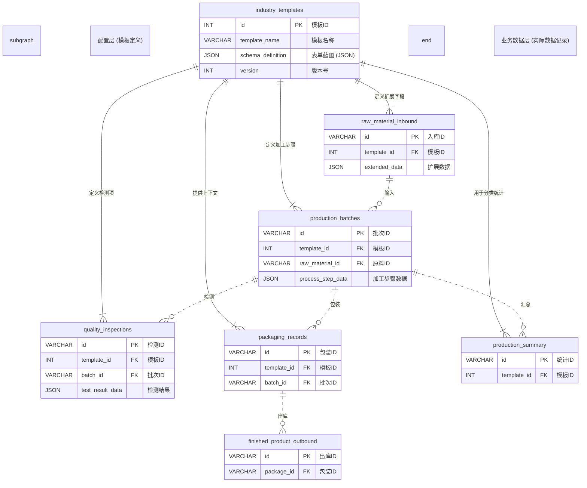

# 生产加工模块数据结构说明

**文档版本**: v4.0
**创建日期**: 2025-06-12
**更新日期**: 2025-06-12
**设计原则**: 通用化设计，支持多种加工场景（肉类、水产、农产品等）
**复杂度平衡**: 6张核心表 + 动态表单模板系统
**数据库**: MySQL 5.7+ (支持JSON数据类型)

## 🎯 设计总览：如何实现通用化？

为了让一套系统能适应肉类、水产、农产品等完全不同的加工流程，我们采用**"配置模板"+"核心业务表"**的双层设计。

- **配置模板 (`industry_templates`)**: 定义每个行业需要收集哪些特殊数据（如肉类的"滚揉温度"，水产的"盐渍浓度"）。
- **核心业务表 (6张)**: 存储所有行业通用的基础数据（如重量、时间、负责人等）。

---

## 🏗️ 系统架构图

下图清晰地展示了"配置层"和"业务数据层"的关系，以及业务数据之间的流转过程。



### **图表解读**
- **左侧的`industry_templates`是"大脑"**: 它定义了每个行业需要填写的表单长什么样。
- **右侧的6张表是"身体"**: 它们是实际的业务流水线，记录着每天发生的事情。
- **连接线**:
    - `||--|{` 表示`industry_templates`**一对多地定义**了业务表中的动态字段。
    - `||..o{` 表示业务表之间**一对多**的流程关系（如一个批次对应多次质检）。

---

## 💡 核心逻辑：模板如何驱动数据？

让我们以 **"生产批次"** 为例，看看模板是如何工作的。

| 步骤 | 1. 定义模板 (在 `industry_templates` 表中) | 2. 录入数据 (在 `production_batches` 表中) |
| :--- | :--- | :--- |
| **做什么** | 系统管理员为"肉类加工"创建一个模板，**定义**需要收集哪些字段。 | 一线员工根据这个模板生成的表单，**填写**当天的生产数据。 |
| **数据示例** | `schema_definition` 字段 (JSON格式) 定义了表单的蓝图：<br/><br/>```json<br/>{<br/>  "rollingTemp": {<br/>    "title": "滚揉温度(°C)",<br/>    "type": "number"<br/>  },<br/>  "operator": {<br/>    "title": "操作员",<br/>    "type": "string"<br/>  }<br/>}``` | `process_step_data` 字段 (JSON格式) 存储了员工填写的**结果**：<br/><br/>```json<br/>{<br/>  "rollingTemp": 4,<br/>  "operator": "王师傅"<br/>}```|
| **一句话总结** | **这张表是"考卷的设计图"** | **这张表是"填写好的答卷"** |

这个设计让您无需为每个新行业开发新的功能，只需要在后台配置一张新的"考卷"即可。

---

## 🚀 实战演练：牛肉 vs. 鱼肉加工流程对比

通过具体案例，我们来看看同一套数据结构如何适配两种完全不同的加工流程。

### 📋 案例设定

| 🥩 **牛肉加工案例** | 🐟 **鱼肉加工案例** |
|-------------------|-------------------|
| 500kg西门塔尔牛肉 → 精装牛排 | 300kg挪威三文鱼 → 烟熏三文鱼柳 |
| 使用：肉类加工模板 | 使用：水产加工模板 |

### 🔍 关键差异对比

**相同的表结构，不同的JSON数据内容：**

| 加工阶段 | 🥩 牛肉关注点 | 🐟 鱼肉关注点 |
|----------|---------------|---------------|
| **原料入库** | 品种、温度<br/>`{"breed": "西门塔尔", "temperature": -2}` | 捕捞日期、新鲜度<br/>`{"catchDate": "2024-12-04", "freshness": "刺身级"}` |
| **生产加工** | 滚揉温度、时间<br/>`{"rollingTemp": 4, "rollingTime": 120}` | 烟熏木材、盐浓度<br/>`{"smokingWood": "苹果木", "saltConcentration": 15}` |
| **质量检测** | PH值、蛋白质<br/>`{"phValue": 6.2, "proteinContent": 20.5}` | 组胺、K值<br/>`{"histamineLevel": "合格", "kValue": "18%"}` |
| **包装出库** | 真空包装，-18°C冷冻 | 气调包装，0-4°C冷藏 |

### 💡 核心价值

1. **零开发扩展**：新增水产加工，只需配置模板，无需写代码
2. **数据统一管理**：所有行业数据在同一个系统中，便于对比分析
3. **快速部署**：新客户接入从2-4周缩短到1-2天

---

## 📚 详细表结构定义

### 1. 配置层

#### **表名：`industry_templates` (行业模板定义)**
**作用**: 系统的"大脑"，定义不同行业的表单结构和验证规则。

| 字段名 | 类型 | 示例值 | 说明 |
|--------|------|--------|------|
| id | INT (PK) | 1 | 主键，模板ID |
| template_name | VARCHAR(255) | 肉类加工模板 | 模板名称，用于前端选择 |
| industry_type | VARCHAR(100) | meat_processing | 行业类型标识 |
| **schema_definition** | **JSON** | (见上方示例) | **核心：表单的结构蓝图** |
| version | INT | 1 | 模板版本号，用于迭代 |
| is_active | BOOLEAN | true | 是否启用 |
| created_by | VARCHAR(100) | 系统管理员 | 创建者 |
| created_at | DATETIME | ... | 创建时间 |
| updated_at | DATETIME | ... | 更新时间 |

---

### 2. 业务数据层

#### **表名：`raw_material_inbound` (原料入库记录)**
**作用**: 记录所有进入工厂的原材料信息。

| 字段名 | 类型 | 示例值 | 说明 |
|--------|------|--------|------|
| id | VARCHAR(50) (PK) | raw_001 | 入库ID |
| **template_id** | **INT (FK)** | **1** | **关联的模板ID** |
| batchCode | VARCHAR(255) | BEEF-20241201-001 | 原料批次号 |
| materialName | VARCHAR(255) | 优质牛肉 | 原料名称 |
| materialType | VARCHAR(100) | meat | 原料类型：meat/seafood/grain/vegetable/other |
| supplier | VARCHAR(255) | 内蒙古牧场 | 供应商 |
| initialWeight | DECIMAL(10,3) | 500.0 | 初始重量(kg) |
| receivedAt | DATETIME | 2024-12-01T08:00:00Z | 入库时间 |
| qualityGrade | VARCHAR(10) | A | 质量等级：A/B/C |
| storageLocation | VARCHAR(255) | 冷库A区 | 存储位置 |
| inspectorName | VARCHAR(100) | 张质检 | 检验员 |
| **extended_data** | **JSON** | `{"temperature": -2}` | **根据模板录入的扩展数据** |
| status | VARCHAR(50) | approved | 状态：pending/approved/rejected |
| notes | TEXT | 肉质新鲜，符合标准 | 备注 |
| createdAt | DATETIME | 2024-12-01T08:00:00Z | 创建时间 |
| updatedAt | DATETIME | 2024-12-01T08:30:00Z | 更新时间 |

#### **表名：`production_batches` (生产批次记录)**
**作用**: 追踪每一批产品的完整加工过程。

| 字段名 | 类型 | 示例值 | 说明 |
|--------|------|--------|------|
| id | VARCHAR(50) (PK) | batch_001 | 批次ID |
| **template_id** | **INT (FK)** | **1** | **关联的模板ID** |
| batchNumber | VARCHAR(255) | PRO-20241201-001 | 生产批次号 |
| productName | VARCHAR(255) | 精装牛排 | 产品名称 |
| rawMaterialId | VARCHAR(50) (FK) | raw_001 | 使用的原料ID |
| preProcessWeight | DECIMAL(10,3) | 480.0 | 加工前重量 |
| postProcessWeight| DECIMAL(10,3) | 465.0 | 加工后重量 |
| **process_step_data**| **JSON** | `{"rollingTemp": 4}` | **根据模板录入的加工步骤数据** |
| **cost_breakdown_data** | **JSON** | **见下方示例** | **成本分解数据** |
| startTime | DATETIME | 2024-12-01T09:00:00Z | 开始时间 |
| endTime | DATETIME | 2024-12-01T16:00:00Z | 结束时间 |
| supervisor | VARCHAR(100) | 李主管 | 生产主管 |
| yieldRate | DECIMAL(5,2) | 96.9 | 成品率（%） |
| status | VARCHAR(50) | completed | 状态：planned/in_progress/completed/failed |
| notes | TEXT | 加工顺利完成 | 备注 |
| createdAt | DATETIME | 2024-12-01T09:00:00Z | 创建时间 |
| updatedAt | DATETIME | 2024-12-01T16:30:00Z | 更新时间 |

**cost_breakdown_data 示例：**
```json
{
  "rawMaterial": 1200.0,
  "labor": 150.0,
  "utilities": {"water": 25.0, "electricity": 45.0},
  "additives": 35.0,
  "packaging": 20.0,
  "total": 1475.0
}
```

#### **表名：`quality_inspections` (质量检测记录)**
**作用**: 记录在生产各环节的质量检验结果。

| 字段名 | 类型 | 示例值 | 说明 |
|--------|------|--------|------|
| id | VARCHAR(50) (PK) | qc_001 | 检测ID |
| **template_id** | **INT (FK)** | **1** | **关联的模板ID** |
| batchId | VARCHAR(50) (FK) | batch_001 | 关联的生产批次 |
| inspectionType | VARCHAR(50) | final | 检测类型：incoming/process/final |
| inspectionDate | DATETIME | 2024-12-01T15:30:00Z | 检测时间 |
| inspector | VARCHAR(100) | 王质检 | 检测员 |
| **test_result_data**| **JSON** | `{"phValue": 6.2}` | **根据模板录入的检测结果** |
| overallResult | VARCHAR(50) | pass | 总体结果：pass/fail |
| qualityScore | DECIMAL(5,2) | 96.0 | 质量分数（0-100） |
| certificateNumber | VARCHAR(100) | QC-2024-001 | 合格证书号 |
| notes | TEXT | 各项指标均符合标准 | 备注 |
| createdAt | DATETIME | 2024-12-01T15:30:00Z | 创建时间 |
| updatedAt | DATETIME | 2024-12-01T16:00:00Z | 更新时间 |

#### **表名：`packaging_records` (包装记录)**
**作用**: 记录成品被包装的详细信息。

| 字段名 | 类型 | 示例值 | 说明 |
|--------|------|--------|------|
| id | VARCHAR(50) (PK) | pkg_001 | 包装ID |
| **template_id** | **INT (FK)** | **1** | **关联的模板ID** |
| batchId | VARCHAR(50) (FK) | batch_001 | 关联的生产批次 |
| packageType | VARCHAR(100) | vacuum_sealed | 包装类型：vacuum_sealed/tray_pack/bulk/other |
| packageCount | INT | 50 | 包装数量 |
| weightPerPackage | DECIMAL(10,3) | 9.3 | 单包重量（kg） |
| totalWeight | DECIMAL(10,3) | 465.0 | 总重量（kg） |
| packagedAt | DATETIME | 2024-12-01T16:00:00Z | 包装时间 |
| operator | VARCHAR(100) | 包装工小李 | 包装操作员 |
| **packaging_spec_data** | **JSON** | **见下方示例** | **包装规格详情** |
| expiryDate | DATE | 2025-06-01 | 保质期 |
| storageLocation | VARCHAR(255) | 成品冷库B区 | 存储位置 |
| notes | TEXT | 包装完好，标签清晰 | 备注 |
| createdAt | DATETIME | 2024-12-01T16:00:00Z | 创建时间 |
| updatedAt | DATETIME | 2024-12-01T16:30:00Z | 更新时间 |

**packaging_spec_data 示例：**
```json
{
  "material": "PA/PE复合膜",
  "vacuum_level": "99.5%",
  "storage_temp": "-18°C",
  "label_info": {
    "product_name": "精装牛排",
    "weight": "9.3kg",
    "batch_code": "PRO-20241201-001"
  }
}
```

#### **表名：`finished_product_outbound` (成品出库记录)**
**作用**: 记录成品离开工厂，发往客户的信息。

| 字段名 | 类型 | 示例值 | 说明 |
|--------|------|--------|------|
| id | VARCHAR(50) (PK) | out_001 | 出库ID |
| packageId | VARCHAR(50) (FK) | pkg_001 | 关联的包装记录ID |
| productName | VARCHAR(255) | 精装牛排 | 产品名称 |
| quantity | INT | 20 | 出库数量 |
| totalWeight | DECIMAL(10,3) | 186.0 | 出库总重量（kg） |
| customer | VARCHAR(255) | 北京连锁超市A | 客户名称 |
| shippedAt | DATETIME | 2024-12-02T08:00:00Z | 出库时间 |
| carrier | VARCHAR(255) | 冷链物流公司 | 承运商 |
| **shipping_requirement_data** | **JSON** | **见下方示例** | **运输要求** |
| operator | VARCHAR(100) | 仓管员张三 | 出库操作员 |
| status | VARCHAR(50) | shipped | 状态：prepared/shipped/delivered |
| estimatedDelivery | DATETIME | 2024-12-02T18:00:00Z | 预计送达 |
| actualDelivery | DATETIME | 2024-12-02T17:30:00Z | 实际送达 |
| notes | TEXT | 按时送达，温度正常 | 备注 |
| createdAt | DATETIME | 2024-12-02T08:00:00Z | 创建时间 |
| updatedAt | DATETIME | 2024-12-02T17:45:00Z | 更新时间 |

**shipping_requirement_data 示例：**
```json
{
  "temperature_range": {"min": -20, "max": -15},
  "handling_instructions": ["保持冷链", "轻拿轻放"],
  "delivery_window": {"start": "08:00", "end": "18:00"}
}
```

#### **表名：`production_summary` (生产统计汇总)**
**作用**: 对生产数据进行日/周/月维度的统计与分析。

| 字段名 | 类型 | 示例值 | 说明 |
|--------|------|--------|------|
| id | VARCHAR(50) (PK) | sum_001 | 统计ID |
| **template_id** | **INT (FK)** | **1** | **关联的模板ID，用于按行业分类** |
| summaryDate | DATE | 2024-12-01 | 统计日期 |
| periodType | VARCHAR(50) | daily | 统计周期：daily/weekly/monthly |
| totalBatches | INT | 5 | 处理批次数 |
| totalInputWeight | DECIMAL(12,3) | 2500.0 | 总投入重量 |
| totalOutputWeight| DECIMAL(12,3) | 2312.5 | 总产出重量 |
| averageYieldRate | DECIMAL(5,2) | 92.5 | 平均成品率 |
| totalCost | DECIMAL(12,2) | 6250.0 | 总成本 |
| totalRevenue | DECIMAL(12,2) | 8750.0 | 总收入 |
| profitMargin | DECIMAL(5,2) | 28.6 | 利润率（%） |
| **resource_usage_data** | **JSON** | **见下方示例** | **资源使用统计** |
| **quality_metrics_data** | **JSON** | **见下方示例** | **质量指标统计** |
| notes | TEXT | 生产正常，效率稳定 | 备注 |
| createdAt | DATETIME | 2024-12-01T23:59:59Z | 创建时间 |

**resource_usage_data 示例：**
```json
{
  "water": {"total": 1250, "unit": "升"},
  "electricity": {"total": 285, "unit": "kWh"},
  "labor_hours": 40,
  "additives": {"盐水": 45.0, "保水剂": 12.0}
}
```

**quality_metrics_data 示例：**
```json
{
  "quality_pass_rate": 98.5,
  "average_quality_score": 94.2,
  "defect_rate": 1.5
}
```

---

## ✅ 方案优势

1.  **直观**: 架构图让所有人秒懂系统设计。
2.  **灵活**: 增删行业无需开发，只需配置模板。
3.  **统一**: 6张核心表结构稳定，便于维护和分析。
4.  **强大**: 利用MySQL的JSON能力，兼具关系型数据库的稳定和非关系型数据库的灵活。

---

## 🚀 附录：分阶段实施计划

<details>
<summary>点击展开查看实施路线图</summary>

### **Phase 1: MVP核心功能（4-6周）**
- **目标**: 实现模板驱动的动态表单。
- **任务**:
  - 后端: 创建`industry_templates`表，提供模板CRUD API。
  - 前端: 实现基础的JSON Schema表单渲染器。
  - 数据: 手动配置2-3个行业模板。
- **验收标准**: 不同工厂能看到不同的表单，无需修改代码。

### **Phase 2: 可视化配置（6-8周）**
- **目标**: 业务人员可自助配置模板。
- **任务**:
  - 后端: 完善模板版本管理、权限控制。
  - 前端: 开发拖拽式模板设计器。
- **验收标准**: 工厂管理员可自主设计和修改表单，并立即生效。

### **Phase 3: 高级功能（8-10周）**
- **目标**: 企业级功能完善。
- **任务**:
  - 实现条件逻辑（如字段间的显示/隐藏依赖）。
  - 开发模板市场，支持模板分享、导入/导出。
- **验收标准**: 支持复杂业务场景，可商业化部署。

</details>
