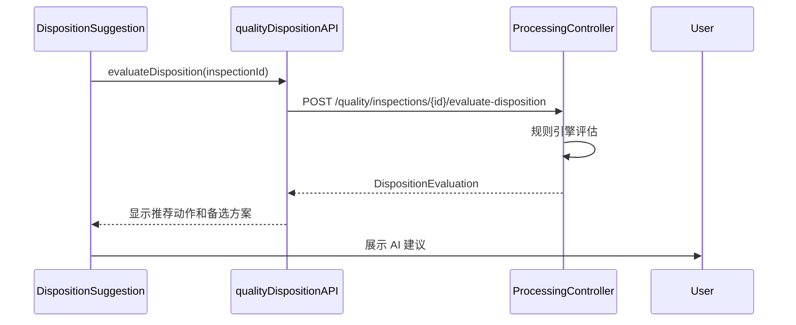
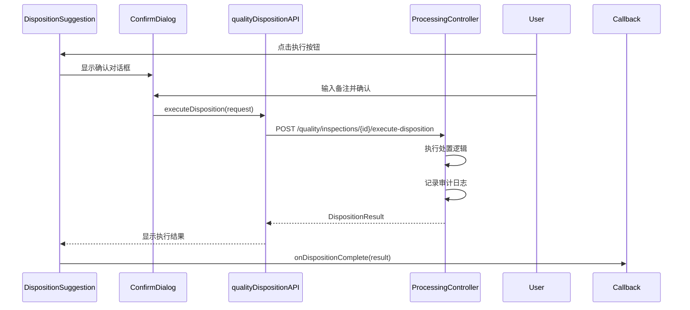
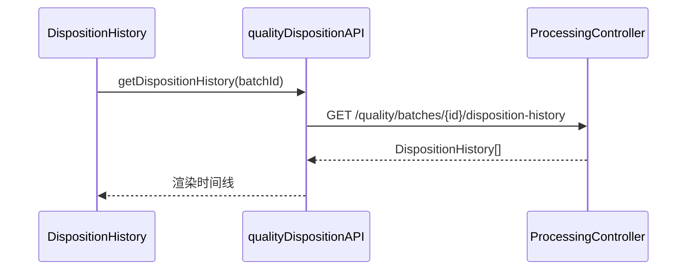

# 质检处置 UI 组件

## 概述

质检处置 UI 组件库提供了完整的质检结果处置流程界面，包括 AI 处置建议展示、处置动作选择和处置历史记录查看。

## 组件列表

### 1. DispositionSuggestion - 处置建议组件

展示基于质检结果的 AI 处置建议，支持查看推荐动作、备选方案和执行处置。

#### Props

```typescript
interface DispositionSuggestionProps {
  batchId: number;              // 生产批次ID
  inspectionId: string;         // 质检记录ID
  qualityScore: number;         // 质检分数 (0-100)
  hasSecurityIssue?: boolean;   // 是否有安全隐患
  onDispositionComplete?: (result: DispositionResult) => void; // 处置完成回调
}
```

#### 功能特性

- 自动加载 AI 处置评估结果
- 显示推荐动作和置信度
- 展示质检结果摘要（合格率、质量等级等）
- 显示处置原因和触发的规则信息
- 标识是否需要审批
- 提供备选处置方案
- 支持操作员备注输入
- 执行处置动作

#### 使用示例

```tsx
import { DispositionSuggestion } from '@/components/quality';

function QualityInspectionDetailScreen() {
  const handleDispositionComplete = (result) => {
    console.log('处置已完成:', result);
    // 刷新批次状态或导航到下一页
  };

  return (
    <DispositionSuggestion
      batchId={12345}
      inspectionId="INS-2025-001"
      qualityScore={92.5}
      hasSecurityIssue={false}
      onDispositionComplete={handleDispositionComplete}
    />
  );
}
```

#### UI 设计

- **推荐动作卡片**: 使用颜色编码区分不同动作类型
  - 放行 (RELEASE): 绿色 ✅
  - 条件放行 (CONDITIONAL_RELEASE): 黄色 ⚠️
  - 返工 (REWORK): 橙色 🔄
  - 报废 (SCRAP): 红色 ❌
  - 特批 (SPECIAL_APPROVAL): 紫色 📋
  - 暂扣 (HOLD): 蓝色 ⏸️

- **置信度显示**: 右上角芯片显示 AI 置信度百分比
- **质检摘要**: 灰色背景卡片展示关键质检数据
- **审批提示**: 需要审批的动作显示橙色提示框

---

### 2. DispositionHistory - 处置历史组件

以时间线形式展示批次的历史处置记录。

#### Props

```typescript
interface DispositionHistoryProps {
  batchId: number;          // 生产批次ID
  inspectionId?: string;    // 质检记录ID (可选，用于过滤)
  autoRefresh?: boolean;    // 是否自动刷新
}
```

#### 功能特性

- 时间线样式展示处置历史
- 显示每条记录的详细信息：
  - 处置动作和时间
  - 质检数据（合格率、等级）
  - 处置原因
  - 执行人信息
  - 审批状态和审批人
  - 批次状态变更
- 按时间倒序排列
- 空状态和错误处理

#### 使用示例

```tsx
import { DispositionHistory } from '@/components/quality';

function BatchHistoryTab() {
  return (
    <DispositionHistory
      batchId={12345}
      inspectionId="INS-2025-001"
      autoRefresh={true}
    />
  );
}
```

#### UI 设计

- **时间线节点**: 圆形头像图标，颜色对应动作类型
- **连接线**: 灰色虚线连接各个节点
- **内容卡片**: 白色卡片展示详细信息
- **审批状态**: 不同颜色标识（绿色=已批准，橙色=待审批，红色=已拒绝）

---

### 3. DispositionActionPicker - 处置动作选择器

提供交互式的处置动作选择界面，支持备注输入。

#### Props

```typescript
interface DispositionActionPickerProps {
  selectedAction: DispositionAction | null;          // 当前选中的动作
  onActionChange: (action: DispositionAction) => void; // 动作变更回调
  operatorComment: string;                            // 操作员备注
  onCommentChange: (comment: string) => void;        // 备注变更回调
  availableActions?: DispositionAction[];            // 可用动作列表 (可选)
  disabled?: boolean;                                 // 是否禁用
}
```

#### 功能特性

- 单选列表展示所有可用处置动作
- 显示每个动作的：
  - 名称和图标
  - 详细说明
  - 是否需要审批
  - 审批级别提示
- 支持备注输入（最多 500 字符）
- 选中状态高亮显示
- 底部提示信息

#### 使用示例

```tsx
import { DispositionActionPicker } from '@/components/quality';
import { DispositionAction } from '@/types/qualityDisposition';
import { useState } from 'react';

function DispositionSelectionDialog() {
  const [selectedAction, setSelectedAction] = useState<DispositionAction | null>(null);
  const [comment, setComment] = useState('');

  return (
    <DispositionActionPicker
      selectedAction={selectedAction}
      onActionChange={setSelectedAction}
      operatorComment={comment}
      onCommentChange={setComment}
      availableActions={[
        DispositionAction.RELEASE,
        DispositionAction.REWORK,
        DispositionAction.HOLD,
      ]}
    />
  );
}
```

#### UI 设计

- **动作卡片**: 左侧彩色边框标识动作类型
- **单选按钮**: 使用 Android 样式单选框
- **审批标签**: 橙色芯片标识需要审批的动作
- **备注输入**: 多行文本框，显示字符计数
- **提示卡片**: 蓝色背景提示信息

---

## 集成示例

### 完整的质检详情页集成

```tsx
import React, { useState } from 'react';
import { View, StyleSheet } from 'react-native';
import { TabView, TabBar } from 'react-native-tab-view';
import {
  DispositionSuggestion,
  DispositionHistory,
  DispositionActionPicker,
} from '@/components/quality';

function QualityInspectionDetailScreen({ route }) {
  const { inspectionId, batchId } = route.params;
  const [index, setIndex] = useState(0);
  const [routes] = useState([
    { key: 'suggestion', title: '处置建议' },
    { key: 'history', title: '处置历史' },
    { key: 'manual', title: '手动处置' },
  ]);

  const [selectedAction, setSelectedAction] = useState(null);
  const [comment, setComment] = useState('');

  const renderScene = ({ route }) => {
    switch (route.key) {
      case 'suggestion':
        return (
          <DispositionSuggestion
            batchId={batchId}
            inspectionId={inspectionId}
            qualityScore={92.5}
            onDispositionComplete={(result) => {
              console.log('处置完成:', result);
              setIndex(1); // 切换到历史记录
            }}
          />
        );

      case 'history':
        return (
          <DispositionHistory
            batchId={batchId}
            inspectionId={inspectionId}
            autoRefresh={true}
          />
        );

      case 'manual':
        return (
          <View style={styles.manualTab}>
            <DispositionActionPicker
              selectedAction={selectedAction}
              onActionChange={setSelectedAction}
              operatorComment={comment}
              onCommentChange={setComment}
            />
          </View>
        );

      default:
        return null;
    }
  };

  return (
    <TabView
      navigationState={{ index, routes }}
      renderScene={renderScene}
      onIndexChange={setIndex}
      renderTabBar={(props) => (
        <TabBar {...props} indicatorStyle={{ backgroundColor: '#2196F3' }} />
      )}
    />
  );
}

const styles = StyleSheet.create({
  manualTab: {
    flex: 1,
    padding: 16,
  },
});
```

---

## 数据流程

### 1. 评估处置建议流程



### 2. 执行处置流程



### 3. 加载历史记录流程



---

## API 客户端

所有组件都使用 `qualityDispositionAPI` 进行数据交互：

```typescript
import { qualityDispositionAPI } from '@/services/api/qualityDispositionApiClient';

// 评估处置建议
const evaluation = await qualityDispositionAPI.evaluateDisposition(factoryId, qualityResult);

// 执行处置动作
const result = await qualityDispositionAPI.executeDisposition(factoryId, request);

// 获取处置历史
const history = await qualityDispositionAPI.getDispositionHistory(factoryId, batchId);
```

---

## 类型定义

所有类型定义位于 `@/types/qualityDisposition.ts`：

```typescript
import {
  DispositionAction,
  DispositionEvaluation,
  DispositionResult,
  DispositionHistory,
  InspectionSummary,
  AlternativeAction,
  getActionLabel,
  getActionColor,
  getActionIcon,
  requiresApproval,
} from '@/types/qualityDisposition';
```

---

## 样式规范

### 颜色系统

| 动作类型 | 颜色代码 | 用途 |
|---------|---------|------|
| RELEASE | `#00C853` | 绿色 - 放行 |
| CONDITIONAL_RELEASE | `#FFC107` | 黄色 - 条件放行 |
| REWORK | `#FF9800` | 橙色 - 返工 |
| SCRAP | `#F44336` | 红色 - 报废 |
| SPECIAL_APPROVAL | `#9C27B0` | 紫色 - 特批 |
| HOLD | `#2196F3` | 蓝色 - 暂扣 |

### 图标映射

使用 Material Community Icons：

- `check-circle` - 放行
- `alert-circle` - 条件放行
- `refresh` - 返工
- `close-circle` - 报废
- `file-document-edit` - 特批
- `pause-circle` - 暂扣

---

## 错误处理

所有组件都内置了完善的错误处理：

1. **加载状态**: 显示 ActivityIndicator
2. **错误状态**: 显示错误图标和消息，提供重试按钮
3. **空状态**: 显示友好的空数据提示
4. **网络错误**: 使用 Alert 提示用户

---

## 测试建议

### 单元测试

```typescript
import { render, fireEvent, waitFor } from '@testing-library/react-native';
import { DispositionSuggestion } from '@/components/quality';

test('should load and display disposition suggestion', async () => {
  const { getByText } = render(
    <DispositionSuggestion
      batchId={123}
      inspectionId="INS-001"
      qualityScore={95}
    />
  );

  await waitFor(() => {
    expect(getByText('AI 处置建议')).toBeTruthy();
  });
});
```

### 集成测试

建议测试以下场景：

1. 质检合格 (≥95%) - 应显示 RELEASE 建议
2. 质检良好 (85-95%) - 应显示 CONDITIONAL_RELEASE 建议
3. 质检不合格 (<70%) - 应显示 REWORK 或 SCRAP 建议
4. 需要审批的动作 - 应显示审批提示
5. 执行处置后 - 应触发回调并刷新状态

---

## 性能优化

1. **懒加载**: 使用 `React.lazy()` 按需加载组件
2. **缓存**: API 响应使用 15 分钟缓存
3. **防抖**: 备注输入使用 debounce (300ms)
4. **虚拟列表**: 历史记录超过 20 条时使用 FlatList

---

## 常见问题

### Q: 如何自定义可用的处置动作？

A: 使用 `DispositionActionPicker` 的 `availableActions` prop：

```tsx
<DispositionActionPicker
  availableActions={[
    DispositionAction.RELEASE,
    DispositionAction.REWORK,
  ]}
  ...
/>
```

### Q: 如何判断某个动作是否需要审批？

A: 使用工具函数：

```typescript
import { requiresApproval, DispositionAction } from '@/types/qualityDisposition';

const needsApproval = requiresApproval(DispositionAction.SPECIAL_APPROVAL); // true
```

### Q: 如何在处置完成后刷新页面？

A: 使用 `onDispositionComplete` 回调：

```tsx
<DispositionSuggestion
  onDispositionComplete={(result) => {
    // 刷新批次状态
    refetchBatchStatus();

    // 或导航到下一页
    navigation.navigate('BatchList');
  }}
/>
```

---

## 后端 API 依赖

确保后端提供以下接口：

| 方法 | 路径 | 说明 |
|------|------|------|
| POST | `/api/mobile/{factoryId}/processing/quality/inspections/{inspectionId}/evaluate-disposition` | 评估处置建议 |
| POST | `/api/mobile/{factoryId}/processing/quality/inspections/{inspectionId}/execute-disposition` | 执行处置动作 |
| GET | `/api/mobile/{factoryId}/processing/quality/batches/{batchId}/disposition-history` | 获取处置历史 |

---

## 更新日志

### v1.0.0 (2025-12-31)

- ✅ 初始版本发布
- ✅ DispositionSuggestion 组件
- ✅ DispositionHistory 组件
- ✅ DispositionActionPicker 组件
- ✅ 完整的类型定义
- ✅ API 客户端集成
- ✅ 使用文档

---

## 贡献指南

如需添加新功能或修复 bug，请：

1. 遵循 TypeScript 类型安全规范
2. 使用 react-native-paper 组件
3. 遵循项目的颜色和样式规范
4. 添加完整的 JSDoc 注释
5. 提供单元测试

---

## 许可证

Copyright © 2025 Cretas Team. All rights reserved.
