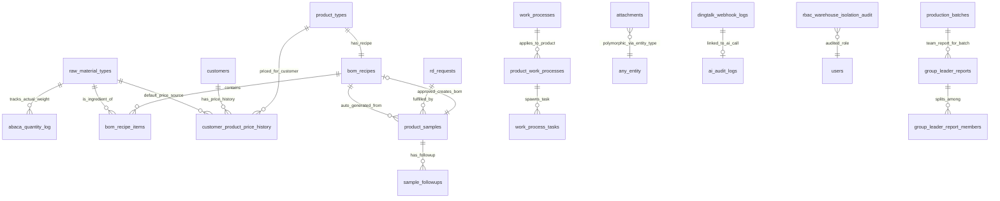

# Sprint 1 数据表 Schema + API 契约设计

> **版本**: v1.0
> **生成日期**: 2026-05-14
> **作者**: Cretas Schema Architect
> **覆盖范围**: 9 张数据表 (W-ABA-1 / M-RPT-LEADER-1 / C-ATT-1 / C-AI-1 / M-WP-1+2 / M-BOM-1 / S-RD-1 / S-PRICE-1 / C-RBAC-1)
> **工程目标**: 工程师拿到本文件可直接写 Flyway migration SQL + JPA Entity + Controller + Service

---

## §1 总览

### 1.1 9 张表清单 + 业务关联

| # | 新编号 | 表名 (snake_case) | 业务含义 | 双主线分类 | 工时估算 |
|---|---|---|---|---|---|
| 1 | W-ABA-1 | `raw_material_types` (扩展) + `abaca_quantity_log` (新) | 抄码品标记 + 入库实际重量 | 🏭 食品厂 (餐饮可关闭) | 2d |
| 2 | M-RPT-LEADER-1 | `group_leader_reports` + `group_leader_report_members` | 小组长代报工 + 工资分摊 | 🏭 食品厂 (与餐饮 PieceworkConfig 联动) | 3d |
| 3 | C-ATT-1 | `attachments` | 通用附件 (多态: entityType + entityId) | 🔄 共享 (5+ 模块依赖) | 5d |
| 4 | C-AI-1 | `dingtalk_webhook_logs` | 钉钉消息日志 (双向) | 🔄 共享 (AI Chat 入口) | 6d |
| 5 | M-WP-1 + M-WP-2 | `work_processes` (已存在) + `product_work_processes` (已存在) + `work_process_tasks` (新, 生成的工序任务) | 工序管理 + 产品工序配置 + 任务生成 | 🔄 共享 (餐饮中央厨房+食品厂车间) | 5d |
| 6 | M-BOM-1 | `bom_recipes` + `bom_recipe_items` (新主子表, 取代单表 bom_items) | BOM 配方主子表 + 出成率自动折算 | 🔄 共享 (餐饮 Recipe + 工厂 BOM) | 5d |
| 7 | S-RD-1 | `rd_requests` (已存在扩展) + `product_samples` (已存在扩展) + `sample_followups` (新) | 研发样品全流程 + 跟踪记录 | 🔄 共享 (餐饮新菜+工厂新品) | 5d |
| 8 | S-PRICE-1 | `customer_product_price_history` | 客户记忆价 (按 customer × product 历史) | 🔄 共享 | 3d |
| 9 | C-RBAC-1 | `rbac_warehouse_isolation_audit` | RBAC 仓管价格隔离审计 (write-only) | 🔄 共享 | 2d |

**Sprint 1 总工时**: ~36 人天 ≈ 7.2 周单人 / 3.6 周双人 (Phase 1 P0 部分)

### 1.2 表关系图 (Mermaid)



### 1.3 设计哲学 (5 大约束)

| 约束 | 实现方式 | 适用范围 |
|---|---|---|
| **多租户隔离** | 每表必须 `factory_id VARCHAR(50) NOT NULL`, 全部索引以 `factory_id` 开头 | 9/9 表 (除全局 attachments 元数据外) |
| **软删除** | 继承 `BaseEntity`, `deleted_at TIMESTAMP NULL`, `@Where(clause = "deleted_at IS NULL")` | 8/9 表 (审计表 write-only 不软删) |
| **审计字段** | `created_at` / `updated_at` 由 `BaseEntity` 提供, 自动维护 | 8/9 表 |
| **命名规范** | 表名 snake_case 复数, 列 snake_case, Java 字段 camelCase, 类 PascalCase | 9/9 表 |
| **时区** | PostgreSQL `TIMESTAMP` (Cretas 现有约定, 非 `TIMESTAMP WITH TIME ZONE` — JPA `LocalDateTime` 配套) | 全部 |

**关于时区的决策**: 任务原文要求 `TIMESTAMP WITH TIME ZONE`, 但 Cretas 现有 `BaseEntity` 全部使用 `LocalDateTime` + `TIMESTAMP` (无 TZ)。**Sprint 1 沿用现有约定**, 保持与 326 个现有 Entity 一致, 避免大规模 schema 迁移。如果未来 `LocalDateTime → OffsetDateTime` 迁移成项目级决策, Sprint 1 表也跟随迁移。

---

## §2 详细 Schema (每张表 DDL + Entity + API + Tool)

---

### §2.1 W-ABA-1 — 抄码品标记 + 实际重量日志

**业务背景**: 卤制品行业 (六扇门刚需) 部分原料每箱重量不一 (例: 牛肉每箱 10-15kg 不固定)。客户原话: *"每箱的规格是不一样的... 比如说像牛肉, 他每箱的重量都不一样"*。需要采购单创建时不显示箱数, 入库时实际称重。

**双主线分类**: 🏭 食品厂 (餐饮中央厨房可关闭, FactoryFeatureConfig 控制)

**关键决策**:
- **决策 A (核心)**: 抄码标记**不**独立成表, 加在 `raw_material_types` 的 `is_abaca_packaging` 字段 — 因为抄码是**原料属性** (牛肉天然抄码), 不是批次级特性。1 个原料类型要么抄码要么不抄码。
- **决策 B**: 入库实际重量记录走**新表** `abaca_quantity_log` 而非塞进 `material_batches` — 因为存在"分次称重 + 合并入库"场景 (1 批次可能称 5 次), 1:N 关系。

#### DDL

```sql
-- (1) 扩展 raw_material_types 表
ALTER TABLE raw_material_types
    ADD COLUMN is_abaca_packaging BOOLEAN NOT NULL DEFAULT FALSE,
    ADD COLUMN abaca_unit_per_box VARCHAR(20),  -- 单位/箱描述 (如 "约 10-15kg/箱")
    ADD COLUMN abaca_default_unit VARCHAR(20);   -- 默认计量单位 (kg / g)

COMMENT ON COLUMN raw_material_types.is_abaca_packaging IS '是否抄码品 (每箱重量不一, 采购不录箱数, 入库实际称重)';
COMMENT ON COLUMN raw_material_types.abaca_unit_per_box IS '抄码品箱重区间描述 (UI 提示用)';

-- (2) 新建 abaca_quantity_log 表
CREATE TABLE abaca_quantity_log (
    id              VARCHAR(191) PRIMARY KEY,                       -- UUID
    factory_id      VARCHAR(50) NOT NULL,
    material_batch_id VARCHAR(191) NOT NULL,                        -- 关联批次
    raw_material_type_id VARCHAR(191) NOT NULL,                     -- 冗余, 加速查询
    purchase_order_item_id VARCHAR(191),                            -- 关联采购单行项 (可空, 手动入库时无)

    box_index       INTEGER NOT NULL,                                -- 第几箱 (1, 2, 3...)
    actual_weight   DECIMAL(12, 4) NOT NULL,                         -- 实际称重 (kg or g, 看 abaca_default_unit)
    unit            VARCHAR(20) NOT NULL DEFAULT 'kg',
    weighing_method VARCHAR(20) NOT NULL DEFAULT 'SCALE',            -- SCALE / MANUAL / IMPORTED
    scale_device_id VARCHAR(50),                                     -- 电子秤设备 ID (如已对接 scale Tool)

    weighed_at      TIMESTAMP NOT NULL DEFAULT NOW(),
    weighed_by      BIGINT NOT NULL,                                 -- 称重员 user_id
    verified_by     BIGINT,                                          -- 复核员 user_id (双签机制, 可选)
    verified_at     TIMESTAMP,
    notes           VARCHAR(500),

    created_at      TIMESTAMP NOT NULL DEFAULT NOW(),
    updated_at      TIMESTAMP NOT NULL DEFAULT NOW(),
    deleted_at      TIMESTAMP,

    CONSTRAINT fk_aql_batch FOREIGN KEY (material_batch_id)
        REFERENCES material_batches(id) ON DELETE RESTRICT,
    CONSTRAINT fk_aql_material FOREIGN KEY (raw_material_type_id)
        REFERENCES raw_material_types(id) ON DELETE RESTRICT,
    CONSTRAINT chk_aql_weight_positive CHECK (actual_weight > 0),
    CONSTRAINT chk_aql_weighing_method CHECK (weighing_method IN ('SCALE', 'MANUAL', 'IMPORTED'))
);

CREATE INDEX idx_aql_factory_batch ON abaca_quantity_log (factory_id, material_batch_id);
CREATE INDEX idx_aql_material_type ON abaca_quantity_log (factory_id, raw_material_type_id, weighed_at DESC);
CREATE INDEX idx_aql_po_item ON abaca_quantity_log (purchase_order_item_id) WHERE purchase_order_item_id IS NOT NULL;

COMMENT ON TABLE abaca_quantity_log IS '抄码品实际重量记录 (1 批次可分多次称重)';
```

#### JPA Entity

```java
package com.cretas.aims.entity.warehouse;

import com.cretas.aims.entity.BaseEntity;
import jakarta.persistence.*;
import lombok.*;
import org.hibernate.annotations.Where;
import java.math.BigDecimal;
import java.time.LocalDateTime;
import java.util.UUID;

@Data
@EqualsAndHashCode(callSuper = true)
@AllArgsConstructor
@NoArgsConstructor
@Entity
@Table(name = "abaca_quantity_log", indexes = {
    @Index(name = "idx_aql_factory_batch", columnList = "factory_id,material_batch_id"),
    @Index(name = "idx_aql_material_type", columnList = "factory_id,raw_material_type_id")
})
@Where(clause = "deleted_at IS NULL")
public class AbacaQuantityLog extends BaseEntity {

    @Id
    @Column(name = "id", nullable = false, length = 191)
    private String id;

    @PrePersist
    void assignUUID() { if (id == null) id = UUID.randomUUID().toString(); }

    @Column(name = "factory_id", nullable = false, length = 50)
    private String factoryId;

    @Column(name = "material_batch_id", nullable = false, length = 191)
    private String materialBatchId;

    @Column(name = "raw_material_type_id", nullable = false, length = 191)
    private String rawMaterialTypeId;

    @Column(name = "purchase_order_item_id", length = 191)
    private String purchaseOrderItemId;

    @Column(name = "box_index", nullable = false)
    private Integer boxIndex;

    @Column(name = "actual_weight", nullable = false, precision = 12, scale = 4)
    private BigDecimal actualWeight;

    @Column(name = "unit", nullable = false, length = 20)
    private String unit = "kg";

    @Column(name = "weighing_method", nullable = false, length = 20)
    private String weighingMethod = "SCALE";

    @Column(name = "scale_device_id", length = 50)
    private String scaleDeviceId;

    @Column(name = "weighed_at", nullable = false)
    private LocalDateTime weighedAt;

    @Column(name = "weighed_by", nullable = false)
    private Long weighedBy;

    @Column(name = "verified_by")
    private Long verifiedBy;

    @Column(name = "verified_at")
    private LocalDateTime verifiedAt;

    @Column(name = "notes", length = 500)
    private String notes;
}
```

#### 状态机
不适用 (write-once 日志表)。

#### API 契约

| 方法 | Path | 说明 |
|---|---|---|
| GET | `/api/mobile/{factoryId}/material/abaca-log?batchId={id}` | 查询某批次的全部称重记录 |
| GET | `/api/mobile/{factoryId}/material/abaca-log/{id}` | 详情 |
| POST | `/api/mobile/{factoryId}/material/abaca-log` | 新增 1 次称重 (single box) |
| POST | `/api/mobile/{factoryId}/material/abaca-log/batch` | 批量新增 (N 箱一次提交) |
| PUT | `/api/mobile/{factoryId}/material/abaca-log/{id}/verify` | 复核 (双签) |
| DELETE | `/api/mobile/{factoryId}/material/abaca-log/{id}` | 软删除 (仅未复核可删) |

**请求 DTO** (`CreateAbacaQuantityLogRequest.java`):

```java
@Data
public class CreateAbacaQuantityLogRequest {
    @NotBlank(message = "批次 ID 不能为空")
    private String materialBatchId;

    @NotBlank(message = "原料类型 ID 不能为空")
    private String rawMaterialTypeId;

    @NotNull(message = "箱号不能为空")
    @Min(value = 1, message = "箱号必须大于 0")
    private Integer boxIndex;

    @NotNull(message = "实际重量不能为空")
    @DecimalMin(value = "0.0001", message = "重量必须大于 0")
    private BigDecimal actualWeight;

    @NotBlank
    private String unit;

    private String weighingMethod;   // SCALE / MANUAL / IMPORTED
    private String scaleDeviceId;
    private String purchaseOrderItemId;
    private String notes;
}
```

**响应**: `ApiResponse<AbacaQuantityLog>` (含批次总重量汇总 in `data.batchTotalWeight`)。

#### AIChat Tool 建议

| Tool 名 | 描述 | 参数 |
|---|---|---|
| `abaca_weight_log` | 记录抄码品入库实际称重 | `batchNumber`, `boxIndex`, `actualWeight`, `unit` |
| `abaca_weight_summary` | 查询某批次的称重汇总 (总重量 + 箱数) | `batchNumber` 或 `batchId` |
| `material_mark_abaca` | 标记某原料类型为抄码品 (WRITE preview 支持) | `materialCode`, `isAbaca`, `unitPerBox` |

**示例触发语句**: *"录入 BAT-20260514-001 批次第 3 箱牛肉, 实际称重 12.5kg"*

---

### §2.2 M-RPT-LEADER-1 — 小组长代报工 + 工资分摊

**业务背景**: 老员工不会扫码 (第一次会议), 由小组长一次扫码代填全组 5-10 人。客户原话: *"组长拿手机一扫, 我们这班八个人, 今天做了 50 公斤"*。

**双主线分类**: 🏭 食品厂为主, 餐饮中央厨房可复用 (餐饮端走 PieceworkConfig)

**关键决策**:
- **决策 A (主子表)**: 拆 `group_leader_reports` (报工总额) + `group_leader_report_members` (个人分摊)。理由: 同一次报工记录拆给 N 个工人, 是经典 1:N。也方便后续审批 / 查询全组报工历史。
- **决策 B (分摊算法)**: 提供 3 种分摊模式: `EQUAL` 平均分 / `BY_WORK_MINUTES` 按工时 / `MANUAL` 手填。算法存 `share_method` 字段, 实际比例存 `share_ratio`。
- **决策 C (与 `BatchWorkSession` 关系)**: 不替代现有 `batch_work_sessions`。代报工是**汇总入口**, 提交后**自动 spawn N 条 batch_work_sessions** (assigned_by = leader.userId, checkin_method = 'LEADER_PROXY')。
- **决策 D (审批)**: status 字段含 4 态 (DRAFT / SUBMITTED / APPROVED / REJECTED), APPROVED 才生成 batch_work_sessions + 触发计件工资计算。

#### DDL

```sql
-- 主表: 一次代报工
CREATE TABLE group_leader_reports (
    id                  VARCHAR(191) PRIMARY KEY,
    factory_id          VARCHAR(50) NOT NULL,
    report_number       VARCHAR(50) NOT NULL,                       -- GLR-20260514-001
    batch_id            BIGINT NOT NULL,                             -- ProductionBatch.id (Long)
    work_process_id     VARCHAR(50),                                 -- 工序 (可选)

    leader_user_id      BIGINT NOT NULL,                             -- 代报工的小组长
    report_date         DATE NOT NULL,
    report_time         TIMESTAMP NOT NULL DEFAULT NOW(),

    total_output        DECIMAL(15, 4) NOT NULL,                     -- 团队总产出
    total_good_quantity DECIMAL(15, 4),                              -- 良品
    total_defect_quantity DECIMAL(15, 4),                            -- 次品
    output_unit         VARCHAR(20) NOT NULL DEFAULT 'kg',

    share_method        VARCHAR(20) NOT NULL DEFAULT 'EQUAL',        -- EQUAL / BY_WORK_MINUTES / MANUAL
    member_count        INTEGER NOT NULL,                             -- 冗余, 加速查询

    status              VARCHAR(32) NOT NULL DEFAULT 'DRAFT',         -- DRAFT/SUBMITTED/APPROVED/REJECTED
    approved_by         BIGINT,
    approved_at         TIMESTAMP,
    rejection_reason    VARCHAR(500),

    notes               VARCHAR(500),

    created_at          TIMESTAMP NOT NULL DEFAULT NOW(),
    updated_at          TIMESTAMP NOT NULL DEFAULT NOW(),
    deleted_at          TIMESTAMP,

    CONSTRAINT chk_glr_status CHECK (status IN ('DRAFT', 'SUBMITTED', 'APPROVED', 'REJECTED')),
    CONSTRAINT chk_glr_share_method CHECK (share_method IN ('EQUAL', 'BY_WORK_MINUTES', 'MANUAL')),
    CONSTRAINT chk_glr_output_positive CHECK (total_output >= 0)
);

CREATE UNIQUE INDEX uk_glr_factory_number ON group_leader_reports (factory_id, report_number) WHERE deleted_at IS NULL;
CREATE INDEX idx_glr_factory_date ON group_leader_reports (factory_id, report_date DESC);
CREATE INDEX idx_glr_batch ON group_leader_reports (batch_id);
CREATE INDEX idx_glr_leader ON group_leader_reports (leader_user_id, report_date DESC);
CREATE INDEX idx_glr_status ON group_leader_reports (factory_id, status);

-- 子表: 组员明细
CREATE TABLE group_leader_report_members (
    id                  BIGSERIAL PRIMARY KEY,
    report_id           VARCHAR(191) NOT NULL,
    factory_id          VARCHAR(50) NOT NULL,                       -- 冗余
    member_user_id      BIGINT NOT NULL,

    work_minutes        INTEGER,                                     -- 该成员实际工时 (BY_WORK_MINUTES 用)
    share_ratio         DECIMAL(8, 6) NOT NULL,                      -- 0.000001 ~ 1.000000
    allocated_output    DECIMAL(15, 4) NOT NULL,                     -- 分到的产出
    allocated_good      DECIMAL(15, 4),
    allocated_defect    DECIMAL(15, 4),

    piecework_unit_price DECIMAL(15, 4),                             -- 计件单价快照 (来自 PieceworkConfig)
    allocated_wage      DECIMAL(15, 2),                              -- 分到的工资 = output * unit_price

    spawned_session_id  BIGINT,                                      -- APPROVED 后生成的 batch_work_sessions.id
    notes               VARCHAR(500),

    created_at          TIMESTAMP NOT NULL DEFAULT NOW(),
    updated_at          TIMESTAMP NOT NULL DEFAULT NOW(),
    deleted_at          TIMESTAMP,

    CONSTRAINT fk_glrm_report FOREIGN KEY (report_id)
        REFERENCES group_leader_reports(id) ON DELETE CASCADE,
    CONSTRAINT chk_glrm_ratio CHECK (share_ratio > 0 AND share_ratio <= 1)
);

CREATE INDEX idx_glrm_report ON group_leader_report_members (report_id);
CREATE INDEX idx_glrm_member_date ON group_leader_report_members (factory_id, member_user_id);
```

#### JPA Entity

```java
@Data
@EqualsAndHashCode(callSuper = true)
@AllArgsConstructor @NoArgsConstructor
@Entity
@Table(name = "group_leader_reports", indexes = {
    @Index(name = "idx_glr_factory_date", columnList = "factory_id,report_date"),
    @Index(name = "idx_glr_batch", columnList = "batch_id"),
    @Index(name = "idx_glr_leader", columnList = "leader_user_id"),
    @Index(name = "idx_glr_status", columnList = "factory_id,status")
})
@Where(clause = "deleted_at IS NULL")
public class GroupLeaderReport extends BaseEntity {

    @Id
    @Column(name = "id", nullable = false, length = 191)
    private String id;

    @PrePersist
    void assignUUID() { if (id == null) id = UUID.randomUUID().toString(); }

    @Column(name = "factory_id", nullable = false, length = 50)
    private String factoryId;

    @Column(name = "report_number", nullable = false, length = 50)
    private String reportNumber;

    @Column(name = "batch_id", nullable = false)
    private Long batchId;

    @Column(name = "work_process_id", length = 50)
    private String workProcessId;

    @Column(name = "leader_user_id", nullable = false)
    private Long leaderUserId;

    @Column(name = "report_date", nullable = false)
    private LocalDate reportDate;

    @Column(name = "report_time", nullable = false)
    private LocalDateTime reportTime;

    @Column(name = "total_output", nullable = false, precision = 15, scale = 4)
    private BigDecimal totalOutput;

    @Column(name = "total_good_quantity", precision = 15, scale = 4)
    private BigDecimal totalGoodQuantity;

    @Column(name = "total_defect_quantity", precision = 15, scale = 4)
    private BigDecimal totalDefectQuantity;

    @Column(name = "output_unit", nullable = false, length = 20)
    private String outputUnit = "kg";

    @Enumerated(EnumType.STRING)
    @Column(name = "share_method", nullable = false, length = 20)
    private ShareMethod shareMethod = ShareMethod.EQUAL;

    @Column(name = "member_count", nullable = false)
    private Integer memberCount;

    @Enumerated(EnumType.STRING)
    @Column(name = "status", nullable = false, length = 32)
    private Status status = Status.DRAFT;

    @Column(name = "approved_by")
    private Long approvedBy;

    @Column(name = "approved_at")
    private LocalDateTime approvedAt;

    @Column(name = "rejection_reason", length = 500)
    private String rejectionReason;

    @Column(name = "notes", length = 500)
    private String notes;

    @OneToMany(mappedBy = "report", cascade = CascadeType.ALL, fetch = FetchType.LAZY, orphanRemoval = true)
    private List<GroupLeaderReportMember> members = new ArrayList<>();

    public enum ShareMethod { EQUAL, BY_WORK_MINUTES, MANUAL }
    public enum Status { DRAFT, SUBMITTED, APPROVED, REJECTED }
}
```

#### 状态机

```
DRAFT → SUBMITTED → APPROVED (生成 batch_work_sessions + 计件工资 + 不可撤销)
           ↓             ↘
        REJECTED       (终态)
           ↓
        DRAFT (允许修正重提)
```

转换规则:
- `DRAFT → SUBMITTED`: 仅组长本人, 必须有 ≥ 1 member
- `SUBMITTED → APPROVED`: 仅 `production:approve` 权限角色 (workshop_supervisor / production_manager), 触发副作用 (生成 sessions + 工资)
- `SUBMITTED → REJECTED`: 同上权限, 必填 rejection_reason
- `REJECTED → DRAFT`: 仅组长本人 (允许修改重提)
- 任何状态 → 软删除: 仅 DRAFT 可删

#### API 契约

| 方法 | Path | 权限 | 说明 |
|---|---|---|---|
| GET | `/api/mobile/{factoryId}/production/group-reports?status=DRAFT&date=2026-05-14` | `production:read` | 列表 (支持分页 + 多过滤) |
| GET | `/api/mobile/{factoryId}/production/group-reports/{id}` | `production:read` | 详情 (含 members) |
| POST | `/api/mobile/{factoryId}/production/group-reports` | `production:report` | 创建草稿 |
| PUT | `/api/mobile/{factoryId}/production/group-reports/{id}` | `production:report` (本人) | 修改草稿 |
| POST | `/api/mobile/{factoryId}/production/group-reports/{id}/submit` | `production:report` | 提交审批 |
| POST | `/api/mobile/{factoryId}/production/group-reports/{id}/approve` | `production:approve` | 批准 (副作用) |
| POST | `/api/mobile/{factoryId}/production/group-reports/{id}/reject` | `production:approve` | 驳回 |
| DELETE | `/api/mobile/{factoryId}/production/group-reports/{id}` | `production:report` | 软删除 (仅 DRAFT) |

**请求 DTO**:

```java
@Data
public class CreateGroupLeaderReportRequest {
    @NotNull private Long batchId;
    private String workProcessId;

    @NotNull @DecimalMin("0") private BigDecimal totalOutput;
    private BigDecimal totalGoodQuantity;
    private BigDecimal totalDefectQuantity;
    private String outputUnit;

    @NotNull private GroupLeaderReport.ShareMethod shareMethod;

    @NotEmpty @Size(min = 1, max = 50)
    @Valid private List<MemberShareDTO> members;

    private String notes;

    @Data
    public static class MemberShareDTO {
        @NotNull private Long memberUserId;
        private Integer workMinutes;           // BY_WORK_MINUTES 必填
        private BigDecimal shareRatio;          // MANUAL 必填, 全组和必须 = 1.0
        private String notes;
    }
}
```

#### AIChat Tool 建议

| Tool 名 | 描述 |
|---|---|
| `production_group_report_create` | 小组长一句话代报工: "今天我们组 8 人做了 50 公斤红烧肉" |
| `production_group_report_submit` | 提交报工审批 |
| `production_group_report_approve` | 主管批准 (含批量批准) |
| `production_group_report_query` | 查询某组某天报工记录 |

**示例**: *"我们组刚才完成 50 公斤红烧肉, 张三李四王五赵六各干 2 小时, 提交报工"*

---

### §2.3 C-ATT-1 — 通用附件系统 (多态)

**业务背景**: 五大场景需要附件: 客户跟踪 / 采购订单 / 质检 / 生产证据 / 财务凭证。客户原话: *"拍照也可以留个单据... 留个附件类似一个拍照然后一个附件也可以的呀"*。Cretas 现有 `BatchEvidencePhoto` 只服务"批次照片", 不能复用为通用附件。

**双主线分类**: 🔄 共享 (9/9 模块都可能用)

**关键决策**:
- **决策 A (多态 vs N:M)**: 采用 `entity_type + entity_id` 多态模式 — 不强制外键, 不污染业务表 schema, 适合"任何实体随时挂附件"场景。N:M 中间表更适合"附件可被多个实体共享"场景, 但本项目附件 1:N 业务实体, 不必要。
- **决策 B (软外键)**: `entity_id` 不做硬外键 (因为指向不同表); `entity_type` 用枚举约束 (CHECK constraint), 强制白名单避免野生 entity_type 值。
- **决策 C (文件存储)**: 仅存 `file_url` (指向 OSS), 不存 BLOB。`file_storage` 字段标识来源 (OSS / R2 / LOCAL)。
- **决策 D (业务字段)**: `file_category` 分类 (PHOTO / VIDEO / DOCUMENT / VOUCHER / SIGNATURE / OTHER), `business_tag` 业务标签 (CONTRACT_SCAN / DELIVERY_PROOF 等具体语义)。
- **决策 E (权限)**: 附件的可见性 = entity 的可见性, **不**单独权限模型。下载 URL 通过签名预签发 (OSS pre-signed URL) 实现细粒度控制。

#### DDL

```sql
CREATE TABLE attachments (
    id              VARCHAR(191) PRIMARY KEY,
    factory_id      VARCHAR(50) NOT NULL,

    -- 多态关联
    entity_type     VARCHAR(50) NOT NULL,                            -- CUSTOMER / PURCHASE_ORDER / QUALITY_CHECK / PRODUCTION_BATCH / PAYMENT_VOUCHER / RD_SAMPLE / RECEIPT / RETURN_ORDER / SHIPMENT / GENERIC
    entity_id       VARCHAR(191) NOT NULL,                           -- 关联实体 ID (字符串兼容 UUID / Long.toString)

    -- 文件元数据
    file_name       VARCHAR(255) NOT NULL,                           -- 原文件名
    file_url        VARCHAR(1000) NOT NULL,                           -- OSS / R2 完整 URL
    thumbnail_url   VARCHAR(1000),                                    -- 缩略图 URL (图片才有)
    file_size       BIGINT NOT NULL,                                  -- bytes
    file_type       VARCHAR(50) NOT NULL,                             -- MIME type (image/jpeg, application/pdf, video/mp4...)
    file_category   VARCHAR(32) NOT NULL DEFAULT 'OTHER',             -- PHOTO/VIDEO/DOCUMENT/VOUCHER/SIGNATURE/OTHER
    file_storage    VARCHAR(20) NOT NULL DEFAULT 'OSS',               -- OSS / R2 / LOCAL
    file_hash       VARCHAR(64),                                       -- SHA256, 用于去重

    -- 业务标签
    business_tag    VARCHAR(50),                                       -- CONTRACT_SCAN / DELIVERY_PROOF / WEIGHT_TICKET / 任何业务自定义
    description     VARCHAR(500),

    -- 上传信息
    uploaded_by     BIGINT NOT NULL,
    uploaded_at     TIMESTAMP NOT NULL DEFAULT NOW(),
    upload_source   VARCHAR(20) NOT NULL DEFAULT 'WEB',               -- WEB/MOBILE/DINGTALK/API

    -- 软删除 + 审计
    created_at      TIMESTAMP NOT NULL DEFAULT NOW(),
    updated_at      TIMESTAMP NOT NULL DEFAULT NOW(),
    deleted_at      TIMESTAMP,

    CONSTRAINT chk_att_entity_type CHECK (entity_type IN (
        'CUSTOMER', 'CUSTOMER_TRACKING', 'PURCHASE_ORDER', 'PURCHASE_RECEIPT',
        'QUALITY_CHECK', 'PRODUCTION_BATCH', 'PAYMENT_VOUCHER', 'INVOICE',
        'RD_SAMPLE', 'RECEIPT', 'RETURN_ORDER', 'SHIPMENT',
        'WASTAGE_RECORD', 'GROUP_LEADER_REPORT', 'EXPENSE_REPORT',
        'LEAVE_REQUEST', 'TIMECLOCK_PHOTO', 'GENERIC'
    )),
    CONSTRAINT chk_att_category CHECK (file_category IN ('PHOTO', 'VIDEO', 'DOCUMENT', 'VOUCHER', 'SIGNATURE', 'OTHER')),
    CONSTRAINT chk_att_storage CHECK (file_storage IN ('OSS', 'R2', 'LOCAL')),
    CONSTRAINT chk_att_size_positive CHECK (file_size > 0)
);

-- 核心查询: 某实体的所有附件
CREATE INDEX idx_att_entity ON attachments (factory_id, entity_type, entity_id) WHERE deleted_at IS NULL;
-- 按上传人查
CREATE INDEX idx_att_uploader ON attachments (factory_id, uploaded_by, uploaded_at DESC) WHERE deleted_at IS NULL;
-- 按业务标签查 (报表场景)
CREATE INDEX idx_att_tag ON attachments (factory_id, business_tag) WHERE business_tag IS NOT NULL AND deleted_at IS NULL;
-- 去重 (file_hash 唯一)
CREATE INDEX idx_att_hash ON attachments (factory_id, file_hash) WHERE file_hash IS NOT NULL;
-- 按文件分类查 (GIN 可选, 如果 file_category 多值查询)
CREATE INDEX idx_att_category ON attachments (factory_id, file_category) WHERE deleted_at IS NULL;

COMMENT ON TABLE attachments IS '通用附件表 (多态: entity_type + entity_id)';
COMMENT ON COLUMN attachments.entity_type IS '关联实体类型, 白名单约束 (CHECK)';
COMMENT ON COLUMN attachments.file_hash IS 'SHA256 用于去重, 同工厂同 hash 视为同一文件';
```

#### JPA Entity

```java
@Data
@EqualsAndHashCode(callSuper = true)
@AllArgsConstructor @NoArgsConstructor
@Entity
@Table(name = "attachments", indexes = {
    @Index(name = "idx_att_entity", columnList = "factory_id,entity_type,entity_id"),
    @Index(name = "idx_att_uploader", columnList = "factory_id,uploaded_by"),
    @Index(name = "idx_att_tag", columnList = "factory_id,business_tag"),
    @Index(name = "idx_att_hash", columnList = "factory_id,file_hash")
})
@Where(clause = "deleted_at IS NULL")
public class Attachment extends BaseEntity {

    @Id
    @Column(name = "id", nullable = false, length = 191)
    private String id;

    @PrePersist
    void assignUUID() { if (id == null) id = UUID.randomUUID().toString(); }

    @Column(name = "factory_id", nullable = false, length = 50)
    private String factoryId;

    @Enumerated(EnumType.STRING)
    @Column(name = "entity_type", nullable = false, length = 50)
    private EntityType entityType;

    @Column(name = "entity_id", nullable = false, length = 191)
    private String entityId;

    @Column(name = "file_name", nullable = false, length = 255)
    private String fileName;

    @Column(name = "file_url", nullable = false, length = 1000)
    private String fileUrl;

    @Column(name = "thumbnail_url", length = 1000)
    private String thumbnailUrl;

    @Column(name = "file_size", nullable = false)
    private Long fileSize;

    @Column(name = "file_type", nullable = false, length = 50)
    private String fileType;

    @Enumerated(EnumType.STRING)
    @Column(name = "file_category", nullable = false, length = 32)
    private FileCategory fileCategory = FileCategory.OTHER;

    @Column(name = "file_storage", nullable = false, length = 20)
    private String fileStorage = "OSS";

    @Column(name = "file_hash", length = 64)
    private String fileHash;

    @Column(name = "business_tag", length = 50)
    private String businessTag;

    @Column(name = "description", length = 500)
    private String description;

    @Column(name = "uploaded_by", nullable = false)
    private Long uploadedBy;

    @Column(name = "uploaded_at", nullable = false)
    private LocalDateTime uploadedAt;

    @Column(name = "upload_source", nullable = false, length = 20)
    private String uploadSource = "WEB";

    public enum EntityType {
        CUSTOMER, CUSTOMER_TRACKING, PURCHASE_ORDER, PURCHASE_RECEIPT,
        QUALITY_CHECK, PRODUCTION_BATCH, PAYMENT_VOUCHER, INVOICE,
        RD_SAMPLE, RECEIPT, RETURN_ORDER, SHIPMENT,
        WASTAGE_RECORD, GROUP_LEADER_REPORT, EXPENSE_REPORT,
        LEAVE_REQUEST, TIMECLOCK_PHOTO, GENERIC
    }

    public enum FileCategory {
        PHOTO, VIDEO, DOCUMENT, VOUCHER, SIGNATURE, OTHER
    }
}
```

#### API 契约

| 方法 | Path | 权限 | 说明 |
|---|---|---|---|
| GET | `/api/mobile/{factoryId}/attachments?entityType=X&entityId=Y` | (跟随实体权限) | 查某实体的全部附件 |
| GET | `/api/mobile/{factoryId}/attachments/{id}` | (跟随实体) | 详情 (含签名 URL) |
| GET | `/api/mobile/{factoryId}/attachments/{id}/download` | (跟随实体) | 重定向到签名 URL (1h 有效) |
| POST | `/api/mobile/{factoryId}/attachments/upload-url` | `upload:create` | 获取 OSS 预签 URL (前端直传) |
| POST | `/api/mobile/{factoryId}/attachments` | `upload:create` | 注册附件元数据 (前端直传完成后调用) |
| PUT | `/api/mobile/{factoryId}/attachments/{id}` | (上传者本人 / admin) | 修改描述 / 业务标签 |
| DELETE | `/api/mobile/{factoryId}/attachments/{id}` | (上传者 / admin) | 软删除 |
| POST | `/api/mobile/{factoryId}/attachments/batch-by-entity` | (跟随实体) | 批量查 N 个实体的附件计数 |

**请求 DTO** (注册元数据, OSS 直传后):

```java
@Data
public class RegisterAttachmentRequest {
    @NotNull private Attachment.EntityType entityType;
    @NotBlank private String entityId;

    @NotBlank @Size(max = 255) private String fileName;
    @NotBlank @Size(max = 1000) private String fileUrl;
    private String thumbnailUrl;

    @NotNull @Min(1) private Long fileSize;
    @NotBlank private String fileType;          // MIME
    private Attachment.FileCategory fileCategory;
    private String fileStorage;
    private String fileHash;                     // SHA256, 客户端计算
    private String businessTag;
    private String description;
    private String uploadSource;
}
```

#### AIChat Tool 建议

| Tool 名 | 描述 |
|---|---|
| `attachment_upload` | 触发拍照 / 选文件上传, 关联到实体 |
| `attachment_query` | 查询某实体的全部附件 |
| `attachment_delete` | 删除附件 (preview 模式确认) |
| `attachment_ocr_recognize` | 触发 OCR 识别 (如发票 → JSON) |

**示例**: *"给采购单 PO-20260514-001 加 2 张收货照片"* → AI 调起拍照, 上传完成后调 `attachment_upload` 注册。

---

### §2.4 C-AI-1 — 钉钉消息日志 (双向)

**业务背景**: 客户在用钉钉, 希望从钉钉群直接调 Cretas AI。客户原话: *"我们现在出了微信就是钉钉在用嘛, 日常跟这个系统去交互, 用钉钉也比较方便"*。

**双主线分类**: 🔄 共享 (AI Chat 的另一个入口)

**关键决策**:
- **决策 A (双向日志一表)**: INBOUND (钉钉 → Cretas) 和 OUTBOUND (Cretas → 钉钉) 用同一表, `direction` 字段区分。理由: 调试/审计场景常需要按时间线串联问答。
- **决策 B (Redis 短缓存)**: 高频写入场景 (推送高峰), 走 Redis 队列 → 5min cron 批量落库。日志表是异步审计, 不在 hot path。
- **决策 C (关联 AI 调用)**: 字段 `ai_audit_log_id` 软关联到 `ai_audit_logs.id`, 便于追溯 LLM 调用细节。
- **决策 D (敏感数据)**: `message_content` 可能含价格 / 客户信息, 配 `is_sensitive` 标记位, 配 Cretas 现有 PII 脱敏拦截。
- **决策 E (Webhook 重试)**: 字段 `retry_count` + `next_retry_at` 配合定时任务做钉钉发送重试 (钉钉群限流 20/min)。

#### DDL

```sql
CREATE TABLE dingtalk_webhook_logs (
    id              BIGSERIAL PRIMARY KEY,
    factory_id      VARCHAR(50),                                      -- 可空 (有些消息是平台级)

    -- 方向 + 类型
    direction       VARCHAR(10) NOT NULL,                             -- INBOUND / OUTBOUND
    message_type    VARCHAR(30) NOT NULL,                             -- TEXT/MARKDOWN/CARD/AT_USER/ALERT_PUSH/AI_REPLY

    -- 钉钉侧信息
    dingtalk_corp_id    VARCHAR(100),                                 -- 钉钉企业 ID
    dingtalk_chat_id    VARCHAR(100),                                 -- 群 ID
    dingtalk_user_id    VARCHAR(100),                                 -- 发送/接收用户 ID
    dingtalk_user_name  VARCHAR(100),                                 -- 用户名 (冗余便于查询)
    dingtalk_message_id VARCHAR(200),                                 -- 钉钉返回的 msg_id (用于回执)
    webhook_url     VARCHAR(500),                                      -- 出方向: 群机器人 webhook (脱敏 access_token)

    -- 消息内容
    message_content TEXT NOT NULL,                                     -- 原始文本 / Markdown
    message_payload JSONB,                                             -- 完整 payload (card 结构 / at_users 等)
    is_sensitive    BOOLEAN NOT NULL DEFAULT FALSE,

    -- Cretas 侧关联
    user_id         BIGINT,                                            -- 映射到 Cretas user.id (基于 dingtalk_user_id 双向绑定)
    ai_audit_log_id BIGINT,                                            -- 关联 ai_audit_logs (LLM 调用)
    intent_code     VARCHAR(100),                                      -- 识别的意图 (如 INVENTORY_QUERY)
    session_id      VARCHAR(100),                                      -- AI 会话 ID

    -- 状态 + 重试
    status          VARCHAR(20) NOT NULL DEFAULT 'PENDING',           -- PENDING/SENT/DELIVERED/FAILED/IGNORED
    error_message   VARCHAR(2000),
    retry_count     INTEGER NOT NULL DEFAULT 0,
    next_retry_at   TIMESTAMP,

    -- 时间
    received_at     TIMESTAMP NOT NULL DEFAULT NOW(),                  -- 入方向: 收到时间 / 出方向: 发送时间
    delivered_at    TIMESTAMP,                                          -- 钉钉确认送达时间

    created_at      TIMESTAMP NOT NULL DEFAULT NOW(),
    updated_at      TIMESTAMP NOT NULL DEFAULT NOW(),
    -- 不软删 (审计日志只读)

    CONSTRAINT chk_dwl_direction CHECK (direction IN ('INBOUND', 'OUTBOUND')),
    CONSTRAINT chk_dwl_status CHECK (status IN ('PENDING', 'SENT', 'DELIVERED', 'FAILED', 'IGNORED')),
    CONSTRAINT chk_dwl_retry CHECK (retry_count >= 0 AND retry_count <= 10)
);

CREATE INDEX idx_dwl_factory_time ON dingtalk_webhook_logs (factory_id, received_at DESC);
CREATE INDEX idx_dwl_session ON dingtalk_webhook_logs (session_id) WHERE session_id IS NOT NULL;
CREATE INDEX idx_dwl_user_dingtalk ON dingtalk_webhook_logs (dingtalk_user_id, received_at DESC);
CREATE INDEX idx_dwl_status_retry ON dingtalk_webhook_logs (status, next_retry_at) WHERE status IN ('PENDING', 'FAILED');
CREATE INDEX idx_dwl_ai_audit ON dingtalk_webhook_logs (ai_audit_log_id) WHERE ai_audit_log_id IS NOT NULL;
-- JSONB GIN 索引 (按 payload 字段查)
CREATE INDEX idx_dwl_payload ON dingtalk_webhook_logs USING GIN (message_payload);

-- 按月分区 (高频写入, 推荐) — Phase 1 不强制, Phase 2 视量决定
-- ALTER TABLE dingtalk_webhook_logs PARTITION BY RANGE (received_at);
```

#### JPA Entity

```java
@Data
@AllArgsConstructor @NoArgsConstructor
@Entity
@Table(name = "dingtalk_webhook_logs", indexes = {
    @Index(name = "idx_dwl_factory_time", columnList = "factory_id,received_at"),
    @Index(name = "idx_dwl_session", columnList = "session_id"),
    @Index(name = "idx_dwl_user_dingtalk", columnList = "dingtalk_user_id"),
    @Index(name = "idx_dwl_status_retry", columnList = "status,next_retry_at"),
    @Index(name = "idx_dwl_ai_audit", columnList = "ai_audit_log_id")
})
// 不继承 BaseEntity — 审计日志只读, 不软删
public class DingtalkWebhookLog {

    @Id
    @GeneratedValue(strategy = GenerationType.IDENTITY)
    private Long id;

    @Column(name = "factory_id", length = 50)
    private String factoryId;

    @Enumerated(EnumType.STRING)
    @Column(name = "direction", nullable = false, length = 10)
    private Direction direction;

    @Column(name = "message_type", nullable = false, length = 30)
    private String messageType;

    @Column(name = "dingtalk_corp_id", length = 100) private String dingtalkCorpId;
    @Column(name = "dingtalk_chat_id", length = 100) private String dingtalkChatId;
    @Column(name = "dingtalk_user_id", length = 100) private String dingtalkUserId;
    @Column(name = "dingtalk_user_name", length = 100) private String dingtalkUserName;
    @Column(name = "dingtalk_message_id", length = 200) private String dingtalkMessageId;
    @Column(name = "webhook_url", length = 500) private String webhookUrl;

    @Column(name = "message_content", columnDefinition = "TEXT", nullable = false)
    private String messageContent;

    @Type(JsonBinaryType.class)
    @Column(name = "message_payload", columnDefinition = "jsonb")
    private Map<String, Object> messagePayload;

    @Column(name = "is_sensitive", nullable = false)
    private Boolean isSensitive = false;

    @Column(name = "user_id") private Long userId;
    @Column(name = "ai_audit_log_id") private Long aiAuditLogId;
    @Column(name = "intent_code", length = 100) private String intentCode;
    @Column(name = "session_id", length = 100) private String sessionId;

    @Enumerated(EnumType.STRING)
    @Column(name = "status", nullable = false, length = 20)
    private Status status = Status.PENDING;

    @Column(name = "error_message", length = 2000) private String errorMessage;
    @Column(name = "retry_count", nullable = false) private Integer retryCount = 0;
    @Column(name = "next_retry_at") private LocalDateTime nextRetryAt;

    @Column(name = "received_at", nullable = false) private LocalDateTime receivedAt;
    @Column(name = "delivered_at") private LocalDateTime deliveredAt;
    @Column(name = "created_at", updatable = false, nullable = false) private LocalDateTime createdAt;
    @Column(name = "updated_at", nullable = false) private LocalDateTime updatedAt;

    @PrePersist void onCreate() {
        if (createdAt == null) createdAt = LocalDateTime.now();
        if (updatedAt == null) updatedAt = createdAt;
        if (receivedAt == null) receivedAt = createdAt;
    }
    @PreUpdate void onUpdate() { updatedAt = LocalDateTime.now(); }

    public enum Direction { INBOUND, OUTBOUND }
    public enum Status { PENDING, SENT, DELIVERED, FAILED, IGNORED }
}
```

#### 状态机 (OUTBOUND)

```
PENDING → SENT → DELIVERED (终态)
   ↓        ↓
 FAILED   FAILED (重试)
   ↓
 IGNORED (重试 10 次后放弃)
```

INBOUND 不走状态机 (写入即 DELIVERED), 但若需 AI 处理失败则 status = FAILED + error_message。

#### API 契约

钉钉 webhook 是**特殊场景**, 不全部走标准 5 endpoint:

| 方法 | Path | 权限 | 说明 |
|---|---|---|---|
| POST | `/api/dingtalk/webhook/inbound` | 钉钉签名验证 | **公开端点**, 钉钉推送入口 |
| POST | `/api/mobile/{factoryId}/dingtalk/send` | `ai:dingtalk:send` | 主动推送消息到群 |
| GET | `/api/mobile/{factoryId}/dingtalk/logs` | `ai:audit:view` | 审计日志查询 (admin) |
| GET | `/api/mobile/{factoryId}/dingtalk/logs/{id}` | `ai:audit:view` | 详情 |
| POST | `/api/mobile/{factoryId}/dingtalk/logs/{id}/retry` | `ai:dingtalk:send` | 手动触发重发 |

**INBOUND 处理流程** (异步):

```
钉钉 POST /api/dingtalk/webhook/inbound
  ↓ HMAC SHA256 签名校验
  ↓ 写 Redis 队列 dingtalk:inbound:{factoryId}
  ↓ 立即返回 200
  ↓
5min cron 消费队列:
  ↓ 写 dingtalk_webhook_logs (direction=INBOUND, status=PENDING)
  ↓ 路由到 AIIntentService → IntentExecutorServiceImpl.execute()
  ↓ Tool/Skill 执行结果
  ↓ 写 OUTBOUND 日志 + 发钉钉群
  ↓ status → DELIVERED
```

#### AIChat Tool 建议

| Tool 名 | 描述 |
|---|---|
| `dingtalk_send_message` | 主动推送到指定群 (文本 / Markdown / Card) |
| `dingtalk_alert_push` | 异常告警推送 (来自 AIInsightCard) |
| `dingtalk_logs_query` | 查询历史消息 (调试用) |

**示例**: 库存告警 → SkillExecutor → 调 `dingtalk_alert_push` → 发钉钉群

---

### §2.5 M-WP-1 + M-WP-2 + 工序任务 — 工序管理增强

**业务背景**: 后端 `WorkProcessController` / `ProductWorkProcessController` 已存在, 但缺**前端 Screen** 和**工序任务生成机制**。第四次会议: *"工序管理新增工序... 产品工序配置 添加完了... 生成工序任务"*。

**双主线分类**: 🔄 共享 (餐饮中央厨房+食品厂车间都需要)

**关键决策**:
- **决策 A (不动现有 2 表)**: `work_processes` + `product_work_processes` 字段足够, 不加列 (Cretas 现有正常工作)。
- **决策 B (新增 work_process_tasks)**: 实际"工序任务"实例需新表 — 现有的 `product_work_processes` 只是**配置模板**, 任务实例化时 spawn 新行到 `work_process_tasks`。
- **决策 C (与 ProductionBatch 关系)**: task 绑定 `production_batch_id` (Long) + `product_work_process_id` (Long 模板 ID) + `work_process_id` (String 工序定义 ID)。三者冗余便于查询。
- **决策 D (顺序号 vs 依赖图)**: Sprint 1 仅支持线性顺序 (`process_order` 0..N), 不支持 DAG 依赖。Phase 2 如需可扩 `predecessor_task_id`。
- **决策 E (状态机)**: PENDING / IN_PROGRESS / COMPLETED / SKIPPED / CANCELLED, 与生产批次 lifecycle 联动。

#### DDL (仅新增 work_process_tasks)

```sql
CREATE TABLE work_process_tasks (
    id              BIGSERIAL PRIMARY KEY,
    factory_id      VARCHAR(50) NOT NULL,

    -- 关联
    production_batch_id Long_,                                       -- production_batches.id (Long)
    product_work_process_id BIGINT NOT NULL,                          -- product_work_processes.id (模板)
    work_process_id VARCHAR(50) NOT NULL,                             -- work_processes.id (工序定义)
    product_type_id VARCHAR(50) NOT NULL,                             -- 冗余, 加速查询

    -- 顺序 + 状态
    process_order   INTEGER NOT NULL,                                 -- 工序在产品流程中的顺序
    status          VARCHAR(32) NOT NULL DEFAULT 'PENDING',           -- PENDING/IN_PROGRESS/COMPLETED/SKIPPED/CANCELLED

    -- 计划 + 实际
    planned_quantity DECIMAL(15, 4),
    planned_unit    VARCHAR(20),
    planned_start_at TIMESTAMP,
    planned_end_at  TIMESTAMP,
    estimated_minutes INTEGER,

    actual_quantity DECIMAL(15, 4),
    actual_start_at TIMESTAMP,
    actual_end_at   TIMESTAMP,
    actual_minutes  INTEGER,

    -- 人员
    assigned_to     BIGINT,                                            -- 工序责任人 (可后期分配)
    completed_by    BIGINT,
    completed_at    TIMESTAMP,

    -- 业务字段
    notes           VARCHAR(500),

    created_at      TIMESTAMP NOT NULL DEFAULT NOW(),
    updated_at      TIMESTAMP NOT NULL DEFAULT NOW(),
    deleted_at      TIMESTAMP,

    CONSTRAINT fk_wpt_batch FOREIGN KEY (production_batch_id) REFERENCES production_batches(id) ON DELETE CASCADE,
    CONSTRAINT chk_wpt_status CHECK (status IN ('PENDING', 'IN_PROGRESS', 'COMPLETED', 'SKIPPED', 'CANCELLED'))
);

-- 修正上文 typo:
ALTER TABLE work_process_tasks ALTER COLUMN production_batch_id TYPE BIGINT;
ALTER TABLE work_process_tasks ALTER COLUMN production_batch_id SET NOT NULL;

CREATE INDEX idx_wpt_factory_batch ON work_process_tasks (factory_id, production_batch_id, process_order);
CREATE INDEX idx_wpt_status ON work_process_tasks (factory_id, status);
CREATE INDEX idx_wpt_assignee ON work_process_tasks (factory_id, assigned_to, status);
CREATE INDEX idx_wpt_process ON work_process_tasks (factory_id, work_process_id);
```

(上述 typo `Long_` 修正为 `BIGINT NOT NULL`, 实际 migration SQL 应一次性写对。)

#### JPA Entity

```java
@Data
@EqualsAndHashCode(callSuper = true)
@AllArgsConstructor @NoArgsConstructor
@Entity
@Table(name = "work_process_tasks", indexes = {
    @Index(name = "idx_wpt_factory_batch", columnList = "factory_id,production_batch_id,process_order"),
    @Index(name = "idx_wpt_status", columnList = "factory_id,status"),
    @Index(name = "idx_wpt_assignee", columnList = "factory_id,assigned_to,status"),
    @Index(name = "idx_wpt_process", columnList = "factory_id,work_process_id")
})
@Where(clause = "deleted_at IS NULL")
public class WorkProcessTask extends BaseEntity {

    @Id
    @GeneratedValue(strategy = GenerationType.IDENTITY)
    private Long id;

    @Column(name = "factory_id", nullable = false, length = 50)
    private String factoryId;

    @Column(name = "production_batch_id", nullable = false)
    private Long productionBatchId;

    @Column(name = "product_work_process_id", nullable = false)
    private Long productWorkProcessId;

    @Column(name = "work_process_id", nullable = false, length = 50)
    private String workProcessId;

    @Column(name = "product_type_id", nullable = false, length = 50)
    private String productTypeId;

    @Column(name = "process_order", nullable = false)
    private Integer processOrder;

    @Enumerated(EnumType.STRING)
    @Column(name = "status", nullable = false, length = 32)
    private Status status = Status.PENDING;

    @Column(name = "planned_quantity", precision = 15, scale = 4)
    private BigDecimal plannedQuantity;

    @Column(name = "planned_unit", length = 20)
    private String plannedUnit;

    @Column(name = "planned_start_at") private LocalDateTime plannedStartAt;
    @Column(name = "planned_end_at") private LocalDateTime plannedEndAt;
    @Column(name = "estimated_minutes") private Integer estimatedMinutes;

    @Column(name = "actual_quantity", precision = 15, scale = 4) private BigDecimal actualQuantity;
    @Column(name = "actual_start_at") private LocalDateTime actualStartAt;
    @Column(name = "actual_end_at") private LocalDateTime actualEndAt;
    @Column(name = "actual_minutes") private Integer actualMinutes;

    @Column(name = "assigned_to") private Long assignedTo;
    @Column(name = "completed_by") private Long completedBy;
    @Column(name = "completed_at") private LocalDateTime completedAt;

    @Column(name = "notes", length = 500) private String notes;

    public enum Status { PENDING, IN_PROGRESS, COMPLETED, SKIPPED, CANCELLED }
}
```

#### 状态机

```
PENDING → IN_PROGRESS → COMPLETED (终态)
   ↓             ↓
 SKIPPED     CANCELLED
   ↓
 (审批跳过, 终态)
```

转换:
- `PENDING → IN_PROGRESS`: 责任人或主管, 记录 `actual_start_at`
- `IN_PROGRESS → COMPLETED`: 必填 `actual_quantity`, 自动算 `actual_minutes`
- 任意 → `SKIPPED`: 主管审批, 必填 notes
- 任意 → `CANCELLED`: 整批取消时级联

#### API 契约 (本表新增 + 现有 work_processes 已有, 此处仅列任务相关)

| 方法 | Path | 说明 |
|---|---|---|
| POST | `/api/mobile/{factoryId}/production/batches/{batchId}/spawn-tasks` | 从 product_work_processes 模板生成任务 |
| GET | `/api/mobile/{factoryId}/work-process-tasks?batchId=X&status=PENDING` | 列表 |
| GET | `/api/mobile/{factoryId}/work-process-tasks/{id}` | 详情 |
| PUT | `/api/mobile/{factoryId}/work-process-tasks/{id}/start` | 开始 (state → IN_PROGRESS) |
| PUT | `/api/mobile/{factoryId}/work-process-tasks/{id}/complete` | 完成 |
| PUT | `/api/mobile/{factoryId}/work-process-tasks/{id}/skip` | 跳过 (主管) |
| PUT | `/api/mobile/{factoryId}/work-process-tasks/{id}` | 修改 (分配责任人 / 计划时间) |
| DELETE | `/api/mobile/{factoryId}/work-process-tasks/{id}` | 软删 |

#### AIChat Tool 建议

| Tool 名 | 描述 |
|---|---|
| `work_process_task_spawn` | 一句话生成工序任务: "给猪蹄加工序: 拆包→分割→卤制→分切" |
| `work_process_task_start` | 开始工序 |
| `work_process_task_complete` | 完成工序 + 录入产量 |
| `work_process_task_assign` | 分配责任人 |
| `work_process_config_update` | 修改产品 × 工序绑定 (WRITE preview 支持) |

**示例**: *"给批次 BAT-001 跳过质检工序, 原因: 客户加急免检"*

---

### §2.6 M-BOM-1 — BOM 配方主子表 (新设计取代单表)

**业务背景**: 现有 `bom_items` 单表只有"原料行"概念, 没有"配方头"概念。客户原话: *"BOM 配方 原辅料需求明细表... 物料名称要选择不是手写"*。需要主子表 + 物料字典 select + 出成率折算。

**双主线分类**: 🔄 共享 (餐饮 Recipe + 工厂 BOM 一套表)

**关键决策**:
- **决策 A (主子表 vs 单表)**: 新建 `bom_recipes` 主表 (1 个产品 1 个配方头) + `bom_recipe_items` 子表 (取代 bom_items)。理由: 主表存配方级元数据 (版本号 / 总成本 / 单份成品克数 / 出成率聚合), 子表存原料明细。这样**单价权限隔离**只需对子表生效, 主表可全员查询。
- **决策 B (兼容性)**: 现有 `bom_items` 表不直接 drop, 通过 migration 拷贝数据到 `bom_recipe_items`, 保留 1 版本观察期。
- **决策 C (强校验物料引用)**: `material_type_id` 硬外键 `raw_material_types(id)`, **不允许手写物料名称**。`material_name` 仅作 denormalize 加速查询。
- **决策 D (出成率)**: 主表 `overall_yield_rate` (整产品级) + 子表 `yield_rate` (单原料级, 处理特定原料损耗)。两层模型。
- **决策 E (版本管理)**: `version` 字段 + `is_current` 标识当前生效版本。历史版本保留 (软删除), 用于追溯。
- **决策 F (单位统一)**: 强制 `unit` 约束在 ('g', 'kg', 'ml', 'L', '个', '袋', '箱'), 由 `material_unit_conversions` 表负责跨单位换算 (现有 Cretas 已有 ConversionService)。

#### DDL

```sql
-- 主表: BOM 配方头
CREATE TABLE bom_recipes (
    id                  VARCHAR(191) PRIMARY KEY,
    factory_id          VARCHAR(50) NOT NULL,
    recipe_code         VARCHAR(50) NOT NULL,                       -- BOM-20260514-001
    product_type_id     VARCHAR(50) NOT NULL,                       -- product_types.id
    product_name        VARCHAR(200) NOT NULL,                       -- 冗余

    version             INTEGER NOT NULL DEFAULT 1,
    is_current          BOOLEAN NOT NULL DEFAULT TRUE,                -- 当前生效版本

    -- 出成率聚合 (主原料层面)
    overall_yield_rate  DECIMAL(6, 2) DEFAULT 100.00,                 -- 0-100%
    output_quantity_per_unit DECIMAL(15, 4) NOT NULL,                 -- 单份成品克数/件数 (200g/份, 1个/份)
    output_unit         VARCHAR(20) NOT NULL DEFAULT 'g',

    -- 成本聚合 (运行时计算, 也可写表加速)
    total_material_cost DECIMAL(15, 4),                                -- 全部原料成本汇总
    total_labor_cost    DECIMAL(15, 4),                                -- 关联 labor_cost_configs
    total_overhead_cost DECIMAL(15, 4),                                -- 关联 overhead_cost_configs
    total_cost          DECIMAL(15, 4),                                -- 总成本
    standard_sale_price DECIMAL(15, 2),                                -- 标准售价 (BOM 出厂价, 销售单默认带入)

    -- 状态
    status              VARCHAR(32) NOT NULL DEFAULT 'DRAFT',          -- DRAFT/ACTIVE/ARCHIVED
    activated_at        TIMESTAMP,
    activated_by        BIGINT,

    -- 来源
    source_type         VARCHAR(20) NOT NULL DEFAULT 'MANUAL',         -- MANUAL/SAMPLE_AUTOGEN/AI_GENERATED/IMPORTED
    source_sample_id    VARCHAR(191),                                  -- 关联 product_samples.id (如来自样品转化)

    notes               VARCHAR(500),

    created_at          TIMESTAMP NOT NULL DEFAULT NOW(),
    updated_at          TIMESTAMP NOT NULL DEFAULT NOW(),
    deleted_at          TIMESTAMP,

    CONSTRAINT chk_br_yield CHECK (overall_yield_rate > 0 AND overall_yield_rate <= 100),
    CONSTRAINT chk_br_output CHECK (output_quantity_per_unit > 0),
    CONSTRAINT chk_br_status CHECK (status IN ('DRAFT', 'ACTIVE', 'ARCHIVED')),
    CONSTRAINT chk_br_source CHECK (source_type IN ('MANUAL', 'SAMPLE_AUTOGEN', 'AI_GENERATED', 'IMPORTED'))
);

-- 同产品同版本唯一; is_current=TRUE 同产品也只允许 1 条 (partial unique)
CREATE UNIQUE INDEX uk_br_product_version ON bom_recipes (factory_id, product_type_id, version) WHERE deleted_at IS NULL;
CREATE UNIQUE INDEX uk_br_product_current ON bom_recipes (factory_id, product_type_id) WHERE is_current = TRUE AND deleted_at IS NULL;
CREATE INDEX idx_br_factory_product ON bom_recipes (factory_id, product_type_id);
CREATE INDEX idx_br_status ON bom_recipes (factory_id, status);
CREATE INDEX idx_br_source_sample ON bom_recipes (source_sample_id) WHERE source_sample_id IS NOT NULL;

-- 子表: 配方项
CREATE TABLE bom_recipe_items (
    id                  BIGSERIAL PRIMARY KEY,
    recipe_id           VARCHAR(191) NOT NULL,
    factory_id          VARCHAR(50) NOT NULL,                          -- 冗余

    material_type_id    VARCHAR(191) NOT NULL,                          -- raw_material_types.id (硬外键!)
    material_name       VARCHAR(200),                                    -- denormalize 加速

    -- 用量
    standard_quantity   DECIMAL(15, 4) NOT NULL,                         -- 每单位成品所需原料量
    yield_rate          DECIMAL(6, 2) NOT NULL DEFAULT 100.00,           -- 该原料出成率 (200g/58% → 实际用 250.58g)
    actual_quantity     DECIMAL(15, 4),                                  -- 折算后实际用量 (运行时算或写)
    unit                VARCHAR(20) NOT NULL,                            -- g/kg/ml/L/个/袋/箱

    -- 价格 (单价敏感, PriceSensitive 注解)
    unit_price          DECIMAL(15, 4),
    tax_rate            DECIMAL(5, 2) DEFAULT 0,
    item_cost           DECIMAL(15, 4),                                  -- 单项成本 = actual_quantity * unit_price

    -- 分类
    material_category   VARCHAR(32) NOT NULL DEFAULT 'RAW',              -- RAW/AUXILIARY/PACKAGING (与现有 bom_items 兼容)
    sort_order          INTEGER NOT NULL DEFAULT 0,

    -- 可选性
    is_optional         BOOLEAN NOT NULL DEFAULT FALSE,                   -- 配方可选项 (如装饰菜)
    substitute_group    VARCHAR(50),                                       -- 替代分组 (同组互可替换)

    remark              VARCHAR(500),

    created_at          TIMESTAMP NOT NULL DEFAULT NOW(),
    updated_at          TIMESTAMP NOT NULL DEFAULT NOW(),
    deleted_at          TIMESTAMP,

    CONSTRAINT fk_bri_recipe FOREIGN KEY (recipe_id) REFERENCES bom_recipes(id) ON DELETE CASCADE,
    CONSTRAINT fk_bri_material FOREIGN KEY (material_type_id) REFERENCES raw_material_types(id) ON DELETE RESTRICT,
    CONSTRAINT chk_bri_qty CHECK (standard_quantity > 0),
    CONSTRAINT chk_bri_yield CHECK (yield_rate > 0 AND yield_rate <= 100),
    CONSTRAINT chk_bri_category CHECK (material_category IN ('RAW', 'AUXILIARY', 'PACKAGING')),
    CONSTRAINT chk_bri_unit CHECK (unit IN ('g', 'kg', 'mg', 'ml', 'L', '个', '袋', '箱', '瓶', '盒'))
);

CREATE INDEX idx_bri_recipe ON bom_recipe_items (recipe_id, sort_order);
CREATE INDEX idx_bri_material ON bom_recipe_items (factory_id, material_type_id);
CREATE INDEX idx_bri_substitute ON bom_recipe_items (recipe_id, substitute_group) WHERE substitute_group IS NOT NULL;
```

#### JPA Entity (BomRecipe + BomRecipeItem 主子)

```java
@Data
@EqualsAndHashCode(callSuper = true)
@AllArgsConstructor @NoArgsConstructor
@Entity
@Table(name = "bom_recipes", indexes = {
    @Index(name = "idx_br_factory_product", columnList = "factory_id,product_type_id"),
    @Index(name = "idx_br_status", columnList = "factory_id,status")
})
@Where(clause = "deleted_at IS NULL")
public class BomRecipe extends BaseEntity {

    @Id
    @Column(name = "id", nullable = false, length = 191)
    private String id;

    @PrePersist void assignUUID() { if (id == null) id = UUID.randomUUID().toString(); }

    @Column(name = "factory_id", nullable = false, length = 50) private String factoryId;
    @Column(name = "recipe_code", nullable = false, length = 50) private String recipeCode;
    @Column(name = "product_type_id", nullable = false, length = 50) private String productTypeId;
    @Column(name = "product_name", nullable = false, length = 200) private String productName;
    @Column(name = "version", nullable = false) private Integer version = 1;
    @Column(name = "is_current", nullable = false) private Boolean isCurrent = true;

    @Column(name = "overall_yield_rate", precision = 6, scale = 2)
    private BigDecimal overallYieldRate = new BigDecimal("100.00");

    @Column(name = "output_quantity_per_unit", nullable = false, precision = 15, scale = 4)
    private BigDecimal outputQuantityPerUnit;

    @Column(name = "output_unit", nullable = false, length = 20)
    private String outputUnit = "g";

    @PriceSensitive @Column(name = "total_material_cost", precision = 15, scale = 4) private BigDecimal totalMaterialCost;
    @PriceSensitive @Column(name = "total_labor_cost", precision = 15, scale = 4) private BigDecimal totalLaborCost;
    @PriceSensitive @Column(name = "total_overhead_cost", precision = 15, scale = 4) private BigDecimal totalOverheadCost;
    @PriceSensitive @Column(name = "total_cost", precision = 15, scale = 4) private BigDecimal totalCost;
    @PriceSensitive @Column(name = "standard_sale_price", precision = 15, scale = 2) private BigDecimal standardSalePrice;

    @Enumerated(EnumType.STRING)
    @Column(name = "status", nullable = false, length = 32)
    private Status status = Status.DRAFT;

    @Column(name = "activated_at") private LocalDateTime activatedAt;
    @Column(name = "activated_by") private Long activatedBy;

    @Enumerated(EnumType.STRING)
    @Column(name = "source_type", nullable = false, length = 20)
    private SourceType sourceType = SourceType.MANUAL;

    @Column(name = "source_sample_id", length = 191) private String sourceSampleId;
    @Column(name = "notes", length = 500) private String notes;

    @OneToMany(mappedBy = "recipe", cascade = CascadeType.ALL, fetch = FetchType.LAZY, orphanRemoval = true)
    @OrderBy("sortOrder ASC")
    private List<BomRecipeItem> items = new ArrayList<>();

    public enum Status { DRAFT, ACTIVE, ARCHIVED }
    public enum SourceType { MANUAL, SAMPLE_AUTOGEN, AI_GENERATED, IMPORTED }
}

// 子实体
@Data
@EqualsAndHashCode(callSuper = true)
@AllArgsConstructor @NoArgsConstructor
@Entity
@Table(name = "bom_recipe_items", indexes = {
    @Index(name = "idx_bri_recipe", columnList = "recipe_id,sort_order"),
    @Index(name = "idx_bri_material", columnList = "factory_id,material_type_id")
})
@Where(clause = "deleted_at IS NULL")
public class BomRecipeItem extends BaseEntity {

    @Id
    @GeneratedValue(strategy = GenerationType.IDENTITY)
    private Long id;

    @Column(name = "recipe_id", nullable = false, length = 191) private String recipeId;
    @Column(name = "factory_id", nullable = false, length = 50) private String factoryId;
    @Column(name = "material_type_id", nullable = false, length = 191) private String materialTypeId;
    @Column(name = "material_name", length = 200) private String materialName;

    @Column(name = "standard_quantity", nullable = false, precision = 15, scale = 4) private BigDecimal standardQuantity;
    @Column(name = "yield_rate", nullable = false, precision = 6, scale = 2) private BigDecimal yieldRate = new BigDecimal("100.00");
    @Column(name = "actual_quantity", precision = 15, scale = 4) private BigDecimal actualQuantity;
    @Column(name = "unit", nullable = false, length = 20) private String unit;

    @PriceSensitive @Column(name = "unit_price", precision = 15, scale = 4) private BigDecimal unitPrice;
    @Column(name = "tax_rate", precision = 5, scale = 2) private BigDecimal taxRate = BigDecimal.ZERO;
    @PriceSensitive @Column(name = "item_cost", precision = 15, scale = 4) private BigDecimal itemCost;

    @Column(name = "material_category", nullable = false, length = 32) private String materialCategory = "RAW";
    @Column(name = "sort_order", nullable = false) private Integer sortOrder = 0;
    @Column(name = "is_optional", nullable = false) private Boolean isOptional = false;
    @Column(name = "substitute_group", length = 50) private String substituteGroup;
    @Column(name = "remark", length = 500) private String remark;

    @ManyToOne(fetch = FetchType.LAZY)
    @JoinColumn(name = "recipe_id", insertable = false, updatable = false)
    @JsonIgnore
    private BomRecipe recipe;

    @Transient
    public BigDecimal calculateActualQuantity() {
        if (yieldRate == null || yieldRate.compareTo(BigDecimal.ZERO) == 0) return standardQuantity;
        return standardQuantity.divide(yieldRate.divide(new BigDecimal("100"), 6, RoundingMode.HALF_UP), 6, RoundingMode.HALF_UP);
    }
}
```

#### 状态机 (recipes)

```
DRAFT → ACTIVE (设置 is_current=TRUE, 同产品其他版本 is_current=FALSE)
         ↓
       ARCHIVED (归档, is_current=FALSE)
```

#### API 契约

| 方法 | Path | 权限 | 说明 |
|---|---|---|---|
| GET | `/api/mobile/{factoryId}/bom/recipes?productTypeId=X&current=true` | `bom:read` | 列表 |
| GET | `/api/mobile/{factoryId}/bom/recipes/{id}` | `bom:read` | 详情含 items |
| POST | `/api/mobile/{factoryId}/bom/recipes` | `bom:write` | 创建草稿 |
| PUT | `/api/mobile/{factoryId}/bom/recipes/{id}` | `bom:write` | 修改 (仅 DRAFT) |
| POST | `/api/mobile/{factoryId}/bom/recipes/{id}/activate` | `bom:write` | 激活 (DRAFT → ACTIVE) |
| POST | `/api/mobile/{factoryId}/bom/recipes/{id}/clone` | `bom:write` | 克隆为新版本 |
| POST | `/api/mobile/{factoryId}/bom/recipes/{id}/archive` | `bom:write` | 归档 |
| POST | `/api/mobile/{factoryId}/bom/recipes/{id}/calculate-cost` | `bom:read` | 重算成本 (返回 DTO 不写表) |
| DELETE | `/api/mobile/{factoryId}/bom/recipes/{id}` | `bom:write` | 软删 (仅 DRAFT) |
| POST | `/api/mobile/{factoryId}/bom/recipes/{id}/items` | `bom:write` | 添加配方项 |
| PUT | `/api/mobile/{factoryId}/bom/recipes/items/{itemId}` | `bom:write` | 修改项 |
| DELETE | `/api/mobile/{factoryId}/bom/recipes/items/{itemId}` | `bom:write` | 删除项 |

**请求 DTO**:

```java
@Data
public class CreateBomRecipeRequest {
    @NotBlank private String productTypeId;
    @NotBlank @Size(max = 200) private String productName;

    @NotNull @DecimalMin("0.01") @DecimalMax("100") private BigDecimal overallYieldRate;
    @NotNull @DecimalMin("0.0001") private BigDecimal outputQuantityPerUnit;
    @NotBlank private String outputUnit;

    private BomRecipe.SourceType sourceType;
    private String sourceSampleId;

    @NotEmpty @Valid private List<BomRecipeItemDTO> items;

    private String notes;

    @Data
    public static class BomRecipeItemDTO {
        @NotBlank private String materialTypeId;     // 强制从字典 select, 不允许手写
        @NotNull @DecimalMin("0.0001") private BigDecimal standardQuantity;
        @NotNull @DecimalMin("0.01") @DecimalMax("100") private BigDecimal yieldRate;
        @NotBlank private String unit;
        private BigDecimal unitPrice;
        private BigDecimal taxRate;
        @NotBlank private String materialCategory;
        private Integer sortOrder;
        private Boolean isOptional;
        private String substituteGroup;
        private String remark;
    }
}
```

#### AIChat Tool 建议

| Tool 名 | 描述 |
|---|---|
| `bom_recipe_create_from_text` | 一句话建 BOM: "200g 牛肉 + 10g 盐 + 5g 糖" |
| `bom_recipe_create_from_sample` | 从研发样品自动生成 BOM (调用 sample_followups 历史) |
| `bom_recipe_clone_with_modify` | "克隆 SKU-201 的 BOM 但减 10% 包材" |
| `bom_recipe_cost_calculate` | 重算成本 + 利润分析 |
| `bom_recipe_activate` | 激活配方 (WRITE preview 支持) |
| `bom_recipe_query` | 查询某产品当前生效 BOM |

**示例**: *"给红烧肉建 BOM, 五花肉 200g 出成率 80%, 老抽 5g, 糖 10g, 单份成品 150g"*

---

### §2.7 S-RD-1 — 研发样品全流程 + 跟踪记录

**业务背景**: 全流程文档 §1: 研发员建样品 → 审核 → 自动生成 BOM → 推送报价任务。Cretas 已有 `rd_requests` / `product_samples` / `quotation_tasks` 实体, 但缺**跟踪记录子表** 和 **状态机完整版**。

**双主线分类**: 🔄 共享 (餐饮新菜研发 + 工厂新品研发)

**关键决策**:
- **决策 A**: 复用现有 `rd_requests` (35 字段已就绪) + `product_samples` (45 字段已就绪), **仅新建** `sample_followups` 跟踪表。
- **决策 B (状态机完整版)**: 现有 ProductSample 有 6 个 status 字符串但无强约束。新设计:
  - `DRAFT → IN_PROGRESS → TESTING → SUBMITTED → APPROVED (生成 BOM + 报价任务) / REJECTED`
  - 用 Java enum 替代 String (兼容性: 现有数据 String → enum 用 `@Enumerated(EnumType.STRING)`)
- **决策 C (sample_followups 跟踪记录)**: 记录样品开发过程的**每次试制 / 客户反馈 / 内部评审**, 1:N 关系。也存照片 attachment (走 C-ATT-1 通用附件)。
- **决策 D (审核后自动生成 BOM)**: APPROVED 状态触发 `BomRecipe` 创建 (source_type='SAMPLE_AUTOGEN', source_sample_id=sample.id), 同时创建 `QuotationTask` 给销售。

#### DDL (仅新增 sample_followups)

```sql
CREATE TABLE sample_followups (
    id              BIGSERIAL PRIMARY KEY,
    factory_id      VARCHAR(50) NOT NULL,
    sample_id       VARCHAR(191) NOT NULL,                          -- product_samples.id

    followup_type   VARCHAR(32) NOT NULL,                            -- TRIAL/CUSTOMER_FEEDBACK/INTERNAL_REVIEW/REVISION_REQUEST/APPROVAL_NOTE
    sequence_no     INTEGER NOT NULL,                                -- 跟踪序号 (第几次试制/反馈)

    title           VARCHAR(200),
    content         TEXT NOT NULL,                                   -- 详细记录

    -- 试制结果 (TRIAL 类型)
    trial_result    VARCHAR(32),                                     -- SUCCESS/PARTIAL/FAILED
    trial_yield_rate DECIMAL(6, 2),                                  -- 该次试制出成率
    trial_cost      DECIMAL(15, 4),                                  -- 该次试制成本

    -- 客户反馈 (CUSTOMER_FEEDBACK 类型)
    customer_rating INTEGER,                                          -- 1-5 星
    customer_comments TEXT,

    -- 评审决策 (INTERNAL_REVIEW 类型)
    review_decision VARCHAR(32),                                      -- APPROVE/REWORK/REJECT/HOLD

    -- 人员
    recorded_by     BIGINT NOT NULL,
    recorded_at     TIMESTAMP NOT NULL DEFAULT NOW(),

    -- 附件 (走 attachments 表, entity_type='RD_SAMPLE_FOLLOWUP')
    attachment_count INTEGER DEFAULT 0,                               -- 冗余, 加速查询

    notes           VARCHAR(500),

    created_at      TIMESTAMP NOT NULL DEFAULT NOW(),
    updated_at      TIMESTAMP NOT NULL DEFAULT NOW(),
    deleted_at      TIMESTAMP,

    CONSTRAINT fk_sf_sample FOREIGN KEY (sample_id) REFERENCES product_samples(id) ON DELETE CASCADE,
    CONSTRAINT chk_sf_type CHECK (followup_type IN ('TRIAL', 'CUSTOMER_FEEDBACK', 'INTERNAL_REVIEW', 'REVISION_REQUEST', 'APPROVAL_NOTE')),
    CONSTRAINT chk_sf_trial CHECK (trial_result IS NULL OR trial_result IN ('SUCCESS', 'PARTIAL', 'FAILED')),
    CONSTRAINT chk_sf_review CHECK (review_decision IS NULL OR review_decision IN ('APPROVE', 'REWORK', 'REJECT', 'HOLD')),
    CONSTRAINT chk_sf_rating CHECK (customer_rating IS NULL OR (customer_rating >= 1 AND customer_rating <= 5))
);

CREATE INDEX idx_sf_sample ON sample_followups (sample_id, sequence_no);
CREATE INDEX idx_sf_factory_date ON sample_followups (factory_id, recorded_at DESC);
CREATE INDEX idx_sf_type ON sample_followups (factory_id, followup_type);

-- 同 sample 内 sequence_no 唯一
CREATE UNIQUE INDEX uk_sf_sample_seq ON sample_followups (sample_id, sequence_no) WHERE deleted_at IS NULL;
```

**对现有 product_samples 表的增强 (推荐 Sprint 1 一起做)**:

```sql
-- 增强字段
ALTER TABLE product_samples
    ADD COLUMN IF NOT EXISTS auto_generated_bom_id VARCHAR(191),   -- APPROVED 后生成的 bom_recipes.id
    ADD COLUMN IF NOT EXISTS auto_generated_quotation_id VARCHAR(191),  -- 关联生成的 QuotationTask
    ADD COLUMN IF NOT EXISTS followup_count INTEGER DEFAULT 0;     -- 冗余

CREATE INDEX IF NOT EXISTS idx_ps_auto_bom ON product_samples (auto_generated_bom_id) WHERE auto_generated_bom_id IS NOT NULL;
```

#### JPA Entity (新增 SampleFollowup)

```java
@Data
@EqualsAndHashCode(callSuper = true)
@AllArgsConstructor @NoArgsConstructor
@Entity
@Table(name = "sample_followups", indexes = {
    @Index(name = "idx_sf_sample", columnList = "sample_id,sequence_no"),
    @Index(name = "idx_sf_factory_date", columnList = "factory_id,recorded_at"),
    @Index(name = "idx_sf_type", columnList = "factory_id,followup_type")
})
@Where(clause = "deleted_at IS NULL")
public class SampleFollowup extends BaseEntity {

    @Id
    @GeneratedValue(strategy = GenerationType.IDENTITY)
    private Long id;

    @Column(name = "factory_id", nullable = false, length = 50) private String factoryId;
    @Column(name = "sample_id", nullable = false, length = 191) private String sampleId;

    @Enumerated(EnumType.STRING)
    @Column(name = "followup_type", nullable = false, length = 32)
    private FollowupType followupType;

    @Column(name = "sequence_no", nullable = false) private Integer sequenceNo;

    @Column(name = "title", length = 200) private String title;
    @Column(name = "content", columnDefinition = "TEXT", nullable = false) private String content;

    @Column(name = "trial_result", length = 32) private String trialResult;
    @Column(name = "trial_yield_rate", precision = 6, scale = 2) private BigDecimal trialYieldRate;
    @PriceSensitive
    @Column(name = "trial_cost", precision = 15, scale = 4) private BigDecimal trialCost;

    @Column(name = "customer_rating") private Integer customerRating;
    @Column(name = "customer_comments", columnDefinition = "TEXT") private String customerComments;

    @Column(name = "review_decision", length = 32) private String reviewDecision;

    @Column(name = "recorded_by", nullable = false) private Long recordedBy;
    @Column(name = "recorded_at", nullable = false) private LocalDateTime recordedAt;

    @Column(name = "attachment_count") private Integer attachmentCount = 0;
    @Column(name = "notes", length = 500) private String notes;

    public enum FollowupType {
        TRIAL, CUSTOMER_FEEDBACK, INTERNAL_REVIEW, REVISION_REQUEST, APPROVAL_NOTE
    }
}
```

#### 完整样品状态机 (落地到 ProductSample.status 字段)

```
草稿 DRAFT
   ↓ 提交研发任务
研发中 IN_PROGRESS
   ↓ 提交内部测试
测试中 TESTING
   ↓ 提交客户评审
已提交 SUBMITTED
   ↓ 客户评审 + 内部审批
   ↙              ↘
已通过 APPROVED   已驳回 REJECTED
   ↓ (副作用)        ↓
   ├ 创建 BOM      回到 IN_PROGRESS
   ├ 创建 QuotationTask
   └ 通知销售
```

转换规则:
- 各阶段都允许补充 sample_followups 跟踪记录
- `APPROVED` 触发 `BomRecipe` 自动创建 (status=DRAFT, source_type=SAMPLE_AUTOGEN)
- `REJECTED → IN_PROGRESS`: 允许迭代, 历史 followups 保留

#### API 契约 (focus on sample_followups, rd_requests/product_samples 现有 API 复用)

| 方法 | Path | 说明 |
|---|---|---|
| GET | `/api/mobile/{factoryId}/rd/samples/{sampleId}/followups` | 查样品的全部跟踪 |
| POST | `/api/mobile/{factoryId}/rd/samples/{sampleId}/followups` | 新增跟踪记录 |
| PUT | `/api/mobile/{factoryId}/rd/samples/{sampleId}/followups/{id}` | 修改 (仅本人 + 24h 内) |
| DELETE | `/api/mobile/{factoryId}/rd/samples/{sampleId}/followups/{id}` | 软删 (仅本人 + 24h 内) |
| POST | `/api/mobile/{factoryId}/rd/samples/{sampleId}/approve-and-spawn-bom` | 一键审核通过 + 自动生成 BOM + 报价任务 |

#### AIChat Tool 建议

| Tool 名 | 描述 |
|---|---|
| `rd_request_create` | (已存在) 创建研发需求 |
| `rd_sample_create` | (已存在) 创建样品档案 |
| `rd_sample_followup_add` | 添加试制 / 评审 / 反馈记录 |
| `rd_sample_approve_with_bom` | "通过样品 SMP-001 并自动生成配方+报价" |
| `rd_sample_query_history` | 查询样品全流程 (request + sample + followups + bom + quotation) |

**示例**: *"样品 SMP-20260514-001 第三次试制成功, 出成率 75%, 客户评 4 星, 通过审核"*

---

### §2.8 S-PRICE-1 — 客户记忆价 (历史价)

**业务背景**: 全流程文档 §1 + 第三次会议: 同一产品对不同客户报价不同, 建销售单时按客户带历史价。客户原话: *"单价 BOM 默认 + 可改"*。

**双主线分类**: 🔄 共享 (餐饮 B2B 团购 + 食品厂大客户)

**关键决策**:
- **决策 A**: 完整历史**全保留** (非"最近 N 条"), 因为审计 + 客户对账场景需要。表预计中等量级 (10w 工厂 × 100 客户 × 50 产品 × 12 次/年 = 6kw/年), PostgreSQL 处理无压力, 加索引足够。
- **决策 B**: `(factory_id, customer_id, product_type_id, effective_date)` 复合唯一约束保证幂等。
- **决策 C (默认价回填)**: 创建销售单时查 `customer_product_price_history` 取**最近一条**作为默认价, 用户可改。改后写新行 (不 update 老行)。
- **决策 D (BOM 价 fallback)**: 若该客户对该产品无历史, fallback 到 `bom_recipes.standard_sale_price`。
- **决策 E (价格趋势分析)**: 加 `price_change_percent` 字段记录与上次价格的差异, 方便 AI 分析 "客户 X 涨价/降价趋势"。

#### DDL

```sql
CREATE TABLE customer_product_price_history (
    id              BIGSERIAL PRIMARY KEY,
    factory_id      VARCHAR(50) NOT NULL,
    customer_id     VARCHAR(191) NOT NULL,                           -- customers.id (UUID)
    product_type_id VARCHAR(50) NOT NULL,

    -- 价格本身
    unit_price      DECIMAL(15, 4) NOT NULL,                          -- 实际成交价
    currency        VARCHAR(10) NOT NULL DEFAULT 'CNY',
    tax_rate        DECIMAL(5, 2) DEFAULT 0,
    price_unit      VARCHAR(20) NOT NULL,                             -- kg/箱/件
    quantity        DECIMAL(15, 4),                                    -- 该次成交数量 (用于加权平均)

    -- 价格元数据
    price_change_percent DECIMAL(8, 4),                                -- vs 上次价 (-100 ~ +inf %)
    discount_rate   DECIMAL(5, 2),                                     -- 相对 BOM 标准价的折扣率 (0-100)
    is_special_offer BOOLEAN DEFAULT FALSE,                            -- 特价标记 (如开业 / 节日)

    -- 关联来源
    source_type     VARCHAR(20) NOT NULL,                              -- SALES_ORDER/QUOTATION/MANUAL/IMPORTED
    source_order_id VARCHAR(191),                                       -- 关联销售单 ID
    source_quotation_id VARCHAR(191),                                   -- 关联报价单 ID

    -- 时效
    effective_date  DATE NOT NULL,                                      -- 价格生效日期 (= 成交日 通常)
    valid_until     DATE,                                                -- 失效日 (合同价用)

    -- 创建信息
    salesperson_id  BIGINT,                                              -- 销售员
    notes           VARCHAR(500),

    created_at      TIMESTAMP NOT NULL DEFAULT NOW(),
    updated_at      TIMESTAMP NOT NULL DEFAULT NOW(),
    deleted_at      TIMESTAMP,

    CONSTRAINT chk_cpph_price CHECK (unit_price > 0),
    CONSTRAINT chk_cpph_source CHECK (source_type IN ('SALES_ORDER', 'QUOTATION', 'MANUAL', 'IMPORTED')),
    CONSTRAINT chk_cpph_discount CHECK (discount_rate IS NULL OR (discount_rate >= 0 AND discount_rate <= 100))
);

-- 核心查询: 取某客户某产品最新价
CREATE INDEX idx_cpph_customer_product ON customer_product_price_history
    (factory_id, customer_id, product_type_id, effective_date DESC) WHERE deleted_at IS NULL;
-- 价格趋势 (某产品全客户历史)
CREATE INDEX idx_cpph_product_date ON customer_product_price_history
    (factory_id, product_type_id, effective_date DESC) WHERE deleted_at IS NULL;
-- 关联订单跳转
CREATE INDEX idx_cpph_source_order ON customer_product_price_history
    (source_order_id) WHERE source_order_id IS NOT NULL;
-- 合同价时段查询
CREATE INDEX idx_cpph_valid_period ON customer_product_price_history
    (factory_id, customer_id, valid_until) WHERE valid_until IS NOT NULL;

COMMENT ON TABLE customer_product_price_history IS '客户产品价格历史 (永久保留, 用于建单默认带价 + 趋势分析)';
```

#### JPA Entity

```java
@Data
@EqualsAndHashCode(callSuper = true)
@AllArgsConstructor @NoArgsConstructor
@Entity
@Table(name = "customer_product_price_history", indexes = {
    @Index(name = "idx_cpph_customer_product", columnList = "factory_id,customer_id,product_type_id,effective_date"),
    @Index(name = "idx_cpph_product_date", columnList = "factory_id,product_type_id,effective_date"),
    @Index(name = "idx_cpph_source_order", columnList = "source_order_id")
})
@Where(clause = "deleted_at IS NULL")
public class CustomerProductPriceHistory extends BaseEntity {

    @Id
    @GeneratedValue(strategy = GenerationType.IDENTITY)
    private Long id;

    @Column(name = "factory_id", nullable = false, length = 50) private String factoryId;
    @Column(name = "customer_id", nullable = false, length = 191) private String customerId;
    @Column(name = "product_type_id", nullable = false, length = 50) private String productTypeId;

    @PriceSensitive
    @Column(name = "unit_price", nullable = false, precision = 15, scale = 4) private BigDecimal unitPrice;

    @Column(name = "currency", nullable = false, length = 10) private String currency = "CNY";
    @Column(name = "tax_rate", precision = 5, scale = 2) private BigDecimal taxRate = BigDecimal.ZERO;
    @Column(name = "price_unit", nullable = false, length = 20) private String priceUnit;
    @Column(name = "quantity", precision = 15, scale = 4) private BigDecimal quantity;

    @Column(name = "price_change_percent", precision = 8, scale = 4) private BigDecimal priceChangePercent;
    @Column(name = "discount_rate", precision = 5, scale = 2) private BigDecimal discountRate;
    @Column(name = "is_special_offer") private Boolean isSpecialOffer = false;

    @Enumerated(EnumType.STRING)
    @Column(name = "source_type", nullable = false, length = 20)
    private SourceType sourceType;

    @Column(name = "source_order_id", length = 191) private String sourceOrderId;
    @Column(name = "source_quotation_id", length = 191) private String sourceQuotationId;

    @Column(name = "effective_date", nullable = false) private LocalDate effectiveDate;
    @Column(name = "valid_until") private LocalDate validUntil;

    @Column(name = "salesperson_id") private Long salespersonId;
    @Column(name = "notes", length = 500) private String notes;

    public enum SourceType { SALES_ORDER, QUOTATION, MANUAL, IMPORTED }
}
```

#### API 契约

| 方法 | Path | 权限 | 说明 |
|---|---|---|---|
| GET | `/api/mobile/{factoryId}/price-history?customerId=X&productTypeId=Y&limit=20` | `sales:read` + `procurement:price:view` | 查历史 |
| GET | `/api/mobile/{factoryId}/price-history/latest?customerId=X&productTypeId=Y` | 同上 | 取最新价 (建单回填) |
| GET | `/api/mobile/{factoryId}/price-history/{id}` | 同上 | 详情 |
| GET | `/api/mobile/{factoryId}/price-history/trend?productTypeId=X&dateFrom=&dateTo=` | 同上 | 趋势分析 (按月聚合) |
| POST | `/api/mobile/{factoryId}/price-history` | `sales:write` | 手动新增历史 (IMPORTED / MANUAL) |
| PUT | `/api/mobile/{factoryId}/price-history/{id}` | `sales:write` (本人) | 修正 notes / discount_rate |
| DELETE | `/api/mobile/{factoryId}/price-history/{id}` | `admin` | 软删 (审计性强, 限制) |

**注**: 自动写入历史的场景 (销售单成交) **不暴露 POST API**, 通过 Service 内部调用。仅手动导入 / 修正才走 POST。

#### AIChat Tool 建议

| Tool 名 | 描述 |
|---|---|
| `customer_price_history_query` | "查客户 ABC 五花肉最近 3 个月价格" |
| `customer_price_latest_get` | 取建单默认价 (内部) |
| `customer_price_trend_analyze` | "本月红烧肉对所有客户均价 vs 上月对比" |
| `customer_price_special_offer_set` | 标记特价 (节日活动) |

**示例**: *"建销售单时, 客户 LSM20260037 五花肉默认带什么价?"* → 调 `customer_price_latest_get` 返回 `28.50 元/kg (来自 2026-04-22 销售单 SO-12345)`

---

### §2.9 C-RBAC-1 — RBAC 仓管价格隔离审计 (write-only)

**业务背景**: 第三次会议: *"采购跟入库是两个人吗? 两个人两个角色... 仓管的不能让他们参与什么价格类的"*。Cretas 已 ship `canViewPrice` 权限框架 (PR #423), 但缺**审计日志**验证"仓管员真的看不到价格"。

**双主线分类**: 🔄 共享 (跨行业 RBAC 都需审计)

**关键决策**:
- **决策 A (write-only)**: 这是一个**审计日志表**, 只 INSERT, 不 UPDATE / DELETE。不继承 BaseEntity (不要 updated_at / deleted_at, 节省存储)。
- **决策 B (异步写入)**: AOP 拦截器拦截 PriceSensitive 字段 → 异步 Kafka/Redis 队列 → 落库, 不影响业务请求 RT。
- **决策 C (粒度)**: 记录**字段级**访问 (而非整 endpoint), 因为同一 endpoint 不同 role 看到的字段不同 (PriceSensitive 注解逐字段判定)。
- **决策 D (分区)**: 按月分区 (审计日志典型读旧少, 写新多, 按时间分区便于归档)。
- **决策 E (告警维度)**: 字段 `decision` 记录 `ALLOWED / DENIED / MASKED`, 配 Grafana 告警 "DENIED 突增" 提示有人尝试越权。

#### DDL

```sql
CREATE TABLE rbac_warehouse_isolation_audit (
    id              BIGSERIAL PRIMARY KEY,
    factory_id      VARCHAR(50) NOT NULL,

    -- 被审计的用户
    user_id         BIGINT NOT NULL,
    user_role       VARCHAR(50) NOT NULL,                           -- factory_super_admin/warehouse_manager/...
    user_name       VARCHAR(100),                                    -- 冗余
    user_dept       VARCHAR(100),                                    -- 冗余

    -- 访问对象
    resource_type   VARCHAR(50) NOT NULL,                            -- MATERIAL/PURCHASE_ORDER/BOM_ITEM/INVOICE/PAYMENT/CUSTOMER
    resource_id     VARCHAR(191),                                    -- 具体资源 ID (可空, 列表场景多个)
    field_name      VARCHAR(100) NOT NULL,                            -- 字段名 (unitPrice/totalAmount/creditLimit/cost)
    field_category  VARCHAR(32) NOT NULL DEFAULT 'PRICE',             -- PRICE/COST/PROFIT/MARGIN/CREDIT

    -- 决策
    decision        VARCHAR(20) NOT NULL,                             -- ALLOWED/DENIED/MASKED
    decision_reason VARCHAR(200),                                      -- 决策理由 (如 'role lacks procurement:price:view')
    permission_required VARCHAR(100),                                  -- 所需权限名

    -- 请求上下文
    endpoint        VARCHAR(200),                                      -- /api/mobile/{factoryId}/material/batches
    http_method     VARCHAR(10),                                       -- GET/POST/...
    request_ip      VARCHAR(50),
    user_agent      VARCHAR(500),
    session_id      VARCHAR(100),
    trace_id        VARCHAR(100),                                      -- 链路追踪 ID

    -- 时间
    accessed_at     TIMESTAMP NOT NULL DEFAULT NOW(),

    CONSTRAINT chk_rwia_decision CHECK (decision IN ('ALLOWED', 'DENIED', 'MASKED')),
    CONSTRAINT chk_rwia_category CHECK (field_category IN ('PRICE', 'COST', 'PROFIT', 'MARGIN', 'CREDIT'))
) PARTITION BY RANGE (accessed_at);

-- 按月分区 (例: 创建 2026-05 分区, deploy 时 cron 自动建新分区)
CREATE TABLE rbac_warehouse_isolation_audit_202605 PARTITION OF rbac_warehouse_isolation_audit
    FOR VALUES FROM ('2026-05-01') TO ('2026-06-01');
CREATE TABLE rbac_warehouse_isolation_audit_202606 PARTITION OF rbac_warehouse_isolation_audit
    FOR VALUES FROM ('2026-06-01') TO ('2026-07-01');
-- ... etc

-- 索引在各 partition 自动创建
CREATE INDEX idx_rwia_factory_user_time ON rbac_warehouse_isolation_audit
    (factory_id, user_id, accessed_at DESC);
CREATE INDEX idx_rwia_factory_decision ON rbac_warehouse_isolation_audit
    (factory_id, decision, accessed_at DESC);
CREATE INDEX idx_rwia_field ON rbac_warehouse_isolation_audit
    (factory_id, field_category, field_name);
-- 告警查询: 最近 5min DENIED 突增
CREATE INDEX idx_rwia_denied_recent ON rbac_warehouse_isolation_audit
    (factory_id, decision, accessed_at) WHERE decision = 'DENIED';

COMMENT ON TABLE rbac_warehouse_isolation_audit IS 'RBAC 价格字段访问审计 (write-only, 按月分区)';
```

#### JPA Entity

```java
@Data
@AllArgsConstructor @NoArgsConstructor @Builder
@Entity
@Table(name = "rbac_warehouse_isolation_audit", indexes = {
    @Index(name = "idx_rwia_factory_user_time", columnList = "factory_id,user_id,accessed_at"),
    @Index(name = "idx_rwia_factory_decision", columnList = "factory_id,decision,accessed_at"),
    @Index(name = "idx_rwia_field", columnList = "factory_id,field_category,field_name")
})
// 不继承 BaseEntity — write-only 审计日志
public class RbacWarehouseIsolationAudit {

    @Id
    @GeneratedValue(strategy = GenerationType.IDENTITY)
    private Long id;

    @Column(name = "factory_id", nullable = false, length = 50) private String factoryId;

    @Column(name = "user_id", nullable = false) private Long userId;
    @Column(name = "user_role", nullable = false, length = 50) private String userRole;
    @Column(name = "user_name", length = 100) private String userName;
    @Column(name = "user_dept", length = 100) private String userDept;

    @Column(name = "resource_type", nullable = false, length = 50) private String resourceType;
    @Column(name = "resource_id", length = 191) private String resourceId;
    @Column(name = "field_name", nullable = false, length = 100) private String fieldName;
    @Column(name = "field_category", nullable = false, length = 32) private String fieldCategory = "PRICE";

    @Enumerated(EnumType.STRING)
    @Column(name = "decision", nullable = false, length = 20)
    private Decision decision;

    @Column(name = "decision_reason", length = 200) private String decisionReason;
    @Column(name = "permission_required", length = 100) private String permissionRequired;

    @Column(name = "endpoint", length = 200) private String endpoint;
    @Column(name = "http_method", length = 10) private String httpMethod;
    @Column(name = "request_ip", length = 50) private String requestIp;
    @Column(name = "user_agent", length = 500) private String userAgent;
    @Column(name = "session_id", length = 100) private String sessionId;
    @Column(name = "trace_id", length = 100) private String traceId;

    @Column(name = "accessed_at", nullable = false, updatable = false)
    private LocalDateTime accessedAt;

    @PrePersist
    void onCreate() { if (accessedAt == null) accessedAt = LocalDateTime.now(); }

    public enum Decision { ALLOWED, DENIED, MASKED }
}
```

#### 状态机
不适用 (write-once 日志)。

#### API 契约

仅 admin 可查 (审计性强):

| 方法 | Path | 权限 | 说明 |
|---|---|---|---|
| GET | `/api/mobile/{factoryId}/audit/rbac-warehouse?userId=X&dateFrom=&dateTo=&decision=DENIED` | `audit:rbac:view` | 查询审计日志 (分页) |
| GET | `/api/mobile/{factoryId}/audit/rbac-warehouse/summary?date=2026-05-14` | `audit:rbac:view` | 当日汇总 (按 role / decision 聚合) |
| GET | `/api/mobile/{factoryId}/audit/rbac-warehouse/alerts` | `audit:rbac:view` | 异常告警列表 (最近 24h DENIED 突增的用户) |
| GET | `/api/mobile/{factoryId}/audit/rbac-warehouse/{id}` | `audit:rbac:view` | 详情 |

**无 POST / PUT / DELETE — 写入仅通过 AOP 内部触发**。

#### AIChat Tool 建议

| Tool 名 | 描述 |
|---|---|
| `audit_rbac_query` | "查仓管员张三本月被拒绝访问价格的记录" |
| `audit_rbac_summary` | "本周 DENIED 趋势" |
| `audit_rbac_alert_list` | "最近异常访问 Top 10" |

**示例**: *"上周谁尝试看采购价被拒了?"* → 调 `audit_rbac_query` (decision=DENIED, dateFrom=last_monday)。

---

## §3 跨表关系 (FK 约束 + 典型联合查询)

### 3.1 硬外键关系总览

| 子表 | 子字段 | 父表 | 父字段 | ON DELETE |
|---|---|---|---|---|
| abaca_quantity_log | material_batch_id | material_batches | id | RESTRICT |
| abaca_quantity_log | raw_material_type_id | raw_material_types | id | RESTRICT |
| group_leader_report_members | report_id | group_leader_reports | id | CASCADE |
| work_process_tasks | production_batch_id | production_batches | id | CASCADE |
| bom_recipe_items | recipe_id | bom_recipes | id | CASCADE |
| bom_recipe_items | material_type_id | raw_material_types | id | RESTRICT (禁止删被引用原料) |
| sample_followups | sample_id | product_samples | id | CASCADE |

### 3.2 软外键关系 (无 FK 约束, 仅业务层维护)

| 引用表 | 字段 | 指向 | 原因 |
|---|---|---|---|
| attachments | entity_id | 多表 | 多态, FK 不可建 |
| dingtalk_webhook_logs | ai_audit_log_id | ai_audit_logs | 可选关联 (历史记录不强约束) |
| dingtalk_webhook_logs | user_id | users | 钉钉用户可能尚未绑定 |
| customer_product_price_history | source_order_id | sales_orders | 销售单可能被软删 |
| rbac_warehouse_isolation_audit | user_id | users | 审计日志不应被用户删除级联 |
| bom_recipes | source_sample_id | product_samples | 样品可能归档 |

### 3.3 典型联合查询

**Q1: 某客户最近 3 个月所有产品的价格 + 来源订单**:
```sql
SELECT
    cpph.*,
    pt.name AS product_name,
    so.order_number,
    so.created_at AS order_date
FROM customer_product_price_history cpph
LEFT JOIN product_types pt ON cpph.product_type_id = pt.id
LEFT JOIN sales_orders so ON cpph.source_order_id = so.id
WHERE cpph.factory_id = $1
  AND cpph.customer_id = $2
  AND cpph.effective_date >= NOW() - INTERVAL '3 months'
  AND cpph.deleted_at IS NULL
ORDER BY cpph.effective_date DESC, pt.name;
```

**Q2: 抄码批次完整称重历史 + 总重量**:
```sql
SELECT
    mb.batch_number,
    rmt.name AS material_name,
    rmt.is_abaca_packaging,
    COUNT(aql.id) AS box_count,
    SUM(aql.actual_weight) AS total_weight,
    array_agg(aql.actual_weight ORDER BY aql.box_index) AS per_box_weights
FROM material_batches mb
JOIN raw_material_types rmt ON mb.material_type_id = rmt.id
LEFT JOIN abaca_quantity_log aql ON aql.material_batch_id = mb.id
WHERE mb.factory_id = $1
  AND rmt.is_abaca_packaging = TRUE
  AND mb.deleted_at IS NULL
GROUP BY mb.id, rmt.name, rmt.is_abaca_packaging;
```

**Q3: 小组长本月报工 + 工人贡献排名**:
```sql
SELECT
    u.username AS leader,
    SUM(glr.total_output) AS team_total,
    member_summary.member_name,
    member_summary.member_total
FROM group_leader_reports glr
JOIN users u ON glr.leader_user_id = u.id
JOIN LATERAL (
    SELECT
        um.username AS member_name,
        SUM(glrm.allocated_output) AS member_total
    FROM group_leader_report_members glrm
    JOIN users um ON glrm.member_user_id = um.id
    WHERE glrm.report_id = glr.id
    GROUP BY um.username
    ORDER BY SUM(glrm.allocated_output) DESC
    LIMIT 1
) AS member_summary ON TRUE
WHERE glr.factory_id = $1
  AND glr.status = 'APPROVED'
  AND glr.report_date >= DATE_TRUNC('month', NOW())
ORDER BY team_total DESC;
```

**Q4: 样品全链路追溯 (request → sample → followups → bom → quotation)**:
```sql
SELECT
    rr.request_number, rr.customer_name,
    ps.sample_code, ps.name AS sample_name, ps.status AS sample_status,
    COUNT(DISTINCT sf.id) AS followup_count,
    br.recipe_code, br.status AS bom_status,
    qt.id AS quotation_id, qt.status AS quotation_status
FROM rd_requests rr
LEFT JOIN product_samples ps ON ps.rd_request_id = rr.id
LEFT JOIN sample_followups sf ON sf.sample_id = ps.id AND sf.deleted_at IS NULL
LEFT JOIN bom_recipes br ON br.source_sample_id = ps.id AND br.deleted_at IS NULL
LEFT JOIN quotation_tasks qt ON qt.sample_id = ps.id
WHERE rr.factory_id = $1 AND rr.deleted_at IS NULL
GROUP BY rr.id, ps.id, br.id, qt.id
ORDER BY rr.created_at DESC;
```

**Q5: RBAC 审计周报 (每个角色被拒次数 Top 10)**:
```sql
SELECT
    user_role,
    field_name,
    COUNT(*) AS denied_count,
    COUNT(DISTINCT user_id) AS user_count
FROM rbac_warehouse_isolation_audit
WHERE factory_id = $1
  AND decision = 'DENIED'
  AND accessed_at >= NOW() - INTERVAL '7 days'
GROUP BY user_role, field_name
ORDER BY denied_count DESC
LIMIT 10;
```

---

## §4 数据迁移注意 (与现有表的关系)

### 4.1 与现有表关系矩阵

| 新表 | 影响现有表 | 迁移策略 |
|---|---|---|
| **abaca_quantity_log** | 扩展 `raw_material_types` 加 3 列 | `ADD COLUMN ... DEFAULT FALSE/NULL` 无破坏 |
| **group_leader_reports/_members** | 配合 `batch_work_sessions` (生成 sessions) | 双向: 新表 APPROVED 触发写 sessions; sessions 反查 `spawned_session_id` |
| **attachments** | 取代 `BatchEvidencePhoto` (功能扩展但**不删**老表) | **不迁移历史数据**, 老表保留只读; 新业务全走 attachments |
| **dingtalk_webhook_logs** | 关联 `ai_audit_logs` (软关联) | 无需迁移 (全新业务) |
| **work_process_tasks** | 关联 `production_batches`/`product_work_processes`/`work_processes` 全部已有 | 已有批次不回填 task; 新批次创建时 spawn |
| **bom_recipes/_items** | **替换** `bom_items` (单表 → 主子) | 一次性迁移: 每个 product_type_id 聚合现有 `bom_items` → 1 条 `bom_recipes` (status=ACTIVE) + N 条 `bom_recipe_items`; 老 `bom_items` 保留 30 天观察 |
| **sample_followups** | 配合 `product_samples` (现有 progress_notes TEXT 字段) | `progress_notes` JSON 解析 → 多条 followups (1 次性脚本); 老字段保留 |
| **customer_product_price_history** | 与 `sales_orders` 配合 (Service 层 hook 写入) | **不回填历史**, 新订单写新表; 旧订单不动 |
| **rbac_warehouse_isolation_audit** | 全新表 | 不迁移 |

### 4.2 Migration 文件命名

按 Cretas 现有 Flyway 约定:

```
backend/java/cretas-api/src/main/resources/db/migration/
  V20260520_01__add_abaca_to_raw_material_types.sql
  V20260520_02__create_abaca_quantity_log.sql
  V20260520_03__create_group_leader_reports.sql
  V20260520_04__create_attachments.sql
  V20260520_05__create_dingtalk_webhook_logs.sql
  V20260520_06__create_work_process_tasks.sql
  V20260520_07__create_bom_recipes_and_items.sql
  V20260520_08__migrate_bom_items_to_recipes.sql
  V20260520_09__create_sample_followups.sql
  V20260520_10__alter_product_samples_auto_bom.sql
  V20260520_11__create_customer_product_price_history.sql
  V20260520_12__create_rbac_audit_partitioned.sql
  V20260520_13__partition_rbac_audit_initial_months.sql
```

### 4.3 部署顺序 (依赖)

```
1. raw_material_types ALTER (无依赖)
2. attachments CREATE (无依赖, 但是 5+ 模块依赖)
3. abaca_quantity_log CREATE (依赖 1)
4. bom_recipes + bom_recipe_items CREATE (依赖 raw_material_types)
5. migrate_bom_items_to_recipes (依赖 4)
6. work_process_tasks CREATE (依赖 production_batches/work_processes)
7. sample_followups CREATE (依赖 product_samples)
8. alter product_samples auto_bom (依赖 4)
9. group_leader_reports + members (依赖 production_batches)
10. customer_product_price_history (依赖 customers/product_types)
11. dingtalk_webhook_logs (无依赖)
12. rbac_warehouse_isolation_audit (无依赖)
13. rbac_audit partition initial months
```

### 4.4 双环境部署策略

按 `.claude/rules/server-operations.md`:
- **先 test (10011 + 8084)**: `./scripts/deploy/deploy-backend.sh --env test` → smoke E2E
- **再 prod (10010 + 8083)**: 验证后 `--env prod`
- **smartbi runner**: `bom_recipes` 涉及 SmartBI 报表的, migration 走 smartbi-python deploy

### 4.5 回滚预案

| 表 | 是否可回滚 | 方案 |
|---|---|---|
| ALTER raw_material_types | ✅ | `ALTER TABLE ... DROP COLUMN` |
| 新建表 | ✅ | `DROP TABLE IF EXISTS` |
| migrate_bom_items | ⚠️ | 旧表保留 30 天; rollback 切回旧表 Repository |
| 删 production data | ❌ | 严禁; 数据全软删 |

---

## §5 与 Phase 1 任务对应 (NUMBERING_MAP 引用)

### 5.1 Sprint 1 任务对应表

| 新编号 | 客户 P0/P1 | MUST_COPY 编号 | 本设计实现 | 工时 (人天) |
|---|---|---|---|---|
| **W-ABA-1** | P0 | N13 抄码品识别 | §2.1 abaca_quantity_log + raw_material_types 3 列 | 2 |
| **M-RPT-LEADER-1** | P1 | P1-10 小组长代报工 | §2.2 group_leader_reports + members | 3 |
| **C-ATT-1** | P0 | N20 通用 attachment | §2.3 attachments 多态 | 5 |
| **C-AI-1** | P0 战略级 | N49 钉钉机器人 | §2.4 dingtalk_webhook_logs | 6 |
| **M-WP-1/M-WP-2** | P0 | N24/N25 工序管理前端 | §2.5 work_process_tasks (新) + 复用已有 work_processes/product_work_processes | 5 |
| **M-BOM-1** | P0 | N32/M4 BOM 配方编辑 | §2.6 bom_recipes + items 主子重构 | 5 |
| **S-RD-1** | P0 | N48 研发样品→BOM→报价 | §2.7 sample_followups + product_samples 增强 | 5 |
| **S-PRICE-1** | P1 | P1-5 客户记忆价 | §2.8 customer_product_price_history | 3 |
| **C-RBAC-1** | P0 | N3 RBAC 仓管隔离审计 | §2.9 rbac_warehouse_isolation_audit | 2 |
| **合计** | | | | **36 人天** |

### 5.2 双主线影响汇总

| 表 | 餐饮主线影响 | 食品厂主线影响 |
|---|---|---|
| abaca_quantity_log | 🍽️ 默认关闭 (FactoryFeatureConfig) | 🏭 卤制品行业刚需, 默认开 |
| group_leader_reports | 🍽️ 中央厨房可用 (PieceworkConfig 联动) | 🏭 车间班组核心 |
| attachments | 🔄 餐饮门店附件 + 中央厨房凭证 | 🔄 工厂质检/生产证据 |
| dingtalk_webhook_logs | 🔄 餐饮店长接收日报 | 🔄 工厂主管接收告警 |
| work_process_tasks | 🍽️ 餐饮中央厨房工序 | 🏭 工厂车间工序 |
| bom_recipes | 🍽️ 取代 Recipe? (Sprint 2 评估合并) | 🏭 工厂 BOM 核心 |
| sample_followups | 🍽️ 新菜研发跟踪 | 🏭 新品研发跟踪 |
| customer_product_price_history | 🍽️ 餐饮 B2B 配送 | 🏭 工厂大客户 |
| rbac_warehouse_isolation_audit | 🔄 餐饮门店仓管价格隔离 | 🔄 工厂仓管价格隔离 |

### 5.3 后续 Phase 衔接

| Phase | 涉及本设计的表 | 增强方向 |
|---|---|---|
| Phase 2 (Week 8-15) P1 | F-INV-1 开票 → attachments(INVOICE) | 附件场景扩展 |
| Phase 2 | F-AR-1 销售订单财务审核 → bom_recipes.total_cost | 利润分析 |
| Phase 2 | P-SPLIT-1 采购拆单 → attachments(PURCHASE_ORDER) | 文档归档 |
| Phase 3 | C-AI-1 钉钉 → AI Skill 扩展 (8 SCENE → +钉钉入口) | AIChat 多入口 |
| Phase 4 | M-BOM-VER-1 BOM 版本管理 → bom_recipes.version 字段已就绪 | 不需 schema 改 |

### 5.4 测试覆盖建议

| 表 | 单元测试 | 集成测试 | E2E (Playwright + Maestro) |
|---|---|---|---|
| abaca_quantity_log | 称重算法 + 单位换算 | 入库流程 | RN APP 扫码称重 |
| group_leader_reports | 分摊算法 (3 种) | 审批工作流 | 主管 APP 批量审批 |
| attachments | 多态校验 | OSS 直传 | 拍照上传 + 浏览 |
| dingtalk_webhook_logs | 签名校验 | INBOUND → AI → OUTBOUND 链路 | 钉钉群对话 |
| work_process_tasks | 状态机 | spawn-tasks 触发 | 工人 APP 报工 |
| bom_recipes | 出成率折算 + 成本算法 | 激活/归档 | BOM 编辑 UI |
| sample_followups | 序号自增 | 审核生成 BOM | 研发员 APP |
| customer_product_price_history | 价格回填算法 | 建单默认带价 | 销售员建单 |
| rbac_warehouse_isolation_audit | AOP 拦截 | 价格脱敏 | 仓管角色登录看价 |

---

## §6 工程师 Checklist (Sprint 1 启动)

按本文件直接进入开发, 工程师顺序如下:

1. **Day 1**: Migration SQL 写完 (V20260520_01 ~ V20260520_13), test 环境执行, schema 校验
2. **Day 2-3**: JPA Entity + Repository (9 个) 全部编译通过
3. **Day 4-7**: Controller + Service + DTO (32 个 endpoint)
4. **Day 8-9**: AOP 拦截器 (RBAC 审计写入) + 异步队列
5. **Day 10**: AIChat Tool 注册 (28 个新 Tool)
6. **Day 11-14**: 前端 Screen (8 个 main, 跨平台 RN + Web)
7. **Day 15-20**: 集成测试 + E2E
8. **Day 21**: 测试环境 deploy + smoke + production 发布

**总 21 工作日 ≈ 4.2 周双人 / 8.4 周单人** (与 §5.1 36 人天估算一致, 含 buffer)。

---

## §7 决策日志

| 日期 | 决策 | 理由 |
|---|---|---|
| 2026-05-14 | 抄码标记加在 raw_material_types 不独立表 | 1 原料 1 状态, 不需要批次级 |
| 2026-05-14 | 通用 attachment 多态 vs N:M | 业务实体 1:N 附件, N:M 是 overkill |
| 2026-05-14 | 钉钉日志双向一表 | 调试 / 审计场景需时间线串联 |
| 2026-05-14 | BOM 重构主子表 | 单价权限隔离 + 配方版本管理 |
| 2026-05-14 | 客户记忆价完整保留 | 审计 + 趋势分析需要 |
| 2026-05-14 | RBAC 审计按月分区 | 写多读少 + 老数据归档 |
| 2026-05-14 | 时间字段沿用 LocalDateTime + TIMESTAMP | 与 Cretas 现有 326 Entity 一致 |
| 2026-05-14 | 不替换现有 BatchEvidencePhoto | 老业务不破坏, 新业务走 attachments |

---

**文件状态**: 已就绪, 工程师可直接进入 Sprint 1 开发。

**后续 amend**:
- 客户会议后新需求 → 增量在 §2 加新章节, §1 表格加一行
- 字段级修改 → Edit 而非重建
- 每 Sprint 末更新 §6 Checklist 实际进度

